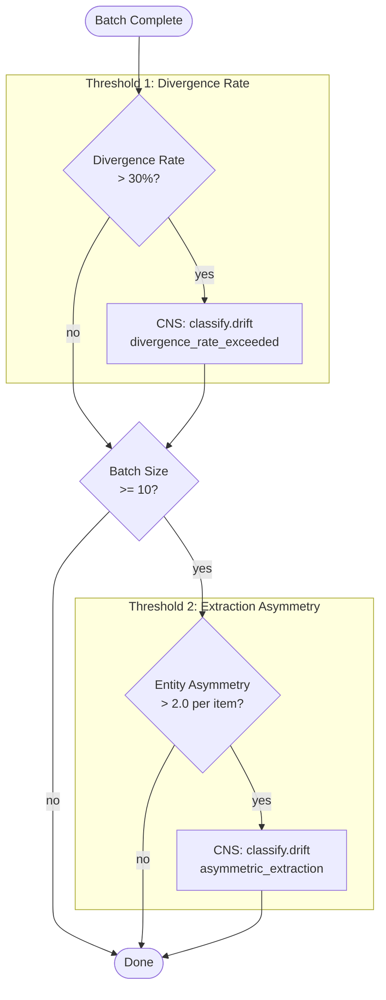

# Classifier Drift Detection

Drift detection logic wired into `extract_triples_dual_batch()`. After each
dual-model batch completes, extraction patterns are checked against two
thresholds. When either is exceeded, `cns.classify.drift` fires.

Related: `crates/hkask-services-runtime/src/dual_classify.rs` — `check_classifier_drift()`

## Thresholds

| Metric | Threshold | Interpretation |
|---|---|---|
| Divergence rate | > 30% of items flagged | Model behavior likely changed (censorship policy shift, model update) |
| Entity asymmetry | > 2.0 per-item difference | One model consistently extracting more entities than the other — possible single-model censorship pattern |
| Minimum batch | 10 items | Asymmetry check requires sufficient sample size |

## CNS Spans

| Span | Trigger | Carries |
|---|---|---|
| `cns.classify.drift` / `divergence_rate_exceeded` | 30% threshold | avg_agreement, divergence_rate, a_only_total, b_only_total |
| `cns.classify.drift` / `asymmetric_extraction` | 2.0 threshold | a_per_item, b_per_item, asymmetry, dominant_model |
