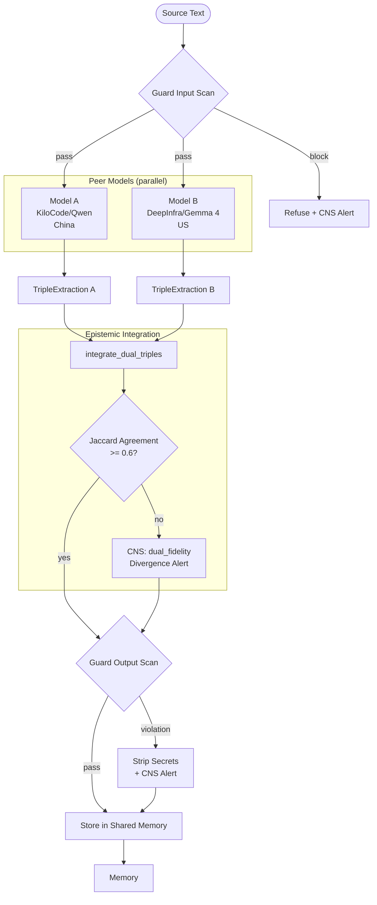

# Dual-Model Classification Flow

How classification operates with two peer models from different jurisdictions.
Neither model is primary — both produce extractions that are integrated with
divergence detection.

Related: `crates/hkask-services-runtime/src/dual_classify.rs`, `crates/hkask-services-corpus/src/embed/service.rs`

