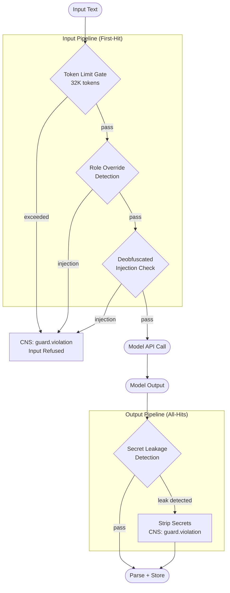

# Content Safety Guard Pipeline

Mandatory input/output scanning aligned with OWASP LLM Top 10. Core scanners
are always active — not configurable off. Powered by `llm-guard` (pure Rust,
zero-copy, sub-millisecond).

Related: `crates/hkask-guard/src/pipeline.rs`, OWASP LLM Top 10

