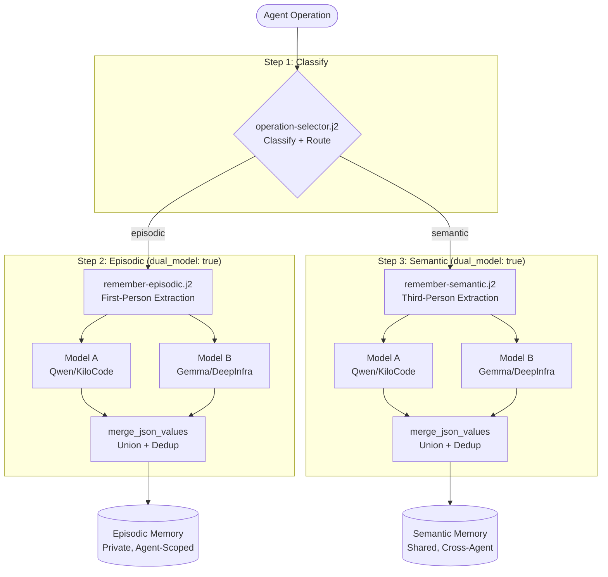

# Memory Remember — Dual-Model Template Cascade

FlowDef manifest for agent memory formation. Three-step cascade with dual-model
rendering on every step. The `operation-selector.j2` classifies and routes to
episodic or semantic extraction. Both peer models render the same template in
parallel; outputs are merged via `merge_json_values()`.

Related: `registry/manifests/memory_remember.yaml`, `crates/hkask-templates/src/executor.rs`

