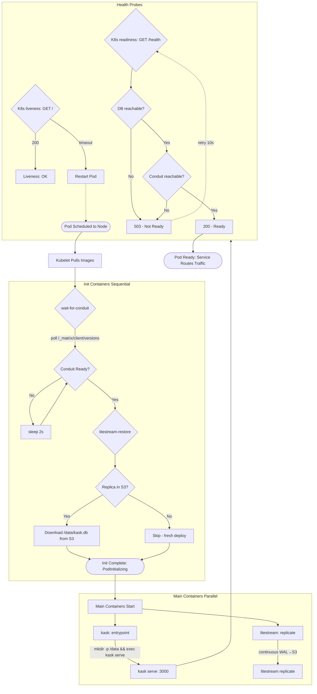

# K8s Pod Startup Sequence

The exact sequence when a new hKask pod is created. Understanding this helps debug startup failures. Extracted from `deploy/k8s/deployment.yaml` and the admin guide §7.

The two init containers run sequentially: first `wait-for-conduit` polls until the Matrix homeserver responds, then `litestream-restore` pulls the database from S3. Main containers start in parallel. The pod is only Ready when both DB and Conduit are reachable.

For the architecture overview, see `docs/diagrams/flowchart-deployment-architecture.md`.
For the full startup sequence explanation, see `docs/plans/k8s-admin-guide.md` §7.
