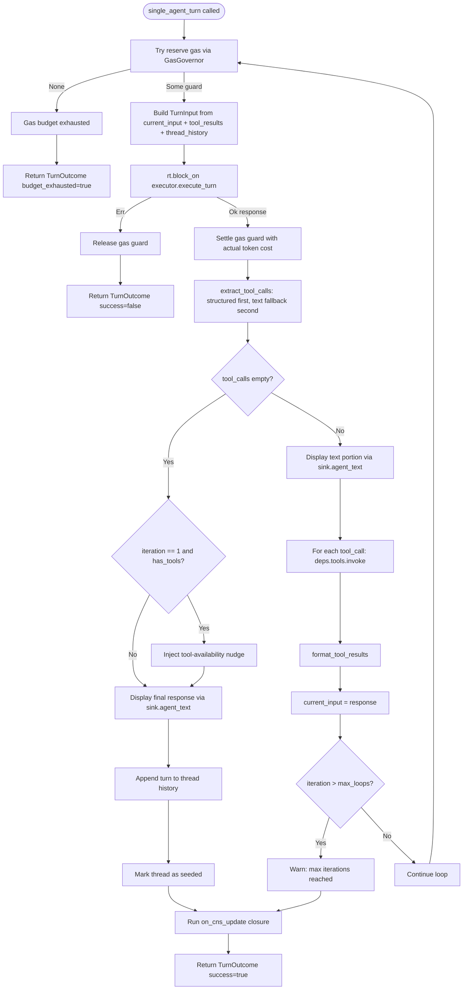

# REPL Turn Pipeline — Control Flow

Flowchart of `run_turn_loop()` in `crates/hkask-repl/src/turn.rs`. The turn pipeline is the core cybernetic loop of the REPL: it senses (gas, token usage), decides (iteration cap, tool call extraction), acts (invokes tools, displays responses), and returns to sense. Both the CLI (stdout) and TUI (capture buffer) surfaces share this single loop via the `TurnSink` trait.

<!-- DIAGRAM_ALIGNMENT
id: DIAG-REPL-001
verified_date: 2026-07-20
verified_against: crates/hkask-repl/src/turn.rs:130-307
status: VERIFIED
-->

## Key Properties

- **Gas regulation:** Every iteration reserves a heuristic estimate, then settles with the actual token cost. On inference error, the reservation is released (no cost incurred). The `EnergyGuard` logs a warning if dropped without settle/release (panic recovery).
- **Tool call priority:** Structured native function calls (`InferenceResult.tool_calls`) are checked first; `<<tool:...>>` text directives are the fallback. This supports both modern models (native function calling) and legacy models (text directives).
- **Thread seeding:** The thread is marked seeded only on successful (non-error) turns. Subsequent turns skip thread history injection — episodic recall handles conversation context.
- **CNS update:** The `on_cns_update` closure runs after the loop exits, checking algedonic alerts and ticking the LoopScheduler. This is the cybernetic feedback path from the turn back to the regulator.
- **Max iterations:** When `max_loops` is exceeded, the loop yields the current response (not an error). This prevents infinite tool-call loops from blocking the REPL indefinitely.

## Cross-References

- [REPL Specification §6 — Single-Agent Turn Pipeline](../specifications/REPL-specification.md#6-single-agent-turn-pipeline)
- [REPL Specification §10 — Gas Governance](../specifications/REPL-specification.md#10-gas-governance-energyguard)
- [Energy and Economy Explanation](../explanation/energy-and-economy.md)
