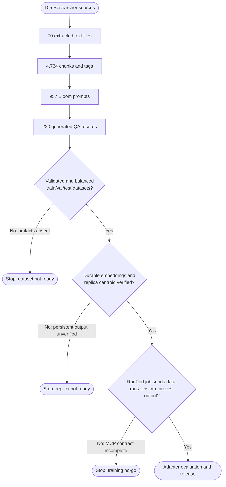

# Replica, Corpus, and Training Readiness Flowchart

This reference flowchart distinguishes artifacts that exist from transitions that are not yet verified end-to-end. The replica server can dispatch four `corpus_*` write operations to `corpus-ingest`, but its pipeline executor cannot dispatch the manifest's Docproc or training steps. The `Library/Researcher` corpus has reached partial QA generation; it has not reached a verified John Brooks replica, durable training dataset, or RunPod-trained adapter.

<!-- DIAGRAM_ALIGNMENT
id: DIAG-TRAIN-002
verified_date: 2026-07-10
verified_against: corpus/chunks/chunks.jsonl; corpus/chunks/tagged_chunks.jsonl; corpus/qa_pairs/prompts_bloom.jsonl; corpus/qa_pairs/gen_bloom_all.jsonl; mcp-servers/hkask-mcp-docproc/src/tools/storage.rs; mcp-servers/hkask-mcp-replica/src/lib.rs:1061-1324; crates/hkask-ports/src/pipeline_runner.rs; mcp-servers/hkask-mcp-training/src/providers/runpod.rs
status: VERIFIED
-->

The operational assessment and remediation sequence are in [Replica, Corpus, and Training Readiness](../status/replica-corpus-training-readiness.md).
