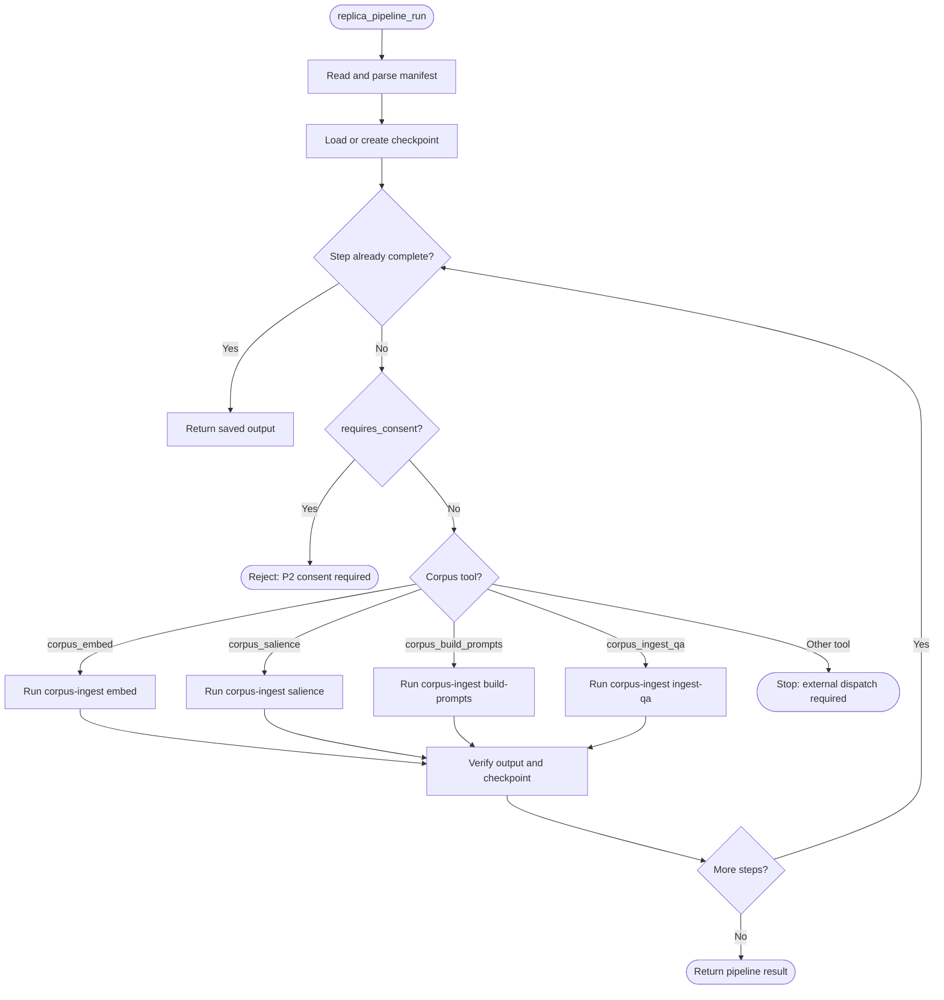

# Replica Pipeline Dispatch Flowchart

This reference flowchart shows the current executable boundary of `replica_pipeline_run`. The replica MCP server parses a `PipelineManifest`, resumes from checkpoint state, and dispatches only its four `corpus_*` steps to the `corpus-ingest` binary. Other manifest tools are deliberately not dispatched by this executor and stop the run with an external-execution error. A `requires_consent` step is rejected before execution; the runner has no approval input, so a consent-required training step cannot proceed through this path.

`execute_tool` wraps the MCP call with a tool span and records success or error against the caller's WebID. That is observability, not authorization: per [P4 — Clear Boundaries](../architecture/core/PRINCIPLES.md#p4--clear-boundaries-ocap), operators must not treat this dispatcher as a replacement for an OCAP check. The checkpoint/result path supports [P9 — Homeostatic Self-Regulation](../architecture/core/PRINCIPLES.md#p9--homeostatic-self-regulation) by retaining the last step outcome for inspection and retry.

The complete, aspirational corpus workflow is in [`corpus/pipeline-capabilities-researcher.yaml`](../../corpus/pipeline-capabilities-researcher.yaml); its initial `docproc_convert` step is outside this executor's current dispatch set. See also [Replica, Corpus, and Training Readiness](../status/replica-corpus-training-readiness.md) and [the replica server reference](../reference/mcp-servers/README.md).

<!-- DIAGRAM_ALIGNMENT
id: DIAG-TRAIN-003
verified_date: 2026-07-10
verified_against: mcp-servers/hkask-mcp-replica/src/lib.rs:1061-1324; crates/hkask-ports/src/pipeline_runner.rs:37-142; crates/hkask-ports/src/pipeline_manifest.rs:49-91; crates/hkask-mcp/src/server/tool_span.rs:247-261
status: VERIFIED
-->
