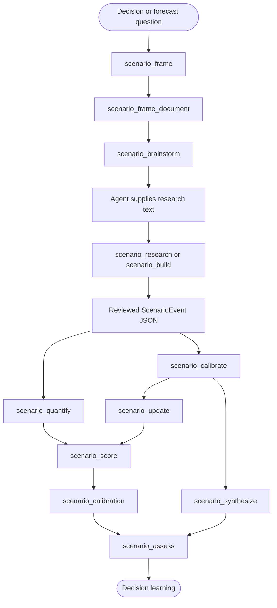

# Scenario Forecasting Pipeline

The scenarios MCP server accepts explicit research and event inputs, calculates the event-tree and calibration artifacts, and records resolved forecasts for later calibration. The diagram distinguishes the optional exploratory framing path from the computational path; `scenario_research` and `scenario_build` return scaffolds for an agent to review rather than silently collecting research or creating final events.[^mcp]

<!-- DIAGRAM_ALIGNMENT
id: DIAG-FW-007
verified_date: 2026-07-10
verified_against: mcp-servers/hkask-mcp-scenarios/src/lib.rs:459-1708; mcp-servers/hkask-mcp-scenarios/src/superforecast.rs:165-400
reference_sources: mcp
status: VERIFIED
-->

## Scope and constraints

`scenario_quantify` validates event probabilities and dependency references before computing marginals. Its all-events value uses parent-true conditionals for a single-parent edge and a documented average proxy for a multi-parent edge; it is not a general joint-distribution engine. Forecasts are only persisted when `scenario_score` receives explicit outcomes, then `scenario_calibration` derives Brier and reliability signals from stored records.[^brier]

[^mcp]: Model Context Protocol. (2025). *Specification*. https://modelcontextprotocol.io/specification/2025-06-18
[^brier]: Brier, G. W. (1950). Verification of forecasts expressed in terms of probability. *Monthly Weather Review*, 78(1), 1–3. https://doi.org/10.1175/1520-0493(1950)078%3C0001:VOFEIT%3E2.0.CO;2
