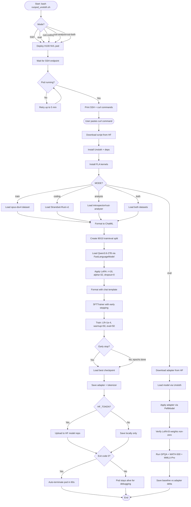

# Training Pipeline Flowchart

This diagram traces the control flow of the hKask adapter training pipeline, from pod launch through training completion and upload. It covers both the reasoning distillation path (`train_unsloth.sh`) and the Rust adapter path (`train_rust_adapter.sh`), which share the same pod launcher (`runpod_unsloth.sh`) but diverge at the dataset formatting stage.

## Key Decision Points

| Decision | Condition | Branches |
|----------|-----------|----------|
| Mode selection | CLI flag (`--rust-coding`, `--eval`, etc.) | 5 paths: train, eval, coding, analysis, both |
| Pod readiness | RunPod `desiredStatus == RUNNING` | Retry loop, max 5 min |
| Dataset selection | `MODE` env var | 3 formatting paths + 1 eval path |
| Early stopping | `eval_loss` no improvement for 10 evals | Load best checkpoint vs continue |
| Upload | `HF_TOKEN` present | Upload vs local-only |
| Pod lifecycle | Exit code 0 | Auto-terminate vs keep alive |
