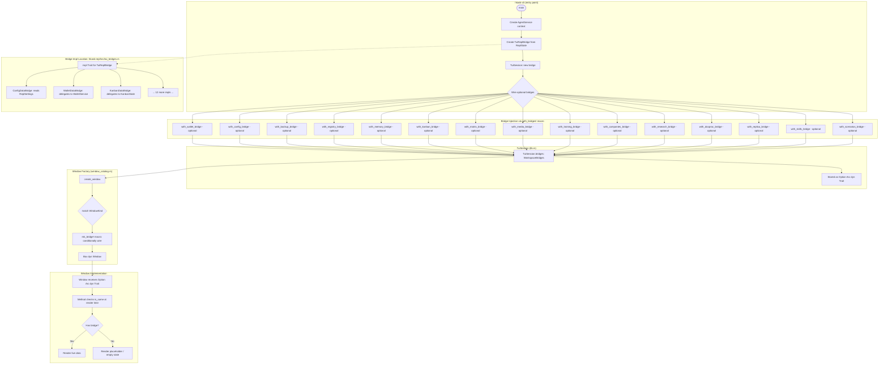

# TUI Bridge Wiring Architecture

**Type:** flowchart | **Target:** Bridge injection from CLI into TUI windows | **Diataxis quadrant:** Reference

The `hkask-tui` crate defines bridge traits; `hkask-repl` implements them on `TuiReplBridge`. The `hkask-cli` crate wires them via the `with_bridges!` macro-generated builder methods. This separation enforces the dependency rule: TUI never depends on CLI.



## Dependency Rule

```
hkask-cli ──→ hkask-tui (uses traits + TuiSession)
hkask-cli ──→ hkask-repl (implements bridges)
hkask-repl ──→ hkask-tui (implements traits)
hkask-tui ──✗→ hkask-cli (PROHIBITED — would be circular)
```

## Bridge Lifecycle

| Phase | Action | Location |
|-------|--------|----------|
| 1. Trait definition | `trait WalletDataBridge { ... }` | `hkask-tui/src/bridges/wallet.rs` |
| 2. Mock implementation | `impl WalletDataBridge for MockWalletBridge` | Same file (tests + dev) |
| 3. Live implementation | `impl WalletDataBridge for TuiReplBridge` | `hkask-repl/src/tui_bridges.rs` |
| 4. Injection | `session.with_wallet_bridge(bridge)` | `hkask-cli` (builder pattern) |
| 5. Window wiring | `mk_bridge!(WalletWindow, ctx.wallet_bridge, ...)` | `window_catalog.rs` |
| 6. Consumption | `self.wallet.as_ref().map(|w| w.wallet_balance())` | Window `render()` |

## Key Architectural Decision

Bridges are `Option<Arc<dyn Trait>>` — windows gracefully degrade when a bridge isn't wired. This means:
- The TUI works in test mode (no services) with mock bridges
- Missing bridges show "No data" / placeholder content, never panic
- Adding a new service requires: bridge trait + mock + live impl + `with_bridges!` macro entry + `create_window` match arm (5 sites)

---

*Generated from `crates/hkask-tui/src/bridges/mod.rs`, `window_catalog.rs`, `crates/hkask-repl/src/tui_bridges.rs` — v0.31.0*
