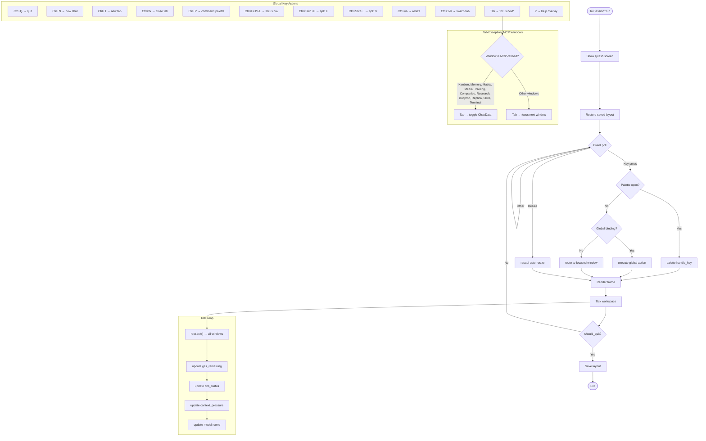

# TUI Event Dispatch Pipeline

**Type:** flowchart | **Target:** `TuiSession::run` + key event routing | **Diataxis quadrant:** Reference

Describes how keyboard input flows from crossterm event polling through the TUI session, global keybindings, command palette, and focused window dispatch. The workspace tick loop handles background state updates (CNS polling, gas tracking).

## Key Decision Points

| Decision | Condition | Action |
|----------|-----------|--------|
| Palette interception | `workspace.palette_open == true` | Route ALL keys to `command_palette.handle_key()` |
| Global vs. window | Key matches global binding table | Execute global action immediately |
| Tab routing | Focused window is MCP-tabbed | Let window handle Tab (Chat/Data toggle) |
| Tab routing | Focused window is not MCP-tabbed | Workspace handles Tab (focus-next) |
| Quit guard | `should_quit == true` | Break event loop, save layout, restore terminal |

## Temporal Properties

| Property | Value | Notes |
|----------|-------|-------|
| Event poll interval | 16ms (~60 FPS) | `tick_rate` from `TuiSession` |
| Tick frequency | Every frame | Background updates: CNS, gas, pressure |
| Splash duration | Configurable | Dismissed by key press or timeout |
| Layout save | On quit | JSON serialized per-agent in `~/.config/hkask/agents/{name}/` |

## Cybernetic Notes

The event dispatch loop is a **negative feedback loop**: input → render → tick (model update) → render. The key routing exception for MCP-tabbed windows (hardcoded list, Finding #5 in architecture review) creates a **variety deficit** — new MCP-tabbed window kinds won't receive Tab key routing unless the list is updated.

---

*Generated from `crates/hkask-tui/src/lib.rs:145-218`, `workspace.rs:543-646`, `mcp_tabbed.rs` — v0.31.0*
