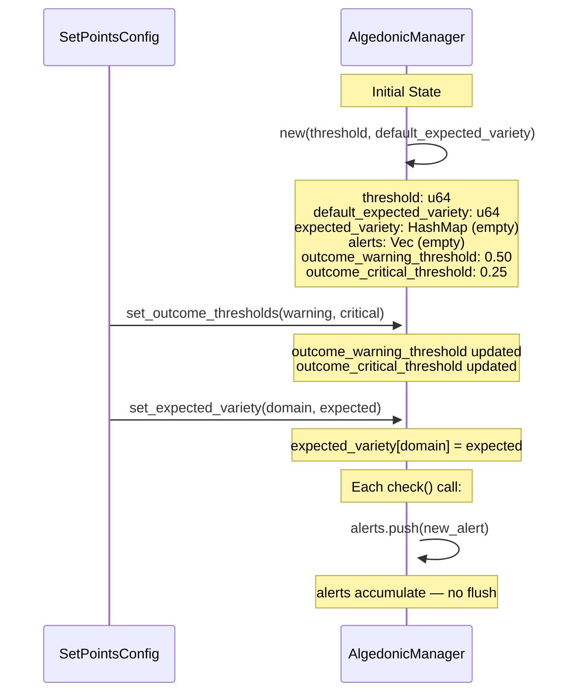

# Algedonic Escalation Sequence

## Description

The Algedonic loop enforces Ashby's Law of Requisite Variety through binary threshold monitoring. The `VarietyTracker` measures state diversity per domain via an exponential moving average (EMA). When the `AlgedonicManager.check()` method detects a deficit exceeding the configured threshold, it generates a `RuntimeAlert` with one of three severities — Info, Warning, or Critical. Critical alerts are automatically escalated (`escalated = true`) and flow through the `CurationLoop` to the `CuratorAgent`, which decides between automatic recalibration (adjusting the threshold via `calibrate_threshold()`) or human escalation. A cooldown `Dampener` prevents alert storms. The `CircuitBreaker` integrates with the algedonic manager for external service failure handling via `check_outcome()`.

**Key source:** `crates/hkask-cns/src/algedonic.rs:26-307` (`AlertSeverity`, `RuntimeAlert`, `AlgedonicManager`), `crates/hkask-cns/src/runtime.rs:52-106` (`VarietyTracker`), `crates/hkask-cns/src/runtime.rs:191-255` (`VarietyMonitor`), `crates/hkask-cns/src/runtime.rs:822-858` (`evaluate_and_escalate_slos`).

### Alert Severity Thresholds

| Severity | Condition | `escalated` Flag | Action |
|----------|-----------|-----------------|--------|
| `Info` | `deficit ≤ threshold / 2` | `false` | No action — logged only |
| `Warning` | `deficit > threshold / 2 && deficit ≤ threshold` | `false` | `warn!()` CNS log — Curator notified |
| `Critical` | `deficit > threshold` | `true` | `error!()` CNS log → CurationLoop escalation |

### Outcome Quality Thresholds

| Severity | Success Rate | Default Threshold |
|----------|-------------|-------------------|
| `Warning` | `< outcome_warning_threshold` | 0.50 (configurable via SetPointsConfig) |
| `Critical` | `< outcome_critical_threshold` | 0.25 (configurable via SetPointsConfig) |

```mermaid
sequenceDiagram
    participant VT as VarietyTracker
    participant AM as AlgedonicManager
    participant CNS as CnsRuntime
    participant CL as CurationLoop
    participant CA as CuratorAgent
    participant Damp as Dampener
    participant CB as CircuitBreaker
    participant Ext as External Service

    rect rgb(245, 248, 252)
        Note over VT,CNS: Variety Monitoring — diversity deficit detection

        loop each tool call / agent activation
            VT->>+VT: increment(state_name)
            Note over VT: count++<br/>EMA: ema = α×count + (1-α)×ema
        end

        VT->>+VT: deficit(expected)
        Note over VT: deficit = expected_variety - variety_ema

        AM->>+AM: check(counter, domain)
        AM->>+AM: expected = expected_variety[domain]<br/>or default_expected_variety
        AM->>+AM: deficit = counter.deficit(expected)
        AM->>+AM: RuntimeAlert::new(domain, deficit, threshold)
    end

    rect rgb(240, 255, 240)
        Note over AM,CL: INFO — deficit ≤ threshold/2 (healthy)

        alt deficit ≤ threshold/2
            AM->>+AM: severity = AlertSeverity::Info
            Note over AM: escalated = false<br/>No log emitted
            AM->>+AM: alerts.push(alert)
        end
    end

    rect rgb(255, 252, 240)
        Note over AM,CL: WARNING — deficit within threshold band

        alt deficit > threshold/2 AND deficit ≤ threshold
            AM->>+AM: severity = AlertSeverity::Warning
            Note over AM: escalated = false
            AM->>+AM: warn!(target: "cns.algedonic", "Variety deficit approaching threshold")
            AM->>+AM: alerts.push(alert)
            AM-->>-CNS: Some(RuntimeAlert::Warning)
        end
    end

    rect rgb(255, 240, 240)
        Note over AM,CL: CRITICAL — deficit > threshold (escalation required)

        alt deficit > threshold
            AM->>+AM: severity = AlertSeverity::Critical
            AM->>+AM: escalated = true
            AM->>+AM: error!(target: "cns.algedonic", "ALGEDONIC ALERT - Escalation required")
            AM->>+AM: alerts.push(alert)
            AM-->>-CNS: Some(RuntimeAlert::Critical)

            CNS->>+CNS: emit_critical_depletion(alert)
            Note over CNS: NuEvent emitted with<br/>SpanKind::VarietyAlgedonicAlert<br/>(cns.variety.algedonic_alert)
        end
    end

    rect rgb(255, 248, 240)
        Note over AM,CB: Outcome Quality Check — CircuitBreaker integration

        CB->>+CB: record_failure(error_kind)
        CB->>+CB: record_success()

        CNS->>+AM: check_outcome(domain, success_rate, total_ops)

        alt success_rate < outcome_critical_threshold
            AM->>+AM: severity = Critical
            AM->>+AM: error!(target: "cns.outcome", "OUTCOME ALERT - Critical failure rate")
            AM->>+AM: alerts.push(alert)
            CB->>+CB: circuit OPEN — stop all calls to External Service
            Note over Ext: External service calls blocked
        else success_rate < outcome_warning_threshold
            AM->>+AM: severity = Warning
            AM->>+AM: warn!(target: "cns.outcome", "Outcome success rate degraded")
            AM->>+AM: alerts.push(alert)
            Note over CB: circuit HALF-OPEN — throttle
        else success_rate ≥ outcome_warning_threshold
            AM-->>-CNS: None (healthy)
            CB->>+CB: circuit CLOSED — normal operation
        end
    end

    rect rgb(248, 245, 255)
        Note over AM,CA: Dampener — Alert Cooldown Override

        CNS->>+CL: runtime_alert propagated
        CL->>+Damp: check_cooldown(domain)

        alt within cooldown window
            Damp-->>-CL: cooldown active — suppress duplicate alert
            Note over CL: Alert dropped —<br/>same domain already escalated recently
        else cooldown expired
            Damp-->>-CL: cooldown clear — allow escalation
            CL->>+CA: forward RuntimeAlert
            Note over CA: alert.deficit, alert.threshold, alert.domain
        end
    end

    rect rgb(245, 252, 245)
        Note over CA,AM: CuratorAgent Decision — Two Paths

        CA->>+CA: evaluate alert severity & domain

        alt Automatic Recalibration
            Note over CA: Curator decides threshold<br/>was too aggressive
            CA->>+CNS: calibrate_threshold(domain, new_threshold)
            CNS->>+AM: set_expected_variety(domain, new_threshold)
            AM-->>-CNS: threshold updated
            Note over AM: expected_variety[domain] = new_threshold<br/>Alert resolved via homeostatic adjustment
        else Human Escalation
            Note over CA: Curator decides situation<br/>requires human judgment
            CA->>+CA: emit CurationEscalation span
            Note over CA: cns.curation.escalation<br/>SpanKind::CurationEscalation
            CA->>+CA: notify human curator
        end
    end
```

## AlgedonicManager Internal State



## Alert Lifecycle Summary

| Phase | Actor | Action |
|-------|-------|--------|
| 1. Measure | `VarietyTracker` | Increment counter, compute EMA, calculate deficit |
| 2. Classify | `AlgedonicManager` | `RuntimeAlert::new()` — binary threshold → Info/Warning/Critical |
| 3. Emit CNS | `CnsRuntime` | `emit_critical_depletion()` for Critical alerts |
| 4. Cooldown Gate | `Dampener` | Suppress duplicate alerts within cooldown window |
| 5. Route | `CurationLoop` | Forward to `CuratorAgent` |
| 6a. Auto-fix | `CuratorAgent` | `calibrate_threshold()` — adjust threshold |
| 6b. Escalate | `CuratorAgent` | Human notification via `cns.curation.escalation` |

---

<!-- DIAGRAM_ALIGNMENT
id: DIAG-TO-005
verified_date: 2026-07-01
verified_against: >
  crates/hkask-cns/src/algedonic.rs:26-33 (AlertSeverity),
  crates/hkask-cns/src/algedonic.rs:37-136 (RuntimeAlert, threshold classification, should_escalate),
  crates/hkask-cns/src/algedonic.rs:139-296 (AlgedonicManager, check, check_outcome, set_outcome_thresholds, set_expected_variety),
  crates/hkask-cns/src/algedonic.rs:299-307 (cns_health_check),
  crates/hkask-cns/src/runtime.rs:52-106 (VarietyTracker, EMA, deficit),
  crates/hkask-cns/src/runtime.rs:191-255 (VarietyMonitor, counter, domains),
  crates/hkask-cns/src/runtime.rs:540-615 (increment_variety, check_variety, emit_critical_depletion),
  crates/hkask-cns/src/runtime.rs:624-653 (calibrate_threshold, calibrate_threshold_blocking),
  crates/hkask-cns/src/runtime.rs:822-858 (evaluate_and_escalate_slos),
  crates/hkask-types/src/event.rs:401-403 (VarietyAlgedonicAlert)
status: VERIFIED
-->

## Cross-Reference

| Reference | Description |
|-----------|-------------|
| [`AlgedonicManager`](crates/hkask-cns/src/algedonic.rs:139-296) | Alert manager with variety and outcome quality checking |
| [`RuntimeAlert`](crates/hkask-cns/src/algedonic.rs:37-136) | Alert struct with binary threshold classification |
| [`VarietyTracker`](crates/hkask-cns/src/runtime.rs:52-106) | Per-domain variety counter with EMA and deficit calculation |
| [`VarietyMonitor`](crates/hkask-cns/src/runtime.rs:191-255) | Multi-domain variety registry (Ashby's Law sensor) |
| [`CnsRuntime`](crates/hkask-cns/src/runtime.rs:294-299) | CNS runtime — entry point for variety ops and calibration |
| [`SpanKind::VarietyAlgedonicAlert`](crates/hkask-types/src/event.rs:401-403) | CNS span for algedonic alert emission |
| [`SpanKind::CurationEscalation`](crates/hkask-types/src/event.rs:389-391) | CNS span for human escalation |
| [PRINCIPLES.md §P9](docs/architecture/core/PRINCIPLES.md) | Homeostatic Self-Regulation |
| [Ashby's Law](https://en.wikipedia.org/wiki/Variety_(cybernetics)) | Law of Requisite Variety — regulatory foundation |
| [`sequence-cns-span-emission.md`](docs/diagrams/sequence-cns-span-emission.md) | CNS span emission flow (DIAG-TO-004) |
