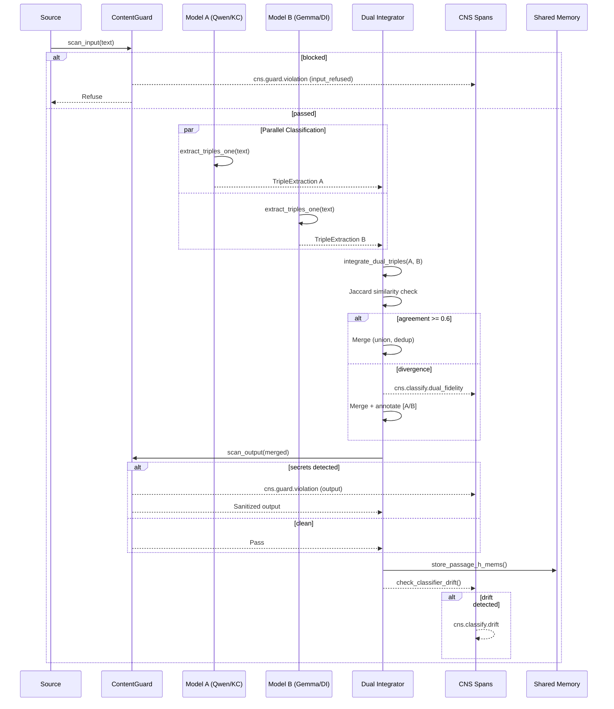

# Classification-to-Memory Sequence

Full flow from source text through dual-model classification, guard scanning,
integration, and shared memory storage. All guard checks are mandatory;
dual-model is mandatory when model B is configured.

Related: `crates/hkask-services-runtime/src/classify_impl.rs`, `crates/hkask-services-runtime/src/dual_classify.rs`

