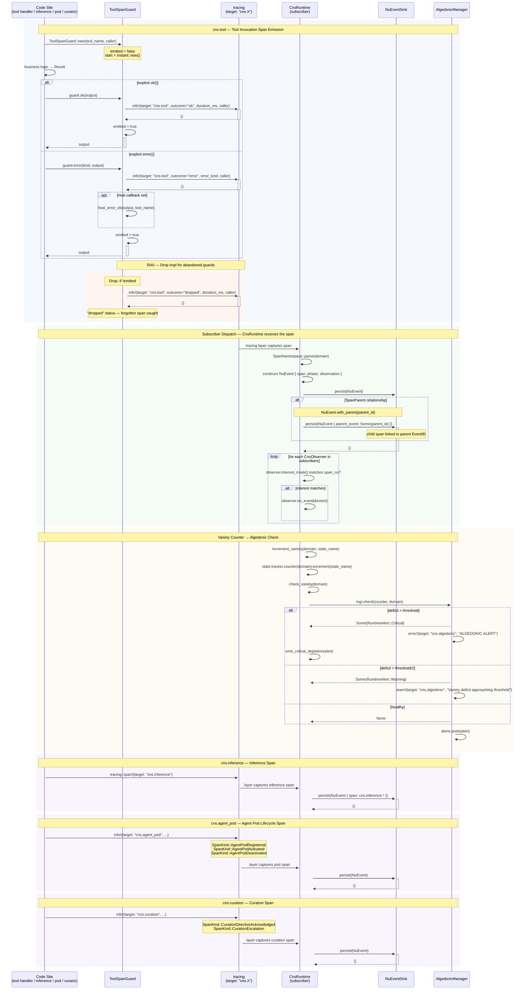
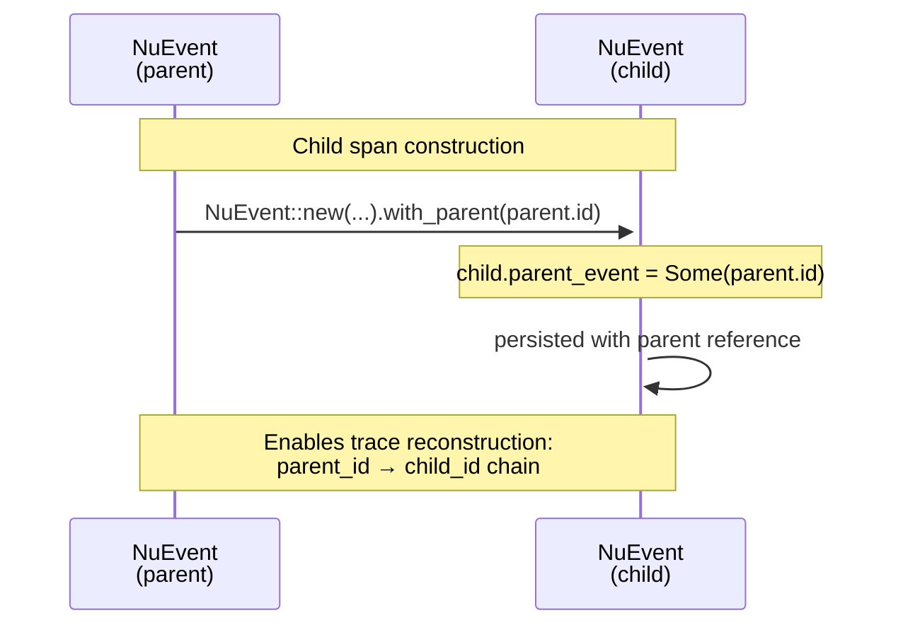

# CNS Span Emission — 4-Namespace Sequence

## Description

The CNS (Cybernetic Nervous System) emits structured spans across four canonical namespaces — `cns.tool`, `cns.inference`, `cns.agent_pod`, and `cns.curation` — using `tracing::info!(target: "cns.X")` as the emission surface. The `CnsRuntime` subscriber layer collects these spans, constructs `NuEvent` records with `SpanParent` relationships for child spans, persists them through the `NuEventSink`, and routes algedonic signals to the `AlgedonicManager`. The `ToolSpanGuard` RAII guard ensures every tool invocation emits a span: explicit `ok()`/`error()` calls emit the appropriate status, and the `Drop` implementation catches forgotten spans with a `"dropped"` outcome.

**Key source:** `crates/hkask-mcp/src/server/tool_span.rs:18-189` (`ToolSpanGuard`), `crates/hkask-cns/src/runtime.rs:540-615` (`increment_variety`, `check_variety`), `crates/hkask-types/src/event.rs:16-93` (`NuEvent`, `parent_event`), `crates/hkask-types/src/event.rs:370-429` (`SpanKind`, namespace mappings).

### Span Namespace Model

| Namespace | SpanKinds | Subscriber Interest |
|-----------|-----------|---------------------|
| `cns.tool` | `Invoked`, `Completed`, `Error`, `dropped` | GovernedTool, CyberneticsLoop |
| `cns.inference` | inference spans (via `tracing::span!`) | InferenceAdapter |
| `cns.agent_pod` | `Registered`, `Activated`, `Deactivated` | PodManager |
| `cns.curation` | `DirectiveAcknowledged`, `Escalation` | CuratorAgent |

## SpanParent Relationship Model

## ToolSpanGuard Drop Behavior

| Method | `emitted` | Outcome in trace | Callbacks Fired |
|--------|-----------|------------------|-----------------|
| `guard.ok(output)` | `true` | `"ok"` | `experience_cb("success")` |
| `guard.error(kind, output)` | `true` | `"error"` | `heal_error_cb` + `experience_cb("error")` |
| `guard.finish(Result)` | `true` | `"ok"` / `"error"` | Context-dependent |
| **No explicit call → `Drop`** | `false` | `"dropped"` | None |

The `Drop` impl enforces that a span is always emitted — even if the code path panics, returns early, or the developer forgets to call `ok()`/`error()`. The `"dropped"` outcome is an observability signal: it tells the CNS that a tool execution began but never reached a terminal state.

---

<!-- DIAGRAM_ALIGNMENT
id: DIAG-TO-004
verified_date: 2026-07-01
verified_against: >
  crates/hkask-mcp/src/server/tool_span.rs:18-189 (ToolSpanGuard, Drop impl, emit_tool_span),
  crates/hkask-cns/src/runtime.rs:295-299 (CnsRuntime struct),
  crates/hkask-cns/src/runtime.rs:540-615 (increment_variety, check_variety, subscriber dispatch),
  crates/hkask-types/src/event.rs:16-93 (NuEvent, parent_event, with_parent builder),
  crates/hkask-types/src/event.rs:105-157 (CANONICAL_NAMESPACES),
  crates/hkask-types/src/event.rs:320-429 (Span, SpanKind, namespace_and_path),
  crates/hkask-cns/src/algedonic.rs:139-296 (AlgedonicManager, check)
status: VERIFIED
-->

## Cross-Reference

| Reference | Description |
|-----------|-------------|
| [`ToolSpanGuard`](crates/hkask-mcp/src/server/tool_span.rs:18-189) | RAII span guard with `ok()`, `error()`, `Drop` for forgotten spans |
| [`CnsRuntime`](crates/hkask-cns/src/runtime.rs:294-299) | CNS runtime with subscribers and algedonic manager |
| [`NuEvent`](crates/hkask-types/src/event.rs:16-93) | CNS event with `parent_event` for span parent relationships |
| [`SpanKind`](crates/hkask-types/src/event.rs:370-429) | Typed span kind enum with canonical namespace/path mapping |
| [`CANONICAL_NAMESPACES`](crates/hkask-types/src/event.rs:105-157) | All valid CNS span namespaces |
| [`AlgedonicManager`](crates/hkask-cns/src/algedonic.rs:139-296) | Alert manager with variety deficit checking |
| [PRINCIPLES.md §P9](docs/architecture/core/PRINCIPLES.md) | Homeostatic Self-Regulation |
| [`sequence-algedonic-escalation.md`](docs/diagrams/sequence-algedonic-escalation.md) | Algedonic escalation flow (DIAG-TO-005) |
