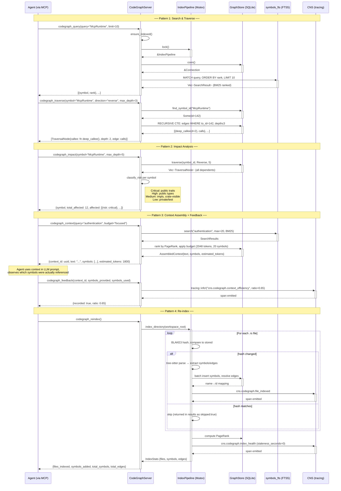

# CodeGraph Agent Workflow

An agent uses the codegraph MCP server to understand the codebase, trace dependencies, assess change impact, and assemble context for LLM prompts. This sequence shows the three most common interaction patterns: search, impact analysis, and context assembly with feedback.

All codegraph tools follow the same OCAP-gated MCP dispatch pattern established by `sequence-mcp-tool-dispatch.md`. This diagram focuses on the codegraph-specific logic after the security gateway.

### Tool Summary

| Tool | What it does | Key query |
|------|-------------|-----------|
| `codegraph_query` | FTS5 keyword search with BM25 ranking | `SELECT ... FROM symbols_fts WHERE MATCH ? ORDER BY rank` |
| `codegraph_traverse` | Recursive CTE: forward (deps) or reverse (callers) | `WITH RECURSIVE trav AS (SELECT e.to_id ... UNION SELECT e.to_id ...)` |
| `codegraph_impact` | Reverse traversal + risk classification | Same CTE + `classify_risk(symbol)` per result |
| `codegraph_analysis` | Dead code detection or complexity hotspots | `symbols WHERE id NOT IN (SELECT to_id FROM edges)` |
| `codegraph_context` | Token-budgeted context assembly for LLM prompts | FTS5 search → PageRank sort → budget cap |
| `codegraph_feedback` | Signal-to-noise tracking (G12 feedback loop) | CNS span: `cns.codegraph.context_efficiency` |

### CNS Spans Emitted

| Span | Trigger | Target |
|------|---------|--------|
| `cns.codegraph.file_indexed` | Per-file index complete | G7: file-level observability |
| `cns.codegraph.index_health` | After full re-index | X6: staleness reset to 0 |
| `cns.codegraph.context_efficiency` | After `codegraph_feedback` | G12: ratio of used/provided symbols |
| `cns.codegraph.embeddings` | After `codegraph_index_embeddings` batch | G13: embedding batch complete |

### Related Documentation

- [`erd-codegraph-schema.md`](erd-codegraph-schema.md) — Database schema ERD
- [`class-codegraph-types.md`](class-codegraph-types.md) — Type system class diagram
- [`sequence-mcp-tool-dispatch.md`](sequence-mcp-tool-dispatch.md) — MCP tool dispatch with OCAP enforcement
- [`../architecture/hKask-architecture-master.md`](../architecture/hKask-architecture-master.md) — Architecture master
