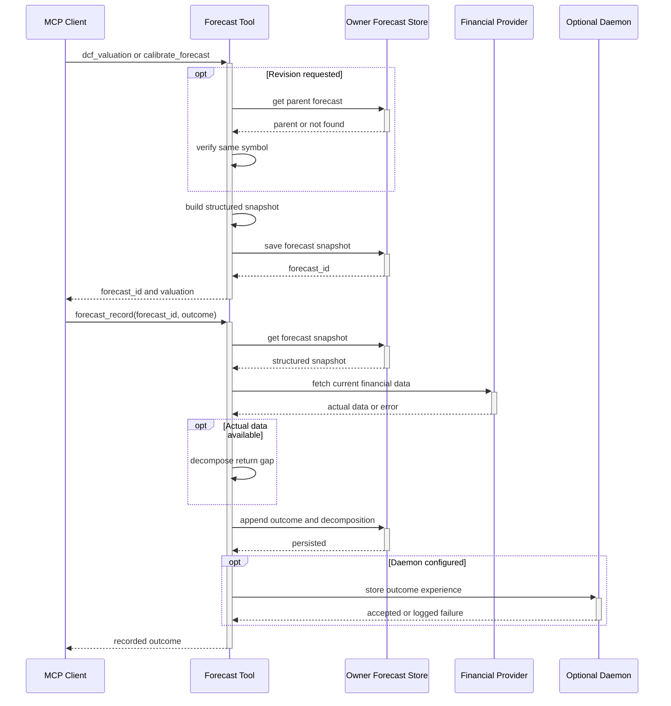

# Companies MCP Forecast Feedback

This reference diagram shows the durable forecast loop. A DCF or calibrated forecast writes an owner-scoped structured JSON snapshot; an optional same-symbol revision references its parent. `forecast_record` reloads the snapshot, retrieves current financial data for decomposition, appends the outcome, and independently sends an experience to the daemon when configured.

See [Companies MCP Server Reference](../reference/mcp-servers/hkask-mcp-companies.md) for request fields and ownership boundaries.

<!-- DIAGRAM_ALIGNMENT
id: DIAG-IC-011
verified_date: 2026-07-10
verified_against: mcp-servers/hkask-mcp-companies/src/tools/analytics.rs:438-457; mcp-servers/hkask-mcp-companies/src/tools/valuation.rs:634-659,774-915; mcp-servers/hkask-mcp-companies/src/portfolio.rs:303-400
status: VERIFIED
-->
