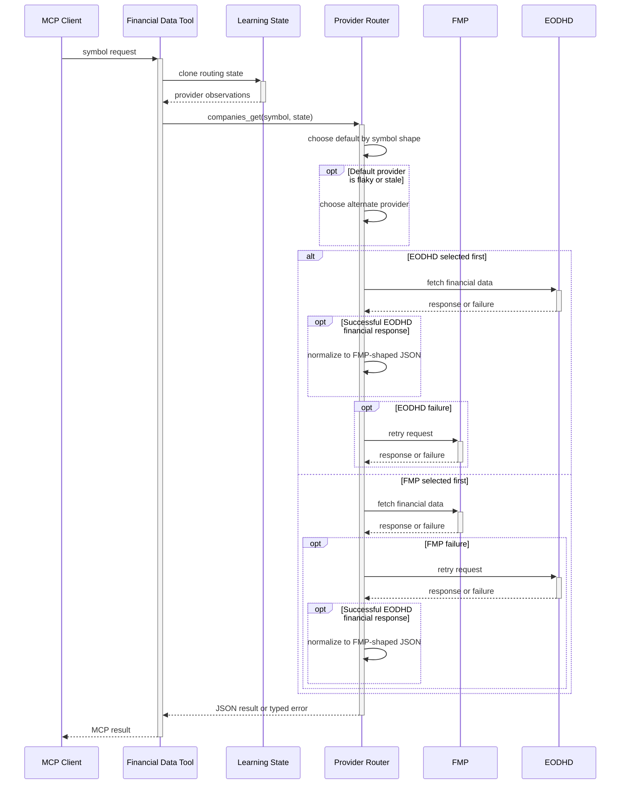

# Companies MCP Provider Routing

This reference diagram shows the routing used by eligible financial-data tools. An exchange-qualified symbol prefers EODHD; a plain symbol prefers FMP. The in-memory learning state can select the alternate provider when the default is classified as flaky or stale. A failed primary request is retried through the alternate provider. `company_screener` and `research_search` are outside this path.

See [Companies MCP Server Reference](../reference/mcp-servers/hkask-mcp-companies.md) for the tool-boundary details.

<!-- DIAGRAM_ALIGNMENT
id: DIAG-IC-010
verified_date: 2026-07-10
verified_against: mcp-servers/hkask-mcp-companies/src/providers.rs:84-247; mcp-servers/hkask-mcp-companies/src/lib.rs:340-361
status: VERIFIED
-->
