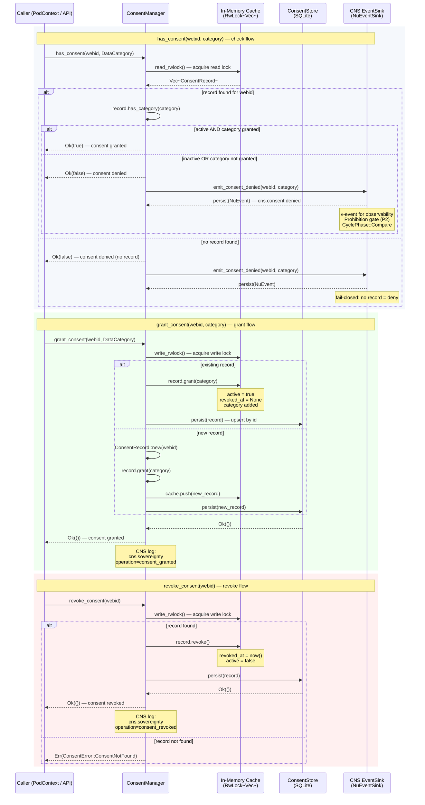

# Consent Check and Grant/Revoke Sequence

## Description

The `ConsentManager` in `hkask-agents` enforces Magna Carta P1 (User Sovereignty) and P2 (Affirmative Consent) through explicit, scoped, revocable consent grants. Every data access check flows through `has_consent()`, which validates: (1) an active `ConsentRecord` exists for the user's `WebID`, (2) the requested `DataCategory` is in `granted_categories`, and (3) the record is not revoked (`active == true`). On denial, a `cns.consent.denied` ν-event is emitted to the CNS `NuEventSink` for observability — this is a Prohibition-gate observation, not a regulatory feedback loop. The `SovereigntyConsent` trait implementation translates storage errors into `false` (fail-closed). `grant_consent()` and `revoke_consent()` modify the in-memory cache and persist to the SQLite-backed `ConsentStore`.

**Key source:** `crates/hkask-agents/src/consent.rs:136-144` (`ConsentManager` struct), `consent.rs:316-338` (`has_consent`), `consent.rs:243-273` (`grant_consent`), `consent.rs:283-300` (`revoke_consent`), `consent.rs:344-366` (`emit_consent_denied`), `consent.rs:388-395` (`SovereigntyConsent` impl).

## Consent Record Lifecycle

| Operation | `active` | `granted_categories` | `revoked_at` | Persisted |
|-----------|----------|---------------------|-------------|-----------|
| `ConsentRecord::new()` | `true` | `{}` (empty) | `None` | Not yet |
| `grant(category)` | `true` | `category` added | `None` | Yes |
| `revoke()` | `false` | Unchanged | `Some(now)` | Yes |
| `has_category(cat)` | Must be `true` | Must contain `cat` | N/A | Read-only |

## Denial Observability (CNS)

When `has_consent()` returns `false`, the `emit_consent_denied()` method fires a `cns.consent.denied` ν-event if an `event_sink` is configured. This is a **Prohibition-gate observation** — the denial is terminal; the event records the fact for audit. The event carries:

- **Span namespace**: `cns.consent`
- **Span name**: `denied`
- **CyclePhase**: `Compare`
- **Payload**: `{ "webid": "...", "category": "..." }`

The `SovereigntyConsent` trait impl translates storage errors into `false`, enforcing the Magna Carta's fail-closed default deny.

---

<!-- DIAGRAM_ALIGNMENT
id: DIAG-TO-006-CM
verified_date: 2026-07-01
verified_against: crates/hkask-agents/src/consent.rs (ConsentManager:136-144, ConsentRecord:38-44, has_consent:316-338, emit_consent_denied:344-366, grant_consent:243-273, revoke_consent:283-300, SovereigntyConsent:388-395, load_from_store:185-225, persist:228-232)
status: VERIFIED
-->

## Cross-Reference

- [`hKask-architecture-master.md` § Sovereignty & Consent](architecture/hKask-architecture-master.md#sovereignty--consent)
- [`consent.rs`](crates/hkask-agents/src/consent.rs) — `ConsentManager`, `ConsentRecord`, `has_consent()`, `grant_consent()`, `revoke_consent()`
- [`sovereignty.rs`](crates/hkask-agents/src/sovereignty.rs) — `SovereigntyConsent` trait
- [Magna Carta P1 — User Sovereignty](docs/magna-carta.md#p1-user-sovereignty)
- [Magna Carta P2 — Affirmative Consent](docs/magna-carta.md#p2-affirmative-consent)
