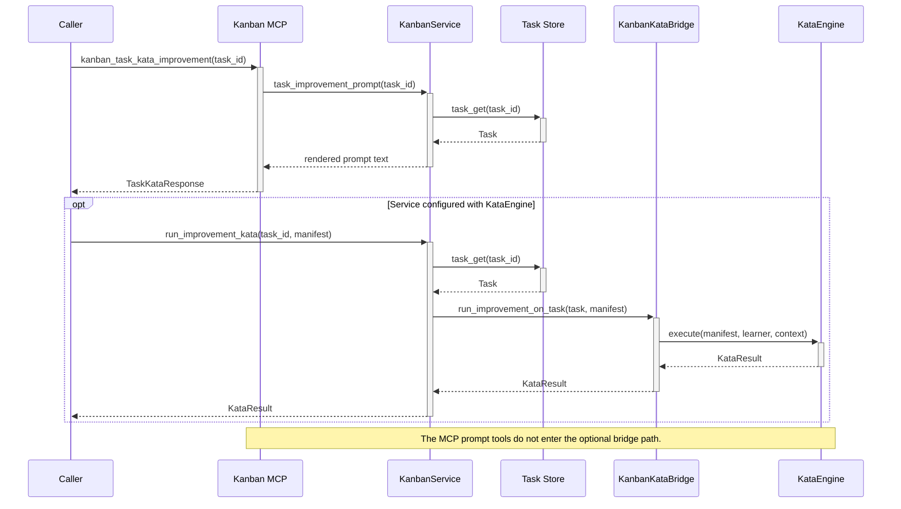

# Kata-Kanban Execution Boundary

This reference sequence separates the two currently implemented Kata paths. The Kanban MCP exposes task-scoped **prompt generation**. Full Kata execution is available only through an optional `KanbanKataBridge` configured on `KanbanService`; the shown MCP tools do not invoke that bridge. The distinction is operationally important because prompt generation does not execute the manifest’s convergence, budget, or OCAP declarations.

<!-- DIAGRAM_ALIGNMENT
id: DIAG-FW-006
verified_date: 2026-07-10
verified_against: mcp-servers/hkask-mcp-kata-kanban/src/lib.rs:680-780; crates/hkask-services-kata-kanban/src/kanban/service_impl/kata.rs:1-210; crates/hkask-services-kata-kanban/src/bridge.rs:18-76; crates/hkask-services-kata-kanban/src/kata/mod.rs:334-498
status: VERIFIED
-->

## Cross-reference

- [Kata PDCA lifecycle state machine](state-kata-pdca.md)
- [Architecture master: Kata](../architecture/hKask-architecture-master.md#kata--cybernetic-capability-development)
