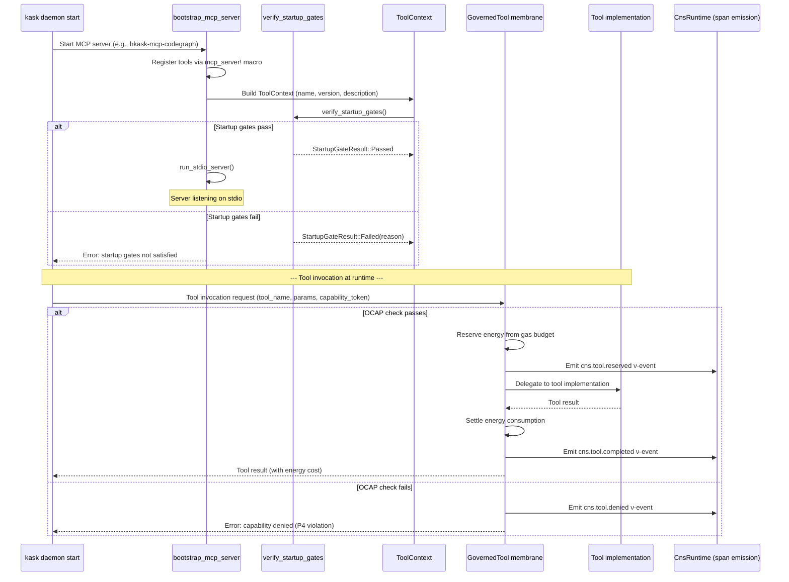

# MCP Bootstrap and Tool Dispatch — Sequence Diagram

**Diataxis quadrant:** How-To / Explanation  
**Domain ontology tier:** Core  
**Purpose:** Show the startup sequence for an MCP server and the tool dispatch path through the OCAP membrane. Used as reference for bootstrapping new MCP servers.  
**Verified against:** `crates/hkask-mcp/src/lib.rs`, `crates/hkask-mcp/src/dispatch.rs`, `crates/hkask-cns/src/governed_tool.rs`  
last-verified-against: "3d1a876f45e3ce64864c3453f1e71d75b2f14376"

**Node-to-code mapping:**

| Step | Source |
|------|--------|
| `bootstrap_mcp_server` | `crates/hkask-mcp/src/lib.rs` |
| `mcp_server!` macro | `crates/hkask-mcp/src/lib.rs` |
| `verify_startup_gates` | `crates/hkask-mcp/src/startup.rs` |
| `ToolContext` + `impl_tool_context!` | `crates/hkask-mcp/src/lib.rs` |
| GovernedTool OCAP membrane | `crates/hkask-cns/src/governed_tool.rs` |
| Energy reserve/settle | `crates/hkask-cns/src/energy.rs` |
| CNS span emission | `crates/hkask-cns/src/runtime.rs` |
| `BUILTIN_SERVERS` (16 registrations) | `crates/hkask-mcp/src/lib.rs` |

**Cardinality:** 16 MCP servers registered in `BUILTIN_SERVERS` constant. Each follows this bootstrap sequence. Tool dispatch flows through a single `GovernedTool` instance per invocation. 6 OCAP membrane steps per invocation: OCAP check → energy reserve → ν-event → delegate → settle → ν-event.
