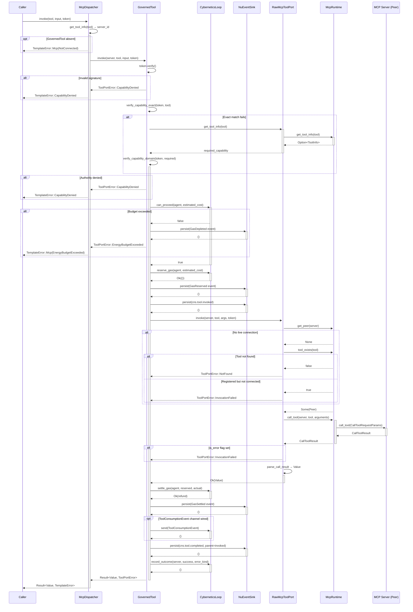
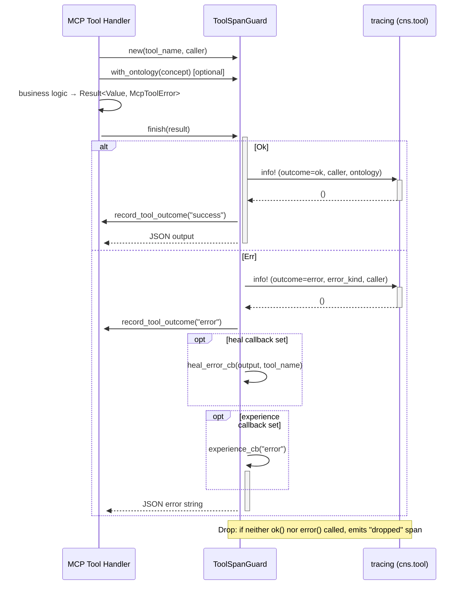
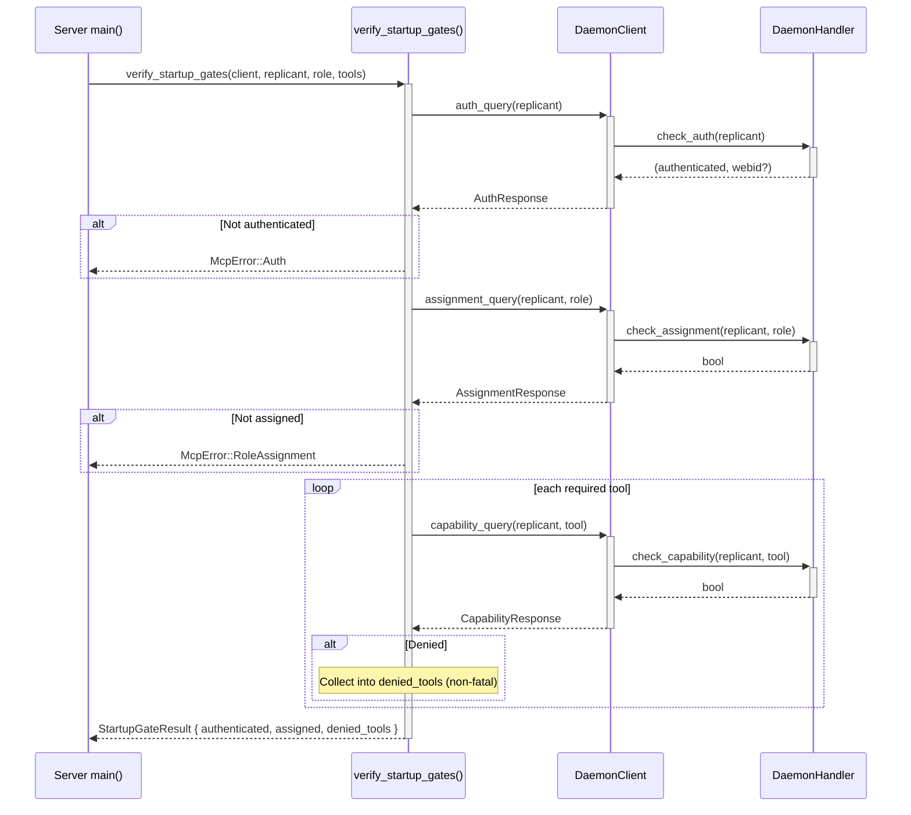

# MCP Tool Dispatch Sequence

**Purpose:** Trace the full MCP tool invocation path from `McpDispatcher::invoke()` through the `GovernedTool` OCAP membrane, to the `RawMcpToolPort` transport layer, with all CNS span emission points, energy budget checks, and error-rejection paths.

**Related:** [PRINCIPLES.md](../architecture/core/PRINCIPLES.md) §P4 — Clear Boundaries (OCAP), [MDS.md](../architecture/core/MDS.md) §6

---

## Dispatch Flow Description

When a caller requests tool execution through the `McpPort` trait, the dispatch flows through three architectural layers:

1. **Dispatcher (`McpDispatcher::invoke`)** — Resolves caller identity and tool metadata (`server_id`), then delegates to the governed membrane. Maps `ToolPortError` variants into `TemplateError` for the caller.

2. **OCAP Membrane (`GovernedTool::invoke`)** — The security boundary where all governance decisions are made. A 7-step hold-settle pipeline:
   - **Step 0:** Cryptographic token signature verification (`token.verify()`)
   - **Step 1:** OCAP authority check — two paths: exact-match (ad-hoc invocation tokens) or domain-based matching via `capabilities_match()` (agent capability tokens)
   - **Step 2:** Energy budget check — `can_proceed()` + `reserve_gas()` hold; emits `GasDepleted` span on rejection, `GasReserved` on success
   - **Step 3:** CNS observability — emits `cns.tool.invoked` span
   - **Step 4:** Delegate to inner `ToolPort` (the raw MCP transport)
   - **Step 5:** Settle gas — `settle_gas()` with refund for over-estimation; emits `GasSettled` + `ToolConsumptionEvent` on direct channel
   - **Step 6:** CNS outcome — emits `cns.tool.completed` span (parented to invoked span)
   - **Step 7:** Record outcome for quality tracking via `CyberneticsLoop::record_outcome()`

3. **Transport (`RawMcpToolPort::invoke`)** — Checks for live Peer connection, calls `McpRuntime::call_tool()` over rmcp stdio, parses `CallToolResult` into `serde_json::Value`.

Per-tool CNS span emission at the server level uses `ToolSpanGuard` (via `execute_tool()`), which emits via `tracing::info!(target: "cns.tool")`. The `Drop` implementation ensures forgotten spans still emit a "dropped" status.

Startup-time P4 enforcement uses `verify_startup_gates()`: Gate 1 (authentication), Gate 2 (role assignment), Gate 3 (per-tool capability query). Gate 3 denials are non-fatal — the server starts in degraded mode.

---

## Tool Dispatch Sequence

---

## Per-Tool CNS Span (Server Side)

---

## P4 Startup Gates (Verification)

---

## DIAGRAM_ALIGNMENT

| Field | Value |
|-------|-------|
| **id** | `DIAG-IC-007` |
| **verified_date** | `2026-06-30` |
| **verified_against** | `crates/hkask-mcp/src/`, `crates/hkask-cns/src/governed_tool.rs`, `crates/hkask-capability/src/verification/checker.rs` |
| **status** | `VERIFIED` |

### Verification notes

- `crates/hkask-mcp/src/dispatch.rs:187–282` — `McpDispatcher` struct, `McpPort` impl, `with_governed_tool()`, invocation routing through membrane
- `crates/hkask-mcp/src/dispatch.rs:36–114` — `RawMcpToolPort` struct and `ToolPort` impl — live peer check, `call_tool()`, error flag handling, result parsing
- `crates/hkask-mcp/src/dispatch.rs:229–272` — `McpPort::invoke()` — server_id lookup → GovernedTool delegation → ToolPortError → TemplateError mapping
- `crates/hkask-cns/src/governed_tool.rs:79–87` — `GovernedTool` struct with inner port, cybernetics loop, event sink, energy estimator, agent WebID
- `crates/hkask-cns/src/governed_tool.rs:188–474` — `ToolPort` impl — 7-step OCAP membrane: token verify → authority check (exact + domain fallback) → energy budget hold → CNS invoked span → inner delegation → gas settle + consumption event → CNS completed span → quality tracking
- `crates/hkask-cns/src/governed_tool.rs:151–157` — `verify_capability_exact()` — exact tool-name match via `is_valid_for()`
- `crates/hkask-cns/src/governed_tool.rs:164–167` — `verify_capability_domain()` — domain-based match via `capabilities_match()`
- `crates/hkask-cns/src/governed_tool.rs:173–185` — `verify_capability_domain_fallback()` — async tool metadata lookup + domain match
- `crates/hkask-capability/src/verification/checker.rs:20–33` — `CapabilityChecker` struct — signing key, trusted roots, root enforcement flag
- `crates/hkask-capability/src/verification/checker.rs:112–120` — `verify()` — signature verification with optional root anchoring (fail-closed on empty roots)
- `crates/hkask-mcp/src/runtime.rs:124–367` — `McpRuntime` — server registry, tool registry, live connections, `start_server()`, `call_tool()`, `get_tool_info()`
- `crates/hkask-mcp/src/runtime.rs:290–307` — `McpRuntime::call_tool()` — direct Peer invocation via rmcp `CallToolRequestParams`
- `crates/hkask-mcp/src/server.rs:241–403` — `ToolSpanGuard` — per-tool CNS span with `ok()`, `error()`, `finish()`, `Drop` guard for forgotten spans
- `crates/hkask-mcp/src/server.rs:446–458` — `execute_tool()` — automatic span emission + outcome recording
- `crates/hkask-mcp/src/server.rs:462–478` — `execute_tool_semantic()` — span with ontology concept tagging
- `crates/hkask-mcp/src/server.rs:852–861` — `emit_tool_span_with_caller()` — `tracing::info!(target: "cns.tool")` with caller WebID
- `crates/hkask-mcp/src/startup.rs:101–190` — `verify_startup_gates()` — Gate 1 (auth), Gate 2 (assignment), Gate 3 (capability per tool, non-fatal denial)
- `crates/hkask-mcp/src/startup.rs:44–52` — `StartupGateResult` — authenticated, assigned, denied_tools fields
- `docs/architecture/core/PRINCIPLES.md:52–56` — P4 Clear Boundaries (OCAP) — pod boundary as enforcement perimeter
- `docs/DIAGRAMS_INDEX.md:27` — DIAG-DC-005 — existing MCP Tool Dispatch with OCAP constraint enforcement

---

## Cross-References

| Reference | Description |
|-----------|-------------|
| [PRINCIPLES.md §P4](../architecture/core/PRINCIPLES.md) | Clear Boundaries (OCAP) — P4.1 Pod Boundary as OCAP Enforcement Perimeter |
| [DIAGRAMS_INDEX.md DIAG-DC-005](../DIAGRAMS_INDEX.md) | Existing MCP Tool Dispatch with OCAP constraint enforcement (MDS.md §6) |
