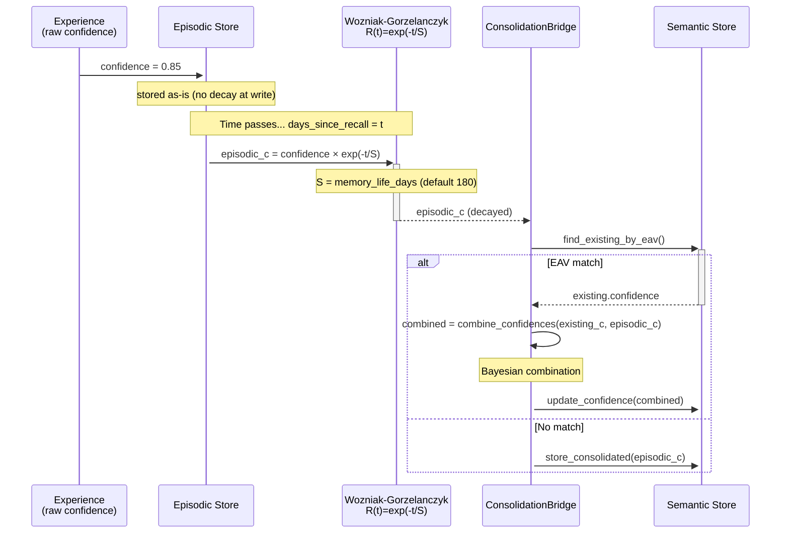

# Memory Pipeline — Episodic → Semantic with Visibility Gating

## Description

The hKask memory pipeline implements a two-layer (episodic + semantic) psycho-cybernetic memory architecture. Tool call experiences enter through `record_experience()` into the private episodic store, scoped to the agent's `perspective` (WebID). Every 10 experiences, a narrative generation loop (`generate_narrative()`) triggers the `ConsolidationBridge` to promote episodic hMems into the shared semantic store. The consolidation is one-way and irreversible: episodic perspective is stripped, confidence is decayed via the Wozniak-Gorzelanczyk forgetting curve, and hMems are either Bayesian-combined with existing semantic matches or seeded as new entries. A `ConsentManager` gates visibility transitions: episodic stays private (sovereign), semantic requires Public/Shared visibility.

**Key source:** `crates/hkask-memory/src/episodic.rs:51-220` (`EpisodicMemory`), `crates/hkask-memory/src/semantic.rs:61-130` (`SemanticMemory`), `crates/hkask-memory/src/consolidation.rs:26-168` (`ConsolidationBridge`), `crates/hkask-memory/src/consolidation_service.rs:10-100` (`ConsolidationService`), `crates/hkask-services-runtime/src/daemon_impl.rs:227-400` (`store_experience`, `generate_narrative`).

### Visibility and Perspective Rules

| Store | `visibility` | `perspective` | Who can read? |
|-------|-------------|--------------|---------------|
| Episodic | `Private` only | `Some(agent_webid)` | Only owning agent |
| Semantic | `Shared` / `Public` | `None` | Any agent with capability token |

### Consolidation Rules

| Scenario | Action | Confidence |
|----------|--------|------------|
| EAV match in semantic | Bayesian combine | `combine_confidences(existing, episodic_decayed)` |
| No EAV match | Seed new semantic hMem | Decayed episodic confidence |
| Episodic hMem expired | Soft-delete via `valid_to` | Source removed from episodic |

```mermaid
sequenceDiagram
    participant Tool as Tool Call Handler
    participant Daemon as DaemonHandler<br/>(store_experience)
    participant Narr as generate_narrative<br/>(every 10 experiences)
    participant Epi as EpisodicMemory<br/>(Private · perspective-scoped)
    participant Cons as ConsentManager<br/>(visibility gate)
    participant Sem as SemanticMemory<br/>(Public · shared)
    participant Bridge as ConsolidationBridge
    participant Svc as ConsolidationService
    participant Sq as SQLCipher<br/>(per-agent isolation)
    participant CNS as CNS NuEventSink

    rect rgb(245, 248, 252)
        Note over Tool,Epi: Phase 1 — Tool Call Experience → Episodic Store

        Tool->>+Daemon: store_experience(replicant, entity, attribute, value, confidence)
        Note over Tool: e.g., "moat_check"<br/>outcome="success"<br/>confidence=0.85
        Daemon->>+Epi: record_experience() → store(h_mem)
        Note over Epi: access.visibility = Private<br/>access.perspective = Some(agent_webid)

        alt visibility is Shared or Public
            Epi-->>Epi: EpisodicMemoryError::InvalidVisibility
            Note over Epi: "Episodic memory is sovereign"<br/>— shared/public hMems rejected
        else perspective is None
            Epi-->>Epi: EpisodicMemoryError::MissingPerspective
        else valid Private + perspective
            Epi->>+Sq: h_mem_store.insert(&triple)
            Sq-->>-Epi: Ok(())
            Epi->>+CNS: persist(NuEvent { span: cns.memory.encode.episodic_stored })
            CNS-->>-Epi: ()

            Epi->>+Epi: storage_usage(perspective)
            opt usage > 80% of budget
                Note over Epi: EpisodicLoop produces<br/>Throttle action (self-targeted)
            end
            opt usage > 100% of budget
                Note over Epi: EpisodicLoop escalates to Curation
            end
        end
    end

    rect rgb(245, 252, 245)
        Note over Tool,Narr: Phase 2 — Narrative Generation Trigger (every 10 experiences)

        Daemon->>+Daemon: experience_count % 10 == 0?
        alt trigger threshold reached
            Daemon->>+Narr: tokio::spawn(generate_narrative)
            Narr->>+Epi: query_for_deduped("mcp_session", perspective)
            Note over Epi: Applies Wozniak-Gorzelanczyk decay:<br/>R(t) = exp(-t/S) where S=180 days
            Epi->>+Epi: dedup_h_mems() — EAV hash dedup
            Epi-->>-Narr: recent episodes (last 20, decayed)
            Narr->>+Narr: build session log → inference prompt
            Narr->>+Narr: inference.generate(prompt)
            Note over Narr: LLM produces semantic observations
            Narr->>+Sem: store(semantic_observation)<br/>(Shared/Public, no perspective)
        end
    end

    rect rgb(255, 252, 240)
        Note over Epi,Svc: Phase 3 — Consolidation Bridge (Episodic → Semantic)

        Note over Bridge: Triggered by EpisodicLoop.act()<br/>when budget pressure detected
        Bridge->>+Epi: consolidation_candidates(perspective, limit)
        Note over Epi: Selects oldest/lowest<br/>effective-confidence hMems
        Epi-->>-Bridge: Vec<hMem> (candidates)

        loop each candidate hMem
            Bridge->>+Bridge: Compute decayed confidence<br/>days_since = (now - recalled_at) / 86400<br/>episodic_c = confidence.memory_decay(days_since, S)

            Bridge->>+Sem: find_existing_by_eav(triple)

            alt EAV match found (combine)
                Sem-->>-Bridge: Some(existing)
                Bridge->>+Bridge: combined = combine_confidences(existing_c, episodic_c)
                Bridge->>+Sem: update_confidence(id, value, combined)
                Sem-->>-Bridge: Ok(())
                Note over Bridge: Bayesian combined —<br/>existing semantic hMem updated
            else No EAV match (seed)
                Sem-->>-Bridge: None
                Bridge->>+Bridge: new semantic hMem:<br/>· stripped perspective (None)<br/>· visibility → Shared/Public<br/>· confidence = episodic_c
                Bridge->>+Sem: store_consolidated(triple)
                Sem-->>-Bridge: Ok(())
                Note over Bridge: New semantic hMem seeded
            end

            Bridge->>+Epi: expire_triple(&id)
            Note over Epi: soft-delete via valid_to<br/>Frees episodic storage budget
            Epi-->>-Bridge: Ok(())
        end

        Bridge-->>-Svc: ConsolidationOutcome { consolidated_count, deleted_count, failed_count }
        Note over Bridge: tracing::info!(target: "cns.consolidation")
    end

    rect rgb(248, 245, 255)
        Note over Svc,Sem: Phase 4 — ConsolidationService Cleanup

        Svc->>+Svc: consolidate(perspective, request)
        Svc->>+Bridge: bridge.consolidate(perspective, limit)
        Bridge-->>-Svc: bridge_outcome

        opt confidence_floor specified
            Svc->>+Sem: low_confidence_h_mems(floor, MAX)
            loop each low-confidence hMem
                Svc->>+Sem: delete_h_mem(id)
            end
        end

        opt max_semantic_triples specified
            Svc->>+Sem: h_mem_count()
            alt count > max
                Svc->>+Sem: lowest_confidence_h_mems(count - max)
                loop each lowest-confidence hMem
                    Svc->>+Sem: delete_h_mem(id)
                end
            end
        end
    end

    rect rgb(245, 248, 252)
        Note over Cons,Sq: Visibility Gating — Private vs Public with SQLCipher Isolation

        Note over Epi: Episodic Recall (Private)
        Epi->>+Cons: has_consent(agent_webid, DataCategory)
        alt consent denied
            Cons-->>-Epi: false — fail-closed
        else consent granted
            Cons-->>-Epi: true
            Epi->>+Sq: query_by_entity(entity)
            Note over Sq: WHERE perspective = agent_webid<br/>(per-agent SQLCipher isolation)
            Sq-->>-Epi: hMems (decayed + deduped)
        end

        Note over Sem: Semantic Recall (Public)
        Sem->>+Sq: query_by_entity(entity)
        Note over Sq: WHERE visibility IN (Shared, Public)<br/>AND perspective IS NULL<br/>(cross-agent accessible)
        Sq-->>-Sem: hMems (deduped by EAV hash)
        Note over Sem: recall_dedup::dedup_h_mems(filtered)
    end
```

## Confidence Flow Through Pipeline



## Per-Agent SQLCipher Isolation

| Dimension | Episodic | Semantic |
|-----------|----------|----------|
| Filter column | `perspective = agent_webid` | `visibility IN (Shared, Public)` |
| Encryption | Per-agent SQLCipher key | Shared encryption key |
| Dedup strategy | `recall_dedup::dedup_h_mems()` | `recall_dedup::dedup_h_mems()` |
| Confidence at read | Wozniak-Gorzelanczyk decay applied | Wozniak-Gorzelanczyk decay applied |
| Budget enforcement | `EpisodicLoop` (80%/100% thresholds) | `ConsolidationService` (confidence floor + max count) |

---

<!-- DIAGRAM_ALIGNMENT
id: DIAG-PL-003
verified_date: 2026-07-02
verified_against: >
  crates/hkask-memory/src/episodic.rs:51-220 (EpisodicMemory, store, query_for_deduped, storage_usage),
  crates/hkask-memory/src/episodic_loop.rs:26-80 (EpisodicLoop, budget enforcement),
  crates/hkask-memory/src/semantic.rs:61-175 (SemanticMemory, store, query_deduped with decay, store_consolidated),
  crates/hkask-memory/src/consolidation.rs:26-179 (ConsolidationBridge, consolidate with dual-decay Bayesian combine),
  crates/hkask-memory/src/consolidation_service.rs:10-100 (ConsolidationService, consolidate, cleanup),
  crates/hkask-memory/src/recall_dedup.rs:10-57 (eav_hash, dedup_h_mems, BLAKE3),
  crates/hkask-memory/src/ports.rs:1-216 (EpisodicStoragePort, SemanticStoragePort, StorageRequest, RecallRequest),
  crates/hkask-services-runtime/src/daemon_impl.rs:227-400 (store_experience, generate_narrative),
  crates/hkask-mcp/src/server/tool_span.rs:78-84 (ExperienceCallback, record_experience trigger)
status: VERIFIED
-->

## Cross-Reference

| Reference | Description |
|-----------|-------------|
| [`EpisodicMemory`](crates/hkask-memory/src/episodic.rs:51-220) | Private, perspective-scoped memory with confidence decay |
| [`SemanticMemory`](crates/hkask-memory/src/semantic.rs:61-175) | Shared, public memory with confidence decay and similarity-augmented recall |
| [`ConsolidationBridge`](crates/hkask-memory/src/consolidation.rs:26-168) | One-way episodic→semantic promotion with Bayesian combination |
| [`ConsolidationService`](crates/hkask-memory/src/consolidation_service.rs:10-100) | Combined consolidation + semantic cleanup |
| [`EpisodicLoop`](crates/hkask-memory/src/episodic_loop.rs:26-80) | Cybernetic loop with budget regulation |
| [`recall_dedup`](crates/hkask-memory/src/recall_dedup.rs:10-57) | BLAKE3 EAV-hash deduplication layer |
| [`MemoryPorts`](crates/hkask-memory/src/ports.rs:1-216) | Episodic and Semantic storage port traits |
| [`store_experience` / `generate_narrative`](crates/hkask-services-runtime/src/daemon_impl.rs:227-400) | Daemon-based experience recording and narrative generation |
| [`ToolSpanGuard` experience callback](crates/hkask-mcp/src/server/tool_span.rs:78-84) | Experience callback wiring for tool span guards |
| [Magna Carta P1](../reference/magna-carta.md#p1-user-sovereignty) | User Sovereignty — episodic memory as sovereign first-person |
| [`sequence-consent-flow.md`](docs/diagrams/sequence-consent-flow.md) | Consent flow for visibility gating (DIAG-TO-006-CM) |
| [`sequence-cns-span-emission.md`](docs/diagrams/sequence-cns-span-emission.md) | CNS span emission for memory encode spans (DIAG-TO-004) |
