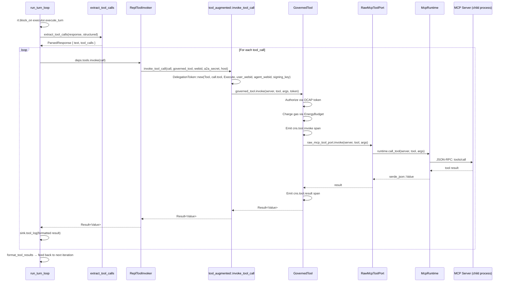

# REPL Tool Invocation — Sequence

Sequence diagram of the tool invocation chain from the REPL turn loop through `GovernedTool` to the MCP runtime. This is the OCAP (Object Capabilities) boundary: every tool call is authorized via a `DelegationToken` minted from the session's A2A secret, and energy is charged through the `GovernedTool` membrane.

<!-- DIAGRAM_ALIGNMENT
id: DIAG-REPL-003
verified_date: 2026-07-20
verified_against: crates/hkask-repl/src/tool_augmented.rs:238-258; crates/hkask-repl/src/deps.rs:262-293; crates/hkask-cns/src/governed_tool.rs
status: VERIFIED
-->

## Security Properties

- **OCAP Authorization:** Every tool invocation requires a `DelegationToken` minted from the session's A2A secret. The token binds the resource (`DelegationResource::Tool`), the tool name, the action (`DelegationAction::Execute`), the user WebID (the authorizing principal), and the agent WebID (the delegated principal). The token is signed with `derive_signing_key(a2a_secret)`.
- **A2A Secret Handling:** The secret is wrapped in `ZeroizingSecret` in both the REPL turn pipeline (`lib.rs`) and the `ReplToolInvoker` (`deps.rs`). The bytes are scrubbed from memory when the invoker is dropped. The previous implementation stored the secret as a plain `Vec<u8>`, defeating the `ZeroizingSecret` protection.
- **Gas Charging:** `GovernedTool` charges gas for tool execution via its internal `EnergyBudget`. This is separate from the inference gas reservation — tool calls have their own energy accounting.
- **CNS Observability:** Every tool invocation emits `cns.tool.invoke` and `cns.tool.result` spans, providing cybernetic observability of the tool-call surface.
- **Two Parse Paths:** `extract_tool_calls` checks structured native function calls first (`InferenceResult.tool_calls` when `finish_reason == "tool_calls"`), then falls back to `<<tool:server/name\n{args}\n>>` text directives. This supports both modern models (native function calling) and legacy models (text directives).

## Cross-References

- [REPL Specification §6.2 — Tool Call Parsing](../specifications/REPL-specification.md#62-tool-call-parsing-two-priority-levels)
- [REPL Specification §6.3 — Tool Call Invocation](../specifications/REPL-specification.md#63-tool-call-invocation)
- [Sovereignty and OCAP Explanation](../explanation/sovereignty-and-ocap.md)
- [REPL Turn Pipeline Flowchart](flowchart-repl-turn-pipeline.md)
