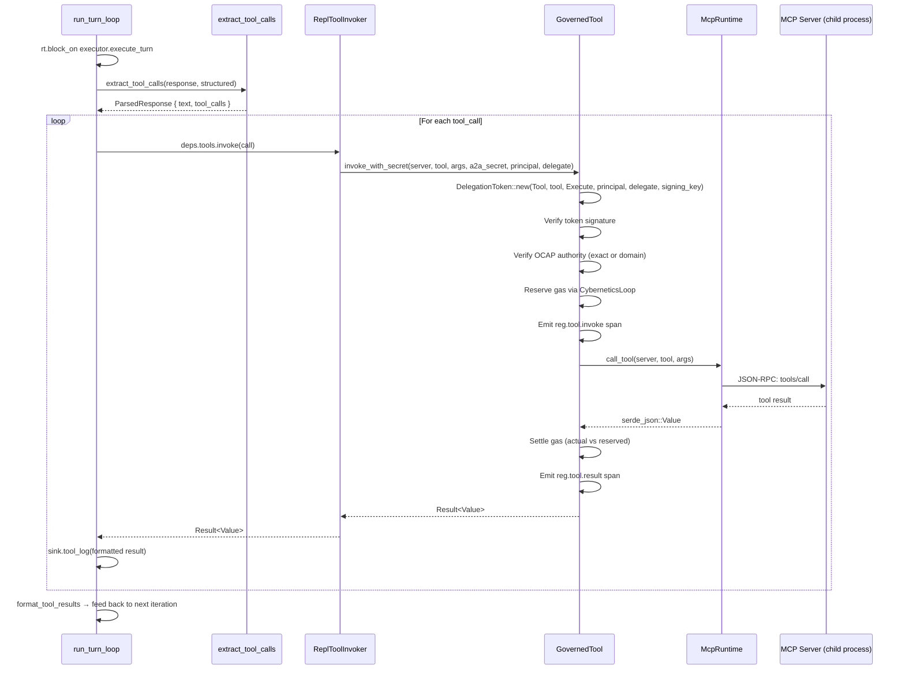

# REPL Tool Invocation — Sequence

Sequence diagram of the tool invocation chain from the REPL turn loop through `GovernedTool` to the MCP runtime. This is the OCAP (Object Capabilities) boundary: `GovernedTool::invoke_with_secret` mints the `DelegationToken` internally from the A2A secret, then verifies OCAP authority, reserves gas, emits Regulation spans, and delegates to the inner tool port.

<!-- DIAGRAM_ALIGNMENT
id: DIAG-REPL-003
verified_date: 2026-07-20
verified_against: crates/hkask-repl/src/deps.rs:262-293, crates/hkask-regulation/src/governed_tool.rs:199-230, crates/hkask-mcp/src/dispatch.rs:52-107
status: VERIFIED
-->

## What Was Removed

The previous invocation chain had 6 Rust-side layers: `ReplToolInvoker` → `tool_augmented::invoke_tool_call` → `GovernedTool::invoke` → `RawMcpToolPort` → `McpRuntime` → MCP server. The `tool_augmented::invoke_tool_call` free function (21 lines of token-minting) was inlined into `GovernedTool::invoke_with_secret`, collapsing the chain to 4 layers. The `RawMcpToolPort` adapter remains (it implements the `ToolPort` trait for `McpRuntime`), but could be eliminated in a future refactor by having `McpRuntime` implement `ToolPort` directly.

## Security Properties

- **OCAP Authorization:** `GovernedTool::invoke_with_secret` mints the `DelegationToken` internally from the A2A secret. The token binds the resource (`DelegationResource::Tool`), the tool name, the action (`DelegationAction::Execute`), the principal WebID (user), and the delegate WebID (agent). The token is signed with `derive_signing_key(a2a_secret)`.
- **A2A Secret Handling:** The secret is stored as `ZeroizingSecret` in `ReplToolInvoker` and passed as `&[u8]` to `invoke_with_secret` — no secret bytes are copied into the token-minting path.
- **Gas Charging:** `GovernedTool` reserves gas before invocation and settles with the actual cost after. This is separate from the inference gas reservation — tool calls have their own energy accounting.
- **Regulation Observability:** Every tool invocation emits `reg.tool.invoke` and `reg.tool.result` spans.
- **Two Parse Paths:** `extract_tool_calls` checks structured native function calls first, then falls back to `<<tool:...>>` text directives.

## Cross-References

- [REPL Specification §6.3 — Tool Call Invocation](../specifications/REPL-specification.md#63-tool-call-invocation)
- [Sovereignty and OCAP Explanation](../explanation/sovereignty-and-ocap.md)
- [REPL Turn Pipeline Flowchart](flowchart-repl-turn-pipeline.md)
