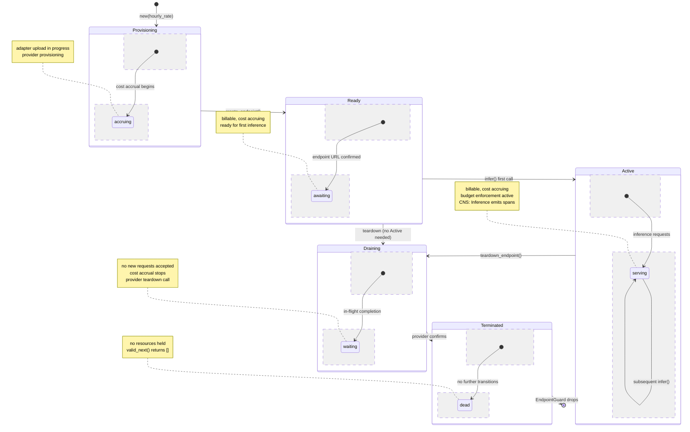

# Adapter Endpoint Lifecycle State Machine

## Description

The `EndpointLifecycle` in `hkask-adapter` governs every inference endpoint through five strictly-validated phases. Construction enters `Provisioning`. The `create_endpoint()` flow in `AdapterRouter` uploads the adapter and transitions to `Ready`. First inference triggers `Ready → Active`. Teardown (explicit or via RAII `EndpointGuard` drop) moves through `Draining` to `Terminated`. Cost accrues only in billable phases (`Provisioning`, `Ready`, `Active`). Every transition is validated by `valid_next()` and emits a CNS span.

**Key source:** `crates/hkask-adapter/src/endpoint_lifecycle.rs:14-45` (enum + `valid_next`), `crates/hkask-adapter/src/adapter_router/mod.rs:464-649` (transition triggers).

## Transition Table

| From | To | Trigger | Source Location |
|------|----|---------|-----------------|
| `[*]` | `Provisioning` | `EndpointLifecycle::new(hourly_rate)` | `endpoint_lifecycle.rs:103` |
| `Provisioning` | `Ready` | `AdapterRouter::create_endpoint()` after upload + provision | `adapter_router/mod.rs:506` |
| `Ready` | `Active` | `AdapterRouter::infer()` first call | `adapter_router/mod.rs:585` |
| `Ready` | `Draining` | `AdapterRouter::teardown_endpoint()` (skip Active) | `adapter_router/mod.rs:613` |
| `Active` | `Active` | `AdapterRouter::infer()` subsequent calls (self-loop) | `adapter_router/mod.rs:568` |
| `Active` | `Draining` | `AdapterRouter::teardown_endpoint()` graceful drain | `adapter_router/mod.rs:613` |
| `Draining` | `Terminated` | Provider teardown completes, state committed | `adapter_router/mod.rs:631` |
| `Terminated` | `[*]` | `EndpointGuard` RAII drop (fire-and-forget spawn) | `adapter_router/mod.rs:700` |

## Guard Conditions

- **Provisioning → Ready:** Provider confirms deployment URL; `valid_next()` enforces this is the only exit.
- **Ready → Draining:** Permitted by `valid_next()` — endpoint can be torn down without ever serving traffic.
- **Active → Active:** Self-loop allowed; `is_billable()` returns true; cost continues accruing.
- **Any billable → Draining:** Cost accrued for time spent in billable phase before transition.
- **Terminated:** `valid_next()` returns empty slice — no further transitions possible.

## Budget Enforcement

`EndpointLifecycle` tracks cost via `hourly_rate * elapsed_hours` in billable phases. `is_over_budget(budget_limit)` gates whether the endpoint should be drained. `drain_all_owner()` in `AdapterRouter` drains all billable endpoints.

---

<!-- DIAGRAM_ALIGNMENT
id: DIAG-DC-008
verified_date: 2026-06-30
verified_against: crates/hkask-adapter/src/endpoint_lifecycle.rs (EndpointPhase enum, valid_next, new, transition), crates/hkask-adapter/src/adapter_router/mod.rs (create_endpoint:506, infer:585, teardown_endpoint:613-631, EndpointGuard drop:700)
status: VERIFIED
-->

## Cross-Reference

- [`hKask-architecture-master.md` § LoRA Adapter Lifecycle & Inference Composition](architecture/hKask-architecture-master.md#lora-adapter-lifecycle--inference-composition)
- [`endpoint_lifecycle.rs`](crates/hkask-adapter/src/endpoint_lifecycle.rs) — `EndpointPhase` enum, `valid_next()`, `EndpointLifecycle::transition()`
- [`adapter_router/mod.rs`](crates/hkask-adapter/src/adapter_router/mod.rs) — `create_endpoint()`, `infer()`, `teardown_endpoint()`, `EndpointGuard`
