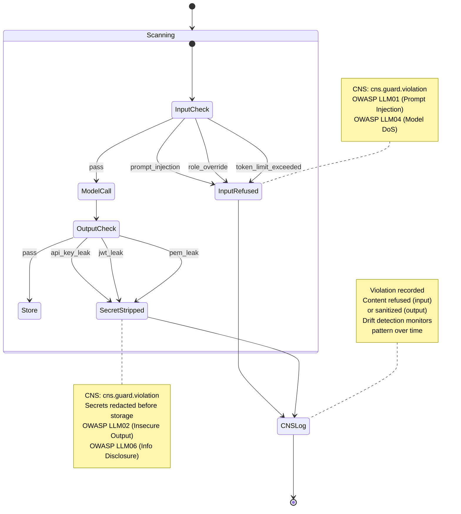

# Guard Violation Lifecycle

States and transitions for content safety guard violations. Aligned with
OWASP LLM Top 10 risk categories (LLM01, LLM02, LLM04, LLM06).

Related: `crates/hkask-guard/src/pipeline.rs`, `crates/hkask-types/src/cns.rs`

