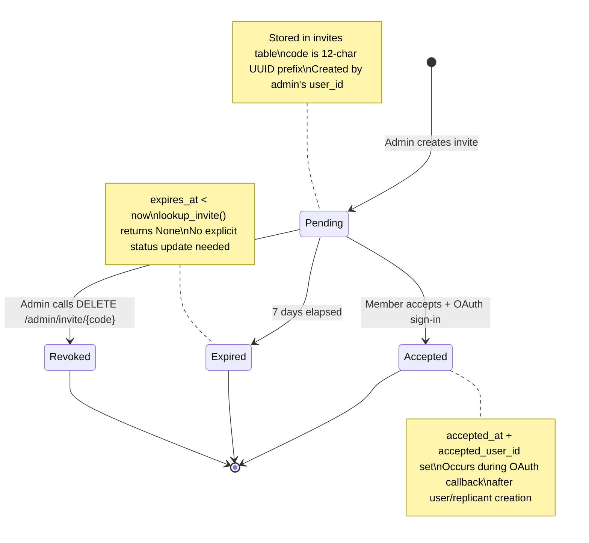

# Invite Lifecycle State Machine

State diagram for hKask's multi-user invitation system. Invites have a 7-day expiry and two terminal states.

## Diagram

## Invite Lifecycle States

| State | Trigger | DB Fields Set | Reversible? |
|-------|---------|--------------|-------------|
| **Pending** | `POST /api/v1/admin/invite` or `kask replicant invite` | `invite_id`, `created_by`, `code`, `status='pending'`, `created_at`, `expires_at` | No (only Accepted or Expired) |
| **Accepted** | OAuth callback after invite validation | `status='accepted'`, `accepted_at`, `accepted_user_id` | No (terminal) |
| **Expired** | 7 days after creation (checked on lookup) | None (implicit — `lookup_invite` checks `expires_at > now`) | No (terminal) |

## Invite Code Format

- Generated from `uuid::Uuid::new_v4().to_string().replace('-', "")[..12]`
- Example: `a1b2c3d4e5f6` (12 alphanumeric chars)
- Delivered via `hkask_invite_code` HttpOnly cookie (10-minute TTL) during redirect from `/api/v1/auth/accept-invite`

## CNS Observability

| Span | When Emitted | Status |
|------|-------------|--------|
| `cns.deploy.invite` (invite_accepted) | After `accept_invite()` succeeds in callback | ✅ Implemented |
| `InviteSent` | When admin creates invite | ❌ Not yet implemented |
| `InviteExpired` | When expired invite is looked up | ❌ Not yet implemented |

## Cross-References

- OAuth flow: `docs/diagrams/flowchart-oauth-registration.md`
- ERD: `docs/diagrams/erd-multi-user.md`
- Functional spec §3.16: `docs/architecture/core/FUNCTIONAL_SPECIFICATION.md`
- Invite storage: `crates/hkask-storage/src/user_store.rs` (create_invite, lookup_invite, accept_invite)
