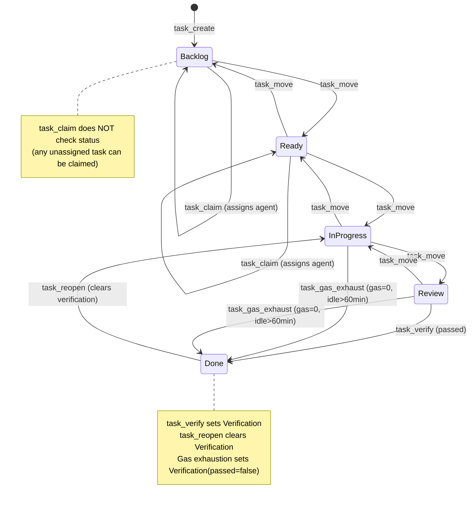

# Kanban Task Lifecycle — State Diagram

**Diataxis type:** Reference
**Status:** Current (v0.31.0)

This diagram shows the valid state transitions for a kanban `Task`. Transitions are column-ordered: forward one step or backward one step — no skipping. The `task_reopen` operation is a special backward transition from `Done` directly to `InProgress` (clearing verification), bypassing the one-step rule. Gas/rJoule exhaustion auto-completes a task from `InProgress` or `Review` directly to `Done` via `task_gas_exhaust`.

Cross-links:
- [Kata-Kanban Architecture](class-kata-kanban-architecture.md) — DIAG-IC-017
- [Kata PDCA Lifecycle](../how-to/skills-and-composition.md#kata-pdca-lifecycle-state-machine) — PDCA phase mapping
- [Architecture Master: Kanban](../architecture/core/hKask-architecture-master.md#kanban--headless-task-coordination) — canonical kanban architecture

<!-- DIAGRAM_ALIGNMENT
id: DIAG-FW-008
verified_date: 2026-07-20
verified_against: crates/hkask-services-kata-kanban/src/kanban/types/status.rs:61-73 (can_transition_to), crates/hkask-services-kata-kanban/src/kanban/service_impl/service.rs:814-837 (task_reopen), crates/hkask-services-kata-kanban/src/kanban/service_impl/dejam.rs:180-207 (task_gas_exhaust), crates/hkask-services-kata-kanban/src/kanban/service_impl/service.rs:617-658 (task_claim)
status: VERIFIED
-->
