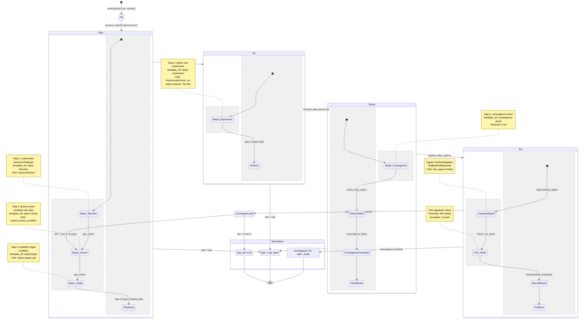

# Kata PDCA Lifecycle State Machine

## Description

The Improvement Kata PDCA cycle in `hkask-services-kata-kanban` executes as a 5-step sequential pipeline within the `KataEngine` that maps to four conceptual PDCA phases. Each step runs an LLM inference via the registered template (e.g., `kata-improvement/improvement-step1-direction`), validates output against the step's `output_schema`, records a `StepExperience`, and emits CNS spans. The cycle is bounded by `gas.cap` (default 15,000) and `convergence.max_iterations` (3). Metric capture flanks the execution: `metric_before` is captured pre-cycle and `metric_after` post-cycle, yielding an `ImprovementSignal` (Positive/Negative/Stalled/NotMeasured). CNS algedonic alerts fire if variety deficit exceeds threshold. Kanban task mapping through `KanbanKataBridge` translates PDCA phases to `TaskStatus`: Plan→Backlog, Do→InProgress, Check→Review, Act→Done (or Backlog if convergence unmet).

**Key source:** `crates/hkask-services-kata-kanban/src/kata/mod.rs:333-486` (`execute`), `crates/hkask-services-kata-kanban/src/kata/improvement.rs:12-121` (`run_improvement_from`), `crates/hkask-services-kata-kanban/src/bridge.rs:43-56` (`run_improvement_on_task`), `crates/hkask-services-kata-kanban/src/kata/metrics.rs:6-133` (metric capture + signal).



## Transition Summary

| From | To | Trigger | Source Location |
|------|----|---------|-----------------|
| `[*]` | `Init` | `KataEngine::execute("improvement", learner_bot, context)` | `kata/mod.rs:333` |
| `Init` | `Plan` | `consent_check("improvement", learner_bot)` passes | `kata/mod.rs:348-349` |
| `Step1_Direction` | `Step2_Current` | `execute_step()` returns, `gas + step_gas <= cap`, `check_step_output()` | `improvement.rs:54` |
| `Step2_Current` | `Step3_Target` | Same gas + output validation gates | `improvement.rs:54` |
| `Plan` | `Do` | `capture_before_metrics()` records CNS counters | `kata/mod.rs:352` |
| `Do` | `Check` | `execute_step()` returns step 4 output | `improvement.rs:54` |
| `Check` | `Act` | `capture_after_metrics()` records post-cycle CNS counters | `kata/mod.rs:367` |
| `Act` | `Done` | Convergence metric ≤ 0.15, `improvement_signal` computed | `kata/mod.rs:386` |
| `Act` | `ConvergentLoop` | Convergence > 0.15, iterations < 3 | `kata-improvement.yaml:16-21` |
| `ConvergentLoop` | `Step2_Current` | Loop back to re-grasp current condition | `kata-improvement.yaml:102-106` |
| `ConvergentLoop` | `MaxIterations` | `iter >= max_iterations (3)` | `kata-improvement.yaml:20` |
| Any phase | `GasExceeded` | `gas_consumed + step_gas > gas.cap` | `improvement.rs:48-51` |

## PDCA → Kanban State Mapping

| PDCA Phase | Kanban `TaskStatus` | CNS Event | Trigger |
|------------|---------------------|-----------|---------|
| **Plan** | `Backlog` | `cns.tool.kanban` (task created) | `KanbanKataBridge::run_improvement_on_task()` |
| **Do** | `InProgress` | `cns.tool.kanban` (task moved) | Coaching Q4: "What is your next step?" |
| **Check** | `Review` | `cns.tool.kanban` (task verified) | Coaching Q5: task transitions to Review |
| **Act** | `Done` | `cns.tool.kanban` (task completed) | Verification passes |
| **Act** (fail) | `InProgress` | `cns.kata.improv.effectiveness` (degradation) | Verification fails → rework |

## Guard Conditions

- **Init → Plan:** Curator consent required for Improvement Kata; `consent_check` must return `Ok(())`. Self-consent suffices for Starter; Learner consent for Coaching.
- **Gas gate (any step):** `state.gas_consumed + step_gas > manifest.gas.cap` → `Err(KataError::GasExceeded)`. No soft continue; hard abort per `error_handling.on_gas_exceeded: abort`.
- **Output schema check:** If step has `output_schema`, all `properties` keys must exist in the inference output JSON. Missing keys → CNS `debug!` log, check returns `false`.
- **Convergence threshold:** Default 0.15; `improvement_gate: threshold_only`. On `not_reached: escalate`, Curator is notified.
- **Convergent loop:** `max_iterations: 3` with `min_iterations: 1`. Re-enters at Step 2 (grasp current condition with updated data).
- **CNS algedonic:** `algedonic_threshold: 100` variety deficit → warning emitted to `cns.kata` target with `escalation_target: Curator`.

## CNS Span Diagram

```
cns.prompt.kata.improvement
├── [pre-cycle]  kata_type="improvement", bot=<learner>
├── [per-step]   step=<ordinal>, action=<action>, bot=<learner>
├── [per-step]   step=<ordinal>, passed_check=<bool>
├── [post-step]  step=<ordinal>, gas=<consumed>
├── [post-cycle] steps=<completed>, gas=<consumed>, has_signal=<bool>
└── [algedonic]  namespace=<...>, severity, deficit, threshold
```

---

<!-- DIAGRAM_ALIGNMENT
id: DIAG-FW-005
verified_date: 2026-06-30
verified_against: crates/hkask-services-kata-kanban/src/kata/mod.rs (execute:333-486), crates/hkask-services-kata-kanban/src/kata/improvement.rs (run_improvement_from:20-121), crates/hkask-services-kata-kanban/src/bridge.rs (KanbanKataBridge:18-73), crates/hkask-services-kata-kanban/src/kata/metrics.rs (capture_before/after:6-105, compute_improvement_signal:76-105), crates/hkask-services-kata-kanban/src/kata/manifest.rs (KataStep, KataManifest, convergence config), crates/hkask-services-kata-kanban/src/kanban/types/status.rs (TaskStatus transitions), registry/manifests/kata-improvement.yaml (step definitions, convergence parameters, CNS spans:150-160)
status: VERIFIED
-->

## Cross-Reference

- [`hKask-architecture-master.md` § Kata — Cybernetic Capability Development](architecture/hKask-architecture-master.md#kata--cybernetic-capability-development)
- [`PRINCIPLES.md` § P6 — Space for Replicants & Bots](architecture/core/PRINCIPLES.md#p6--space-for-replicants--bots)
- [`kata/mod.rs`](crates/hkask-services-kata-kanban/src/kata/mod.rs) — `KataEngine::execute()` dispatch (L333-486)
- [`kata/improvement.rs`](crates/hkask-services-kata-kanban/src/kata/improvement.rs) — `run_improvement_from()` step loop (L20-121)
- [`kata/metrics.rs`](crates/hkask-services-kata-kanban/src/kata/metrics.rs) — before/after capture, signal computation (L6-133)
- [`kata/manifest.rs`](crates/hkask-services-kata-kanban/src/kata/manifest.rs) — `KataStep`, `KataManifest`, convergence config
- [`bridge.rs`](crates/hkask-services-kata-kanban/src/bridge.rs) — `KanbanKataBridge` PDCA→task mapping (L18-73)
- [`kanban/types/status.rs`](crates/hkask-services-kata-kanban/src/kanban/types/status.rs) — `TaskStatus` column-ordered transitions
- [`registry/manifests/kata-improvement.yaml`](registry/manifests/kata-improvement.yaml) — canonical step definitions, convergence params, CNS spans
