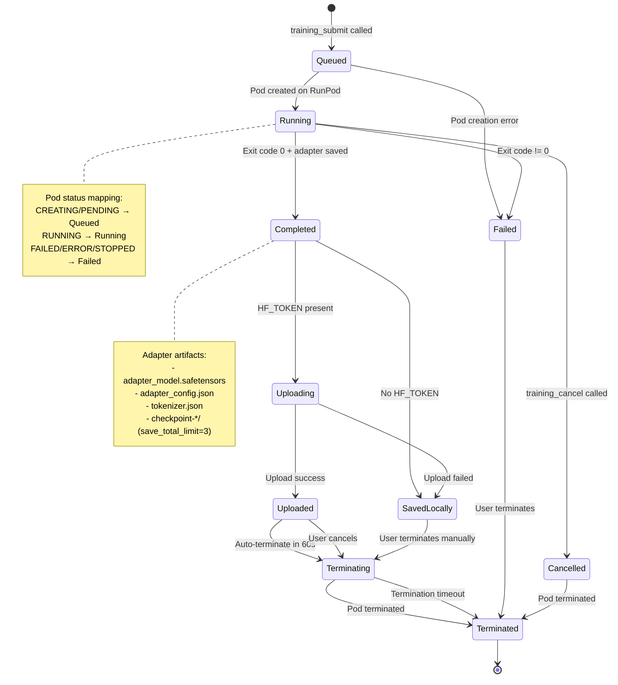

# Training Job Lifecycle State Diagram

This diagram shows the states and transitions for a training job as it moves through the hKask training pipeline. It covers both the MCP server's `TrainingJobStatus` enum and the RunPod pod lifecycle.

## State Definitions

| State | Meaning | Pod Alive? |
|-------|---------|------------|
| Queued | Job submitted, pod not yet created | No |
| Running | Pod is running, training in progress | Yes |
| Completed | Training finished successfully, adapter saved | Yes (grace period) |
| Failed | Training error or pod crash | Yes (for debugging) |
| Cancelled | User cancelled the job | Yes (until terminated) |
| Uploading | Adapter being uploaded to HF | Yes |
| Uploaded | Upload complete | Yes (60s grace) |
| SavedLocally | Adapter saved but not uploaded | Yes |
| Terminating | Pod termination in progress | Yes |
| Terminated | Pod destroyed | No |
