# Architecture Patterns

This document consolidates five architectural patterns that define hKask's structural identity and the API surface that exposes them. Each pattern exists because a specific project constraint demands it — not for aesthetic or conventional reasons. The patterns are: hexagonal ports and adapters, the loom-and-thread separation, the Good Regulator theorem, the Viable System Model mapping, and the dual-axis ontology. The final section documents the API surface equivalence (P3) that makes every architectural boundary equally accessible from CLI, API, and MCP.

---

## 1. Hexagonal Ports and Adapters

### Statement

The hexagonal architecture in hKask is not a pattern adopted for aesthetics. It exists because the system's core regulatory logic — the Regulation, the Curator, the Inference loop — must function identically whether it runs against a local SQLite database on a developer's laptop or against a federated cluster of PostgreSQL-backed replicas. More importantly, it must be testable without any of those backends at all.

### Evidence

In standard hexagonal architecture, the domain core is surrounded by ports (interfaces the core defines) and adapters (implementations that satisfy those interfaces). In Rust, ports are **traits**, and adapters are **structs that implement those traits**. The rule is simple: domain crates define the traits; infrastructure crates provide the implementations.

This design exists because hKask's dependency graph imposes a strict Authority DAG. Domain crates (`hkask-regulation`, `hkask-pods`, `hkask-inference`) must not depend on infrastructure crates (`hkask-storage`, `hkask-mcp`, `hkask-federation`). The port traits in `hkask-ports` are the only shared dependency — every domain crate imports from `hkask-ports`, and every infrastructure crate implements against it. There is no other coupling path.

As the crate-level documentation in `crates/hkask-ports/src/lib.rs` states: "Port traits that enable crates to depend on abstractions rather than concrete implementations. Per the Authority DAG, domain crates depend on these port traits (not on each other)."

#### The 17 Port Traits

The `hkask-ports` crate defines **17 trait contracts**, each guarding a distinct architectural boundary. They group into five concerns:

| Concern | Traits |
|---------|--------|
| Regulation regulation | `CircuitBreakerPort`, `LedgerStoragePort`, `LedgerObserver` |
| Federation | `FederationTransport`, `FederationSyncPort`, `FederationDispatch` |
| Inference and tools | `InferencePort`, `ToolPort` |
| Governance and pipelines | `ConsentPort`, `EscalationPort`, `WalletBudgetPort`, `StepExecutor` |

The eight primary infrastructure boundaries are documented in detail below. The remaining nine are listed in §1.4.

**`InferencePort`** (`crates/hkask-ports/src/inference_port.rs`) — The LLM invocation boundary. This is the most heavily used port — every agent pod, every Curator reflection, every template cascade eventually calls `generate()`. It uses `Pin<Box<dyn Future>>` rather than `async_trait` for object safety, enabling `Arc<dyn InferencePort>` dispatch at construction time. The trait provides default implementations for `generate_n()`, `generate_stream()`, `generate_with_model()`, and `generate_vision()` — all fall back to `generate()`, so a new backend only needs to implement one method. The concrete implementor is the `InferenceRouter` in `hkask-inference`, which multiplexes across multiple providers (DeepSeek, Anthropic, Groq, OpenAI, DeepInfra, Together AI, fal.ai, OpenRouter, KiloCode) with model routing, failover, and concurrency control.

**`ToolPort`** (`crates/hkask-ports/src/tool.rs`) — The governance membrane for MCP tool invocation. Unlike `InferencePort`, this port has an authentication asymmetry: `discover_tools()` and `get_tool_info()` are intentionally unauthenticated — tool schemas are public metadata — but `invoke()` requires a `DelegationToken`. OCAP enforcement applies at the actuator boundary, not the sensor boundary. The concrete implementor is `McpDispatcher` in `hkask-mcp`. The error type, `ToolPortError`, encodes the governance envelope directly: `CapabilityDenied` (OCAP rejection), `EnergyBudgetExceeded` (gas depletion), `NotFound`, and `InvocationFailed`.

**`CircuitBreakerPort`** (`crates/hkask-ports/src/regulation.rs`) — The circuit breaker boundary for the Cybernetics membrane. A minimal trait — `allow_request()`, `record_success()`, `record_failure()`, `state()` — that allows the Inference loop to use circuit breaking without depending on `hkask-regulation`. The concrete implementor is `CircuitBreaker` in `hkask-regulation`. When the Regulation detects elevated error rates above the `error_rate_max` set-point (default: 30%), it opens the circuit and the inference loop stops sending requests.

**`LedgerStoragePort`** (`crates/hkask-ports/src/regulation.rs`) — Storage abstraction for Regulation event queries. While `CircuitBreakerPort` is the actuator boundary, `LedgerStoragePort` is the memory boundary — it abstracts the `RegulationArchive` behind a trait so the cybernetic regulation layer (`GasReport`, `CalibratedEnergyEstimator`, `WalletGasCalibrator`) can be tested without a real SQLite database. It provides `query_algedonic()` for alert retrospectives, `replay_weighted()` for temporal decay-weighted event replay, and `persist_cursor()`/`load_cursor()` for crash recovery.

**`LedgerObserver`** (`crates/hkask-ports/src/regulation.rs`) — The subscriber interface for Regulation events. Observers declare an `interest_mask()` of `SpanNamespace` values they care about, then receive `on_event()`, `on_depletion()`, and `on_backpressure()` callbacks. The concrete implementor in `hkask-inference` uses this to react to throttle and circuit-break signals.

**`ConsentPort`** (`crates/hkask-ports/src/consent_port.rs`) — Decouples agent pods from the concrete `ConsentStore` in `hkask-storage`. A CRUD trait for consent records — `initialize_schema()`, `store()`, `list_active()` — that ensures the Affirmative Consent (P2) verification layer can be tested independently of the database schema.

**`EmbeddingPort`** (`crates/hkask-ports/src/embedding_port.rs`) — The vector embedding storage boundary. Abstracts the concrete `EmbeddingStore` in `hkask-storage`. Provides `store()`, `get()`, `search()` (cosine similarity), and `delete()` — the four operations needed by the semantic memory loop to anchor triples in embedding space.

**Federation ports** (`crates/hkask-ports/src/federation.rs`) — Three traits for cross-instance federation: `FederationTransport` (async send/receive with partition simulation for testing), `FederationSyncPort` (CRDT cursor-based triple synchronization), and `FederationDispatch` (high-level lifecycle orchestration). These decouple the Curator's federation logic from the concrete `FederationLinkManager` in `hkask-federation`. The `FederationDispatch` trait is documented in detail in the [Federation and Transport](federation-and-transport.md) guide.

### Diagram

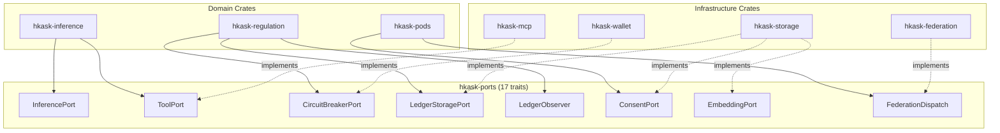
<!-- DIAGRAM_ALIGNMENT
id: DIAG-ARCH-001
verified_date: 2026-07-12
verified_against: crates/hkask-ports/src/lib.rs, crates/hkask-regulation/src/cybernetics_loop.rs
status: VERIFIED
-->

### Implications

The hexagonal pattern in hKask serves three purposes, each grounded in a specific project constraint:

**Testability.** The Regulation must be testable without external dependencies. `LedgerStoragePort` means the `CyberneticsLoop` test suite runs against in-memory data. `ToolPort` means the OCAP enforcement tests do not need running MCP servers. `InferencePort` means the prompt assembly tests do not burn API credits.

**Provider independence.** The `InferencePort` abstraction means the system can route to any LLM provider without changing agent logic. The `CircuitBreakerPort` means the circuit breaker implementation can be swapped without touching the inference loop.

**OCAP enforcement at boundaries.** The `ToolPort` is not just a convenience abstraction — it is a security boundary. The `DelegationToken` requirement is not advisory; it is enforced by the trait's contract. Any implementor of `ToolPort` must reject unauthenticated invocations. The hexagon's perimeter is also the capability security perimeter.

#### How Ports Compose

At runtime, three ports compose into the regulated inference pathway:

```
InferenceLoop
    │
    ├─▶ CircuitBreakerPort::allow_request()
    │       └── state = Open → return Err, short-circuit
    │
    ├─▶ InferencePort::generate()
    │       └── actual LLM call, returns InferenceResult
    │
    └─▶ ToolPort::invoke(tool, args, token)
            └── OCAP check → gas reservation → MCP dispatch
```

The `CircuitBreakerPort` gates the `InferencePort`: if the circuit is open (too many recent failures), the inference loop skips the LLM call entirely and returns an error. The `ToolPort` governs tool execution: even if the LLM produces a tool call, the OCAP membrane checks whether the agent's delegation token authorizes that specific tool before dispatching.

This composition is not wired by magic — it is wired by the `InferenceLoop` in `hkask-inference`, which holds references to all three ports and sequences them explicitly. The Regulation observes the results (`LedgerObserver::on_event()`) and may decide to open the circuit or escalate based on the outcome.

#### The GovernedTool Decorator Pattern

`ToolPort` on its own would be a simple dispatch interface: "call this tool with these arguments." But hKask's P4 (Object Capability) principle requires that every tool invocation be capability-gated. Rather than polluting every call site with authorization logic, the system uses a **decorator pattern**: `GovernedTool` wraps `ToolPort` with OCAP checking, energy reservation, span emission, and cost accounting.

The decorator's `invoke()` method: (1) checks the `DelegationToken` against the tool's `required_capability`, (2) reserves gas from the agent's `GasBudget`, (3) emits a `reg.tool.pre` span, (4) delegates to the inner `ToolPort::invoke()`, (5) accounts for the actual cost against the budget, (6) emits a `reg.tool.post` span with outcome.

From the caller's perspective, it still calls `invoke()` on a `ToolPort` — the decorator makes the governance membrane invisible to the consumer while enforcing it at every invocation. This is the cybernetic equivalent of a capability-secure dispatch: the agent can only call tools it holds tokens for, and every call is metered. The full OCAP dispatch contract is documented in the [Sovereignty and OCAP](sovereignty-and-ocap.md) guide.

#### Additional Port Traits (§1.4)

The following nine traits are defined in `hkask-ports` but are not given full section treatment above. They are listed for completeness and agent-correctness.

| Trait | File | Purpose |
|-------|------|---------|
| `FederationDispatch` | `federation.rs` | High-level federation orchestration: `register_peer`, `invite`, `accept`, `reject`, `pause`, `resume`, `revoke`, `leave`, `dissolve`. The primary federation trait referenced in AGENTS.md Key Docs. |
| `GitCASPort` | `git_cas/port.rs` | Content-addressed storage boundary: `store_blob`, `get_blob`, `hash_exists`. Guards the Git object store abstraction. |
| `WalletBudgetPort` | `wallet_budget_port.rs` | Wallet-backed gas budgeting: `get_balance`, `reserve_gas`, `release_gas`. Enables Regulation energy management to query wallet state. |
| `StepExecutor` | `pipeline_runner.rs` | Pipeline step execution boundary for multi-step agent workflows. |
| `SkillRegistryIndex` | `registry.rs` | Read-only skill registry access: `list_skills`, `get_skill_metadata`. Used by `SkillAuditor` and bundle composition. |
| `RegistryIndex` | `registry.rs` | Read-only template registry access: `list_templates`, `get_template`. Used by the cascade resolver. |
| `EscalationPort` | `escalation.rs` | Escalation queue access: `push_escalation`, `list_escalations`, `resolve_escalation`. Bridges Regulation algedonic alerts to Curator action. |
| `ConsentPort` | `consent_port.rs` | Consent store access: `check_consent`, `grant_consent`, `revoke_consent`. Enforces P1 sovereignty at the data-access boundary. |

For a visual reference, see the Ports Trait Hierarchy Class Diagram (inlined below in "Inlined Diagrams" section) (DIAG-IC-002 in the Diagram Index), which renders the complete trait hierarchy with method signatures and implementor relationships.

---

## 2. The Loom and the Thread

### Statement

hKask's README opens with a design philosophy: "Austere and efficient recombinatorial system. Rust is the loom (fixed logic). YAML/Jinja2 is the thread (mutable content)." This is not a metaphor for poetic effect — it is the structural premise of the entire system. The loom-and-thread separation resolves a fundamental tension in agent platforms: behavior must be both stable enough to trust and flexible enough to evolve. A pure-code system locks behavior at compile time, making it rigid. A pure-configuration system puts behavior in mutable files, making it brittle and unverifiable. hKask splits the difference: the loom constrains what the thread can express, and the thread gives the loom something to weave.[^loom]

### Evidence

#### The Loom: Rust as Invariant Logic

The loom is everything compiled. It is the `kask` binary — 45 core crates, 15 MCP servers, ~192,700 lines of Rust. It is:

- **The Regulation** (`hkask-regulation`). The cybernetic loop: sense, compare, compute, act, verify. This loop does not change based on configuration. It is structural — a `Loop` trait with fixed semantics, `RegulatoryAction` types with fixed authority hierarchy.

- **The Energy Layer** (`GasBudget`, `Well`, `WalletManager`). The hold-settle pattern, stale reservation detection, hard limits, invariance enforcement (`remaining + reserved ≤ cap`). These invariants are compile-time guarantees via private fields and constructor assertions.

- **The Database Driver** (`DatabaseDriver` trait, `SqliteDriver`, `PostgresDriver`). The abstraction is fixed — stores code against `&dyn DatabaseDriver`, not raw connections. New providers can be added, but the interface is invariant.

- **The GovernedTool Membrane** (`GovernedTool<P: ToolPort>`). Every tool invocation passes through this single membrane: OCAP check → gas reserve → tool execute → gas settle → span emit. The sequence is structural. Configuration cannot reorder it.

- **The Template Engine** (`ManifestExecutor`). It interprets YAML manifests, but the interpretation itself is Rust. The executor walks steps, evaluates conditions, checks convergence, enforces gas. The interpreter is the loom — it cannot be changed by a manifest.

The loom is not configurable. It is code. It is compiled, tested, fuzzed, verified by CI (format → clippy → build → test → doc → invariants). It is the safety boundary.

#### The Thread: YAML/Jinja2 as Variant Content

The thread is everything authored. It lives in files that are read at runtime, not compiled in. It is:

- **Skill Manifests** (`registry/templates/*/manifest.yaml`, 64 files). These declare the structure of a skill: its steps, convergence criteria, gas budget, error handling. They do not contain logic — they contain declarative configuration that the Rust executor interprets.

- **Jinja2 Templates** (`registry/templates/*/*.j2`, 273 files). These are the prompts, the tool invocations, the output schemas. They are raw material for the skill execution engine. A template runs once; the skill wraps it in a PDCA loop.

- **SKILL.md Files** (`.agents/skills/*/SKILL.md`, 39 files). These are documentation — the human-facing description of what a skill does. The YAML front matter declares metadata (name, namespace, visibility); the Markdown body is the explanation. The `SkillLoader` parses these at startup.

- **Agent Definitions**. Pod configurations, agent WebIDs, skill assignments, capability grants. These declare what exists, not how it works.

The thread is mutable. An author can create a new skill by writing a `manifest.yaml` and a few `.j2` templates — no recompilation, no redeployment. An existing skill can be tuned: tighten the convergence threshold, increase the gas cap, add a pre-condition to a step. The thread evolves without touching the loom.

### Diagram

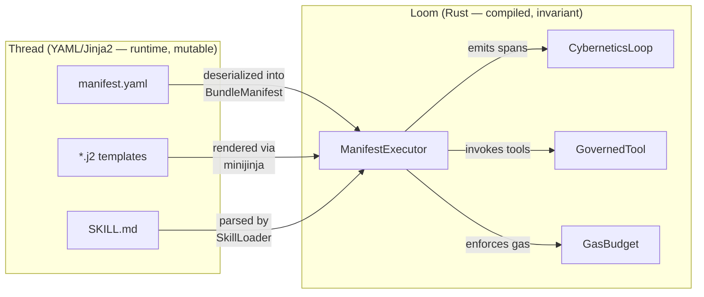
<!-- DIAGRAM_ALIGNMENT
id: DIAG-ARCH-002
verified_date: 2026-07-12
verified_against: crates/hkask-ports/src/lib.rs, crates/hkask-regulation/src/cybernetics_loop.rs
status: VERIFIED
-->

### Implications

The key property is that the loom constrains what the thread can express. A YAML manifest cannot:

- Create new action types. The executor only understands `render`, `tool_invoke`, `choice`, `populate`, `select`, `abort`, `escalate`. A manifest that declares `action: "rm -rf /"` is a parse error.
- Bypass gas enforcement. `gas.cap`, `gas.cost_per_iteration`, `gas.hard_limit` are fields the executor reads and enforces. A manifest cannot declare `"gas_bypass": true`.
- Violate convergence invariants. The executor enforces `min_iterations`, `max_iterations`, and `improvement_gate`. A manifest can configure these values but cannot override the check logic.
- Access the file system, network, or cryptographic keys. Templates invoke tools through the MCP protocol; tools are registered Rust implementations behind the `GovernedTool` membrane. A template cannot call `std::fs::remove_dir_all`.

The thread is powerful within its domain — it can compose skills, define workflows, set quality thresholds, tune iteration parameters — but it cannot escape the loom's constraints. This is the same security model as a web browser: JavaScript (thread) can manipulate the DOM, but it cannot access the file system. The browser (loom) provides a sandbox.

The boundary is clean: Rust never interprets YAML structurally — YAML describes, Rust enforces. The `manifest_loader` (`crates/hkask-templates/src/manifest_loader.rs`) reads YAML files, deserializes them into strongly typed `BundleManifest` structs via `serde_yaml_neo`, and passes the typed structures to the executor. The YAML's structure is validated at parse time: missing required fields produce errors, unknown fields are ignored or rejected, type mismatches fail immediately. This is fundamentally different from a system where configuration is arbitrary JSON parsed into `serde_json::Value` and interpreted at runtime. In hKask, there is no runtime YAML traversal. The loom has already cast the thread into its fixed mold before any step executes.

#### The Tooling Policy as Loom Hygiene

The AGENTS.md tooling policy reinforces this separation: "hKask is a Rust project. Python is not an acceptable project dependency." This is loom purity. Adding a Python dependency would introduce a second loom — a second interpreter, a second type system, a second security boundary. The hKask project instead favors shell scripts under `scripts/` and Rust binaries for auxiliary tooling. The loom is one language, one compiler, one set of invariants.

---

## 3. The Good Regulator Theorem

### Statement

The Conant-Ashby theorem (1970) states: "Every good regulator of a system must be a model of that system."[^conant_ashby] The regulator can only control what it can represent. If the regulator's internal model diverges from the system's actual behavior — if it does not know what "healthy" looks like, or cannot detect when "healthy" becomes "unhealthy" — regulation fails. This design exists because hKask's Regulation is not a passive observer. It is an active cybernetic regulator. It must have a model of the system it regulates, and that model must stay synchronized with reality.

### Evidence

The four components that comprise the Regulation's internal model — `SetPoints`, `SloManager`, `SeamWatcher`, and `ToolStats` — each model a different dimension of system health, and together they satisfy the Conant-Ashby requirement.

#### SetPoints: The Regulator's Internal Model

`SetPoints` at `crates/hkask-regulation/src/set_points.rs:139` is the regulator's reference model. It defines 25 configurable fields that establish "what healthy looks like" for every observable dimension:

- **Energy health**: `gas_min_remaining` (default 0.2 — alert when less than 20% of budget remains)
- **Variety health**: `variety_max_deficit` (default 100 — alert when observed variety falls short of expected by more than 100)
- **Error health**: `error_rate_max` (default 0.3 — alert when >30% of operations fail)
- **Latency health**: `connector_latency_max_secs` (default 30s)
- **Communication health**: `communication_backpressure_threshold` (default: `QueueDepth::DEFAULT_BACKPRESSURE`)
- **Seam health**: `seam_coverage_min` (default 0.0 — alert on any coverage regression)
- **Federation health**: 8 fields covering sync latency (warning 5s, critical 30s), CRDT divergence (2× baseline), link downtime (warning 1h, critical 24h), pause duration (24h), invitation rate (5/hr), and registry divergence (10 entries/sync)
- **Regulation health**: `max_iterations` (100), `stagnation_thresholds` (per-metric, default 5), `stage_worsening_ratio` (0.05), `block_worsening_ratio` (0.20), `substitution_after` (2)
- **Dampener**: `dampen_window_secs` (60s), `metacognitive_window_secs` (300s), `override_cooldown_secs` (120s)
- **Outcome**: `outcome_warning_threshold` (0.50), `outcome_critical_threshold` (0.25)
- **Guard**: `guard_violation_rate_max` (0.20 — per OWASP LLM Top 10)

These set points are loaded from YAML via `HKASK_CNS_CONFIG` environment variable, falling back to validated defaults. The `SetPointsConfig` type (line 232) allows partial configuration — any omitted field uses its default, making the model self-healing against misconfiguration.

The regulator's model is validated on load: `validate()` at line 398 enforces 13 invariants — ratio fields must be in `[0.0, 1.0]`, warning thresholds must exceed critical thresholds, federation latencies must be ordered warning < critical, `stage_worsening_ratio` < `block_worsening_ratio`, and `variety_max_deficit` must be positive.

#### SloManager: Service Level Objectives vs Actual Performance

`SloManager` at `crates/hkask-regulation/src/slo_manager.rs:82` models the system's service level contracts. It holds `Vec<SloDefinition>` — explicit, measurable service level objectives — and evaluates them against ν-event data via the `SloDataProvider` trait.

Each SLO has a target compliance rate and a time window. `SloDataProvider::query()` retrieves `SloDataPoint { total_operations, successful_operations }` for a given span namespace within the window. The manager computes `SloEvaluation` — compliance rate, error budget remaining, and breach status. Breaches emit `reg.slo.evaluated` spans and feed the algedonic pathway.

This is the regulator modeling the system's contractual obligations. An SLO breach is not just "things are slow" — it is "the system promised 99% availability on this span and is delivering 94%." The gap between SLO target and actual performance is a Conant-Ashby deviation: the model says "should be X," reality says "is Y," and the regulator must close that gap.

#### SeamWatcher: Detecting Model-Reality Drift

`SeamWatcher` at `crates/hkask-regulation/src/seam_watcher.rs:94` models the system's API contracts. It loads the public seam inventory — a machine-readable JSON catalog of every public type, function, and trait, each tagged with its REQ test coverage status — and compares snapshots over time.

The inventory is embedded at compile time via `include_str!("../../../docs/status/public-seam-inventory.json")` (line 34), ensuring seam watching works in deployed binaries. The `HKASK_SEAM_INVENTORY_PATH` env var provides a development override.

When `SeamWatcher` detects drift between snapshots — coverage degradation, new items without tests, or removed coverage — it produces `SeamDrift` records with per-crate `delta_pct`. These drift signals are registered as Regulation variety dimensions (`seam:{crate_name}`) with `SEAM_EXPECTED_VARIETY` set to 10. When coverage degrades, the variety deficit triggers algedonic alerts.

This is the regulator detecting model-reality divergence. The seam inventory IS the model of "what APIs exist and are tested." When that model drifts — when a developer adds a public function without a REQ test — the regulator knows. Conant-Ashby is satisfied: the regulator's model of the codebase is kept synchronized through continuous observation.

#### ToolStats: Statistical Learning

`ToolStats` at `crates/hkask-regulation/src/tool_stats.rs:71` is the regulator's statistical model of tool behavior. It implements a three-layer learning architecture:

**Layer 1 (cost distribution)**: Each tool accumulates up to 200 cost observations (`MAX_COST_OBSERVATIONS`) in a `VecDeque<f64>`. At `reserve_estimate()` time (line 109), if ≥10 observations exist (`MIN_OBSERVATIONS_FOR_FIT`), a LogNormal distribution is fitted via method of moments on log-transformed observations. The reserve estimate is the 90th percentile (`p90`), tightening with more data. If fewer observations exist, the raw mean is used. If none exist, the caller falls back to the `EnergyEstimator` point estimate.

**Layer 2 (reliability tracking)**: `ToolState` tracks `successes: u64` and `failures: u64`. `reliability_alerts()` (line 130) computes Beta posterior success probability: `P(success) = (successes + 1) / (successes + failures + 2)` — a Beta(α = successes+1, β = failures+1) conjugate prior with Laplace smoothing. When `P(success) < reliability_threshold` (default 0.80), a `ToolReliabilityAlert` is emitted, pre-escalating before the tool actually fails.

**Layer 3 (auto-calibration)**: When `GovernedTool` reserves gas, it queries `ToolStats::reserve_estimate()` first. If the distribution's p90 is consistently lower than the point estimate from `EnergyEstimator`, reserves tighten automatically — the statistical model overrides the static model. This closes the feedback loop: tool behavior feeds the model, the model improves the reserve, better reserves prevent gas waste.

The LogNormal choice for cost is deliberate — tool costs are positive and right-skewed (most invocations are cheap, a few are expensive). The Beta choice for reliability is the standard Bayesian conjugate prior for Bernoulli trials, enabling probabilistic reasoning about tool health without storing raw success/failure streams.

`ToolStats` is wired into `GovernedTool` at construction time via `with_tool_stats()`. At settle time, `stats.record(tool, actual_cost, success)` updates the model. The `ToolReliabilitySensor` feeds reliability alerts into the `SensorRegistry`, making tool degradation visible to the Regulation regulation pipeline. This completes the Conant-Ashby contract: the regulator models tool behavior statistically, detects degradation probabilistically, and intervenes before the user experiences a failure.

### Diagram

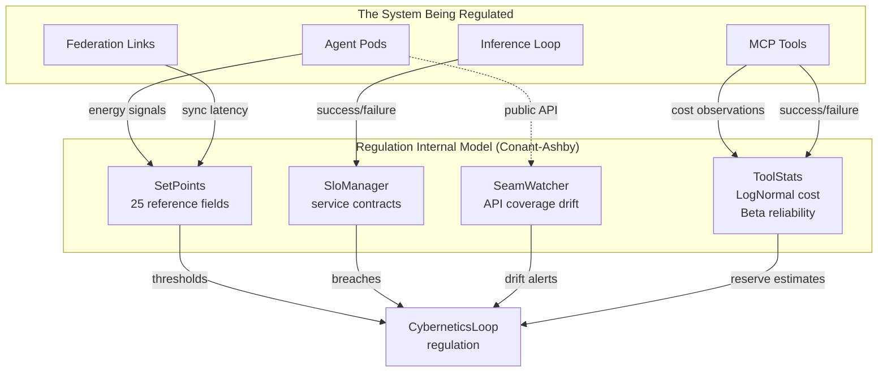
<!-- DIAGRAM_ALIGNMENT
id: DIAG-ARCH-003
verified_date: 2026-07-12
verified_against: crates/hkask-ports/src/lib.rs, crates/hkask-regulation/src/cybernetics_loop.rs
status: VERIFIED
-->

### Implications

The Good Regulator theorem is not an aspirational goal in hKask — it is a structural requirement. The Regulation does not regulate by reacting to raw metrics; it regulates by comparing observations against an explicit model and closing the gap. The four model components are maintained through continuous observation, not configured once and forgotten. When the model drifts from reality — when a tool's cost distribution shifts, when an SLO breaches, when seam coverage degrades — the regulator detects the drift and acts before the user experiences degradation. The `SystemSimulator` in `CyberneticsLoop` (line 101) provides an additional layer: `MovingAverageExtrapolator` predicts metric trajectories, enabling predictive regulation — if a metric is approaching its set-point within 3 ticks, the Regulation emits a `Notify` action before the threshold is breached. This is anticipatory regulation, not reactive monitoring.

---

## 4. Viable System Model Mapping

### Statement

The Viable System Model (VSM), developed by Stafford Beer, is a cybernetic framework for understanding how any system — biological, organizational, or computational — maintains viability in a changing environment.[^beer] Beer's core insight: a viable system must have the internal variety to match the variety of its environment (Ashby's Law of Requisite Variety), and it organizes this variety through five recursive system levels (S1–S5). This design exists because hKask is not a passive monitoring system. It is a cybernetic regulator. Per the architecture master at `docs/architecture/core/hKask-architecture-master.md`, the Regulation is described as "a complete cybernetic system per Beer's Viable System Model (S1–S5). Not passive monitoring; active regulation." Every structural decision in the Regulation maps onto VSM levels.

### Evidence

#### S1: Operations — Pods and MCP Servers

System 1 in VSM is the collection of autonomous operational units that do the actual work. In hKask, these are the agent pods — each a `PodDeployment` at `crates/hkask-pods/src/pod/deployment.rs:47` — and their bound MCP servers, held in `PerPodToolBinding`. Each pod is autonomous: it owns its storage (`PerPodStorage` — a dedicated SQLCipher file at `{data_dir}/agents/{sanitized_name}/pod.db`), its Regulation runtime (`PerPodRegulationLedger` — variety counters scoped to the pod), and its tool bindings.

MCP servers provide the operational capabilities: web search, condenser, media, memory, wallet, codegraph, and others — 15 tool subsystems tracked in `RegulationSpan::Tool { subsystem }` at `crates/hkask-types/src/regulation.rs:111`. Each pod's variety is measured independently via `PerPodRegulationLedger`, enabling per-pod regulation.

#### S2: Coordination — Regulation Set Points and SLOs

System 2 is the anti-oscillation layer — it prevents autonomous units from conflicting with each other through coordination signals. In hKask, this is the `SetPoints` struct at `crates/hkask-regulation/src/set_points.rs:139` and the `SloManager` at `crates/hkask-regulation/src/slo_manager.rs:82`.

`SetPoints` defines 25 configurable reference values. These are loaded from YAML via `HKASK_CNS_CONFIG` or fall back to defaults validated by `SetPoints::validate()`. `SloManager` defines service level objectives that are evaluated against ν-event data. Each `SloDefinition` has compliance targets; `SloEvaluation` reports whether an SLO is in breach. Breached SLOs feed the algedonic pathway — the pain channel that surfaces S2 coordination failures to higher VSM levels. These set points prevent oscillation by establishing explicit coordination contracts: when a pod's variety deficit exceeds the threshold, the system does not just oscillate — it escalates.

#### S3: Control — The Curator Agent

System 3 is the internal control function — resource allocation, monitoring, and auditing of the operational units. In hKask, this is the `CuratorAgent` at `crates/hkask-pods/src/curator_agent/mod.rs:44`. It composes the pure regulatory `CurationLoop` with the persona-layer `MetacognitionLoop`.

The Curator's control responsibilities include: issuing `CuratorDirective::OverrideEnergyBudget` to reallocate gas between agents, `CuratorDirective::CalibrateThreshold` to adjust Regulation set points (sent on the direct `mpsc` channel to `CyberneticsLoop`), monitoring regulation effectiveness via `HealthSnapshot.regulation_effectiveness`, and triggering escalations when `MetacognitionLoop::act()` detects that the Regulation cannot self-correct.

The Curator is not an operator — it is a daemon. It responds in <3s latency target, is always running, and never bypasses OCAP. It can recommend actions but cannot execute without capability tokens. Per the Magna Carta, the Curator is the enforcer, not the sovereign.

#### S4: Intelligence — Seam Watcher and Provider Intelligence

System 4 is the external-facing intelligence function — scanning the environment, detecting threats and opportunities, and feeding strategic information inward. In hKask, this is implemented by several components:

- **SeamWatcher** (`crates/hkask-regulation/src/seam_watcher.rs:94`): Loads the machine-readable public seam inventory (embedded at compile time via `include_str!`, overridable at runtime via `HKASK_SEAM_INVENTORY_PATH`), tracks per-crate test coverage as Regulation variety dimensions (`seam:{crate_name}`), and detects drift from previous snapshots. When coverage degrades, it emits algedonic alerts. This is the system's external contract monitor — it watches the boundary between implementation and specification.

- **Provider intelligence**: The capability domain system allows new MCP servers to register with the system. `capability_from_server_id()` at `crates/hkask-capability/src/resources.rs:117` derives capability shorthand from MCP server IDs (`hkask-mcp-<domain>` → `tool:<domain>:execute`), enabling dynamic provider discovery.

- **Spec drift detection**: `DefaultSpecCurator` (referenced in the architecture master as part of Pattern C) detects when specifications diverge from implementation — a Conant-Ashby violation that signals the system's internal model no longer matches reality.

S4 is where the system looks outward and feeds strategic intelligence inward. Without it, the Curator has no basis for knowing whether the system is drifting from its intended state.

#### S5: Policy — The Magna Carta

System 5 is the identity and purpose layer — the fundamental policies that define what the system IS, not just what it does. In hKask, this is the Magna Carta at `docs/architecture/core/magna-carta.md`. Its four inviolable principles form the policy backbone:

- **P1 (User Sovereignty)**: SOLID-grounded data ownership, atomic consent
- **P2 (Affirmative Consent)**: Default deny, scoped consent, fail-closed — enforced by `SovereigntyChecker` at `crates/hkask-pods/src/sovereignty.rs:60`
- **P3 (Generative Space)**: Settings exposure, user curation, open-source commitment
- **P4 (Clear Boundaries)**: OCAP enforcement of P1–P3 through `GovernedTool` and `DelegationToken`

The Magna Carta cannot be overridden by any component — not the Curator, not the Regulation, not any agent. The `magna-carta-verifier` skill periodically audits that P1–P4 assertions hold. The Curator can recommend policy changes but cannot enact them — only a human user with Admin role can modify Magna Carta configuration.

#### Algedonic Signals as the VSM Pain/Pleasure Channel

In VSM, algedonic signals are the direct pain/pleasure pathway that bypasses normal hierarchical channels when urgent. In hKask, this is the `AlgedonicManager` at `crates/hkask-regulation/src/algedonic.rs`. When `variety_deficit` exceeds `variety_max_deficit`, or `critical_alerts` count passes the threshold, an `EscalationAlert` is produced by `EscalationPolicy::check_conditions()` at `crates/hkask-pods/src/curator_agent/metacognition/escalation.rs:80`.

Algedonic signals are **unidirectional**: the Regulation signals the Curator via alerts; the Curator regulates the Regulation through `CuratorDirective::CalibrateThreshold` on a direct `mpsc` channel → `RegulationLedger::calibrate_threshold()`. This separation mirrors VSM's algedonic channel design: pain signals bypass the normal S2 coordination layer and go straight to S3 (Control) and S5 (Policy) when the system's viability is threatened.

The `EscalationSeverity` has two levels: Warning (at threshold/2) and Critical (at threshold). `MetacognitionConfig.max_concurrent_escalations` (default: 3) implements the VSM algedonic paradox — fewer signals mean higher fidelity. When escalations pile up, they are batched into `EscalationBatch` with a consolidated summary, preventing alert fatigue.

### Diagram

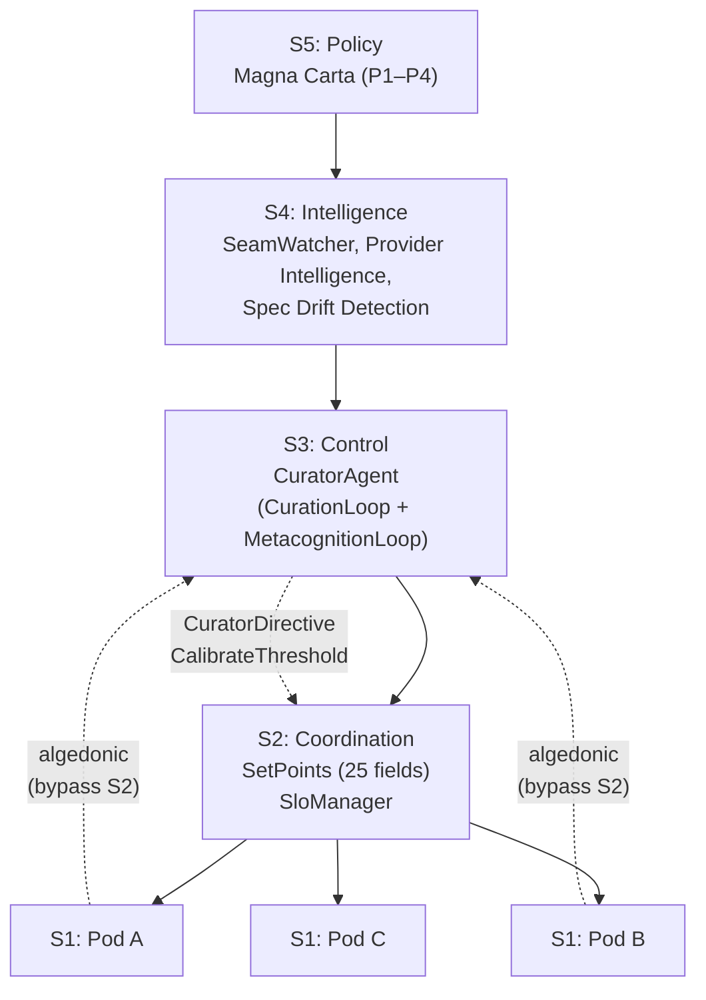
<!-- DIAGRAM_ALIGNMENT
id: DIAG-ARCH-004
verified_date: 2026-07-12
verified_against: crates/hkask-ports/src/lib.rs, crates/hkask-regulation/src/cybernetics_loop.rs
status: VERIFIED
-->

### Implications

The VSM mapping is not a retrospective overlay — it is a design constraint. Each architectural decision (pod autonomy, set-point coordination, Curator control, seam-watching intelligence, Magna Carta policy) maps onto a VSM level because the system was designed to be viable in Beer's sense. The algedonic channel exists because VSM requires it: without a bypass pathway for urgent signals, the system would oscillate between S2 coordination and S1 operations without ever reaching S3 control. The `max_concurrent_escalations` limit exists because VSM's algedonic paradox demands signal fidelity over signal volume — three well-curated escalations are more actionable than thirty raw alerts.

---

## 5. Dual-Axis Ontology

### Statement

Most systems pick a single source of truth. hKask does not. P5.4 of the architecture principles declares that "no single source of truth" is not a bug — it is the design. Every artifact in hKask has both a state identity and a process identity. It is simultaneously a noun and a verb.[^norouzi]

### Evidence

The two axes are:

| Axis | Master Ontology | Question | Domain |
|---|---|---|---|
| **Process (Flow)** | PKO | How did this come to be? What flow? | Procedures, steps, executions — the verb dimension |
| **State (Entity)** | Dublin Core + BIBO | What is this? What type? Who made it? | Entities, resources, types, metadata — the noun dimension |

The architectural metaphor is deliberate. P5.4 invokes Heisenberg: the more precisely one samples state (DC typing), the less one can know about process position (PKO flow), and vice versa. One is always sampling, never arriving at truth. The bridges are sampling instruments, not truth claims.

#### The 5W1H Core

Before either axis engages, there is a simpler filter. P5.2 defines the 5W1H ontological core — **Who, What, When, Where, Why, How** — as the drop-dead-simple gate every artifact must pass. An artifact that answers none of these six questions is ontological noise. This is not abstract philosophy. It is operational:

- **Who** — agent, userpod, bot (anchored by P12 userpod host mandate)
- **What** — entity, resource, data, state
- **When** — time, sequence, duration, temporal scope
- **Where** — pod boundary, namespace, domain
- **Why** — goal, purpose, constraint motivation (anchored by Magna Carta P1–P4)
- **How** — method, mechanism, procedure, execution path

The 5W1H core is grounded in Ontology Design Pattern methodology: instead of navigating entire complex ontologies, hKask extracts compact, requirement-driven patterns. The six questions are the minimal set that distinguishes "understood" from "not understood."

#### Bridge Crates

Two shared crates implement the dual-axis core:

**`hkask-bridge-dublincore` — The State Axis.** This crate (`crates/hkask-bridge-dublincore/src/lib.rs`, 128 lines) provides canonical URI constants for Dublin Core, BIBO, and CiTO vocabularies. It is a pure-vocabulary crate: no dependencies, no reasoners, no overhead. It defines the type `DcConcept = &'static str` and exports constants like `TITLE`, `CREATOR`, `DATE`, `ARTICLE`, `BOOK`, `CITES`, `SUPPORTS`, `REFUTES`.

Two mapping helpers earn the bridge its keep. `mime_to_dc_type()` maps MIME types to Dublin Core resource types — `"image/png"` → `STILL_IMAGE`, `"application/json"` → `DATASET`. `kind_to_bibo()` maps informal labels like `"preprint"` or `"conference"` to their BIBO equivalents. These thin functions sit between raw data and ontological precision, answering the Who and What questions by connecting unstructured metadata to structured vocabularies.

**`hkask-bridge-pko` — The Process Axis.** This crate (`crates/hkask-bridge-pko/src/lib.rs`, 174 lines) maps hKask's procedural concepts to the PKO (Procedural Knowledge Ontology) standard. PKO is built on PROV-O (Activity, Agent), P-Plan (Step, Plan), and DCAT (Resource). The crate exports `PkoConcept = &'static str` constants: `PROCEDURE`, `HAS_STEP`, `STEP_EXECUTION`, `ISSUE_OCCURRENCE`, `USER_FEEDBACK_OCCURRENCE`, `AGENT`, `ROLE`, `HAS_VERSION`.

Three mapping functions connect domain workflows to ontological concepts. `kanban_status_to_pko_execution()` maps task statuses (`"in_progress"` → `"pko:ProcedureExecutionStatus/inProgress"`). `docproc_stage_to_pko_step()` classifies document processing stages as PKO Steps, Functions, or Actions. `research_stage_to_pko()` maps research workflow stages (`"hypothesis"` → `USER_QUESTION_OCCURRENCE`, `"evaluate"` → `STEP_VERIFICATION`). These answer the How and Why questions — connecting concrete procedure fragments to a shared process vocabulary.

#### How Bridges Earn Their Keep

P5.3 is explicit: bridges must themselves pass the 5W1H test. A bridge that does not connect a 5W1H question to domain-specific depth is a P5 violation. The two bridge crates earn their keep by different routes:

- **Dublin Core bridge** answers "What is this thing?" and "Who made it?" for any artifact in hKask. Every MCP server depends on it because every server produces resources that need typing. A condensed document, a generated image, a research finding — all carry DC identity.
- **PKO bridge** answers "How was this produced?" and "What flow is it part of?" Every server's workflow — training a model, processing a document, searching for papers — is a PKO Procedure composed of Steps and producing Executions.

#### Beyond the Core

The dual-axis core (PKO + DC+BIBO) is the minimum viable ontology for any server. But some domains need more specificity. The architecture principles define domain-specific bridges layered on top where DC+BIBO's state axis is not specific enough:

- **FIBO** (financial concepts) supplements the `companies` MCP server
- **GOLEM** (narrative structure) supplements the `replica` MCP server
- **CogAT** (cognitive concepts) supplements the `memory` MCP server
- **ML-Schema** (ML experiments) supplements the `training` MCP server
- **OMC** (media creation) supplements the `media` MCP server

These follow the same `fibo.rs` pattern: concept URI constants, field-to-concept mapping functions, no dependencies, no reasoners. Each is typically ≤150 lines. They are supplements, not alternatives to the dual-axis core.

### Diagram

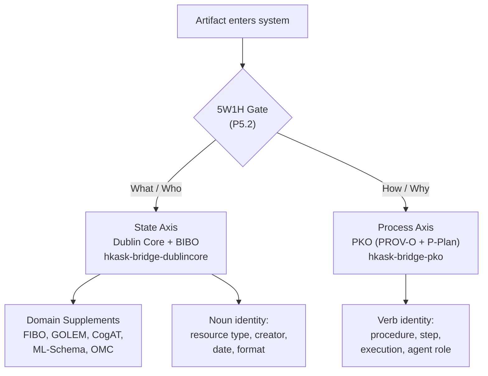
<!-- DIAGRAM_ALIGNMENT
id: DIAG-ARCH-005
verified_date: 2026-07-12
verified_against: crates/hkask-ports/src/lib.rs, crates/hkask-regulation/src/cybernetics_loop.rs
status: VERIFIED
-->

### Implications

P8.1 states the invariant clearly: **hKask never requires knowledge of a full domain ontology.** All interaction with domain ontologies flows through thin bridges. The dual-axis core provides the minimum viable ontology for any server; domain bridges are opt-in specificity. One can stand up a new MCP server, and without writing a single ontological constant, artifacts carry DC identity (the noun) and PKO flow semantics (the verb). That is the dual axis working at the architectural level. The bridge crates themselves are P5-essentialist — each is a thin vocabulary mapping that earns its existence by connecting the 5W1H gate to domain-specific depth. A bridge that fails this test would be a pass-through abstraction, prohibited by P5.

---

## 6. API Surface Equivalence

### Statement

hKask's P3 (Generative Space) principle mandates that every architectural boundary be equally accessible from three surfaces: the CLI (`kask` binary), the REST API (`hkask-api`), and the MCP protocol. This is not a convenience — it is a sovereignty guarantee. A user who cannot reach a capability from the surface they prefer does not have sovereignty over that capability. The API surface is the programmatic expression of architectural boundaries, and its equivalence to the CLI and MCP surfaces is a first-order design constraint.

### Evidence

The `AgentService` at `crates/hkask-services-context/src/context_impl.rs:103` is the shared service layer that all three surfaces consume. It has **9 fields** (`infra`, `governance`, `regulation`, `storage`, `system_webid`, `curator_ready`, `config`, `inference_loop`, `governed_tool`) and **20 public methods** spanning configuration access, sub-context delegation, memory consolidation, governed tool access, and gas budget queries. Surfaces do not implement domain logic — they call `AgentService` methods that delegate to the underlying contexts.

The API server is bootstrapped via `create_router()` in `crates/hkask-api/src/lib.rs`. Endpoints are organized by architectural concern:

| Concern | Endpoints | CLI Equivalent | MCP Equivalent |
|---------|-----------|----------------|----------------|
| Chat | `POST /api/v1/chat`, `GET /api/v1/chat/ws` | `kask chat` | communication MCP |
| Agent Management | `GET /api/v1/agents`, `POST /api/v1/pods`, etc. | `kask agent` / `kask pod` | registry MCP |
| Regulation | `GET /api/v1/regulation/health`, `GET /api/v1/regulation/variety`, `GET /api/v1/regulation/subscribe` | `kask regulation health` | regulation MCP tools |
| Memory | `POST /api/v1/episodic`, `POST /api/v1/consolidation` | `kask memory` | memory MCP |
| Models | `GET /api/v1/models`, `GET /api/v1/models/search` | `kask model` | inference MCP |
| Templates & Bundles | `GET /api/v1/templates`, `POST /api/v1/bundles/compose` | `kask template` / `kask bundle` | registry MCP |
| Sovereignty | `POST /api/v1/sovereignty/consent`, `GET /api/v1/sovereignty/check` | `kask consent` | consent MCP |
| Wallet | `GET /api/v1/wallet/balance`, `POST /api/v1/wallet/deposit` | `kask wallet` | wallet MCP |
| Export | `POST /api/v1/export`, `GET /api/v1/export/{id}` | `kask export` | — |
| Specs | `POST /api/v1/specs`, `POST /api/v1/specs/{id}/assess` | `kask spec` | — |

All endpoints are OCAP-gated (P4): a `DelegationToken` Bearer token is required. The `Bearer` security scheme is declared in the OpenAPI spec. All requests are Regulation-observed (P9): every request is traced via Regulation spans. The storage layer (`hkask-storage`) re-exports from 9 sub-crates (`-core`, `-gallery`, `-kata`, `-hmem`, `-archive`, `-token_registry`, `-consent_store`, `-sovereignty`, `-escalation`); API code imports from the facade, not sub-crates.

### Diagram

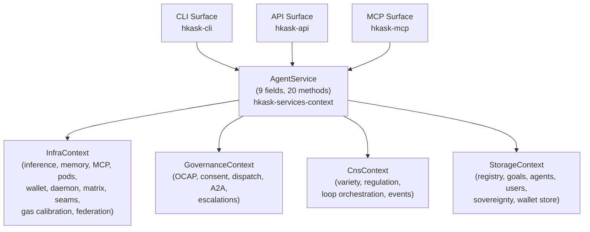
<!-- DIAGRAM_ALIGNMENT
id: DIAG-ARCH-006
verified_date: 2026-07-12
verified_against: crates/hkask-ports/src/lib.rs, crates/hkask-regulation/src/cybernetics_loop.rs
status: VERIFIED
-->

### Implications

The three-surface equivalence means that no architectural capability is hidden behind a single interface. A user who prefers the CLI has the same power as a user who writes an API client or an agent that speaks MCP. This is P3 (Generative Space) in action: the system does not gatekeep capabilities by surface. The `AgentService` shared layer ensures that domain logic is written once and consumed by all three surfaces — no surface re-implements inference, memory, or governance logic. This also means that testing any one surface exercises the shared service layer, and bugs found in one surface are bugs in all surfaces.

---

## References

[^loom]: The loom-and-thread metaphor originates in hKask's project README and is elaborated in the architecture master document at `docs/architecture/core/hKask-architecture-master.md`. The separation draws on the same principle as browser sandboxing: the interpreter (loom) constrains the content (thread).

[^conant_ashby]: Conant, R. C., & Ashby, W. R. (1970). "Every good regulator of a system must be a model of that system." *International Journal of Systems Science*, 1(2), 89–97.

[^beer]: Beer, S. (1979). *The Heart of Enterprise*. Wiley. The Viable System Model is developed across Beer's works, with S1–S5 recursion as the core structural insight.

[^norouzi]: Norouzi, N., et al. (2025). Ontology Design Pattern methodology — extracting compact, requirement-driven patterns rather than navigating entire ontologies. The 5W1H core is the operational expression of this methodology in hKask.

- Ousterhout, J. (2018). *A Philosophy of Software Design*. El Camino Real. The deep-module discipline (deletion test, interface minimalism) is applied to port trait design.
- Miller, M. (2006). "Robust Composition: Towards a Unified Approach to Access Control and Concurrency Control." PhD thesis, Johns Hopkins University. The OCAP membrane pattern underlying `GovernedTool`.
---

## Template Authorship (Merged from TEMPLATE_AUTHORSHIP.md)


# Template Authorship Policy

**hKask v0.31.0 — How to decide whether a template is skill-bound or infrastructure.**

## Decision Tree

When adding a new `.j2` template, answer these questions in order:

```
Q1: Does the template describe a process with measurable quality improvement?
    └─ YES → Q2
    └─ NO  → Q3

Q2: Does the process benefit from iterative refinement (PDCA loop)?
    └─ YES → SKILL-BOUND
         ├─ Create a FlowDef manifest in registry/manifests/<name>.yaml
         ├─ Add convergence section with threshold, improvement_ratio, max_iterations
         ├─ Add gas and rjoule budget fields
         ├─ Add a terminal `loop` action for PDCA re-entry
         └─ Create a SKILL.md companion in .agents/skills/<name>/ (derived, not canonical)
    └─ NO  → Q3

Q3: Is the template a routing, dispatching, or model-tier selection concern?
    └─ YES → INFRASTRUCTURE
         ├─ Place in registry/manifests/ as <name>.yaml with functional_role: flowdef
         ├─ Do NOT add convergence (no PDCA loop)
         ├─ Do add gas and rjoule budget fields if any step performs inference
         └─ Mark with visibility: Public
    └─ NO  → Q4

Q4: Is the template a base type (WordAct, KnowAct, FlowDef dispatch)?
    └─ YES → INFRASTRUCTURE (base type)
         ├─ Register in per-skill manifest.yaml (registry/templates/<name>/manifest.yaml)
         ├─ No standalone manifest needed
         └─ Document in registry/templates/<name>/README.md
    └─ NO  → Q5

Q5: Is the template a utility that is imported/included by other templates?
    └─ YES → INFRASTRUCTURE (utility)
         ├─ No manifest needed
         ├─ Document the include API in the template header
         └─ Register in per-skill manifest.yaml only if dispatched directly
    └─ NO  → SKILL-BOUND (default for new cognitive processes)
```

## Budget Requirements

| Manifest Type | gas.cap | rjoule.cap | cost_per_iteration | convergence |
|--------------|---------|------------|-------------------|-------------|
| Skill (PDCA) | Required (standard: 100000) | Required (standard: 2) | Required (100) | Required |
| Infrastructure dispatch | Required (50000) | Required (1) | Required (100) | Not applicable |
| Web tool | Required (2048–8192) | Required (0–1) | Not applicable | Not applicable |
| QA script | Required (10000–50000) | Required (1) | Not applicable | Not applicable |

## SKILL.md ≠ Skill Invariant

**The canonical artifact of a skill is its FlowDef manifest (`.yaml`) and its executable templates (`.j2`).**

The `SKILL.md` file is a derived companion document. It teaches the Zed coding agent the methodology but is **not** what the hKask runtime executes. Editing a `SKILL.md` does not change the skill's behavior in `kask chat` sessions.

All meta-skills (skill-maintenance, skill-logic-audit, etc.) **must** operate on the `.yaml` manifest and `.j2` templates as their primary truth source. They may read `SKILL.md` for methodology context, but any findings or recommendations that reference only `SKILL.md` content without verifying against the manifest and templates are **Epistemically Unsound** and must carry confidence: Hypothesis (Speculative) at maximum.

## Naming Convention

- **Manifest filename:** Must match `manifest.id`. Example: `coding-guidelines.yaml` with `manifest.id: coding-guidelines`
- **Template directory:** Must match `manifest.id`. Example: `registry/templates/coding-guidelines/` for `manifest.id: coding-guidelines`
- **SKILL.md directory:** Should match `manifest.id`. Example: `.agents/skills/coding-guidelines/SKILL.md`
- **Template ref paths:** Use `<manifest.id>/<template-name>` format. Example: `coding-guidelines/guidelines-assess`

Name mismatches (e.g., `scenario-planning` manifest referencing `scenario-builder/` templates) create discoverability failures and must be corrected.

## Audit

Before committing a new manifest or template:

```bash
# Verify manifest.id matches filename
grep "id:" registry/manifests/<name>.yaml | head -1

# Verify template directory exists and matches
ls registry/templates/$(grep "id:" registry/manifests/<name>.yaml | awk '{print $2}')/

# Verify all template_refs resolve
grep "template_ref:" registry/manifests/<name>.yaml | while read -r ref; do
  path="registry/templates/$(echo "$ref" | awk '{print $2}').j2"
  [ -f "$path" ] || echo "MISSING: $path"
done

# Verify budget fields are present
grep -c "gas:" registry/manifests/<name>.yaml
grep -c "rjoule:" registry/manifests/<name>.yaml
```

## rJoule/Gas Budget Calibration

All manifest budgets are currently **uncalibrated** — they are placeholder values set during
authorship without runtime measurement. The `WalletGasCalibrator` in `hkask-regulation` provides
the infrastructure for calibration.

### Calibration Procedure

```bash
# 1. Run a representative execution of the skill with Regulation span logging enabled
kask run <skill-name> --regulation-spans

# 2. Extract the actual gas and rjoule consumption from Regulation spans
kask regulation alerts

# 3. Compare against the manifest's declared budget
#    If actual > declared: the manifest budget is too low (will cause aborts)
#    If actual < 50% of declared: the manifest budget is too loose (wasteful)

# 4. Update the manifest with calibrated values
#    rjoule.cap = ceil(actual_rjoule * 1.2)    # 20% headroom
#    gas.cap   = ceil(actual_gas * 1.2)
```

### System Constants

| Constant | Value | Location |
|----------|-------|----------|
| `GAS_PER_RJOULE` | 250000 | `crates/hkask-wallet-types/src/lib.rs` |
| `RJOULE_TO_GAS` | 250000 | Used in CSkill files, reverse of above |

### Known Uncalibrated Budgets

All skill manifests currently use uncalibrated placeholder values:

| Budget | Standard Value | Calibrated? |
|--------|---------------|-------------|
| `gas.cap` for skills | 100000 | No — placeholder |
| `gas.cap` for sequential-inquiry | 120000 | No — 20% above standard, not measured |
| `rjoule.cap` for skills | 2 | No — placeholder |
| `rjoule.cap` for superforecasting | 5 | No — justified by complexity but unmeasured |
| `rjoule.cap` for coding-guidelines, tdd | 3 | No — placeholder |

Calibration should be run as part of the v0.32.0 release cycle after the Regulation
`WalletGasCalibrator` has been validated against production inference workloads.

---

## Inlined Diagrams

The following Mermaid diagrams were inlined from the former `docs/diagrams/` directory per DOCUMENTATION_STANDARDS §1.

### Service Layer Decomposition — Class Diagram

*Inlined from `docs/diagrams/class-service-layer.md`*


# Service Layer Class Diagram

The hKask service layer comprises **10 subcrates** decomposed from the original monolithic `hkask-services-core` crate, following the Strangler Fig pattern (archived ADR-040). Every subcrate depends on `hkask-services-core` as its universal foundation. `hkask-services-context` provides `AgentService`, the canonical DI container that assembles all shared infrastructure (Regulation, governance, storage, infra). Domain services (chat, compose, skill, kata-kanban, corpus, wallet, onboarding, runtime) are thin orchestrators that delegate to domain crates via `AgentService` or port traits. Curator metacognition and escalation handling were merged into `ChatService` and `services-context::governance` respectively.

```mermaid
classDiagram
    direction TB

    %% ── Ports (Hexagonal Interfaces) ──────────────────────────────────────
    namespace ports {
        class InferencePort {
            <<interface>>
            +infer(prompt, params) InferenceResult
            +infer_stream(prompt, params) Stream
        }
        class ToolPort {
            <<interface>>
            +name() String
            +description() String
            +execute(input) Result
        }
        class CircuitBreakerPort {
            <<interface>>
            +check() Outcome
            +record_success()
            +record_failure()
        }
        class LedgerObserver {
            <<interface>>
            +on_event(event) bool
        }
        class RegistryIndex {
            <<interface>>
            +list_entries() Vec~RegistryEntry~
            +get(name) Option~RegistryEntry~
        }
        class SkillRegistryIndex {
            <<interface>>
            +list_skills() Vec~Skill~
            +get_skill(name) Option~Skill~
        }
        class FederationDispatch {
            <<interface>>
            +register_peer(replica, domain, matrix_domain, matrix_id)
            +invite(peer) Result
            +accept(peer) Result
            +reject(peer) Result
            +pause(peer, reason) Result
            +resume(peer) Result
            +revoke(peer, reason) Result
            +leave(reason) Result
            +linked_peers() Vec~ReplicaId~
            +link_state(peer) Option~String~
        }
        class LedgerStoragePort {
            <<interface>>
            +query_algedonic(since, limit) Result~Vec~RegulationRecord~~
        }
        class FederationTransport {
            <<interface>>
            +send(peer, message) Result
            +recv() Result
            +simulate_partition(peer)
            +heal_partition(peer)
        }
        class FederationSyncPort {
            <<interface>>
            +query_public_since(cursor, limit) Result~Vec~FederatedTriple~~
            +cursor_for(source) u64
            +advance_cursor(source, cursor)
        }
    }

    %% ── Foundation ────────────────────────────────────────────────────────
    namespace services_foundation {
        class ServiceError {
            +enum ServiceError
            GoalNotFound, Escalation, EscalationNotFound
            Metacognition, Inference
        }
        class ServiceConfig {
            +default_model: String
            +inference_config: InferenceConfig
            +db_path: PathBuf
            +load() ServiceConfig
        }
        class HkaskSettings {
            +enabled_features: Vec~String~
            +save()
        }
        class InferenceContext {
            +shared_port: Arc~dyn InferencePort~
            +default_model: String
        }
    }

    %% ── Context (DI Container) ────────────────────────────────────────────
    namespace services_context {
        class AgentService {
            -infra: InfraContext
            -governance: GovernanceContext
            -regulation: CnsContext
            -storage: StorageContext
            -system_webid: WebID
            +build(config) AgentService
            +config() &ServiceConfig
            +webid() &WebID
            +governance() &GovernanceContext
            +infra() &InfraContext
            +regulation() &CnsContext
            +storage() &StorageContext
            +identity() (&WebID, &A2ARuntime)
            +curator_ready() Result
            +build_per_agent_memory(db) PerAgentMemory
        }
        class PerAgentMemory {
            +episodic_storage: Arc~dyn EpisodicStoragePort~
            +semantic_storage: Arc~dyn SemanticStoragePort~
            +consolidation_service: ConsolidationService
        }
    }

    %% ── Chat Service (includes merged CuratorService) ──────────────────
    namespace services_chat {
        class ChatService {
            +chat(ctx, request) ChatTurnResponse
            +prepare_chat(ctx, bot_id) PreparedChat
            +run_curator_metacognition(ctx) Result~String~
            +list_escalations(ctx) Vec~EscalationResponse~
            +resolve(ctx, id, resolved_by) Result
            +dismiss(ctx, id, dismissed_by) Result
        }
        class MemoryService {
            +has_memory_consent(ctx, owner, category) bool
            +recall_semantic(port, input, token) Option~String~
            +recall_episodic(port, input, token) Vec~RecalledEpisode~
            +store_episode(port, episode)
            +paired_recall(episodic, semantic) Vec~RecalledEpisode~
        }
        class ChatTurnRequest {
            +prompt: String
            +bot_id: String
            +model_override: Option~String~
        }
        class ChatTurnResponse {
            +response: String
            +tool_calls: Vec~StructuredToolCall~
            +token_usage: TokenUsage
        }
        class EscalationResponse {
            +id: String
            +template_id: String
            +status: String
            +confidence: f64
        }
    }

    %% ── Compose Service ───────────────────────────────────────────────────
    namespace services_compose {
        class ComposeService {
            +compose(request) ComposeResult
        }
        class ComposeRequest {
            +prompt: String
            +db_path: PathBuf
            +cognition: CognitionConfig
            +inference_ctx: InferenceContext
        }
        class ComposeResult {
            +generated_prose: String
            +exemplar_count: u32
            +validation: Option~CentroidValidation~
        }
    }

    %% ── Kata-Kanban Service ───────────────────────────────────────────────
    namespace services_kata_kanban {
        class KataEngine {
            -inference: Arc~dyn InferencePort~
            -registry: Arc~dyn RegistryIndex~
            -history: KataHistory
            +from_env() KataEngine
            +load_manifest(path) KataManifest
            +run_bundle(bundle) KataResult
            +execute(state) KataResult
        }
        class KanbanService {
            +create_board(owner, name) Board
            +add_task(board_id, spec) Task
            +move_task(task_id, status) Task
            +verify_task(task_id, criterion) Verification
            +dejam(board_id) Vec~UnjamItem~
        }
        class Board {
            +board_id: BoardId
            +name: String
            +owner: WebID
            +columns: Vec~ColumnDef~
        }
        class Task {
            +task_id: TaskId
            +title: String
            +status: TaskStatus
            +priority: Priority
            +owner: WebID
        }
    }

    %% ── Runtime Services ──────────────────────────────────────────────────
    namespace services_runtime {
        class ServiceDaemonHandler {
            -pod_manager: Arc~ActivePods~
            -user_store: Arc~Mutex~UserStore~~
            +handle_assign(request) Result
            +handle_capability(query) Result
        }
        class ProviderIntelligence {
            +fetch_state(provider) ProviderState
            +usage_status(provider) UsageStatus
        }
    }

    %% ── Skill Service ─────────────────────────────────────────────────────
    namespace services_skill {
        class SkillAuditor {
            -registry: &dyn RegistryIndex
            -skill_index: &dyn SkillRegistryIndex
            +audit_all() SkillAuditReport
        }
        class SkillAuditReport {
            +health_score: SkillHealthScore
            +defects: Vec~Defect~
        }
        class BundleService {
            +compose(skill_ids) BundleComposeResult
            +evolve(bundle, delta) BundleComposeResult
        }
    }

    %% ── Wallet Service ────────────────────────────────────────────────────
    namespace services_wallet {
        class WalletService {
            -manager: Arc~WalletManager~
            -issuer: Arc~ApiKeyIssuer~
            +build(config, store, sink) WalletService
            +balance() WalletBalance
            +deposit_address() DepositAddress
            +withdraw(amount, to) TxHash
            +create_api_key(caps) ApiKeyMaterial
        }
    }

    %% ── Onboarding Service ────────────────────────────────────────────────
    namespace services_onboarding {
        class OnboardingService {
            +resolve_secrets() ResolvedSecrets
            +register_matrix(config) MatrixRegistrationResult
            +sign_in(user) SignInOutcome
        }
    }

    %% ── Corpus Service ────────────────────────────────────────────────────
    namespace services_corpus {
        class DiscoveryService {
            +discover(request) DiscoverResult
        }
        class EmbedService {
            +embed(config) EmbedResult
            +embed_progress() EmbedProgress
        }
        class DiscoverResult {
            +works: Vec~DiscoveredWork~
        }
        class EmbedResult {
            +phase: EmbedPhase
            +entities: Vec~Entity~
        }
    }

    %% ── Surfaces (Consumers) ──────────────────────────────────────────────
    namespace surfaces {
        class CLI {
            <<binary>>
            +main()
        }
        class API {
            <<server>>
            +routes()
            +openapi_spec()
        }
    }

    %% ═══ DEPENDENCY RELATIONSHIPS ═════════════════════════════════════════

    %% Foundation: every service crate depends on core
    services_chat::ChatService ..> services_foundation::ServiceError : uses
    services_chat::ChatService ..> services_foundation::InferenceContext : uses
    services_compose::ComposeService ..> services_foundation::ServiceError : uses
    services_kata_kanban::KataEngine ..> services_foundation::ServiceError : uses
    services_runtime::ServiceDaemonHandler ..> services_foundation::ServiceError : uses
    services_skill::SkillAuditor ..> services_foundation::ServiceError : uses
    services_skill::BundleService ..> services_foundation::ServiceError : uses
    services_wallet::WalletService ..> services_foundation::ServiceError : uses
    services_onboarding::OnboardingService ..> services_foundation::ServiceError : uses
    services_corpus::DiscoveryService ..> services_foundation::ServiceError : uses

    %% Context (DI container): services parameterized on AgentService
    services_chat::ChatService ..> services_context::AgentService : takes &AgentService
    services_chat::MemoryService ..> services_context::AgentService : takes &AgentService
    services_skill::BundleService ..> services_context::AgentService : takes &AgentService
    services_context::AgentService ..> services_context::PerAgentMemory : build_per_agent_memory()
    services_context::AgentService o-- services_foundation::ServiceConfig : config

    %% Context embeds wallet and daemon in InfraContext
    services_context::AgentService o-- services_wallet::WalletService : wallet (optional)
    services_context::AgentService o-- services_runtime::ServiceDaemonHandler : daemon

    %% Port dependency: core, context, and services use port traits
    services_foundation::InferenceContext o-- "1" ports::InferencePort : shared_port
    services_kata_kanban::KataEngine o-- "1" ports::InferencePort : inference
    services_kata_kanban::KataEngine o-- "1" ports::RegistryIndex : registry
    services_skill::SkillAuditor o-- "1" ports::RegistryIndex : registry
    services_skill::SkillAuditor o-- "1" ports::SkillRegistryIndex : skill_index
    services_skill::BundleService ..> ports::InferencePort : uses
    services_skill::BundleService ..> ports::SkillRegistryIndex : uses

    %% Surfaces depend on service subcrates
    surfaces::CLI ..> services_context::AgentService : uses
    surfaces::CLI ..> services_chat::ChatService : uses
    surfaces::CLI ..> services_compose::ComposeService : uses
    surfaces::CLI ..> services_wallet::WalletService : uses
    surfaces::CLI ..> services_skill::SkillAuditor : uses
    surfaces::CLI ..> services_skill::BundleService : uses
    surfaces::CLI ..> services_kata_kanban::KataEngine : uses
    surfaces::CLI ..> services_kata_kanban::KanbanService : uses
    surfaces::CLI ..> services_onboarding::OnboardingService : uses
    surfaces::CLI ..> services_corpus::DiscoveryService : uses
    surfaces::CLI ..> services_corpus::EmbedService : uses
    surfaces::CLI ..> services_runtime::ProviderIntelligence : uses
    surfaces::CLI ..> services_foundation::ServiceConfig : uses

    surfaces::API ..> services_context::AgentService : uses
    surfaces::API ..> services_chat::ChatService : uses
    surfaces::API ..> services_wallet::WalletService : uses
    surfaces::API ..> services_skill::SkillAuditor : uses
    surfaces::API ..> services_foundation::ServiceConfig : uses

    %% Runtime depends on context
    services_runtime::ProviderIntelligence ..> services_foundation::ServiceError : uses
    services_corpus::EmbedService ..> services_runtime::ServiceDaemonHandler : uses
```
<!-- DIAGRAM_ALIGNMENT
id: DIAG-ARCH-007
verified_date: 2026-07-12
verified_against: crates/hkask-ports/src/lib.rs, crates/hkask-regulation/src/cybernetics_loop.rs
status: VERIFIED
-->

---

## DIAGRAM_ALIGNMENT

| Field | Value |
|-------|-------|
| **ID** | `DIAG-IC-008` |
| **Verified Date** | 2026-07-12 |
| **Verified Against** | `crates/hkask-services-core through hkask-services-wallet/src/lib.rs`, `crates/hkask-ports/src/lib.rs`, `crates/hkask-services-core through hkask-services-wallet/Cargo.toml`, `crates/hkask-cli/Cargo.toml`, `crates/hkask-api/Cargo.toml` |
| **Status** | `VERIFIED` |

### Verification checklist

- [x] 10 subcrates enumerated (core, chat, compose, context, kata-kanban, runtime, skill, wallet, onboarding, corpus)
- [x] Key public structs per subcrate matched to `lib.rs` re-exports
- [x] Port traits (`<<interface>>`) from `hkask-ports/src/lib.rs` verified
- [x] CLI deps: 10 `hkask-services-core through hkask-services-wallet` crates in `hkask-cli/Cargo.toml`
- [x] API deps: 6 `hkask-services-core through hkask-services-wallet` crates in `hkask-api/Cargo.toml` lines 19–25
- [x] Core foundation: every service subcrate depends on `hkask-services-core`
- [x] Context DI: ChatService, MemoryService, BundleService take `&AgentService`
- [x] Embedded: WalletService, ServiceDaemonHandler live in `InfraContext`
- [x] Port interfaces (10 total): InferencePort, ToolPort, CircuitBreakerPort, LedgerObserver, RegistryIndex, SkillRegistryIndex, FederationDispatch, LedgerStoragePort, FederationTransport, FederationSyncPort

---

## Cross-Reference

- **MDS.md § AgentService Specification** ([`docs/architecture/core/MDS.md`](../architecture/core/MDS.md#agentservice-specification)) — defines the 25 accessor methods on `AgentService`, the bounded context, and the service layer contract table listing all 10 subcrates with their contract prefixes and counts.
- **MDS.md § 1.4 Service Layer Subsystems** — domain ontology table mapping each subcrate to its domain, contract prefix, and decomposition status.
- **PRINCIPLES.md** — P5 (Essentialism) governs the service layer: thin orchestration, delegates to domain crates, ≤7 public functions per module.
- **ADR-040** — Strangler Fig decomposition of the monolithic `hkask-services-core` into 10 subcrates (2026-06-27). CuratorService merged into ChatService.


### Hexagonal Ports Trait Hierarchy

*Inlined from `docs/diagrams/class-ports-trait-hierarchy.md`*


# Hexagonal Ports Trait Hierarchy — Class Diagram

**Diataxis quadrant:** Reference  
**Domain ontology tier:** Core  
**Purpose:** Show the hexagonal ports/adapter interface hierarchy — the trait contracts that define hKask's dependency inversion boundary.  
**Verified against:** `crates/hkask-ports/src/lib.rs`, `crates/hkask-ports/src/federation.rs`  
last-verified-against: "3d1a876f45e3ce64864c3453f1e71d75b2f14376"

```mermaid
classDiagram
    class InferencePort {
        <<trait>>
        +infer(request: InferenceRequest) Result~InferenceResult, InferenceError~
        +infer_stream(request: InferenceRequest) Stream~InferenceStreamChunk~
        +list_models() Vec~ModelInfo~
    }

    class ToolPort {
        <<trait>>
        +invoke(name: String, params: Value) Result~Value, ToolPortError~
        +list_tools() Vec~ToolInfo~
        +describe_tool(name: String) Option~ToolInfo~
    }

    class CircuitBreakerPort {
        <<trait>>
        +check() CircuitState
        +record_success()
        +record_failure()
        +reset()
    }

    class LedgerObserver {
        <<trait>>
        +emit(event: RegulationRecord)
        +observe(span: ObservableSpan)
    }

    class LedgerStoragePort {
        <<trait>>
        +store_event(event: WeightedEvent) Result~(), Error~
        +query_events(filter: EventFilter) Vec~WeightedEvent~
        +apply_decay(config: DecayConfig)
    }

    class ConsentPort {
        <<trait>>
        +initialize_schema() Result
        +store(record) Result
        +list_active() Vec~StoredConsentRecord~
    }

    class FederationDispatch {
        <<trait>>
        +register_peer(replica, server_domain, matrix_domain, matrix_id)
        +invite(peer, message) Result
        +accept(peer) Result
        +reject(peer, reason) Result
        +pause(peer, reason) Result
        +resume(peer) Result
        +revoke(peer, reason) Result
        +leave(reason) Result
        +dissolve(reason) Result
        +linked_peers() Vec~ReplicaId~
        +link_state(peer) Option~String~
    }

    class EmbeddingPort {
        <<trait>>
        +store(entity_ref, embedding) Result
        +get(entity_ref) Option~StoredEmbedding~
        +search(query_vec, limit) Vec~StoredEmbedding~
    }

    class WalletBudgetPort {
        <<trait>>
        +gas_to_rjoules(gas: u64) RJoule
        +get_encumbrance(key_id) Option~Encumbrance~
        +emit_key_alert(key_id, exhausted, expired)
        +can_afford(wallet_id, cost_rj) bool
        +get_api_key(key_id) Option~ApiKeyCapability~
    }
        +gas_per_rjoule() u64
        +set_gas_per_rjoule(rate)
        +emit_key_alert(key_id, exhausted, expired)
        +get_api_key(key_id) Option~ApiKeyCapability~
    }

    class InferencePort <<trait>> InferencePort
    class ToolPort <<trait>> ToolPort
    class CircuitBreakerPort <<trait>> CircuitBreakerPort
    class LedgerObserver <<trait>> LedgerObserver

    InferencePort <|.. InferenceRouter : implements
    ToolPort <|.. McpDispatcher : implements
    ToolPort <|.. GovernedTool : decorates (OCAP)
    CircuitBreakerPort <|.. CircuitBreaker : implements
    LedgerObserver <|.. RegulationLedger : implements
    WalletBudgetPort <|.. WalletManager : implements (in hkask-wallet)

    GovernedTool --> ToolPort : delegates to
    GovernedTool --> CircuitBreakerPort : checks before dispatch
    InferenceRouter --> CircuitBreakerPort : checks before inference
    RegulationLedger --> LedgerStoragePort : persists events
    ConsentPort --> LedgerObserver : emits on denial
    FederationDispatch --> LedgerObserver : emits sync events
    CyberneticsLoop --> WalletBudgetPort : regulates via port (not concrete)

    note for GovernedTool "OCAP membrane:\n1. Check capability\n2. Reserve energy\n3. Emit ν-event\n4. Delegate\n5. Settle energy\n6. Emit ν-event"

    note for InferenceRouter "Multi-provider:\n- DeepInfra\n- Together AI\n- fal.ai\n- OpenRouter\n- KiloCode"
```
<!-- DIAGRAM_ALIGNMENT
id: DIAG-ARCH-008
verified_date: 2026-07-12
verified_against: crates/hkask-ports/src/lib.rs, crates/hkask-regulation/src/cybernetics_loop.rs
status: VERIFIED
-->

**Trait-to-file mapping:**

| Trait | Source File |
|-------|------------|
| `InferencePort` | `crates/hkask-ports/src/inference_port.rs` |
| `ToolPort` | `crates/hkask-ports/src/tool.rs` |
| `CircuitBreakerPort` | `crates/hkask-ports/src/lib.rs` |
| `LedgerObserver` | `crates/hkask-ports/src/regulation.rs` |
| `LedgerStoragePort` | `crates/hkask-ports/src/regulation.rs` |
| `ConsentPort` | `crates/hkask-ports/src/consent_port.rs` |
| `FederationDispatch` | `crates/hkask-ports/src/federation.rs` |
| `EmbeddingPort` | `crates/hkask-ports/src/embedding_port.rs` |
| `WalletBudgetPort` | `crates/hkask-ports/src/wallet_budget_port.rs` |

**Cardinality:** 9 port traits defined in `hkask-ports`. `InferenceRouter` (in `hkask-inference`) implements `InferencePort`. `McpDispatcher` (in `hkask-mcp`) implements `ToolPort`. `GovernedTool` (in `hkask-regulation`) decorates `ToolPort` with OCAP membrane. `CircuitBreaker` (in `hkask-regulation`) implements `CircuitBreakerPort`. `RegulationLedger` (in `hkask-regulation`) implements `LedgerObserver`. `WalletManager` (in `hkask-wallet`) implements `WalletBudgetPort` — Regulation consumes the port, not the concrete type.


### ServiceError Hierarchy — Class Diagram

*Inlined from `docs/diagrams/class-service-error-hierarchy.md`*


# ServiceError Hierarchy

The hKask error architecture follows a three-layer Miller separation design (see `crates/hkask-types/src/error.rs` doc comment). At the base, `InfrastructureError` carries transport-level failures (Database, Serialization, LockPoisoned, Io, NotFound) shared across all crates. Domain crate errors (InferenceError, EmbeddingGenerationError, WalletError) compose from `InfrastructureError` via `#[from]`. At the top, `ServiceError` unifies 49 domain-tagged variants into a single canonical error vocabulary. `ServiceError::domain()` returns a `DomainKind` for routing and observability; `ServiceError::kind()` returns a semantic `ErrorKind` (NotFound, Forbidden, etc.) for HTTP status mapping to `ApiError`.

```mermaid
classDiagram
    direction TB

    %% ── Foundation Types (hkask-types) ──────────────────────────────────
    namespace types {
        class InfrastructureError {
            <<enumeration>>
            Database(message, kind)
            Serialization(String)
            LockPoisoned
            NotFound(String)
            Io(String)
        }
        class DatabaseErrorKind {
            <<enumeration>>
            Connection
            Query
            Constraint
            Migration
            Other
        }
        class McpErrorKind {
            <<enumeration>>
            Internal
            Unavailable
            Timeout
            NotFound
            InvalidArgument
            PermissionDenied
            RateLimited
            FailedPrecondition
        }
    }

    %% ── ServiceError Core (hkask-services-core) ────────────────────────
    namespace core {
        class ServiceError {
            <<enumeration>>
            +domain() DomainKind
            +kind() ErrorKind
        }
        class ErrorKind {
            <<enumeration>>
            NotFound
            Conflict
            Forbidden
            BadRequest
            ServiceUnavailable
        }
        class DomainKind {
            <<enumeration>>
            Agent
            Consent
            Curator
            Federation
            Inference
            Infrastructure
            Memory
            Pod
            Storage
            User
            Wallet
        }
    }

    %% ── ServiceError Variants by Domain ─────────────────────────────────
    namespace curator {
        class EscalationNotFound {
            source: Option~BoxErr~
            message: String
        }
        class Escalation {
            source: Option~BoxErr~
            message: String
        }
        class Metacognition {
            source: Option~BoxErr~
            message: String
        }
    }

    namespace agent {
        class AgentNotFound {
            source: Option~BoxErr~
            message: String
        }
        class InvalidAgentType {
            source: Option~BoxErr~
            message: String
        }
        class AgentRegistrationFailed {
            source: Option~BoxErr~
            message: String
        }
        class A2A {
            source: Option~BoxErr~
            message: String
        }
    }

    namespace consent {
        class Consent {
            source: Option~BoxErr~
            message: String
            kind: Option~ErrorKind~
        }
        class ConsentDenied {
            source: Option~BoxErr~
            message: String
        }
    }

    namespace storage {
        class Storage {
            source: Option~BoxErr~
            message: String
        }
        class Registry {
            source: Option~BoxErr~
            message: String
        }
        class Template {
            source: Option~BoxErr~
            message: String
            kind: Option~ErrorKind~
        }
        class GoalRepo {
            source: Option~BoxErr~
            message: String
        }
        class UserStore {
            source: Option~BoxErr~
            message: String
        }
        class ConsentStore {
            source: Option~BoxErr~
            message: String
        }
        class SovereigntyStore {
            source: Option~BoxErr~
            message: String
        }
        class Archival {
            source: Option~BoxErr~
            message: String
        }
    }

    namespace memory {
        class HMem {
            source: Option~BoxErr~
            message: String
        }
        class EpisodicMemory {
            source: Option~BoxErr~
            message: String
        }
        class SemanticMemory {
            source: Option~BoxErr~
            message: String
        }
        class Consolidation {
            source: Option~BoxErr~
            message: String
        }
    }

    namespace infrastructure {
        class Infra {
            wraps: InfrastructureError
        }
        class Config {
            source: Option~BoxErr~
            message: String
        }
        class RegistryInitFailed {
            source: Option~BoxErr~
            message: String
        }
        class RegistryLoadFailed {
            source: Option~BoxErr~
            message: String
        }
        class Matrix {
            source: Option~BoxErr~
            message: String
        }
        class RateLimited {
            source: Option~BoxErr~
            message: String
        }
        class Keystore {
            source: Option~BoxErr~
            message: String
        }
        class Gas {
            source: Option~BoxErr~
            message: String
        }
        class Cns {
            source: Option~BoxErr~
            message: String
        }
    }

    namespace pod {
        class PodNotFound {
            source: Option~BoxErr~
            message: String
        }
        class Pod {
            source: Option~BoxErr~
            message: String
            kind: Option~ErrorKind~
        }
    }

    namespace inference {
        class InferencePort {
            source: Option~BoxErr~
            message: String
            retryable: bool
        }
        class Embedding {
            source: Option~BoxErr~
            message: String
            retryable: bool
        }
    }

    namespace user {
        class UserNotFound {
            source: Option~BoxErr~
            message: String
        }
        class LoginFailed {
            source: Option~BoxErr~
            message: String
        }
        class InvalidPassphrase {
            source: Option~BoxErr~
            message: String
        }
        class ValidationError {
            source: Option~BoxErr~
            message: String
        }
        class InvalidWebID {
            source: Option~uuid::Error~
            message: String
        }
        class Forbidden {
            source: Option~BoxErr~
            message: String
        }
    }

    namespace wallet {
        class Wallet {
            source: Option~BoxErr~
            message: String
        }
        class McpTool {
            kind: McpErrorKind
            server: String
            tool: String
            message: String
        }
        class Embed {
            source: Option~BoxErr~
            message: String
        }
        class Compose {
            source: Option~BoxErr~
            message: String
        }
        class Skill {
            source: Option~BoxErr~
            message: String
        }
        class Verification {
            source: Option~BoxErr~
            message: String
        }
    }

    namespace federation {
        class Federation {
            source: Option~BoxErr~
            message: String
        }
    }

    %% ── API Layer (hkask-api) ───────────────────────────────────────────
    namespace api {
        class ApiError {
            <<enumeration>>
            NotFound(resource, id)
            Unauthorized(reason)
            Forbidden(reason)
            BadRequest(message)
            Conflict(message)
            ServiceUnavailable(reason)
            Internal(message)
        }
        class ServiceErrorResponse {
            +newtype wrapper
            +from(ServiceError)
            +into_response()
        }
    }

    %% ── Composition: variant → ServiceError ─────────────────────────────
    ServiceError *-- curator : "3 variants"
    ServiceError *-- agent : "6 variants"
    ServiceError *-- consent : "2 variants"
    ServiceError *-- storage : "8 variants"
    ServiceError *-- memory : "4 variants"
    ServiceError *-- infrastructure : "9 variants"
    ServiceError *-- pod : "2 variants"
    ServiceError *-- inference : "2 variants"
    ServiceError *-- user : "6 variants"
    ServiceError *-- wallet : "6 variants"
    ServiceError *-- federation : "1 variant"

    %% ── Infra variant wraps InfrastructureError ─────────────────────────
    Infra ..> InfrastructureError : wraps
    InfrastructureError *-- DatabaseErrorKind : classifies
    McpTool ..> McpErrorKind : carries

    %% ── Domain classification ───────────────────────────────────────────
    ServiceError ..> DomainKind : domain()
    ServiceError ..> ErrorKind : kind()

    %% ── Consent/Pod/Template carry optional ErrorKind ───────────────────
    Consent ..> ErrorKind : optional kind field
    Pod ..> ErrorKind : optional kind field
    Template ..> ErrorKind : optional kind field

    %% ── From domain crate errors → ServiceError ─────────────────────────
    ServiceError ..> InferencePort : "From<InferenceError>"
    ServiceError ..> Embedding : "From<EmbeddingGenerationError>"
    ServiceError ..> InvalidWebID : "From<uuid::Error>"
    ServiceError ..> Wallet : "From<WalletError>"
    ServiceError ..> Infra : "From<PoisonError<T>>"
    ServiceError ..> Infra : "From<InfrastructureError> (#[from])"

    %% ── ApiError mapping ────────────────────────────────────────────────
    ServiceErrorResponse ..> ApiError : delegates to
    ServiceError ..> ServiceErrorResponse : "From<ServiceError>"
    ServiceError ..> ApiError : "Into<ApiError> → HTTP status"

    %% ── Infra is transparent via #[error(transparent)] ──────────────────
    ServiceError ..> Infra : "#[error(transparent)]"
```
<!-- DIAGRAM_ALIGNMENT
id: DIAG-ARCH-009
verified_date: 2026-07-12
verified_against: crates/hkask-ports/src/lib.rs, crates/hkask-regulation/src/cybernetics_loop.rs
status: VERIFIED
-->

## Entity Counts

| Layer | Type | Count |
|-------|------|-------|
| `ServiceError` | enum variants | 49 |
| `DomainKind` | enum variants | 11 |
| `ErrorKind` | enum variants | 5 |
| `InfrastructureError` | enum variants | 5 |
| `DatabaseErrorKind` | enum variants | 5 |
| `McpErrorKind` | enum variants | 8 |
| `ApiError` | enum variants | 7 |

## ErrorKind → HTTP Status Mapping (via `ServiceError → ApiError`)

| `ErrorKind` | HTTP Status | Example ServiceError variants |
|-------------|-------------|-------------------------------|
| `NotFound` | 404 | EscalationNotFound, AgentNotFound, PodNotFound, UserNotFound |
| `Conflict` | 409 | AgentRegistrationFailed |
| `Forbidden` | 403 | ConsentDenied, A2A, InvalidWebID |
| `BadRequest` | 400 | InvalidAgentType, InvalidPassphrase, ValidationError |
| `ServiceUnavailable` | 503 | InferencePort(retryable), Embedding(retryable), RateLimited, Keystore |

Variants with an explicit `kind: Option<ErrorKind>` field (Consent, Pod, Template) dispatch to the corresponding HTTP status; when `kind` is `None`, they fall through to `500 Internal Server Error`.

## `From` Impls (Domain → ServiceError)

| Source Error | ServiceError Variant | Notes |
|---|---|---|
| `InferenceError` | `InferencePort` | Sets `retryable` based on variant (Connection/CircuitOpen = true) |
| `EmbeddingGenerationError` | `Embedding` | Sets `retryable` based on variant (Connection/Api = true) |
| `WalletError` | `Wallet` | Wraps source in `Box<dyn Error>` |
| `uuid::Error` | `InvalidWebID` | Preserves source as `Option<uuid::Error>` (typed) |
| `PoisonError<T>` | `Infra(LockPoisoned)` | Generic `T`, delegates to `InfrastructureError::LockPoisoned` |
| `InfrastructureError` | `Infra` | Via `#[from]` attribute — transparent pass-through |

## DIAGRAM_ALIGNMENT

Diagram generated by **diataxis-diagram class** skill from `crates/hkask-services-core/src/error/mod.rs` (v0.31.0). Variant count, domain groupings, and relationships verified against the `domain()`, `kind()`, and `From` impl blocks at time of generation.

### Verification checklist

- [x] 49 `ServiceError` variants match the source enum definition
- [x] 11 `DomainKind` variants correspond to `domain()` match arms
- [x] 5 `ErrorKind` variants: NotFound, Conflict, Forbidden, BadRequest, ServiceUnavailable
- [x] 5 `InfrastructureError` variants: Database, Serialization, LockPoisoned, NotFound, Io
- [x] 8 `McpErrorKind` variants match `crates/hkask-types/src/error.rs`
- [x] 7 `ApiError` variants: NotFound, Unauthorized, Forbidden, BadRequest, Conflict, ServiceUnavailable, Internal
- [x] 6 domain `From` impls verified (InferenceError, EmbeddingGenerationError, uuid::Error, WalletError, PoisonError, InfrastructureError)
- [x] `Consent`, `Pod`, `Template` carry optional `kind: Option<ErrorKind>` for runtime dispatch
- [x] `InferencePort` and `Embedding` carry `retryable: bool`
- [x] `McpTool` variant carries `McpErrorKind` for retryability and observability

## Cross-Reference

- [`FUNCTIONAL_SPECIFICATION.md`](../architecture/core/FUNCTIONAL_SPECIFICATION.md) — §2 error contract definitions, §5 contract anchoring
- [`PRINCIPLES.md`](../architecture/core/PRINCIPLES.md) — P5 (no pass-through abstractions), P7 (interface minimalism)
- [`crates/hkask-services-core/src/error/mod.rs`](../../crates/hkask-services-core/src/error/mod.rs) — canonical source
- [`crates/hkask-types/src/error.rs`](../../crates/hkask-types/src/error.rs) — InfrastructureError, McpErrorKind
- [`crates/hkask-api/src/error.rs`](../../crates/hkask-api/src/error.rs) — ApiError mapping, ServiceErrorResponse newtype


### Template Manifest Cascade Execution

*Inlined from `docs/diagrams/flowchart-template-cascade.md`*


# Template Manifest Cascade Execution

## Description

The `ManifestExecutor` in `hkask-templates` drives the select → populate → execute cascade for `BundleManifest` execution. Steps are sorted by ordinal and dispatched by `action`: **select** (render selector template → inference → parse JSON result), **populate** (render template with context map → produce filled prompt), and **execute** (invoke MCP tool via `McpPort` with context-bound parameters). Three template types compose the skill taxonomy: **WordAct** renders system prompts, **FlowDef** orchestrates multi-step PDCA cascades, and **KnowAct** drives metacognition decisions. The recursive cascade is bounded by the matryoshka depth limit (`SYSTEM_MAX_RECURSION` = 7). Every execute step routes through `GovernedTool` for energy accounting (gas + rJoule budgets). The PDCA convergence loop re-enters from `loop_target` until the threshold is met, max iterations exhausted, or `abort`/`escalate` is triggered.

**Key source:** `crates/hkask-templates/src/executor.rs:69-84` (`ManifestExecutor` struct), `executor.rs:209-686` (`execute_manifest` cascade loop), `executor.rs:230` (`matryoshka_limit = SYSTEM_MAX_RECURSION`), `executor.rs:386-475` (loop action with depth guard), `executor.rs:232-245` (gas + rJoule tracking), `crates/hkask-capability/src/token_types.rs:22` (`SYSTEM_MAX_RECURSION = 7`).

```mermaid
flowchart TD
    Start(["execute_manifest(manifest, context)"]) --> Sort[Sort steps by ordinal]
    Sort --> Init[Initialize convergence context<br/>gas_cap / rjoule_cap / matryoshka_limit=7]
    Init --> Loop{"cascade loop<br/>iteration ≤ max_iterations?"}

    Loop -->|yes| StepDispatch{"step.action?"}

    %% ── abort / escalate (terminal exits) ──
    StepDispatch -->|"abort"| Converged(["exit: converged<br/>reg.skill.converged"])
    StepDispatch -->|"escalate"| Escalated(["exit: escalated<br/>reg.skill.escalated"])

    %% ── choice (branching) ──
    StepDispatch -->|"choice"| EvalChoice[evaluate_choice()<br/>parse condition → target ordinal]
    EvalChoice --> Jump{target found?}
    Jump -->|yes| StepDispatch
    Jump -->|no| NextStep

    %% ── loop (recursive re-entry) ──
    StepDispatch -->|"loop"| IncDepth[recursion_depth += 1]
    IncDepth --> DepthCheck{"depth > matryoshka_limit (7)?"}
    DepthCheck -->|yes| DepthExceeded(["exit: maxed_out<br/>Matryoshka depth exceeded"])
    DepthCheck -->|no| CheckConv{convergence met?<br/>or max_iterations exhausted?}
    CheckConv -->|yes| MaxedOut(["exit: maxed_out<br/>energy_spent"])
    CheckConv -->|no| Reenter[Reset step_idx → loop_target<br/>continue cascade]
    Reenter --> StepDispatch

    %% ── select (template → inference → parse) ──
    StepDispatch -->|"select"| RenderSelect[render_step_template()<br/>minijinja or inline]
    RenderSelect --> Infer[inference.generate()<br/>LLMParameters + timeout]
    Infer --> Parse[parse_json_response()]
    Parse --> UpdateCtx[Update context map]
    UpdateCtx --> DeductGas["Deduct gas + rJoule<br/>per-token energy accounting"]

    %% ── populate (template fill) ──
    StepDispatch -->|"populate"| RenderPop[render_step_template()<br/>fill template with context]
    RenderPop --> UpdateCtxPop[Store populated result<br/>in context map]

    %% ── execute (MCP tool invoke) ──
    StepDispatch -->|"execute"| BindParams[bind_parameters()<br/>resolve dot-path refs]
    BindParams --> GovTool[GovernedTool.invoke()<br/>OCAP: DelegationToken check<br/>energy budget debited]
    GovTool --> ToolResult[Tool result → context map]
    ToolResult --> DeductGasExec["Deduct gas + rJoule"]

    %% ── convergence & budget checks ──
    DeductGas --> GasCheck{"gas_hard_limit &<br/>gas_used ≥ gas_cap?"}
    GasCheck -->|yes| GasExhausted(["exit: maxed_out<br/>reg.skill.gas_exhausted"])
    GasCheck -->|no| RJCheck{"rjoule_hard_limit &<br/>rjoule_used ≥ rjoule_cap?"}
    RJCheck -->|yes| RJExhausted(["exit: maxed_out<br/>reg.skill.rjoule_exhausted"])
    RJCheck -->|no| NextStep[step_idx += 1<br/>advance to next step]

    DeductGasExec --> GasCheck

    UpdateCtxPop --> NextStep

    NextStep --> MoreSteps{"more steps?"}
    MoreSteps -->|yes| StepDispatch
    MoreSteps -->|no| EndIter{"iteration ≥ max_iterations?"}
    EndIter -->|yes| MaxedOut
    EndIter -->|no| Loop

    Loop -->|no, cascading| MaxedOut

    %% ── Template type taxonomy (legend) ──
    subgraph TemplateTypes["Template Types (WordAct / FlowDef / KnowAct)"]
        WA[WordAct<br/>render system prompt<br/>agent persona + charter]
        FD[FlowDef<br/>orchestrate PDCA steps<br/>select → populate → execute]
        KA[KnowAct<br/>metacognition decisions<br/>single-template invocation]
    end

    WA -.->|"rendered by"| RenderSelect
    FD -.->|"cascade orchestrated by"| StepDispatch
    KA -.->|"invoked via"| Infer

    %% ── Dependency graph constraint ──
    subgraph DepCheck["Acyclic Dependency Constraint"]
        DepGraph["steps form a DAG<br/>ordinal ordering enforced<br/>no cyclic dependencies<br/>loop re-entry is bounded"]
    end

    Sort -.-> DepGraph
```
<!-- DIAGRAM_ALIGNMENT
id: DIAG-ARCH-010
verified_date: 2026-07-12
verified_against: crates/hkask-ports/src/lib.rs, crates/hkask-regulation/src/cybernetics_loop.rs
status: VERIFIED
-->

## Template Type Taxonomy

| Type | Purpose | Invocation | Example |
|------|---------|------------|---------|
| **WordAct** | Render system prompt / persona | Step `action: "populate"` with persona context | Agent persona YAML → system prompt |
| **FlowDef** | Orchestrate multi-step PDCA cascade | `execute_manifest()` full cascade | Kata improvement cycles, skill bundles |
| **KnowAct** | Single-template metacognition decision | `execute_knowact()` direct call | `metacognition-diagnose.j2`, `metacognition-escalate.j2` |

## Energy Accounting (Gas + rJoule)

Every select and execute step deducts from two parent-allocated budgets:

| Budget | Unit | Deduction | Hard Limit |
|--------|------|-----------|------------|
| **Gas** | `u64` cycles | `gas_cost_per_iter` per step + per-token inference cost | `gas_hard_limit`: cascade aborts if `gas_used ≥ gas_cap` |
| **rJoule** | `f64` energy | Per-token cost from inference provider/model config | `rjoule_hard_limit`: cascade aborts if `rjoule_used ≥ rjoule_cap` |

Alert thresholds (`gas_alert_threshold`, `rjoule_alert_threshold`) fire Regulation warnings once per cascade when usage exceeds the threshold fraction.

## Matryoshka Depth Limit

The recursive cascade is bounded by `SYSTEM_MAX_RECURSION` (7), shared across all depth-constrained systems:

- Capability attenuation chain: max 7 levels (`SYSTEM_MAX_ATTENUATION`)
- Template cascade recursion: max 7 nested loops
- Improv cascade: max 7 total mode applications
- Goal sub-goal nesting: max 7 levels

When `recursion_depth > matryoshka_limit`, the cascade exits with `maxed_out` / `energy_spent`.

---

## Cross-Reference

- [`hKask-architecture-master.md` § Template System & Cascade Execution](../architecture/core/hKask-architecture-master.md#template-system--cascade-execution)
- [`executor.rs`](crates/hkask-templates/src/executor.rs) — `ManifestExecutor`, `execute_manifest()`, PDCA cascade loop
- [`token_types.rs`](crates/hkask-capability/src/token_types.rs) — `SYSTEM_MAX_RECURSION` = 7
- [`cascade.rs`](crates/hkask-services-chat/src/chat/improv.rs) — `MATRYOSHKA_LIMIT`, improv cascade
- [Template registry routes](crates/hkask-api/src/routes/templates.rs) — WordAct / FlowDef / KnowAct API


### Classification + Guard Architecture Overview

*Inlined from `docs/diagrams/flowchart-architecture-overview.md`*


# Classification + Guard Architecture Overview

How algo / no-judge classification, content safety guard, and
memory storage compose. P3.1 Social Generativity governs the entire pipeline —
no single model gates shared memory, and no LLM boundary is unguarded.
How algo / no-judge classification, content safety guard, and memory storage compose. P3.1 Social Generativity governs the entire pipeline — no single model gates shared memory, and no LLM boundary is unguarded. The algo / no-judge path (`judge: "algo"`) runs the fusion panel in parallel and `algo_merge` folds the JSON responses into a single result.

Related: `crates/hkask-guard/src/lib.rs`, `crates/hkask-services-runtime/src/classify_impl.rs`, `docs/architecture/core/PRINCIPLES.md` §P3.1

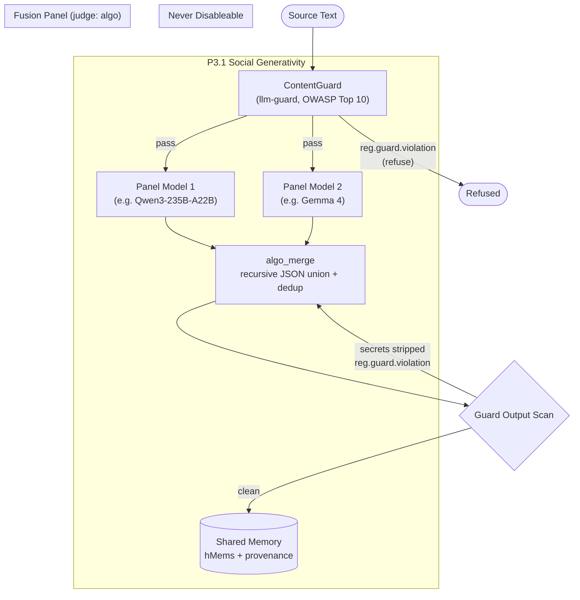
<!-- DIAGRAM_ALIGNMENT
id: DIAG-ARCH-011
verified_date: 2026-07-12
verified_against: crates/hkask-ports/src/lib.rs, crates/hkask-regulation/src/cybernetics_loop.rs
status: VERIFIED
-->

## Subsystems

| Subsystem | Crate | OWASP Alignment |
|---|---|---|
| ContentGuard | `hkask-guard` | LLM01, LLM02, LLM04, LLM06 |
| Algo Merge | `hkask-services-runtime` | LLM09 (Misinformation — cross-jurisdiction) |
| Memory Storage | `hkask-storage` | Provenance-tagged hMems |


### MCP Tool Dispatch — Sequence Diagram

*Inlined from `docs/diagrams/sequence-mcp-tool-dispatch.md`*


# MCP Tool Dispatch Sequence

**Purpose:** Trace the full MCP tool invocation path from `McpDispatcher::invoke()` through the `GovernedTool` OCAP membrane, to the `RawMcpToolPort` transport layer, with all Regulation span emission points, gas budget checks, and error-rejection paths.

**Related:** [PRINCIPLES.md](../architecture/core/PRINCIPLES.md) §P4 — Clear Boundaries (OCAP), [MDS.md](../architecture/core/MDS.md) §6

---

## Dispatch Flow Description

When a caller requests tool execution through the `McpPort` trait, the dispatch flows through three architectural layers:

1. **Dispatcher (`McpDispatcher::invoke`)** — Resolves caller identity and tool metadata (`server_id`), then delegates to the governed membrane. Maps `ToolPortError` variants into `TemplateError` for the caller.

2. **OCAP Membrane (`GovernedTool::invoke`)** — The security boundary where all governance decisions are made. A 7-step hold-settle pipeline:
   - **Step 0:** Cryptographic token signature verification (`token.verify()`)
   - **Step 1:** OCAP authority check — two paths: exact-match (ad-hoc invocation tokens) or domain-based matching via `capabilities_match()` (agent capability tokens)
   - **Step 2:** Gas budget check — `can_proceed()` + `reserve_gas()` hold; emits `GasDepleted` span on rejection, `GasReserved` on success
   - **Step 3:** Regulation observability — emits `reg.tool.invoked` span
   - **Step 4:** Delegate to inner `ToolPort` (the raw MCP transport)
   - **Step 5:** Settle gas — `settle_gas()` with refund for over-estimation; emits `GasSettled` + `ToolConsumptionEvent` on direct channel
   - **Step 6:** Regulation outcome — emits `reg.tool.completed` span (parented to invoked span)
   - **Step 7:** Record outcome for quality tracking via `CyberneticsLoop::record_outcome()`

3. **Transport (`RawMcpToolPort::invoke`)** — Checks for live Peer connection, calls `McpRuntime::call_tool()` over rmcp stdio, parses `CallToolResult` into `serde_json::Value`.

Per-tool Regulation span emission at the server level uses `ToolSpanGuard` (via `execute_tool()`), which emits via `tracing::info!(target: "reg.tool")`. The `Drop` implementation ensures forgotten spans still emit a "dropped" status.

Startup-time P4 enforcement uses `verify_startup_gates()`: Gate 1 (authentication), Gate 2 (role assignment), Gate 3 (per-tool capability query). Gate 3 denials are non-fatal — the server starts in degraded mode.

---

## Tool Dispatch Sequence

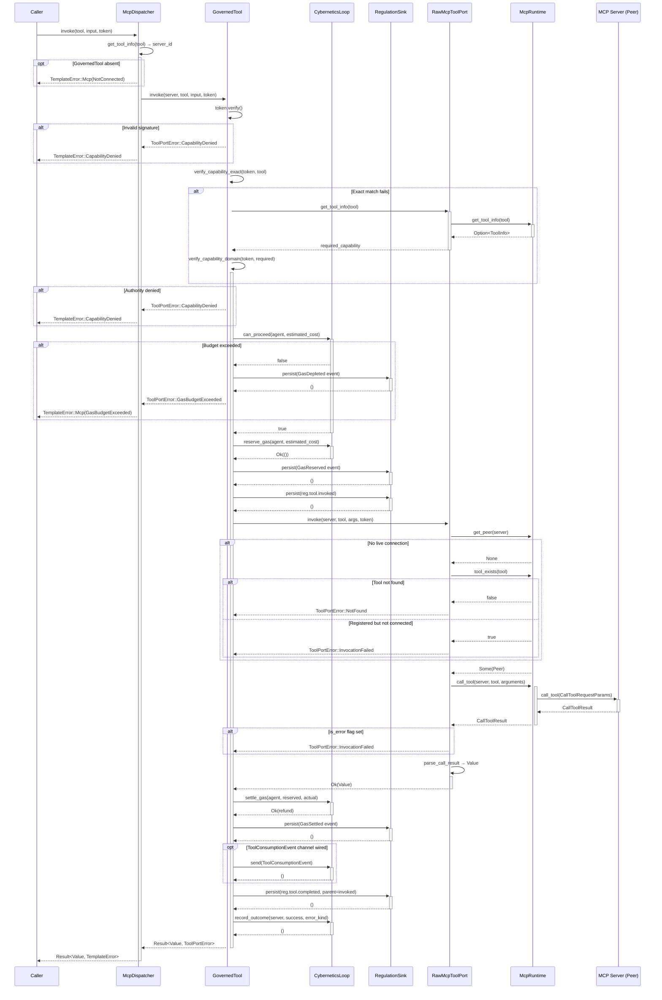
<!-- DIAGRAM_ALIGNMENT
id: DIAG-ARCH-012
verified_date: 2026-07-12
verified_against: crates/hkask-ports/src/lib.rs, crates/hkask-regulation/src/cybernetics_loop.rs
status: VERIFIED
-->

---

## Per-Tool Regulation Span (Server Side)

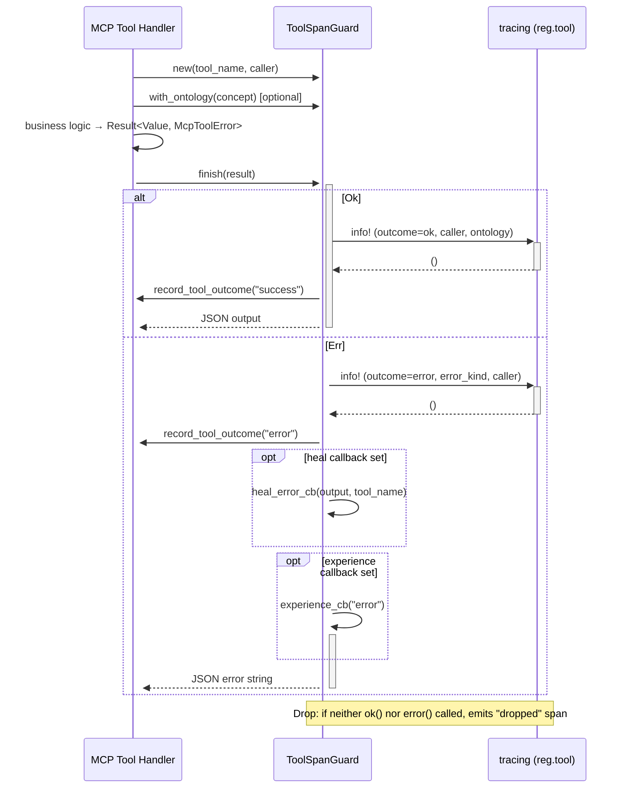
<!-- DIAGRAM_ALIGNMENT
id: DIAG-ARCH-013
verified_date: 2026-07-12
verified_against: crates/hkask-ports/src/lib.rs, crates/hkask-regulation/src/cybernetics_loop.rs
status: VERIFIED
-->

---

## P4 Startup Gates (Verification)

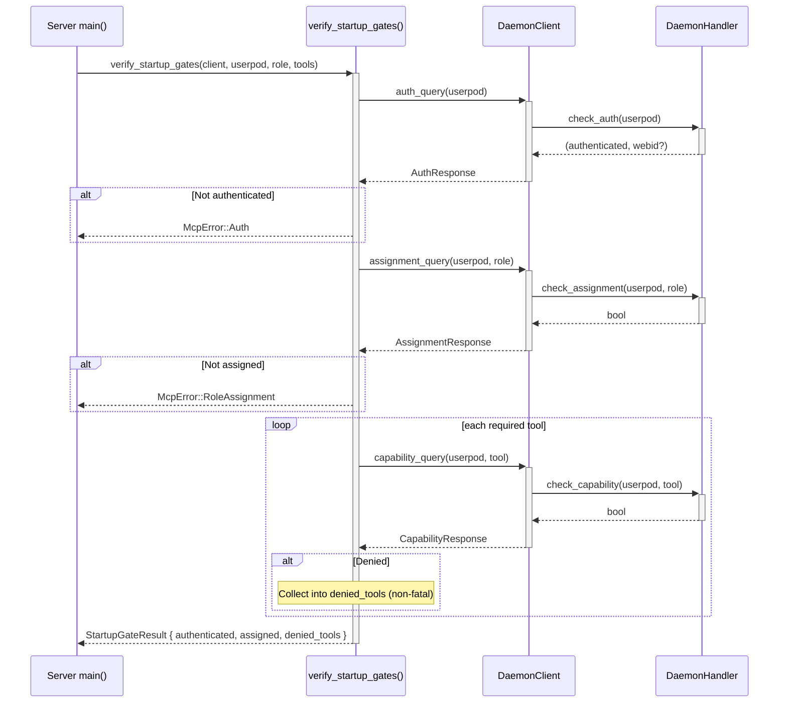
<!-- DIAGRAM_ALIGNMENT
id: DIAG-ARCH-014
verified_date: 2026-07-12
verified_against: crates/hkask-ports/src/lib.rs, crates/hkask-regulation/src/cybernetics_loop.rs
status: VERIFIED
-->

---

## DIAGRAM_ALIGNMENT

| Field | Value |
|-------|-------|
| **id** | `DIAG-IC-007` |
| **verified_date** | `2026-06-30` |
| **verified_against** | `crates/hkask-mcp/src/`, `crates/hkask-regulation/src/governed_tool.rs`, `crates/hkask-capability/src/verification/checker.rs` |
| **status** | `VERIFIED` |

### Verification notes

- `crates/hkask-mcp/src/dispatch.rs:176–282` — `McpDispatcher` struct, `McpPort` impl, `with_governed_tool()`, invocation routing through membrane
- `crates/hkask-mcp/src/dispatch.rs:36–114` — `RawMcpToolPort` struct and `ToolPort` impl — live peer check, `call_tool()`, error flag handling, result parsing
- `crates/hkask-mcp/src/dispatch.rs:218–261` — `McpPort::invoke()` — server_id lookup → GovernedTool delegation → ToolPortError → TemplateError mapping
- `crates/hkask-regulation/src/governed_tool.rs:79–87` — `GovernedTool` struct with inner port, cybernetics loop, event sink, energy estimator, agent WebID
- `crates/hkask-regulation/src/governed_tool.rs:199–474` — `ToolPort` impl — 7-step OCAP membrane: token verify → authority check (exact + domain fallback) → gas budget hold → Regulation invoked span → inner delegation → gas settle + consumption event → Regulation completed span → quality tracking
- `crates/hkask-regulation/src/governed_tool.rs:162–168` — `verify_capability_exact()` — exact tool-name match via `is_valid_for()`
- `crates/hkask-regulation/src/governed_tool.rs:175–178` — `verify_capability_domain()` — domain-based match via `capabilities_match()`
- `crates/hkask-regulation/src/governed_tool.rs:184–196` — `verify_capability_domain_fallback()` — async tool metadata lookup + domain match
- `crates/hkask-capability/src/verification/checker.rs:20–33` — `CapabilityChecker` struct — signing key, trusted roots, root enforcement flag
- `crates/hkask-capability/src/verification/checker.rs:112–120` — `verify()` — signature verification with optional root anchoring (fail-closed on empty roots)
- `crates/hkask-mcp/src/runtime.rs:124–367` — `McpRuntime` — server registry, tool registry, live connections, `start_server()`, `call_tool()`, `get_tool_info()`
- `crates/hkask-mcp/src/runtime.rs:290–307` — `McpRuntime::call_tool()` — direct Peer invocation via rmcp `CallToolRequestParams`
- `crates/hkask-mcp/src/server.rs:241–403` — `ToolSpanGuard` — per-tool Regulation span with `ok()`, `error()`, `finish()`, `Drop` guard for forgotten spans
- `crates/hkask-mcp/src/server.rs:446–458` — `execute_tool()` — automatic span emission + outcome recording
- `crates/hkask-mcp/src/server.rs:462–478` — `execute_tool_semantic()` — span with ontology concept tagging
- `crates/hkask-mcp/src/server.rs:852–861` — `emit_tool_span_with_caller()` — `tracing::info!(target: "reg.tool")` with caller WebID
- `crates/hkask-mcp/src/startup.rs:101–190` — `verify_startup_gates()` — Gate 1 (auth), Gate 2 (assignment), Gate 3 (capability per tool, non-fatal denial)
- `crates/hkask-mcp/src/startup.rs:44–52` — `StartupGateResult` — authenticated, assigned, denied_tools fields
- `docs/architecture/core/PRINCIPLES.md:52–56` — P4 Clear Boundaries (OCAP) — pod boundary as enforcement perimeter
- `docs/DIAGRAMS_INDEX.md:27` — DIAG-DC-005 — existing MCP Tool Dispatch with OCAP constraint enforcement

---

## Cross-References

| Reference | Description |
|-----------|-------------|
| [PRINCIPLES.md §P4](../architecture/core/PRINCIPLES.md) | Clear Boundaries (OCAP) — P4.1 Pod Boundary as OCAP Enforcement Perimeter |
| [DIAGRAMS_INDEX.md DIAG-DC-005](../DIAGRAMS_INDEX.md) | Existing MCP Tool Dispatch with OCAP constraint enforcement (MDS.md §6) |


### MCP Bootstrap and Tool Dispatch — Sequence

*Inlined from `docs/diagrams/sequence-mcp-bootstrap.md`*


# MCP Bootstrap and Tool Dispatch — Sequence Diagram

**Diataxis quadrant:** How-To / Explanation  
**Domain ontology tier:** Core  
**Purpose:** Show the startup sequence for an MCP server and the tool dispatch path through the OCAP membrane. Used as reference for bootstrapping new MCP servers.  
**Verified against:** `crates/hkask-mcp/src/lib.rs`, `crates/hkask-mcp/src/dispatch.rs`, `crates/hkask-regulation/src/governed_tool.rs`  
last-verified-against: "3d1a876f45e3ce64864c3453f1e71d75b2f14376"

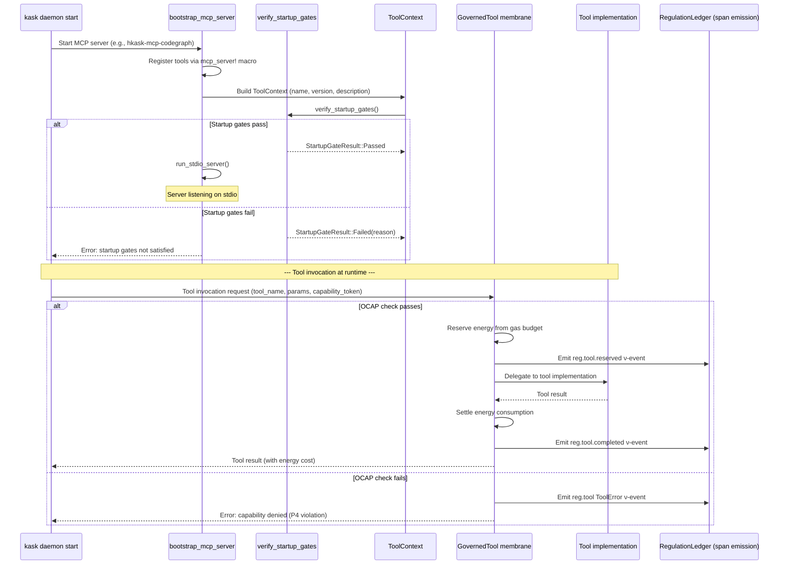
<!-- DIAGRAM_ALIGNMENT
id: DIAG-ARCH-015
verified_date: 2026-07-12
verified_against: crates/hkask-ports/src/lib.rs, crates/hkask-regulation/src/cybernetics_loop.rs
status: VERIFIED
-->

**Node-to-code mapping:**

| Step | Source |
|------|--------|
| `bootstrap_mcp_server` | `crates/hkask-mcp/src/lib.rs` |
| `mcp_server!` macro | `crates/hkask-mcp/src/lib.rs` |
| `verify_startup_gates` | `crates/hkask-mcp/src/startup.rs` |
| `ToolContext` + `impl_tool_context!` | `crates/hkask-mcp/src/lib.rs` |
| GovernedTool OCAP membrane | `crates/hkask-regulation/src/governed_tool.rs` |
| Energy reserve/settle | `crates/hkask-regulation/src/energy.rs` |
| Regulation span emission | `crates/hkask-regulation/src/runtime.rs` |
| `BUILTIN_SERVERS` (16 registrations) | `crates/hkask-mcp/src/lib.rs` |

**Cardinality:** 15 MCP servers registered in `BUILTIN_SERVERS` constant. Each follows this bootstrap sequence. Tool dispatch flows through a single `GovernedTool` instance per invocation. 6 OCAP membrane steps per invocation: OCAP check → energy reserve → ν-event → delegate → settle → ν-event.

