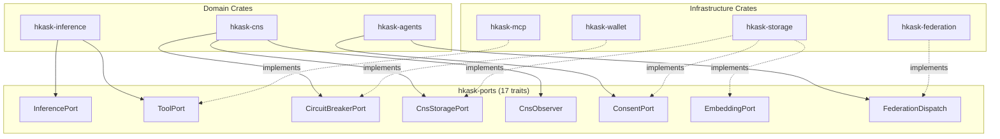
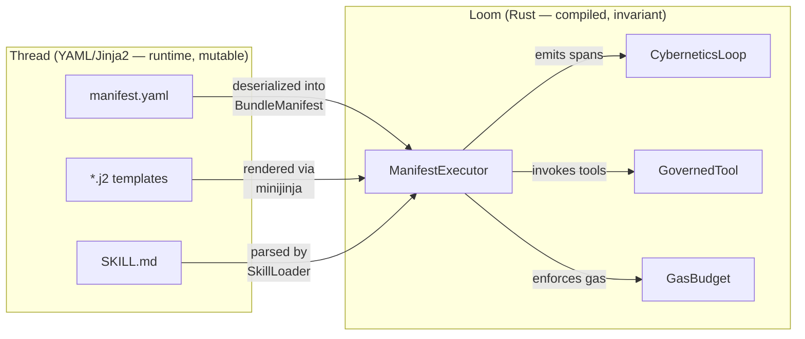
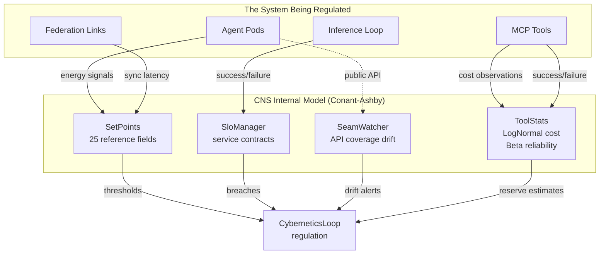
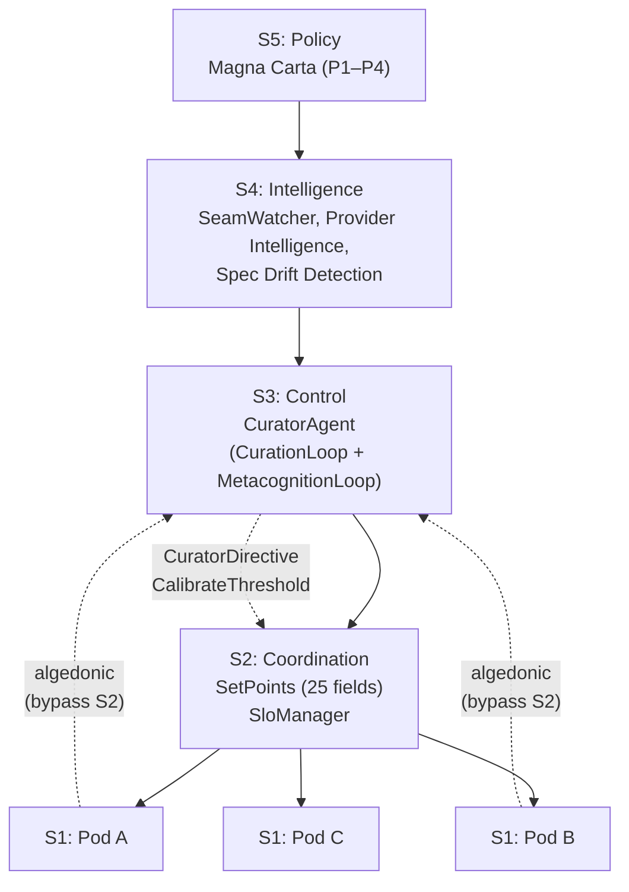
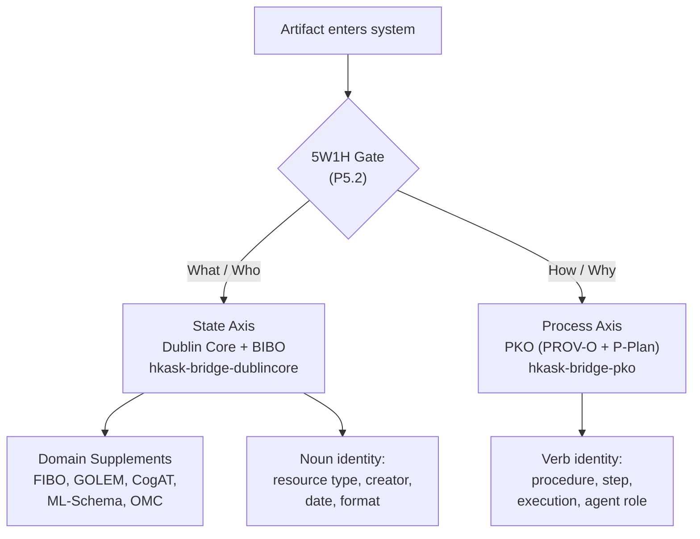
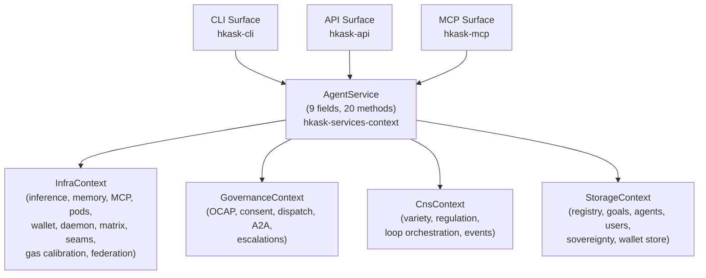

# Architecture Patterns

This document consolidates five architectural patterns that define hKask's structural identity and the API surface that exposes them. Each pattern exists because a specific project constraint demands it — not for aesthetic or conventional reasons. The patterns are: hexagonal ports and adapters, the loom-and-thread separation, the Good Regulator theorem, the Viable System Model mapping, and the dual-axis ontology. The final section documents the API surface equivalence (P3) that makes every architectural boundary equally accessible from CLI, API, and MCP.

---

## 1. Hexagonal Ports and Adapters

### Statement

The hexagonal architecture in hKask is not a pattern adopted for aesthetics. It exists because the system's core regulatory logic — the CNS, the Curator, the Inference loop — must function identically whether it runs against a local SQLite database on a developer's laptop or against a federated cluster of PostgreSQL-backed replicas. More importantly, it must be testable without any of those backends at all.

### Evidence

In standard hexagonal architecture, the domain core is surrounded by ports (interfaces the core defines) and adapters (implementations that satisfy those interfaces). In Rust, ports are **traits**, and adapters are **structs that implement those traits**. The rule is simple: domain crates define the traits; infrastructure crates provide the implementations.

This design exists because hKask's dependency graph imposes a strict Authority DAG. Domain crates (`hkask-cns`, `hkask-agents`, `hkask-inference`) must not depend on infrastructure crates (`hkask-storage`, `hkask-mcp`, `hkask-federation`). The port traits in `hkask-ports` are the only shared dependency — every domain crate imports from `hkask-ports`, and every infrastructure crate implements against it. There is no other coupling path.

As the crate-level documentation in `crates/hkask-ports/src/lib.rs` states: "Port traits that enable crates to depend on abstractions rather than concrete implementations. Per the Authority DAG, domain crates depend on these port traits (not on each other)."

#### The 17 Port Traits

The `hkask-ports` crate defines **17 trait contracts**, each guarding a distinct architectural boundary. They group into five concerns:

| Concern | Traits |
|---------|--------|
| CNS regulation | `CircuitBreakerPort`, `CnsStoragePort`, `CnsObserver` |
| Federation | `FederationTransport`, `FederationSyncPort`, `FederationDispatch` |
| Storage and registry | `EmbeddingPort`, `RegistryPort`, `RegistryIndex`, `SkillRegistryIndex`, `GitCASPort` |
| Inference and tools | `InferencePort`, `ToolPort` |
| Governance and pipelines | `ConsentPort`, `EscalationPort`, `WalletBudgetPort`, `StepExecutor` |

The eight primary infrastructure boundaries are documented in detail below. The remaining nine are listed in §1.4.

**`InferencePort`** (`crates/hkask-ports/src/inference_port.rs`) — The LLM invocation boundary. This is the most heavily used port — every agent pod, every Curator reflection, every template cascade eventually calls `generate()`. It uses `Pin<Box<dyn Future>>` rather than `async_trait` for object safety, enabling `Arc<dyn InferencePort>` dispatch at construction time. The trait provides default implementations for `generate_n()`, `generate_stream()`, `generate_with_model()`, and `generate_vision()` — all fall back to `generate()`, so a new backend only needs to implement one method. The concrete implementor is the `InferenceRouter` in `hkask-inference`, which multiplexes across multiple providers (DeepSeek, Anthropic, Groq, OpenAI, DeepInfra, Together AI, fal.ai, OpenRouter, KiloCode) with model routing, failover, and concurrency control.

**`ToolPort`** (`crates/hkask-ports/src/tool.rs`) — The governance membrane for MCP tool invocation. Unlike `InferencePort`, this port has an authentication asymmetry: `discover_tools()` and `get_tool_info()` are intentionally unauthenticated — tool schemas are public metadata — but `invoke()` requires a `DelegationToken`. OCAP enforcement applies at the actuator boundary, not the sensor boundary. The concrete implementor is `McpDispatcher` in `hkask-mcp`. The error type, `ToolPortError`, encodes the governance envelope directly: `CapabilityDenied` (OCAP rejection), `EnergyBudgetExceeded` (gas depletion), `NotFound`, and `InvocationFailed`.

**`CircuitBreakerPort`** (`crates/hkask-ports/src/cns.rs`) — The circuit breaker boundary for the Cybernetics membrane. A minimal trait — `allow_request()`, `record_success()`, `record_failure()`, `state()` — that allows the Inference loop to use circuit breaking without depending on `hkask-cns`. The concrete implementor is `CircuitBreaker` in `hkask-cns`. When the CNS detects elevated error rates above the `error_rate_max` set-point (default: 30%), it opens the circuit and the inference loop stops sending requests.

**`CnsStoragePort`** (`crates/hkask-ports/src/cns.rs`) — Storage abstraction for CNS event queries. While `CircuitBreakerPort` is the actuator boundary, `CnsStoragePort` is the memory boundary — it abstracts the `NuEventStore` behind a trait so the cybernetic regulation layer (`GasReport`, `CalibratedEnergyEstimator`, `WalletGasCalibrator`) can be tested without a real SQLite database. It provides `query_algedonic()` for alert retrospectives, `replay_weighted()` for temporal decay-weighted event replay, and `persist_cursor()`/`load_cursor()` for crash recovery.

**`CnsObserver`** (`crates/hkask-ports/src/cns.rs`) — The subscriber interface for CNS events. Observers declare an `interest_mask()` of `SpanNamespace` values they care about, then receive `on_event()`, `on_depletion()`, and `on_backpressure()` callbacks. The concrete implementor in `hkask-inference` uses this to react to throttle and circuit-break signals.

**`ConsentPort`** (`crates/hkask-ports/src/consent_port.rs`) — Decouples agent pods from the concrete `ConsentStore` in `hkask-storage`. A CRUD trait for consent records — `initialize_schema()`, `store()`, `list_active()` — that ensures the Affirmative Consent (P2) verification layer can be tested independently of the database schema.

**`EmbeddingPort`** (`crates/hkask-ports/src/embedding_port.rs`) — The vector embedding storage boundary. Abstracts the concrete `EmbeddingStore` in `hkask-storage`. Provides `store()`, `get()`, `search()` (cosine similarity), and `delete()` — the four operations needed by the semantic memory loop to anchor triples in embedding space.

**Federation ports** (`crates/hkask-ports/src/federation.rs`) — Three traits for cross-instance federation: `FederationTransport` (async send/receive with partition simulation for testing), `FederationSyncPort` (CRDT cursor-based triple synchronization), and `FederationDispatch` (high-level lifecycle orchestration). These decouple the Curator's federation logic from the concrete `FederationLinkManager` in `hkask-federation`. The `FederationDispatch` trait is documented in detail in the [Federation and Transport](federation-and-transport.md) guide.

### Diagram



### Implications

The hexagonal pattern in hKask serves three purposes, each grounded in a specific project constraint:

**Testability.** The CNS must be testable without external dependencies. `CnsStoragePort` means the `CyberneticsLoop` test suite runs against in-memory data. `ToolPort` means the OCAP enforcement tests do not need running MCP servers. `InferencePort` means the prompt assembly tests do not burn API credits.

**Provider independence.** The `InferencePort` abstraction means the system can route to any LLM provider without changing agent logic. The `CircuitBreakerPort` means the circuit breaker implementation can be swapped without touching the inference loop.

**OCAP enforcement at boundaries.** The `ToolPort` is not just a convenience abstraction — it is a security boundary. The `DelegationToken` requirement is not advisory; it is enforced by the trait's contract. Any implementor of `ToolPort` must reject unauthenticated invocations. The hexagon's perimeter is also the capability security perimeter.

#### How Ports Compose

At runtime, three ports compose into the regulated inference pathway:

```
InferenceLoop
    │
    ├─▶ CircuitBreakerPort::allow_request()
    │       └── state = Open → return Err, short-circuit
    │
    ├─▶ InferencePort::generate()
    │       └── actual LLM call, returns InferenceResult
    │
    └─▶ ToolPort::invoke(tool, args, token)
            └── OCAP check → gas reservation → MCP dispatch
```

The `CircuitBreakerPort` gates the `InferencePort`: if the circuit is open (too many recent failures), the inference loop skips the LLM call entirely and returns an error. The `ToolPort` governs tool execution: even if the LLM produces a tool call, the OCAP membrane checks whether the agent's delegation token authorizes that specific tool before dispatching.

This composition is not wired by magic — it is wired by the `InferenceLoop` in `hkask-inference`, which holds references to all three ports and sequences them explicitly. The CNS observes the results (`CnsObserver::on_event()`) and may decide to open the circuit or escalate based on the outcome.

#### The GovernedTool Decorator Pattern

`ToolPort` on its own would be a simple dispatch interface: "call this tool with these arguments." But hKask's P4 (Object Capability) principle requires that every tool invocation be capability-gated. Rather than polluting every call site with authorization logic, the system uses a **decorator pattern**: `GovernedTool` wraps `ToolPort` with OCAP checking, energy reservation, span emission, and cost accounting.

The decorator's `invoke()` method: (1) checks the `DelegationToken` against the tool's `required_capability`, (2) reserves gas from the agent's `GasBudget`, (3) emits a `cns.tool.pre` span, (4) delegates to the inner `ToolPort::invoke()`, (5) accounts for the actual cost against the budget, (6) emits a `cns.tool.post` span with outcome.

From the caller's perspective, it still calls `invoke()` on a `ToolPort` — the decorator makes the governance membrane invisible to the consumer while enforcing it at every invocation. This is the cybernetic equivalent of a capability-secure dispatch: the agent can only call tools it holds tokens for, and every call is metered. The full OCAP dispatch contract is documented in the [Sovereignty and OCAP](sovereignty-and-ocap.md) guide.

#### Additional Port Traits (§1.4)

The following nine traits are defined in `hkask-ports` but are not given full section treatment above. They are listed for completeness and agent-correctness.

| Trait | File | Purpose |
|-------|------|---------|
| `FederationDispatch` | `federation.rs` | High-level federation orchestration: `register_peer`, `invite`, `accept`, `reject`, `pause`, `resume`, `revoke`, `leave`, `dissolve`. The primary federation trait referenced in AGENTS.md Key Docs. |
| `GitCASPort` | `git_cas/port.rs` | Content-addressed storage boundary: `store_blob`, `get_blob`, `hash_exists`. Guards the Git object store abstraction. |
| `WalletBudgetPort` | `wallet_budget_port.rs` | Wallet-backed gas budgeting: `get_balance`, `reserve_gas`, `release_gas`. Enables CNS energy management to query wallet state. |
| `StepExecutor` | `pipeline_runner.rs` | Pipeline step execution boundary for multi-step agent workflows. |
| `SkillRegistryIndex` | `registry.rs` | Read-only skill registry access: `list_skills`, `get_skill_metadata`. Used by `SkillAuditor` and bundle composition. |
| `RegistryIndex` | `registry.rs` | Read-only template registry access: `list_templates`, `get_template`. Used by the cascade resolver. |
| `RegistryPort` | `registry_port.rs` | Full registry access (read + write): `insert_template`, `get_template`, `list_templates`. The mutable counterpart to `RegistryIndex`. |
| `EscalationPort` | `escalation.rs` | Escalation queue access: `push_escalation`, `list_escalations`, `resolve_escalation`. Bridges CNS algedonic alerts to Curator action. |
| `ConsentPort` | `consent_port.rs` | Consent store access: `check_consent`, `grant_consent`, `revoke_consent`. Enforces P1 sovereignty at the data-access boundary. |

For a visual reference, see the [Ports Trait Hierarchy Class Diagram](../diagrams/class-ports-trait-hierarchy.md) (DIAG-IC-002 in the Diagram Index), which renders the complete trait hierarchy with method signatures and implementor relationships.

---

## 2. The Loom and the Thread

### Statement

hKask's README opens with a design philosophy: "Austere and efficient recombinatorial system. Rust is the loom (fixed logic). YAML/Jinja2 is the thread (mutable content)." This is not a metaphor for poetic effect — it is the structural premise of the entire system. The loom-and-thread separation resolves a fundamental tension in agent platforms: behavior must be both stable enough to trust and flexible enough to evolve. A pure-code system locks behavior at compile time, making it rigid. A pure-configuration system puts behavior in mutable files, making it brittle and unverifiable. hKask splits the difference: the loom constrains what the thread can express, and the thread gives the loom something to weave.[^loom]

### Evidence

#### The Loom: Rust as Invariant Logic

The loom is everything compiled. It is the `kask` binary — 40 core crates, 15 MCP servers, ~192,700 lines of Rust. It is:

- **The CNS** (`hkask-cns`). The cybernetic loop: sense, compare, compute, act, verify. This loop does not change based on configuration. It is structural — a `Loop` trait with fixed semantics, `LoopAction` types with fixed authority hierarchy.

- **The Energy Layer** (`GasBudget`, `Well`, `WalletManager`). The hold-settle pattern, stale reservation detection, hard limits, invariance enforcement (`remaining + reserved ≤ cap`). These invariants are compile-time guarantees via private fields and constructor assertions.

- **The Database Driver** (`DatabaseDriver` trait, `SqliteDriver`, `PostgresDriver`). The abstraction is fixed — stores code against `&dyn DatabaseDriver`, not raw connections. New providers can be added, but the interface is invariant.

- **The GovernedTool Membrane** (`GovernedTool<P: ToolPort>`). Every tool invocation passes through this single membrane: OCAP check → gas reserve → tool execute → gas settle → span emit. The sequence is structural. Configuration cannot reorder it.

- **The Template Engine** (`ManifestExecutor`). It interprets YAML manifests, but the interpretation itself is Rust. The executor walks steps, evaluates conditions, checks convergence, enforces gas. The interpreter is the loom — it cannot be changed by a manifest.

The loom is not configurable. It is code. It is compiled, tested, fuzzed, verified by CI (format → clippy → build → test → doc → invariants). It is the safety boundary.

#### The Thread: YAML/Jinja2 as Variant Content

The thread is everything authored. It lives in files that are read at runtime, not compiled in. It is:

- **Skill Manifests** (`registry/templates/*/manifest.yaml`, 64 files). These declare the structure of a skill: its steps, convergence criteria, gas budget, error handling. They do not contain logic — they contain declarative configuration that the Rust executor interprets.

- **Jinja2 Templates** (`registry/templates/*/*.j2`, 273 files). These are the prompts, the tool invocations, the output schemas. They are raw material for the skill execution engine. A template runs once; the skill wraps it in a PDCA loop.

- **SKILL.md Files** (`.agents/skills/*/SKILL.md`, 39 files). These are documentation — the human-facing description of what a skill does. The YAML front matter declares metadata (name, namespace, visibility); the Markdown body is the explanation. The `SkillLoader` parses these at startup.

- **Agent Definitions**. Pod configurations, agent WebIDs, skill assignments, capability grants. These declare what exists, not how it works.

The thread is mutable. An author can create a new skill by writing a `manifest.yaml` and a few `.j2` templates — no recompilation, no redeployment. An existing skill can be tuned: tighten the convergence threshold, increase the gas cap, add a pre-condition to a step. The thread evolves without touching the loom.

### Diagram



### Implications

The key property is that the loom constrains what the thread can express. A YAML manifest cannot:

- Create new action types. The executor only understands `render`, `tool_invoke`, `choice`, `populate`, `select`, `abort`, `escalate`. A manifest that declares `action: "rm -rf /"` is a parse error.
- Bypass gas enforcement. `gas.cap`, `gas.cost_per_iteration`, `gas.hard_limit` are fields the executor reads and enforces. A manifest cannot declare `"gas_bypass": true`.
- Violate convergence invariants. The executor enforces `min_iterations`, `max_iterations`, and `improvement_gate`. A manifest can configure these values but cannot override the check logic.
- Access the file system, network, or cryptographic keys. Templates invoke tools through the MCP protocol; tools are registered Rust implementations behind the `GovernedTool` membrane. A template cannot call `std::fs::remove_dir_all`.

The thread is powerful within its domain — it can compose skills, define workflows, set quality thresholds, tune iteration parameters — but it cannot escape the loom's constraints. This is the same security model as a web browser: JavaScript (thread) can manipulate the DOM, but it cannot access the file system. The browser (loom) provides a sandbox.

The boundary is clean: Rust never interprets YAML structurally — YAML describes, Rust enforces. The `manifest_loader` (`crates/hkask-templates/src/manifest_loader.rs`) reads YAML files, deserializes them into strongly typed `BundleManifest` structs via `serde_yaml_neo`, and passes the typed structures to the executor. The YAML's structure is validated at parse time: missing required fields produce errors, unknown fields are ignored or rejected, type mismatches fail immediately. This is fundamentally different from a system where configuration is arbitrary JSON parsed into `serde_json::Value` and interpreted at runtime. In hKask, there is no runtime YAML traversal. The loom has already cast the thread into its fixed mold before any step executes.

#### The Tooling Policy as Loom Hygiene

The AGENTS.md tooling policy reinforces this separation: "hKask is a Rust project. Python is not an acceptable project dependency." This is loom purity. Adding a Python dependency would introduce a second loom — a second interpreter, a second type system, a second security boundary. The hKask project instead favors shell scripts under `scripts/` and Rust binaries for auxiliary tooling. The loom is one language, one compiler, one set of invariants.

---

## 3. The Good Regulator Theorem

### Statement

The Conant-Ashby theorem (1970) states: "Every good regulator of a system must be a model of that system."[^conant_ashby] The regulator can only control what it can represent. If the regulator's internal model diverges from the system's actual behavior — if it does not know what "healthy" looks like, or cannot detect when "healthy" becomes "unhealthy" — regulation fails. This design exists because hKask's CNS is not a passive observer. It is an active cybernetic regulator. It must have a model of the system it regulates, and that model must stay synchronized with reality.

### Evidence

The four components that comprise the CNS's internal model — `SetPoints`, `SloManager`, `SeamWatcher`, and `ToolStats` — each model a different dimension of system health, and together they satisfy the Conant-Ashby requirement.

#### SetPoints: The Regulator's Internal Model

`SetPoints` at `crates/hkask-cns/src/set_points.rs:139` is the regulator's reference model. It defines 25 configurable fields that establish "what healthy looks like" for every observable dimension:

- **Energy health**: `gas_min_remaining` (default 0.2 — alert when less than 20% of budget remains)
- **Variety health**: `variety_max_deficit` (default 100 — alert when observed variety falls short of expected by more than 100)
- **Error health**: `error_rate_max` (default 0.3 — alert when >30% of operations fail)
- **Latency health**: `connector_latency_max_secs` (default 30s)
- **Communication health**: `communication_backpressure_threshold` (default: `QueueDepth::DEFAULT_BACKPRESSURE`)
- **Seam health**: `seam_coverage_min` (default 0.0 — alert on any coverage regression)
- **Federation health**: 8 fields covering sync latency (warning 5s, critical 30s), CRDT divergence (2× baseline), link downtime (warning 1h, critical 24h), pause duration (24h), invitation rate (5/hr), and registry divergence (10 entries/sync)
- **Regulation health**: `max_iterations` (100), `stagnation_thresholds` (per-metric, default 5), `stage_worsening_ratio` (0.05), `block_worsening_ratio` (0.20), `substitution_after` (2)
- **Dampener**: `dampen_window_secs` (60s), `metacognitive_window_secs` (300s), `override_cooldown_secs` (120s)
- **Outcome**: `outcome_warning_threshold` (0.50), `outcome_critical_threshold` (0.25)
- **Guard**: `guard_violation_rate_max` (0.20 — per OWASP LLM Top 10)

These set points are loaded from YAML via `HKASK_CNS_CONFIG` environment variable, falling back to validated defaults. The `SetPointsConfig` type (line 232) allows partial configuration — any omitted field uses its default, making the model self-healing against misconfiguration.

The regulator's model is validated on load: `validate()` at line 398 enforces 13 invariants — ratio fields must be in `[0.0, 1.0]`, warning thresholds must exceed critical thresholds, federation latencies must be ordered warning < critical, `stage_worsening_ratio` < `block_worsening_ratio`, and `variety_max_deficit` must be positive.

#### SloManager: Service Level Objectives vs Actual Performance

`SloManager` at `crates/hkask-cns/src/slo_manager.rs:82` models the system's service level contracts. It holds `Vec<SloDefinition>` — explicit, measurable service level objectives — and evaluates them against ν-event data via the `SloDataProvider` trait.

Each SLO has a target compliance rate and a time window. `SloDataProvider::query()` retrieves `SloDataPoint { total_operations, successful_operations }` for a given span namespace within the window. The manager computes `SloEvaluation` — compliance rate, error budget remaining, and breach status. Breaches emit `cns.slo.evaluated` spans and feed the algedonic pathway.

This is the regulator modeling the system's contractual obligations. An SLO breach is not just "things are slow" — it is "the system promised 99% availability on this span and is delivering 94%." The gap between SLO target and actual performance is a Conant-Ashby deviation: the model says "should be X," reality says "is Y," and the regulator must close that gap.

#### SeamWatcher: Detecting Model-Reality Drift

`SeamWatcher` at `crates/hkask-cns/src/seam_watcher.rs:94` models the system's API contracts. It loads the public seam inventory — a machine-readable JSON catalog of every public type, function, and trait, each tagged with its REQ test coverage status — and compares snapshots over time.

The inventory is embedded at compile time via `include_str!("../../../docs/status/public-seam-inventory.json")` (line 34), ensuring seam watching works in deployed binaries. The `HKASK_SEAM_INVENTORY_PATH` env var provides a development override.

When `SeamWatcher` detects drift between snapshots — coverage degradation, new items without tests, or removed coverage — it produces `SeamDrift` records with per-crate `delta_pct`. These drift signals are registered as CNS variety dimensions (`seam:{crate_name}`) with `SEAM_EXPECTED_VARIETY` set to 10. When coverage degrades, the variety deficit triggers algedonic alerts.

This is the regulator detecting model-reality divergence. The seam inventory IS the model of "what APIs exist and are tested." When that model drifts — when a developer adds a public function without a REQ test — the regulator knows. Conant-Ashby is satisfied: the regulator's model of the codebase is kept synchronized through continuous observation.

#### ToolStats: Statistical Learning

`ToolStats` at `crates/hkask-cns/src/tool_stats.rs:71` is the regulator's statistical model of tool behavior. It implements a three-layer learning architecture:

**Layer 1 (cost distribution)**: Each tool accumulates up to 200 cost observations (`MAX_COST_OBSERVATIONS`) in a `VecDeque<f64>`. At `reserve_estimate()` time (line 109), if ≥10 observations exist (`MIN_OBSERVATIONS_FOR_FIT`), a LogNormal distribution is fitted via method of moments on log-transformed observations. The reserve estimate is the 90th percentile (`p90`), tightening with more data. If fewer observations exist, the raw mean is used. If none exist, the caller falls back to the `EnergyEstimator` point estimate.

**Layer 2 (reliability tracking)**: `ToolState` tracks `successes: u64` and `failures: u64`. `reliability_alerts()` (line 130) computes Beta posterior success probability: `P(success) = (successes + 1) / (successes + failures + 2)` — a Beta(α = successes+1, β = failures+1) conjugate prior with Laplace smoothing. When `P(success) < reliability_threshold` (default 0.80), a `ToolReliabilityAlert` is emitted, pre-escalating before the tool actually fails.

**Layer 3 (auto-calibration)**: When `GovernedTool` reserves gas, it queries `ToolStats::reserve_estimate()` first. If the distribution's p90 is consistently lower than the point estimate from `EnergyEstimator`, reserves tighten automatically — the statistical model overrides the static model. This closes the feedback loop: tool behavior feeds the model, the model improves the reserve, better reserves prevent gas waste.

The LogNormal choice for cost is deliberate — tool costs are positive and right-skewed (most invocations are cheap, a few are expensive). The Beta choice for reliability is the standard Bayesian conjugate prior for Bernoulli trials, enabling probabilistic reasoning about tool health without storing raw success/failure streams.

`ToolStats` is wired into `GovernedTool` at construction time via `with_tool_stats()`. At settle time, `stats.record(tool, actual_cost, success)` updates the model. The `ToolReliabilitySensor` feeds reliability alerts into the `SensorRegistry`, making tool degradation visible to the CNS regulation pipeline. This completes the Conant-Ashby contract: the regulator models tool behavior statistically, detects degradation probabilistically, and intervenes before the user experiences a failure.

### Diagram



### Implications

The Good Regulator theorem is not an aspirational goal in hKask — it is a structural requirement. The CNS does not regulate by reacting to raw metrics; it regulates by comparing observations against an explicit model and closing the gap. The four model components are maintained through continuous observation, not configured once and forgotten. When the model drifts from reality — when a tool's cost distribution shifts, when an SLO breaches, when seam coverage degrades — the regulator detects the drift and acts before the user experiences degradation. The `SystemSimulator` in `CyberneticsLoop` (line 101) provides an additional layer: `MovingAverageExtrapolator` predicts metric trajectories, enabling predictive regulation — if a metric is approaching its set-point within 3 ticks, the CNS emits a `Notify` action before the threshold is breached. This is anticipatory regulation, not reactive monitoring.

---

## 4. Viable System Model Mapping

### Statement

The Viable System Model (VSM), developed by Stafford Beer, is a cybernetic framework for understanding how any system — biological, organizational, or computational — maintains viability in a changing environment.[^beer] Beer's core insight: a viable system must have the internal variety to match the variety of its environment (Ashby's Law of Requisite Variety), and it organizes this variety through five recursive system levels (S1–S5). This design exists because hKask is not a passive monitoring system. It is a cybernetic regulator. Per the architecture master at `docs/architecture/hKask-architecture-master.md`, the CNS is described as "a complete cybernetic system per Beer's Viable System Model (S1–S5). Not passive monitoring; active regulation." Every structural decision in the CNS maps onto VSM levels.

### Evidence

#### S1: Operations — Pods and MCP Servers

System 1 in VSM is the collection of autonomous operational units that do the actual work. In hKask, these are the agent pods — each a `PodDeployment` at `crates/hkask-agents/src/pod/deployment.rs:47` — and their bound MCP servers, held in `PerPodToolBinding`. Each pod is autonomous: it owns its storage (`PerPodStorage` — a dedicated SQLCipher file at `{data_dir}/agents/{sanitized_name}/pod.db`), its CNS runtime (`PerPodCnsRuntime` — variety counters scoped to the pod), and its tool bindings.

MCP servers provide the operational capabilities: web search, condenser, media, memory, wallet, codegraph, and others — 15 tool subsystems tracked in `CnsSpan::Tool { subsystem }` at `crates/hkask-types/src/cns.rs:111`. Each pod's variety is measured independently via `PerPodCnsRuntime`, enabling per-pod regulation.

#### S2: Coordination — CNS Set Points and SLOs

System 2 is the anti-oscillation layer — it prevents autonomous units from conflicting with each other through coordination signals. In hKask, this is the `SetPoints` struct at `crates/hkask-cns/src/set_points.rs:139` and the `SloManager` at `crates/hkask-cns/src/slo_manager.rs:82`.

`SetPoints` defines 25 configurable reference values. These are loaded from YAML via `HKASK_CNS_CONFIG` or fall back to defaults validated by `SetPoints::validate()`. `SloManager` defines service level objectives that are evaluated against ν-event data. Each `SloDefinition` has compliance targets; `SloEvaluation` reports whether an SLO is in breach. Breached SLOs feed the algedonic pathway — the pain channel that surfaces S2 coordination failures to higher VSM levels. These set points prevent oscillation by establishing explicit coordination contracts: when a pod's variety deficit exceeds the threshold, the system does not just oscillate — it escalates.

#### S3: Control — The Curator Agent

System 3 is the internal control function — resource allocation, monitoring, and auditing of the operational units. In hKask, this is the `CuratorAgent` at `crates/hkask-agents/src/curator_agent/mod.rs:44`. It composes the pure regulatory `CurationLoop` with the persona-layer `MetacognitionLoop`.

The Curator's control responsibilities include: issuing `CuratorDirective::OverrideEnergyBudget` to reallocate gas between agents, `CuratorDirective::CalibrateThreshold` to adjust CNS set points (sent on the direct `mpsc` channel to `CyberneticsLoop`), monitoring regulation effectiveness via `HealthSnapshot.regulation_effectiveness`, and triggering escalations when `MetacognitionLoop::act()` detects that the CNS cannot self-correct.

The Curator is not an operator — it is a daemon. It responds in <3s latency target, is always running, and never bypasses OCAP. It can recommend actions but cannot execute without capability tokens. Per the Magna Carta, the Curator is the enforcer, not the sovereign.

#### S4: Intelligence — Seam Watcher and Provider Intelligence

System 4 is the external-facing intelligence function — scanning the environment, detecting threats and opportunities, and feeding strategic information inward. In hKask, this is implemented by several components:

- **SeamWatcher** (`crates/hkask-cns/src/seam_watcher.rs:94`): Loads the machine-readable public seam inventory (embedded at compile time via `include_str!`, overridable at runtime via `HKASK_SEAM_INVENTORY_PATH`), tracks per-crate test coverage as CNS variety dimensions (`seam:{crate_name}`), and detects drift from previous snapshots. When coverage degrades, it emits algedonic alerts. This is the system's external contract monitor — it watches the boundary between implementation and specification.

- **Provider intelligence**: The capability domain system allows new MCP servers to register with the system. `capability_from_server_id()` at `crates/hkask-capability/src/resources.rs:113` derives capability shorthand from MCP server IDs (`hkask-mcp-<domain>` → `tool:<domain>:execute`), enabling dynamic provider discovery.

- **Spec drift detection**: `DefaultSpecCurator` (referenced in the architecture master as part of Pattern C) detects when specifications diverge from implementation — a Conant-Ashby violation that signals the system's internal model no longer matches reality.

S4 is where the system looks outward and feeds strategic intelligence inward. Without it, the Curator has no basis for knowing whether the system is drifting from its intended state.

#### S5: Policy — The Magna Carta

System 5 is the identity and purpose layer — the fundamental policies that define what the system IS, not just what it does. In hKask, this is the Magna Carta at `docs/architecture/core/magna-carta.md`. Its four inviolable principles form the policy backbone:

- **P1 (User Sovereignty)**: SOLID-grounded data ownership, atomic consent
- **P2 (Affirmative Consent)**: Default deny, scoped consent, fail-closed — enforced by `SovereigntyChecker` at `crates/hkask-agents/src/sovereignty.rs:60`
- **P3 (Generative Space)**: Settings exposure, user curation, open-source commitment
- **P4 (Clear Boundaries)**: OCAP enforcement of P1–P3 through `GovernedTool` and `DelegationToken`

The Magna Carta cannot be overridden by any component — not the Curator, not the CNS, not any agent. The `magna-carta-verifier` skill periodically audits that P1–P4 assertions hold. The Curator can recommend policy changes but cannot enact them — only a human user with Admin role can modify Magna Carta configuration.

#### Algedonic Signals as the VSM Pain/Pleasure Channel

In VSM, algedonic signals are the direct pain/pleasure pathway that bypasses normal hierarchical channels when urgent. In hKask, this is the `AlgedonicManager` at `crates/hkask-cns/src/algedonic.rs`. When `variety_deficit` exceeds `variety_max_deficit`, or `critical_alerts` count passes the threshold, an `EscalationAlert` is produced by `EscalationPolicy::check_conditions()` at `crates/hkask-agents/src/curator_agent/metacognition/escalation.rs:80`.

Algedonic signals are **unidirectional**: the CNS signals the Curator via alerts; the Curator regulates the CNS through `CuratorDirective::CalibrateThreshold` on a direct `mpsc` channel → `CnsRuntime::calibrate_threshold()`. This separation mirrors VSM's algedonic channel design: pain signals bypass the normal S2 coordination layer and go straight to S3 (Control) and S5 (Policy) when the system's viability is threatened.

The `EscalationSeverity` has two levels: Warning (at threshold/2) and Critical (at threshold). `MetacognitionConfig.max_concurrent_escalations` (default: 3) implements the VSM algedonic paradox — fewer signals mean higher fidelity. When escalations pile up, they are batched into `EscalationBatch` with a consolidated summary, preventing alert fatigue.

### Diagram



### Implications

The VSM mapping is not a retrospective overlay — it is a design constraint. Each architectural decision (pod autonomy, set-point coordination, Curator control, seam-watching intelligence, Magna Carta policy) maps onto a VSM level because the system was designed to be viable in Beer's sense. The algedonic channel exists because VSM requires it: without a bypass pathway for urgent signals, the system would oscillate between S2 coordination and S1 operations without ever reaching S3 control. The `max_concurrent_escalations` limit exists because VSM's algedonic paradox demands signal fidelity over signal volume — three well-curated escalations are more actionable than thirty raw alerts.

---

## 5. Dual-Axis Ontology

### Statement

Most systems pick a single source of truth. hKask does not. P5.4 of the architecture principles declares that "no single source of truth" is not a bug — it is the design. Every artifact in hKask has both a state identity and a process identity. It is simultaneously a noun and a verb.[^norouzi]

### Evidence

The two axes are:

| Axis | Master Ontology | Question | Domain |
|---|---|---|---|
| **Process (Flow)** | PKO | How did this come to be? What flow? | Procedures, steps, executions — the verb dimension |
| **State (Entity)** | Dublin Core + BIBO | What is this? What type? Who made it? | Entities, resources, types, metadata — the noun dimension |

The architectural metaphor is deliberate. P5.4 invokes Heisenberg: the more precisely one samples state (DC typing), the less one can know about process position (PKO flow), and vice versa. One is always sampling, never arriving at truth. The bridges are sampling instruments, not truth claims.

#### The 5W1H Core

Before either axis engages, there is a simpler filter. P5.2 defines the 5W1H ontological core — **Who, What, When, Where, Why, How** — as the drop-dead-simple gate every artifact must pass. An artifact that answers none of these six questions is ontological noise. This is not abstract philosophy. It is operational:

- **Who** — agent, replicant, bot (anchored by P12 replicant host mandate)
- **What** — entity, resource, data, state
- **When** — time, sequence, duration, temporal scope
- **Where** — pod boundary, namespace, domain
- **Why** — goal, purpose, constraint motivation (anchored by Magna Carta P1–P4)
- **How** — method, mechanism, procedure, execution path

The 5W1H core is grounded in Ontology Design Pattern methodology: instead of navigating entire complex ontologies, hKask extracts compact, requirement-driven patterns. The six questions are the minimal set that distinguishes "understood" from "not understood."

#### Bridge Crates

Two shared crates implement the dual-axis core:

**`hkask-bridge-dublincore` — The State Axis.** This crate (`crates/hkask-bridge-dublincore/src/lib.rs`, 128 lines) provides canonical URI constants for Dublin Core, BIBO, and CiTO vocabularies. It is a pure-vocabulary crate: no dependencies, no reasoners, no overhead. It defines the type `DcConcept = &'static str` and exports constants like `TITLE`, `CREATOR`, `DATE`, `ARTICLE`, `BOOK`, `CITES`, `SUPPORTS`, `REFUTES`.

Two mapping helpers earn the bridge its keep. `mime_to_dc_type()` maps MIME types to Dublin Core resource types — `"image/png"` → `STILL_IMAGE`, `"application/json"` → `DATASET`. `kind_to_bibo()` maps informal labels like `"preprint"` or `"conference"` to their BIBO equivalents. These thin functions sit between raw data and ontological precision, answering the Who and What questions by connecting unstructured metadata to structured vocabularies.

**`hkask-bridge-pko` — The Process Axis.** This crate (`crates/hkask-bridge-pko/src/lib.rs`, 174 lines) maps hKask's procedural concepts to the PKO (Procedural Knowledge Ontology) standard. PKO is built on PROV-O (Activity, Agent), P-Plan (Step, Plan), and DCAT (Resource). The crate exports `PkoConcept = &'static str` constants: `PROCEDURE`, `HAS_STEP`, `STEP_EXECUTION`, `ISSUE_OCCURRENCE`, `USER_FEEDBACK_OCCURRENCE`, `AGENT`, `ROLE`, `HAS_VERSION`.

Three mapping functions connect domain workflows to ontological concepts. `kanban_status_to_pko_execution()` maps task statuses (`"in_progress"` → `"pko:ProcedureExecutionStatus/inProgress"`). `docproc_stage_to_pko_step()` classifies document processing stages as PKO Steps, Functions, or Actions. `research_stage_to_pko()` maps research workflow stages (`"hypothesis"` → `USER_QUESTION_OCCURRENCE`, `"evaluate"` → `STEP_VERIFICATION`). These answer the How and Why questions — connecting concrete procedure fragments to a shared process vocabulary.

#### How Bridges Earn Their Keep

P5.3 is explicit: bridges must themselves pass the 5W1H test. A bridge that does not connect a 5W1H question to domain-specific depth is a P5 violation. The two bridge crates earn their keep by different routes:

- **Dublin Core bridge** answers "What is this thing?" and "Who made it?" for any artifact in hKask. Every MCP server depends on it because every server produces resources that need typing. A condensed document, a generated image, a research finding — all carry DC identity.
- **PKO bridge** answers "How was this produced?" and "What flow is it part of?" Every server's workflow — training a model, processing a document, searching for papers — is a PKO Procedure composed of Steps and producing Executions.

#### Beyond the Core

The dual-axis core (PKO + DC+BIBO) is the minimum viable ontology for any server. But some domains need more specificity. The architecture principles define domain-specific bridges layered on top where DC+BIBO's state axis is not specific enough:

- **FIBO** (financial concepts) supplements the `companies` MCP server
- **GOLEM** (narrative structure) supplements the `replica` MCP server
- **CogAT** (cognitive concepts) supplements the `memory` MCP server
- **ML-Schema** (ML experiments) supplements the `training` MCP server
- **OMC** (media creation) supplements the `media` MCP server

These follow the same `fibo.rs` pattern: concept URI constants, field-to-concept mapping functions, no dependencies, no reasoners. Each is typically ≤150 lines. They are supplements, not alternatives to the dual-axis core.

### Diagram



### Implications

P8.1 states the invariant clearly: **hKask never requires knowledge of a full domain ontology.** All interaction with domain ontologies flows through thin bridges. The dual-axis core provides the minimum viable ontology for any server; domain bridges are opt-in specificity. One can stand up a new MCP server, and without writing a single ontological constant, artifacts carry DC identity (the noun) and PKO flow semantics (the verb). That is the dual axis working at the architectural level. The bridge crates themselves are P5-essentialist — each is a thin vocabulary mapping that earns its existence by connecting the 5W1H gate to domain-specific depth. A bridge that fails this test would be a pass-through abstraction, prohibited by P5.

---

## 6. API Surface Equivalence

### Statement

hKask's P3 (Generative Space) principle mandates that every architectural boundary be equally accessible from three surfaces: the CLI (`kask` binary), the REST API (`hkask-api`), and the MCP protocol. This is not a convenience — it is a sovereignty guarantee. A user who cannot reach a capability from the surface they prefer does not have sovereignty over that capability. The API surface is the programmatic expression of architectural boundaries, and its equivalence to the CLI and MCP surfaces is a first-order design constraint.

### Evidence

The `AgentService` at `crates/hkask-services-context/src/context_impl.rs:103` is the shared service layer that all three surfaces consume. It has **9 fields** (`infra`, `governance`, `cns`, `storage`, `system_webid`, `curator_ready`, `config`, `inference_loop`, `governed_tool`) and **20 public methods** spanning configuration access, sub-context delegation, memory consolidation, governed tool access, and gas budget queries. Surfaces do not implement domain logic — they call `AgentService` methods that delegate to the underlying contexts.

The API server is bootstrapped via `create_router()` in `crates/hkask-api/src/lib.rs`. Endpoints are organized by architectural concern:

| Concern | Endpoints | CLI Equivalent | MCP Equivalent |
|---------|-----------|----------------|----------------|
| Chat | `POST /api/v1/chat`, `GET /api/v1/chat/ws` | `kask chat` | communication MCP |
| Agent Management | `GET /api/v1/agents`, `POST /api/v1/pods`, etc. | `kask agent` / `kask pod` | registry MCP |
| CNS | `GET /api/v1/cns/health`, `GET /api/v1/cns/variety`, `GET /api/v1/cns/subscribe` | `kask cns health` | cns MCP tools |
| Memory | `POST /api/v1/episodic`, `POST /api/v1/consolidation` | `kask memory` | memory MCP |
| Models | `GET /api/v1/models`, `GET /api/v1/models/search` | `kask model` | inference MCP |
| Templates & Bundles | `GET /api/v1/templates`, `POST /api/v1/bundles/compose` | `kask template` / `kask bundle` | registry MCP |
| Sovereignty | `POST /api/v1/sovereignty/consent`, `GET /api/v1/sovereignty/check` | `kask consent` | consent MCP |
| Wallet | `GET /api/v1/wallet/balance`, `POST /api/v1/wallet/deposit` | `kask wallet` | wallet MCP |
| Export | `POST /api/v1/export`, `GET /api/v1/export/{id}` | `kask export` | — |
| Specs | `POST /api/v1/specs`, `POST /api/v1/specs/{id}/assess` | `kask spec` | — |

All endpoints are OCAP-gated (P4): a `DelegationToken` Bearer token is required. The `Bearer` security scheme is declared in the OpenAPI spec. All requests are CNS-observed (P9): every request is traced via CNS spans. The storage layer (`hkask-storage`) re-exports from 9 sub-crates (`-core`, `-gallery`, `-kata`, `-hmem`, `-archive`, `-token_registry`, `-consent_store`, `-sovereignty`, `-escalation`); API code imports from the facade, not sub-crates.

### Diagram



### Implications

The three-surface equivalence means that no architectural capability is hidden behind a single interface. A user who prefers the CLI has the same power as a user who writes an API client or an agent that speaks MCP. This is P3 (Generative Space) in action: the system does not gatekeep capabilities by surface. The `AgentService` shared layer ensures that domain logic is written once and consumed by all three surfaces — no surface re-implements inference, memory, or governance logic. This also means that testing any one surface exercises the shared service layer, and bugs found in one surface are bugs in all surfaces.

---

## References

[^loom]: The loom-and-thread metaphor originates in hKask's project README and is elaborated in the architecture master document at `docs/architecture/hKask-architecture-master.md`. The separation draws on the same principle as browser sandboxing: the interpreter (loom) constrains the content (thread).

[^conant_ashby]: Conant, R. C., & Ashby, W. R. (1970). "Every good regulator of a system must be a model of that system." *International Journal of Systems Science*, 1(2), 89–97.

[^beer]: Beer, S. (1979). *The Heart of Enterprise*. Wiley. The Viable System Model is developed across Beer's works, with S1–S5 recursion as the core structural insight.

[^norouzi]: Norouzi, N., et al. (2025). Ontology Design Pattern methodology — extracting compact, requirement-driven patterns rather than navigating entire ontologies. The 5W1H core is the operational expression of this methodology in hKask.

- Ousterhout, J. (2018). *A Philosophy of Software Design*. El Camino Real. The deep-module discipline (deletion test, interface minimalism) is applied to port trait design.
- Miller, M. (2006). "Robust Composition: Towards a Unified Approach to Access Control and Concurrency Control." PhD thesis, Johns Hopkins University. The OCAP membrane pattern underlying `GovernedTool`.