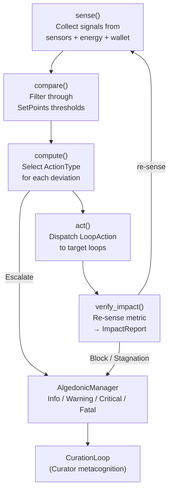
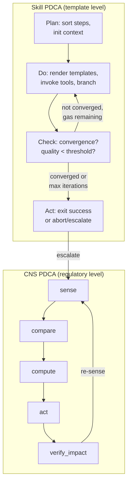
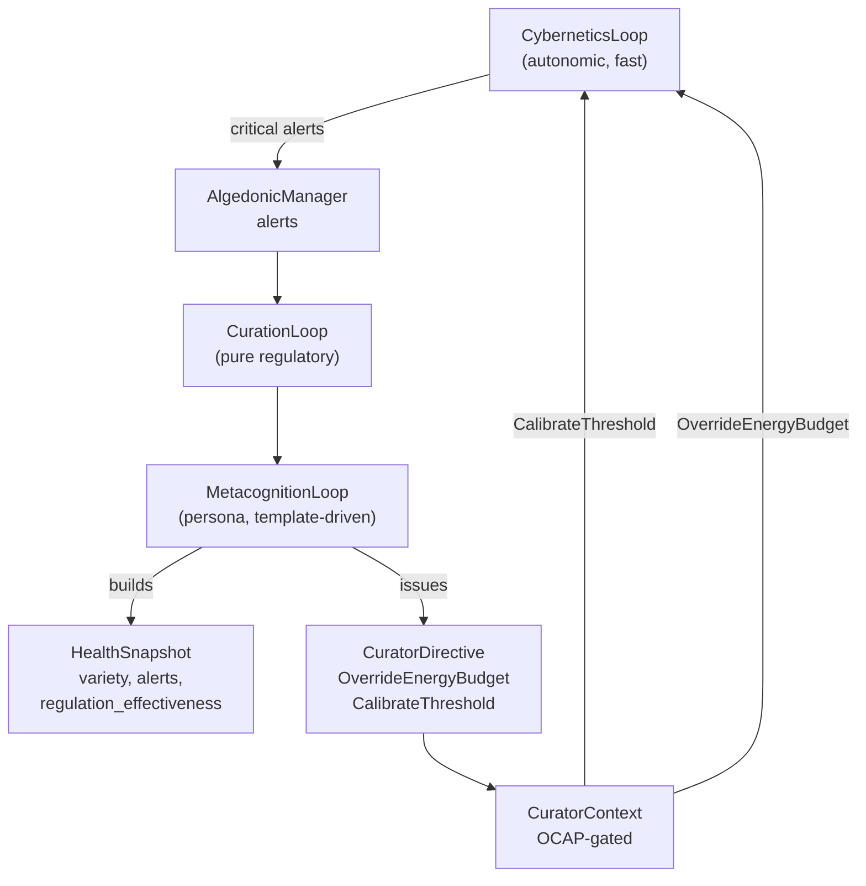
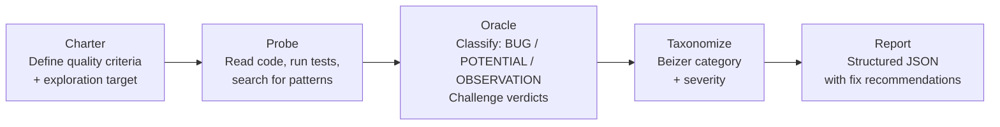
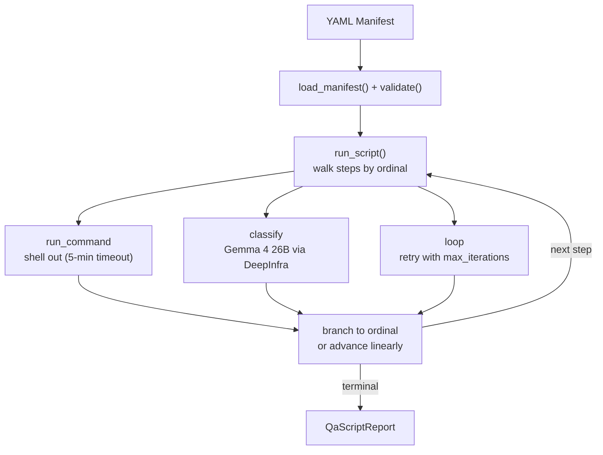
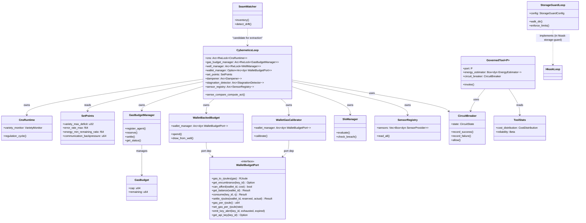
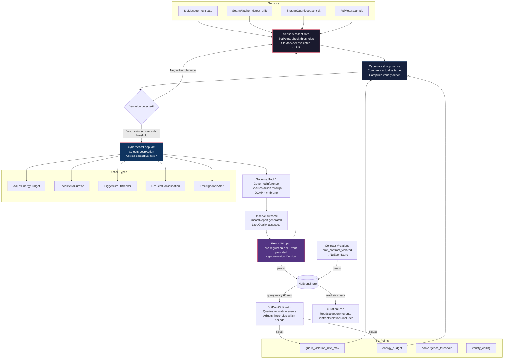
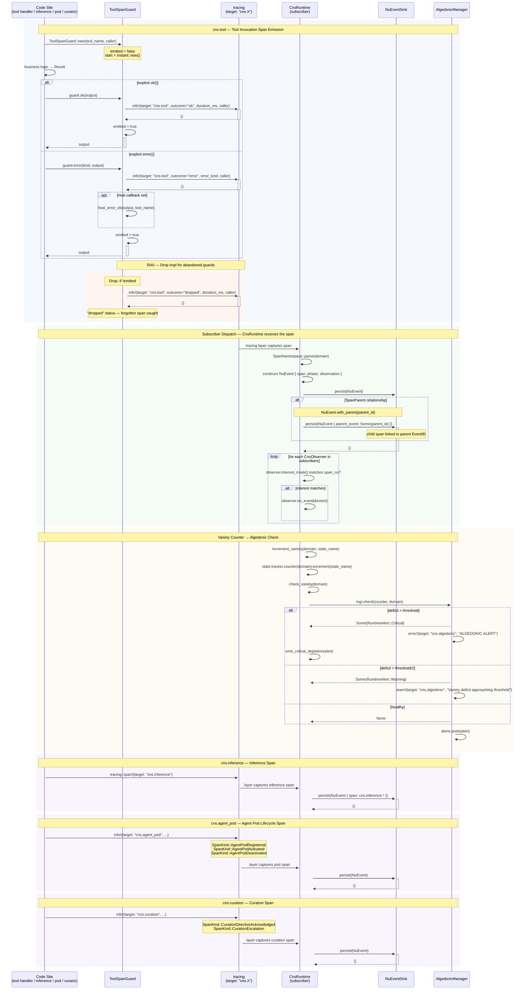
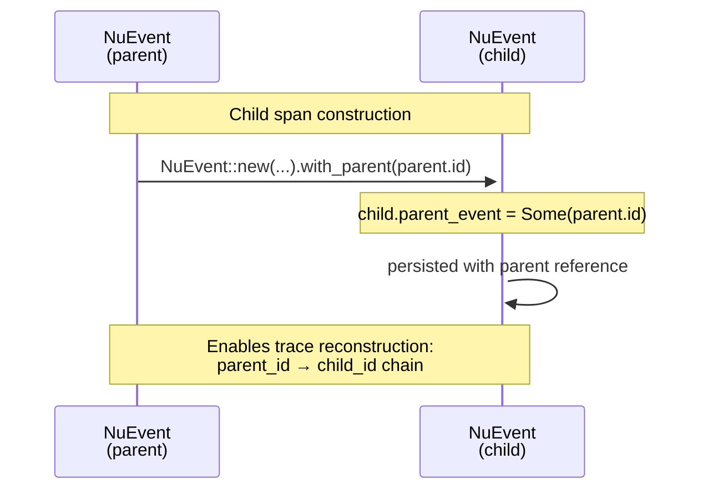
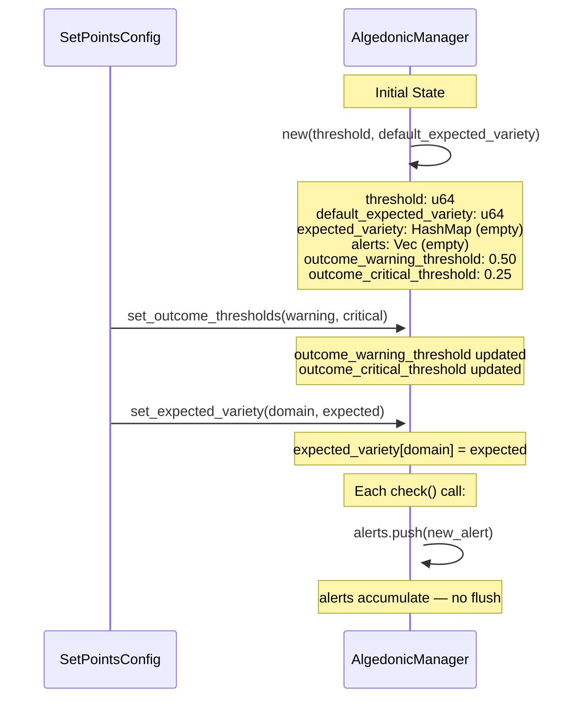

# CNS and Loops

This document consolidates the cybernetic regulation architecture of hKask: the CNS homeostatic loop, the skill PDCA model, the Curator metacognition layer, the bug-hunting observability methodology, and the QA system that operationalizes observability for automated testing. These five topics share a single theme — feedback loops that sense, compare, compute, act, and verify — and are documented together because they form a single regulatory stack from template-level PDCA to system-level cybernetic control.

---

## 1. CNS Homeostatic Loop

### Statement

The CNS (Cybernetic Nervous System) is the component of hKask that other documentation calls "the monitoring system." That label is wrong, and the misconception matters. The CNS is not a monitoring system — it is a **regulatory system**. A monitoring system observes and alerts. A regulatory system senses, compares, computes, acts, and verifies. The CNS does all five.

### Evidence

The CNS is a closed-loop controller implemented as a cybernetic feedback loop. Its core type is `CyberneticsLoop` (`crates/hkask-cns/src/cybernetics_loop.rs`), which implements the `HkaskLoop` trait (`crates/hkask-cns/src/types/loops/loop_trait.rs`). The `HkaskLoop` trait defines a five-phase cycle:

```
sense → compare → compute → act → verify_impact
```

The `tick()` method chains all five phases:

```rust
async fn tick(&self) {
    let signals = self.sense().await;
    let deviations = self.compare(&signals).await;
    let actions = self.compute(&deviations).await;
    self.act(&actions).await;
    let _ = self.verify_impact(&actions).await;
}
```

Each phase is a separate async method, making the regulatory pipeline explicit rather than buried in reactive callbacks. The cycle is triggered by `Scheduled` ticks, `AlertDriven` events, `Manual` directives, or `EventDriven` ν-events — provenance is tracked via `TriggerOrigin` so the CNS can correlate trigger type with regulatory effectiveness.

#### The Sense-Act-Observe Cycle

The regulation cycle begins with **sense**. `CyberneticsLoop::sense()` (`cybernetics_loop.rs:733`) collects signals from multiple sources: per-agent energy ratios from the `GasBudgetManager`, wallet balance ratios, and signals from pluggable `SensorProvider` instances (`EnergyBudgetSensor`, `VarietySensor`, `ToolReliabilitySensor`, `WalletKeyHealthSensor`). The sensor registry pattern means new signal sources can be added without modifying the loop.

Signals are compared against set-points during `compare()` — the default implementation in the `HkaskLoop` trait filters signals through `Deviation::from_signal()`, producing a `DeviationDirection` (`AboveSetPoint` or `BelowSetPoint`) for each metric that exceeds its threshold.

**Compute** (`cybernetics_loop.rs:779`) is where the regulatory logic lives. For each deviation, the loop selects an `ActionType`:

| Deviation | Direction | Action |
|-----------|-----------|--------|
| `EnergyRemaining` | `BelowSetPoint` | `Throttle` or `AdjustEnergyBudget` (depending on `InferenceThrottleMode`) |
| `VarietyDeficit` | `AboveSetPoint` | `Escalate` to Curation |
| `ErrorRate` | `AboveSetPoint` | `CircuitBreak` on Inference |
| `ConnectorLatency` | `AboveSetPoint` | `Throttle` |
| `CommunicationQueueDepth` | `AboveSetPoint` | `Throttle` (backpressure) |
| `WalletBalanceRatio` | `BelowSetPoint` | `Escalate` to Curation (critical if zero) |
| `WalletKeyHealth` | `AboveSetPoint` | `Escalate` (informational) |
| `SeamCoverage` | `BelowSetPoint` | `Escalate` (critical if >5pp drop) |
| `SeamCoverage` | `AboveSetPoint` | `Notify` (positive health signal) |
| `ToolReliability` | `BelowSetPoint` | `Escalate` to Curation |

Each action is wrapped in a `LoopAction` struct that carries a `target` (which loop receives the action), an `action_type`, typed `LoopActionParams` with a required `reason` field, and an optional `metric_name` for impact verification.

The **act** phase dispatches these actions to their target loops, and **verify_impact** (`cybernetics_loop.rs:1354`) re-senses the targeted metric and compares pre- and post-action values, producing an `ImpactReport` with an `ActionDecision` — `Accept`, `Stage`, or `Block`. Actions that are repeatedly `Block`ed are prevented from re-use for that metric.

#### Set Points as Homeostatic Targets

`SetPoints` (`crates/hkask-cns/src/set_points.rs:139`) is the homeostatic reference model. It defines 25 configurable thresholds across four categories:

**Resource set-points:** `gas_min_remaining` (default 0.2), `variety_max_deficit` (100), `error_rate_max` (0.3), `connector_latency_max_secs` (30.0), `communication_backpressure_threshold`.

**Outcome set-points:** `outcome_warning_threshold` (0.50), `outcome_critical_threshold` (0.25) — when the success rate of regulatory actions drops below these thresholds, the CNS escalates.

**Regulation set-points:** `max_iterations` (100) prevents unbounded cascading, `stagnation_thresholds` detect regulatory plateaus (Fermi-inspired early-stopping pattern), `stage_worsening_ratio` (0.05) and `block_worsening_ratio` (0.20) control the three-tier decision gate.

**Consent and guard set-points:** `inference_throttle_mode` controls how throttling decisions are made — `Off` (user manages manually), `Autonomous` (CNS throttles directly, pre-authorized by P2 consent), or `CuratorMediated` (escalate to Curator with fallback timeout). `guard_violation_rate_max` (0.20) triggers when >20% of requests are blocked by content safety.

Set points are loaded from YAML via `SetPointsConfig::load_from_file()` and merged with defaults in `SetPoints::from_config()`. The `validate()` method (`set_points.rs:398`) enforces invariants: `gas_min_remaining` must be in [0, 1], outcome thresholds must not be inverted (warning > critical), `variety_max_deficit` must be positive.

#### Variety Engineering — Why the CNS Exists

The CNS exists because of Ashby's Law of Requisite Variety: a controller must have at least as much variety as the system it regulates. An unsupervised agent system generates unbounded variety — different models, different prompts, different tools, different error modes, different resource states. Without a controller with matching variety, the system drifts toward entropy.

The CNS maintains a `VarietyMonitor` (`crates/hkask-cns/src/runtime.rs:219`) that counts distinct agent states across domains using an exponential moving average (EMA) with a 60-second window. Each domain (Cybernetics, Curation, Inference, Episodic) has its own `VarietyTracker` with a configurable window. The `variety_deficit` is computed as the gap between expected variety and observed variety — when it exceeds `variety_max_deficit` (default 100), the CNS escalates.

#### Action Types and When Each Fires

The `ActionType` enum (`crates/hkask-types/src/loops/actions.rs:195`, re-exported by `hkask-cns`) defines nine action categories:

| ActionType | When it fires | Target |
|-----------|---------------|--------|
| `Throttle` | Energy low, connector latency high, queue depth exceeds backpressure | `Inference` or `Cybernetics` |
| `Escalate` | Variety deficit exceeded, wallet balance low, key unhealthy, seam degraded, tool reliability low | `Curation` |
| `Calibrate` | Thresholds need adjustment based on observed error rates | `Cybernetics` (self-calibration) |
| `CircuitBreak` | Error rate exceeds `error_rate_max` | `Inference` |
| `AdjustEnergyBudget` | Energy low (within set-point bounds, automatic) | `Cybernetics` |
| `OverrideEnergyBudget` | Curation overrides set-point bounds (weaker capability) | `Cybernetics` |
| `ReplenishBudget` | Curator injects gas into an exhausted agent | `Cybernetics` |
| `Notify` | Positive health signals (seam coverage improved, predictive approach warning) | `Curation` |
| `Prune` | Disk space management (StorageGuard Loop 7) | Storage |

The capability hierarchy is deliberate: `AdjustEnergyBudget` and `OverrideEnergyBudget` are distinct because Cybernetics can adjust within its set-point range, but only Curation can override set-points themselves. `ReplenishBudget` is exclusively a Curator capability — the CNS cannot create energy, only redistribute it.

#### Algedonic Escalation

"Algedonic" (from Greek *algos*, pain, and *hedone*, pleasure) describes the mechanism by which the CNS communicates threat levels to the Curator. The `AlgedonicManager` (`crates/hkask-cns/src/algedonic.rs`) classifies alerts by severity:

- **Info:** Positive signals (`Notify` actions, seam coverage improvements)
- **Warning:** Deviations that are correctable autonomously (energy below 20% but above 0%, variety deficit elevated but below critical, tool reliability degraded)
- **Critical:** Deviations requiring Curator intervention (energy at 0%, error rate catastrophic, key completely exhausted, seam coverage drops >5pp)
- **Fatal:** System-level failures requiring human intervention (the CNS itself is unstable)

The escalation pathway is not just a log line. `Critical` alerts flow through `alerts_tx` (`cybernetics_loop.rs:79`) as `CurationInput` messages to the `CurationLoop`. The Curator's metacognition layer (`crates/hkask-agents/src/curator_agent/metacognition.rs`) receives these as structured problem statements — not raw metrics, but curated alerts with context, options, and fallback behaviors.

When the CNS cannot self-correct — when `verify_impact` returns `Block` decisions for repeated actions, or when the `StagnationDetector` (`cybernetics_loop.rs:93`) detects a regulatory plateau — the escalation moves upward: from Cybernetic self-regulation to Curator metacognitive override, and from Curator to human operator if the Curator cannot resolve the issue within its authority bounds.

This is the two-level meta-loop stability guarantee: the CNS stabilizes the domain loops (Inference, Episodic, Semantic); the Curation loop stabilizes the CNS. The CNS may NOT regulate the Curation loop — the authority DAG flows downward, never upward.

### Diagram


<!-- DIAGRAM_ALIGNMENT
id: DIAG-CNS-001
verified_date: 2026-07-12
verified_against: crates/hkask-cns/src/cybernetics_loop.rs, crates/hkask-agents/src/curator_agent/mod.rs
status: VERIFIED
-->

### Implications

The CNS is not a log aggregator or a metrics dashboard. It is a closed-loop controller with the authority to change system behavior — throttling inference, opening circuit breakers, adjusting energy budgets, and escalating to the Curator. The `verify_impact` phase is the meta-feedback loop that prevents the CNS from repeating ineffective actions: when an action is `Block`ed, the substitution ladder tries alternatives, and when all alternatives are exhausted, the plateau escalates to Curation. This is cybernetic regulation in the Conant-Ashby sense — the regulator contains a model of the system (SetPoints, SLOs, ToolStats), compares observations against that model, and acts to close the gap.

---

## 2. Skill PDCA Model

### Statement

Most agent platforms have one concept: a "skill" is a prompt that runs once. hKask distinguishes two layers. Templates (`.j2` Jinja2 files, 273 total) are one-shot prompt executions — what Claude, ChatGPT, and most platforms call a "skill." In hKask, this is raw material. Skills (39 total) are iterative PDCA (Plan-Do-Check-Act) loops that compose multiple templates into autonomous cycles. Where other systems give a prompt, hKask gives a process.

### Evidence

#### The FlowDef Manifest

Every skill is defined by a `manifest.yaml` file located at `registry/templates/{skill-id}/manifest.yaml`. The `SkillLoader` (`crates/hkask-templates/src/skill_loader.rs`) discovers skills from two zones: the private zone (`.agents/skills/`, the author's source of truth) and the public zone (`skills/`, the export surface). It parses YAML front matter from each `SKILL.md`, validates zone-vs-visibility consistency, and infers the skill's domain from its registry manifest template types.

The manifest is deserialized into a `BundleManifest` (`crates/hkask-templates/src/bundle/manifest.rs` and `manifest_loader.rs`):

```rust
pub struct BundleManifest {
    pub id: String,
    pub skills: Vec<BundleSkill>,
    pub steps: Vec<BundleManifestStep>,
    pub convergence: ConvergenceConfig,
    pub gas: BundleGasConfig,
    pub rjoule: RjouleConfig,
    pub error_handling: ErrorHandlingConfig,
    pub ocap: OcapConfig,
    // ...
}
```

Each `BundleManifestStep` declares its `ordinal`, `action` (render, tool_invoke, choice, populate, select, abort, escalate), `template_ref`, `mcp` server target, per-step `gas_cap`, `timeout_seconds`, and optional `condition` gating and `fusion` flag.

#### The Convergence Contract

Convergence is how a skill knows it is done. `ConvergenceConfig` (`crates/hkask-templates/src/bundle/config.rs`) defines the exit conditions:

```rust
pub struct ConvergenceConfig {
    pub threshold: f64,              // Absolute quality threshold
    pub improvement_ratio: f64,      // Minimum proportional improvement
    pub improvement_gate: String,    // "threshold_only" | "both" | "either"
    pub max_iterations: u32,         // Hard iteration cap
    pub min_iterations: u32,         // Minimum before exit allowed
    pub convergence_field: String,   // Context field to read (e.g. "composite")
    pub on_not_reached: String,      // "abort" | "escalate" on max iterations
    pub aggregation: String,         // "none" | "min" | "weighted_avg" | "all_converged"
}
```

Defaults: `threshold = 0.1`, `max_iterations = 3`, `improvement_gate = "threshold_only"`. For a skill to converge, the quality score in `convergence_field` must drop below `threshold` — lower is better, measuring deviation from the target condition. When `improvement_ratio > 0`, the improvement kata engages: `(baseline - current) / baseline >= improvement_ratio`. The `improvement_gate` determines whether both conditions must be met or either suffices. `min_iterations` prevents premature exit — the improvement kata needs at least a few cycles to produce measurable change.

#### The PDCA Loop in Practice

The `ManifestExecutor` (`crates/hkask-templates/src/executor.rs`) implements the loop. Its `execute_manifest()` method:

1. **Plan** — sorts steps by ordinal, reads convergence config, initializes context with `_convergence` metadata (threshold, gas_remaining, rjoule_remaining, iterations_completed).
2. **Do** — enters a `'cascade` loop. Each iteration walks the step list sequentially: render templates (Jinja2 via minijinja), invoke MCP tools, evaluate choice branches, populate context from step outputs, run optional select/evaluate steps.
3. **Check** — after each iteration, `check_convergence()` reads the quality field from context (resolving dot-paths like `"_convergence.quality_at_exit"`), checks against threshold and improvement ratio, and determines whether all convergence conditions are met. For compound skills with multiple sources, `compute_compound_quality()` aggregates across sources using the configured aggregation method.
4. **Act** — if converged, exits with success via `finalize_convergence_report()`. If max iterations reached without convergence, acts per `on_not_reached` — either `abort` (exit with available result) or `escalate` (exit with error for Curator review).

The loop respects gas budgets: `gas_cap` is the total compute cycle allocation, and `gas_cost_per_iteration` is deducted each pass. When gas reaches the `alert_threshold`, a CNS alert fires; when exhausted under `hard_limit`, the loop terminates. Dual currency tracking extends to rJoules: `rjoule_cap` bounds inference energy, and `rjoule_alert_threshold` governs warnings. Tokens consumed by inference calls are tracked via the provider's per-token cost.

#### LoopAction: The CNS Analog

While skills execute PDCA at the template level, CNS loops execute PDCA at the regulatory level. The `Loop` trait (`crates/hkask-cns/src/types/loops/loop_trait.rs`) defines the same sense→compare→compute→act→verify cycle, but for system regulation rather than skill execution:

```rust
pub trait Loop: Send + Sync {
    fn id(&self) -> LoopId;
    async fn sense(&self) -> Vec<Signal>;
    async fn compare(&self, signals: &[Signal]) -> Vec<Deviation>;
    async fn compute(&self, deviations: &[Deviation]) -> Vec<LoopAction>;
    async fn act(&self, actions: &[LoopAction]);
    async fn verify_impact(&self, previous_actions: &[LoopAction]) -> Vec<ImpactReport>;
}
```

Nine `ActionType` variants (`crates/hkask-types/src/loops/actions.rs`) define what a regulatory loop can do: `Throttle`, `Escalate`, `Calibrate`, `CircuitBreak`, `AdjustEnergyBudget`, `OverrideEnergyBudget`, `ReplenishBudget`, `Notify`, `Prune`. The distinction between `AdjustEnergyBudget` (Cybernetics can adjust within set-point bounds) and `OverrideEnergyBudget` (only Curation can exceed set-points) reflects the authority hierarchy in the CNS DAG.

`LoopQuality` measures the loop's own performance — `delay_ms`, `gain` (actions per deviation), `fidelity_score` (deviations matched to actions), and `effectiveness_score` (ratio of Accepted impact reports). These telemetry metrics close the meta-feedback loop: is the regulator itself regulating effectively?

#### Bundle Composition

A Bundle composes multiple Skills but is not itself a PDCA loop. The `BundleManifest` validates composition constraints: at least 2 skills, cascade depth ≤ 7 (the matroshka limit), no divergent and convergent skills in the same cascade phase (P1 violation), and conflict/complementarity declarations that reference valid skill IDs. The bundle orchestrates — it delegates deployment decisions to sub-skills — while skills iterate toward convergence.

### Diagram


<!-- DIAGRAM_ALIGNMENT
id: DIAG-CNS-002
verified_date: 2026-07-12
verified_against: crates/hkask-cns/src/cybernetics_loop.rs, crates/hkask-agents/src/curator_agent/mod.rs
status: VERIFIED
-->

### Implications

The two-layer PDCA structure means that hKask has regulation at every scale. At the template level, skills iterate toward convergence with gas-bounded autonomy. At the system level, the CNS regulates the conditions under which skills run. A skill that cannot converge escalates to the Curator; the Curator's regulation of the CNS ensures that skills have the resources (gas, working tools, stable inference) to converge. This is the cybernetic stack: the skill loop is embedded in the CNS loop, and the CNS loop is embedded in the Curation loop. Each level has its own convergence criteria, its own gas budget, and its own escalation pathway.

---

## 3. Curator Metacognition

### Statement

The Curator is hKask's metacognitive layer — "thinking about thinking." Where the CNS (`CyberneticsLoop`) is the autonomic nervous system — fast, reactive, homeostatic — the Curator is the deliberative cortex. It observes the CNS observing the system, evaluates whether regulation is effective, and intervenes when autonomic responses are not enough. This design exists because cybernetic regulation has a fundamental limitation: a purely reactive system can correct deviations but cannot learn from them. It cannot ask "is our regulation strategy working?" or "should we change how we regulate?" The Curator provides that second-order capability.

### Evidence

The `CuratorAgent` at `crates/hkask-agents/src/curator_agent/mod.rs:44` composes three components:

```text
CuratorAgent
├── curation_loop: Arc<CurationLoop>      // pure regulatory
├── metacognition: Arc<MetacognitionLoop>  // persona: observe & adapt
└── context: Arc<CuratorContext>           // capability-disciplined access
```

The separation between `CurationLoop` (pure regulatory, no persona) and `MetacognitionLoop` (persona layer, template-driven) is deliberate. The Curation Loop reads algedonic signals from the ν-event store and produces directives. The Metacognition Loop observes those signals, builds a `HealthSnapshot`, runs KnowAct templates to produce calibrated assessments, and issues `CuratorDirective`s like `OverrideEnergyBudget` and `CalibrateThreshold`. This separation mirrors the brain's division between fast autonomic responses and slow deliberative reasoning.

#### The CurationLoop: Sense → Classify → Decide → Act

The Curator's core cycle is the `HkaskLoop` trait implementation on `CurationLoop` at `crates/hkask-agents/src/curator/curation_loop.rs:332`. Its phases:

1. **Sense**: Reads algedonic-significant `NuEvent`s from the persistent store using cursor-based review. `last_review_ms` tracks the cursor position; each `sense()` call advances it. Falls back to live CNS reads if no NuEvent store is configured.

2. **Compute**: Maps deviations to regulatory actions. Handles independent consolidation via `try_auto_consolidate()`, called from `act()`.

3. **Act**: Issues directives through `CuratorContext` with DAMPEN filtering — repeated identical directives within `dampen_window_secs` (default 60s) are suppressed, preventing directive storms.

The `MetacognitionLoop::sense()` at `crates/hkask-agents/src/curator_agent/metacognition/hloop_impl.rs:27` reads CNS health, variety counters, alerts, and regulation effectiveness. It builds a `HealthSnapshot` (defined in `config.rs:21`) with:

- `variety_counters: HashMap<SpanNamespace, u64>` — full variety state per domain
- `variety_deficit: u64` — total deficit across all domains
- `critical_alerts: usize` / `total_alerts: usize` — alert counts
- `regulation_effectiveness: f64` — ratio of accepted regulatory actions (0.0–1.0), read from `CnsRuntime::regulation_health()`

This snapshot is published on a `tokio::sync::watch` channel, making it available to other components without polling.

#### Semantic Indexing

The Curator builds a searchable model of system history through the `ConsolidationBridge` referenced in `mod.rs:28`. Episodic memory (private, per-agent experiences) is periodically consolidated into semantic memory (public, shared knowledge). The Curator's three-tier pod architecture — `CuratorPod` owns the `SemanticIndex` aggregating Public hMems from all pods — enables the Curator to query cross-agent knowledge without violating per-pod sovereignty.

The `CuratorSync` polling loop opens source pods read-only, inserts Public hMems into the `SemanticIndex` with cursor tracking, and provides merged-lens semantic recall through `PodContext::recall_semantic()`. This is how the Curator "knows what it knows" — it maintains an indexed, searchable model of all public knowledge across all agents, continuously updated as new experiences are published.

#### Escalation Handling

When the CNS cannot self-correct, the Curator steps in. `EscalationPolicy::check_conditions()` at `crates/hkask-agents/src/curator_agent/metacognition/escalation.rs:80` evaluates three triggers:

- **VarietyDeficit**: Critical if deficit > threshold, Warning if > threshold/2
- **CriticalAlerts**: Critical if alert count ≥ threshold
- **BotFailures**: Critical if failure count ≥ threshold

When alerts are produced, `MetacognitionLoop::act()` at `hloop_impl.rs:137` takes action. Template-driven bot direction: when the LLM produces `restart` or `rebalance` actions, `direct_bot()` sends A2A directives before posting escalation entries. `adjust_budget` actions issue `CuratorDirective::OverrideEnergyBudget` with an LLM-computed budget value. When escalations exceed `max_concurrent_escalations` (default 3), they are batched into `EscalationBatch` and formatted through the `curator/metacognition-escalate.j2` KnowAct template.

The Curator never bypasses OCAP. Every directive is issued through `CuratorContext::issue_directive()`, which verifies `handle.can_write(&DataCategory::Public)` — the Magna Carta Curator Responsibility #1. The Curator can recommend, calibrate, and escalate, but it cannot override sovereignty boundaries.

#### Regulation Effectiveness Tracking

The `verify_impact` phase of the `CyberneticsLoop` produces `ImpactReport` with `ActionDecision::Accept | Stage | Block`. `HealthSnapshot.regulation_effectiveness` at `config.rs:31` tracks the ratio of accepted actions — 1.0 means all regulatory actions were effective, 0.0 means all were blocked or staged.

`StagnationDetector` at `crates/hkask-cns/src/cybernetics_loop.rs:93` tracks repeated ineffectiveness: when the same (metric, action_type) pair fails for `stagnation_threshold` cycles (default 5), it triggers `RegulatoryPlateauDetected` — an escalation to the Curator. Before plateau, substitution ladders are tried: `substitution_after` (default 2 cycles) activates the next action in the ladder. If all alternatives are exhausted, the plateau escalates to Curation.

#### The CAT Communication Posture

`MetacognitionLoop` evaluates Matrix messages through `cat::evaluate()` at `crates/hkask-agents/src/curator_agent/cat.rs:24` — a pure-function engagement gate based on Communication Accommodation Theory. The `convergence_bias` governs: >0.0 speaks when addressed by name, ≥0.7 speaks to any message, =0.0 remains silent.

Before the CAT gate, `condenser/condenser_score_saliency` scores message relevance via ontology graph proximity: persona (charter-anchored), episodic memory (PKO process domain), or semantic memory (DC+BIBO document domain). The score modulates `convergence_bias` — domain-relevant messages pull the agent toward stronger engagement.

#### The Curator's Relationship to Magna Carta

The Curator cannot override P1–P4. This is a first-order architectural invariant. `CuratorContext::issue_directive()` verifies capability before every directive. The Curator operates within `SovereigntyChecker` boundaries — it can only access data categories with explicit consent. It is bound by the same OCAP membranes as every other agent.

The Curator's role is enforcer, not sovereign. It detects Magna Carta violations (`consent_anomaly`, `governance_report` spans), alerts the user, and recommends remediation — but the user decides. The `cns.sovereignty.consent_audited` span records consent audits; the Curator can verify that consent is in place but cannot grant, revoke, or override it.

### Diagram


<!-- DIAGRAM_ALIGNMENT
id: DIAG-CNS-003
verified_date: 2026-07-12
verified_against: crates/hkask-cns/src/cybernetics_loop.rs, crates/hkask-agents/src/curator_agent/mod.rs
status: VERIFIED
-->

### Implications

The Curator's two-loop architecture (CurationLoop + MetacognitionLoop) means that regulation and reasoning are separable. The CurationLoop can run without the MetacognitionLoop — it still processes algedonic signals and issues directives. The MetacognitionLoop adds the persona layer: LLM-driven assessment of whether the CNS's regulation strategy is working, and calibrated recommendations for changing it. This separation means that the Curator can be tested in two modes: pure regulatory (CurationLoop only) and full metacognitive (both loops). The `regulation_effectiveness` metric closes the meta-feedback loop — the Curator observes whether its directives are actually improving regulation, not just whether they are being issued.

---

## 4. Bug Hunting — Observability Methodology

### Statement

Bug hunting in hKask is not ad-hoc debugging. It is a structured expedition methodology grounded in Weinberg's quality definition ("value to some person who matters"), Beizer's bug taxonomy, Bach/Bolton's heuristic test strategy model, and Hendrickson's exploratory testing charters.[^weinberg] The methodology was validated in two real expeditions against `hkask-wallet` (7 findings) and `hkask-cns` (6 findings). Each pattern listed below found actual bugs.

### Evidence

#### The Mindset

Before starting an expedition, the quality criteria must be stated explicitly — whose values are at stake. A bug is not an objective property of code. It is a mismatch between behavior and someone's values. Example quality criteria from real expeditions:

- Wallet expedition: "All wallet operations preserve financial invariants — no double-spend, no negative balances, all deposits credited, all withdrawals debited correctly, encumbrance conservation."
- CNS expedition: "No silent budget overruns, no undetected alert failures, correct hold-settle enforcement."

#### Beizer's Taxonomy

Every bug fits into one of eight categories. This guides where to look:

| Category | What to hunt for | Wallet example | CNS example |
|----------|-----------------|---------------|-------------|
| **requirements** | Missing or wrong specification | — | — |
| **structural** | Control flow, data flow, ownership errors | — | — |
| **data** | Types, boundaries, initialization, persistence | `balance_after: 0` (missing runtime value) | Circuit breaker unknown state |
| **coding** | Implementation logic, error handling, dead code | `let _ = reserved` (dead parameter) | — |
| **interface** | API contracts, parameter validation | Debit non-idempotent (missing contract) | `settle` doesn't check `actual ≤ reserved` |
| **integration** | Component interaction, ordering | — | — |
| **timing** | Concurrency, race conditions, TOCTOU | — | `WalletBackedBudget::reserve` TOCTOU |
| **configuration** | Environment, feature flags, deployment | — | — |

#### Three Bug Tiers

| Tier | Confidence | Criteria |
|------|-----------|----------|
| **BUG** | 0.90–1.00 | Behavior violates a contract, invariant, or documented constraint |
| **POTENTIAL BUG** | 0.60–0.89 | Behavior matches a known pattern but no contract exists to confirm |
| **OBSERVATION** | <0.60 | Suspect behavior, no contract, flag as contract gap |

#### The Hunt Pattern: Five Phases

Every expedition follows: CHARTER → PROBE → ORACLE → TAXONOMIZE → REPORT.

**Charter:** "Explore [target] using [strategy] to discover [quality threat]." Be specific. A charter like "look for bugs" finds nothing. A charter like "trace the credit→debit→settle path checking hold-settle enforcement at each step" finds BUG-1.

**Probe:** Read code. Search for patterns. Run tests. Do not just list patterns — actually use tools. Read real files. Run real commands.

**Oracle:** For each observation, ask: "Is this a bug?" Use the three-tier classification. Challenge own verdicts (grill-me pattern).

**Taxonomize:** Classify into Beizer category. Assign severity. Generate pattern signature.

**Report:** Structured JSON with locations, evidence, and fix recommendations.

#### Probe Strategies (Hendrickson Tours)

| Tour | What to do | When to use |
|------|-----------|------------|
| **Money Trail Tour** | Follow the data flow: where does value enter, where does it leave, what checks exist at each boundary | Financial code, gas budgets, any value-bearing subsystem |
| **Contract Gap Tour** | List every public function. Check which have contracts. Probe the uncontracted ones. | Any public API surface |
| **Hold-Settle Tour** | Find every reserve/allocate/hold pattern. Check that settle always verifies actual ≤ reserved. | Gas budgets, encumbrance systems, resource management |
| **Idempotency Tour** | For every state-changing operation: can it be called twice? What happens? Is the result correct? | Storage operations, payment operations, state transitions |
| **Fail-Safe Tour** | Find every default/fallback/unknown-handler path. Does it fail open or fail closed? Which is correct? | Circuit breakers, error handlers, state machines |
| **Audit Trail Tour** | Follow every transaction record. Is the balance recorded? Can you reconstruct the ledger? | Financial code, state changes, anything that needs traceability |

#### Bug Pattern Catalog

Patterns that actually found bugs in hKask:

**PATTERN: Dead Parameter** — A parameter is accepted but never used. The constraint exists in the API signature but not in the implementation. Found in: `WalletManager::settle_rjoules` — `reserved` parameter discarded, hold-settle broken.

**PATTERN: Hardcoded Sentinel** — A field that should carry runtime state is hardcoded. Found in: `WalletManager::shield_assets` — `balance_after: 0` breaks audit trail.

**PATTERN: Documented Gap** — The test name IS the bug report. The developers know about the gap and documented it as a test. Found in: `wallet/` — credit and debit idempotency gaps.

**PATTERN: Implicit Contract Violation** — The function signature implies a constraint but only partially enforces it. Found in: `GasBudget::settle` — checks `actual ≤ remaining` but not `actual ≤ reserved`.

**PATTERN: Fail-Open Default** — Unknown/unexpected states default to permissive. Found in: `CircuitBreaker::state()` — unknown state defaulted to `Closed` (allow all requests).

**PATTERN: TOCTOU Without Documentation** — Check and use are separated in time. Found in: `WalletBackedBudget::reserve` — TOCTOU between reserve and settle.

#### The Report Format

Every finding follows this structure:

```json
{
  "id": "BUG-001",
  "verdict": "BUG | POTENTIAL_BUG | OBSERVATION",
  "confidence": 0.92,
  "location": {
    "file": "crates/hkask-wallet/src/manager/budget.rs",
    "function": "settle_rjoules",
    "line": 82
  },
  "beizer_category": "coding",
  "severity": "CRITICAL | HIGH | MEDIUM | LOW",
  "summary": "One sentence describing the bug and its impact",
  "evidence": "Code snippet showing the issue",
  "pattern_signature": "How to detect this class of bug elsewhere",
  "fix_suggestion": "Specific code change or 'needs investigation'"
}
```

#### What the Expeditions Taught

| Strategy | Yield | Example |
|----------|-------|---------|
| **Follow the money** | 3 bugs (HIGH, HIGH, MEDIUM) | Traced `credit → debit → settle` path, found broken hold-settle and idempotency gap |
| **Check contract enforcement** | 2 bugs (MEDIUM, MEDIUM) | Found `settle` API under-constrained and `shield_assets` recording wrong balance |
| **Search for documented gaps** | 1 bug (HIGH) | Found explicitly-named tests documenting known idempotency gaps |
| **Audit default behaviors** | 1 fix (MEDIUM) | Found circuit breaker fail-open on unknown states |

Bug density by Beizer category: interface (3) and data (2) and coding (2) were most common. The code was structurally sound (correct state machines, atomic operations) but had gaps at API boundaries (missing validation, under-constrained parameters, non-idempotent operations).

### Diagram


<!-- DIAGRAM_ALIGNMENT
id: DIAG-CNS-004
verified_date: 2026-07-12
verified_against: crates/hkask-cns/src/cybernetics_loop.rs, crates/hkask-agents/src/curator_agent/mod.rs
status: VERIFIED
-->

### Implications

The bug-hunting methodology is itself a feedback loop — the same sense→compare→compute→act→verify cycle as the CNS, applied to code quality. The charter defines the set-points (quality criteria); the probe is the sense phase; the oracle is compare; the taxonomize+report is compute+act. The methodology is designed to compose with hKask's skill ecosystem: `pragmatic-semantics` classifies findings (IS vs OUGHT), `grill-me` challenges HIGH-confidence verdicts, `diagnose` reproduces POTENTIAL_BUG findings, `essentialist` prunes ineffective probe strategies after the expedition. This is not just a testing checklist — it is a cybernetic testing methodology that treats the codebase as a system to be regulated, not a puzzle to be solved.

---

## 5. QA System — Automated Observability

### Statement

The hKask QA system operationalizes the feedback-loop methodology of bug hunting into automated, YAML-defined test manifests. Each manifest executes `cargo test` commands, optionally classifies failures via an LLM, and routes to terminal states based on branch conditions. The QA system is the CNS's testing analog: it senses test outcomes, compares against expected results, computes a classification, and acts by branching to repair or escalation.

### Evidence

The QA system runs through `hkask_test_harness::qa_script::run_script()`. Each manifest is a YAML file following the `QaScriptManifest` schema:

```yaml
manifest:
  id: my-script
  name: My Script
  description: >
    Description.
  editor: system
  visibility: Public

gas:
  cap: 50000
  alert_threshold: 0.8
  hard_limit: true

steps:
  - ordinal: 1
    action: classify
    classifier: qa-triage
    description: "What to classify"
    branching:
      high_confidence: 3
      medium_confidence: 4
      low_confidence: 5
    default_next: 2
    cns_span: cns.qa.my_script.classify_step

  - ordinal: 2
    action: run_command
    command: "cargo test 2>&1"
    description: "Run tests"
    branching:
      success: 4
      failure: 3
```

#### Step Actions

| Action | Description | Required Fields |
|--------|-------------|----------------|
| `classify` | Send passage to LLM classifier, branch on confidence | `classifier`, `description` |
| `run_command` | Execute shell command, branch on exit code | `command` (defaults to `true`) |
| `loop` | Repeat a command or classify until a branch condition matches or max iterations | `max_iterations` (default: 5), `command` or `classifier` |
| *(any other)* | Treated as passthrough — always "success" | — |

#### Branching

Each step can define a `branching` map that routes execution to a target ordinal:

| Outcome | Triggered When |
|---------|---------------|
| `high_confidence` | Classify returned confidence ≥ 0.95 |
| `medium_confidence` | Classify returned confidence 0.70–0.95 |
| `low_confidence` | Classify returned confidence < 0.70 but > 0 |
| `flake` | Classify returned `is_flake: true` |
| `unparseable` | Classify returned non-JSON or confidence = 0 |
| `success` | Shell command exited with code 0 |
| `failure` | Shell command exited with non-zero code |
| `loop_exhausted` | Loop reached `max_iterations` without matching a branch |

If no branch condition matches, `default_next` is used. If neither is set, the script advances to the next ordinal linearly.

#### Classification Service

The classification service (`hkask-services-runtime`) is the decision engine for all QA operations. Classifier configs are stored in `$HKASK_REPLICANT_REGISTRY_PATH/classify/` as YAML files. Each config's `model:` field is intentionally empty — all classifiers defer to the canonical model resolved from `HKASK_CLASSIFIER_MODEL` (default `DI/Qwen/Qwen3-235B-A22B-Instruct-2507`, DeepInfra) with temperature 0.0.

The `ClassifyResponse` struct expected from the LLM:

```json
{
  "confidence": 0.96,
  "is_flake": false,
  "root_cause": "off-by-one error in index calculation at line 42",
  "proposed_fix": "Change `i <= len` to `i < len`",
  "failure_type": "panic"
}
```

#### CNS Integration

QA runs emit CNS spans automatically:

| Span | When Emitted |
|------|-------------|
| `cns.qa.repair_attempted` | Script start |
| `cns.qa.repair_verified` | Successful completion (PASS terminal) |
| `cns.qa.repair_exhausted` | Failure or error (FAIL/WARN/error) |

Spans include `manifest`, `terminal`, `steps`, `gas` fields. This means QA runs are observable through the same CNS infrastructure as all other system operations — the QA system is not a separate observability stack.

#### Executable Manifests

Four manifests are executable via `cargo test` without any API keys:

| Manifest | Tests | Status |
|----------|-------|--------|
| `qa-comm-integration-gate` | 5 | Executable |
| `qa-condenser-health-check` | 11 | Executable |
| `qa-keystore-security-gate` | 16 | Executable |
| `qa-memory-privacy-boundary` | 6 | Executable |

Classify steps gracefully degrade through `classifier_unavailable` when `DI_API_KEY` is not set, routing to the WARN terminal step.

#### Principle Grounding

| Principle | How the QA system satisfies it |
|-----------|-------------------------------|
| **P4** Clear Boundaries | Gas budgets cap LLM costs; `classifier_unavailable` graceful degradation |
| **P5** Essentialism | One module (`qa_script.rs`), one public function (`run_script`) |
| **P8** Semantic Grounding | CNS spans emitted on start/complete/error; classify results carry confidence |
| **P9** Homeostatic Self-Regulation | Branching adapts to test outcomes; gas enforcement prevents runaway |

### Diagram


<!-- DIAGRAM_ALIGNMENT
id: DIAG-CNS-005
verified_date: 2026-07-12
verified_against: crates/hkask-cns/src/cybernetics_loop.rs, crates/hkask-agents/src/curator_agent/mod.rs
status: VERIFIED
-->

### Implications

The QA system is the testing-layer expression of the same PDCA pattern that governs skills and the CNS. A QA manifest is a skill for testing: it has steps, branching, gas budgets, and convergence (terminal states). The LLM classifier adds a cognitive layer — the system does not just detect failures, it diagnoses them, proposes fixes, and routes to repair or escalation based on confidence. The CNS span integration means that QA runs are first-class observability events, visible to the Curator and subject to the same regulation as any other system operation. This closes the testing feedback loop: QA runs produce CNS spans, the CNS observes them, and the Curator can escalate if QA failures indicate systemic quality degradation.

---

## References

[^weinberg]: Weinberg, G. M. (1992). *Quality Software Management, Volume 1: Systems Thinking*. Dorset House. "Quality is value to some person who matters" — the foundational definition underlying the bug-hunting methodology.

- Beizer, B. (1990). *Software Testing Techniques* (2nd ed.). Van Nostrand Reinhold. The eight-category bug taxonomy.
- Bach, J. (2015). Heuristic Test Strategy Model. Satisfice, Inc.
- Hendrickson, E. (2013). *Explore It!: Reduce Risk and Increase Confidence with Exploratory Testing*. Pragmatic Bookshelf. The tour-based exploration methodology.
- Agans, D. J. (2002). *Debugging: The Nine Indispensable Rules*. AMACOM.
- Zeller, A. (2009). *Why Programs Fail: A Guide to Systematic Debugging* (2nd ed.). Morgan Kaufmann.
- Conant, R. C., & Ashby, W. R. (1970). "Every good regulator of a system must be a model of that system." *International Journal of Systems Science*, 1(2), 89–97.
- Beer, S. (1979). *The Heart of Enterprise*. Wiley. Viable System Model (S1–S5).
- Ashby, W. R. (1956). *An Introduction to Cybernetics*. Chapman & Hall. Law of Requisite Variety.
---

## Inlined Diagrams

The following Mermaid diagrams were inlined from the former `docs/diagrams/` directory per DOCUMENTATION_STANDARDS §1.

### CNS Architecture — Responsibility Clusters

*Inlined from `docs/diagrams/class-cns-architecture.md`*


# CNS Architecture — Responsibility Clusters and Coupling

This class diagram maps the internal structure of `hkask-cns` after the StorageGuard extraction and WalletBudgetPort introduction. The CNS crate previously conflated seven distinct responsibilities; two have been addressed:

- **StorageGuard** — extracted to `hkask-storage-guard` crate (2026-07-11)
- **Wallet coupling** — resolved via `WalletBudgetPort` trait in `hkask-ports` (2026-07-11). CNS no longer depends on `hkask-wallet`; it depends on the abstract port.

Remaining responsibility clusters still in CNS:

1. **Core Regulation** — `CyberneticsLoop`, `CnsRuntime`, `SetPoints`, `Dampener`, `StagnationDetector`
2. **Energy/Gas** — `GasBudgetManager`, `GasBudget`, `GasCost`, `GasReport`
3. **Wallet Budget** — `WalletBackedBudget`, `WalletGasCalibrator` (now via `WalletBudgetPort`, not concrete)
4. **SLO** — `SloManager`, `SloDataPoint`, `SloDataProvider` (candidate for extraction)
5. **Seam Watching** — `SeamWatcher`, `SeamDrift`, `SeamSummary` (candidate for extraction)
6. **Spans** — `AcpSpan`, `ClassifySpan`, `ContractSpan`, `InfraSpan`, `QaSpan`, `SloSpan`, `SeamSpan` (candidate for extraction)

See also: [CNS Homeostatic Loop](#cns-homeostatic-loop--mermaid-flowchart) for the sense→compare→compute→act cycle, and [CNS Regulation Pipeline](#cns-regulation-pipeline--5-phase-cybernetic-cycle) for regulation policy dispatch.


<!-- DIAGRAM_ALIGNMENT
id: DIAG-CNS-006
verified_date: 2026-07-12
verified_against: crates/hkask-cns/src/cybernetics_loop.rs, crates/hkask-agents/src/curator_agent/mod.rs
status: VERIFIED
-->

## Coupling Analysis — Current State

| Edge | Type | Status |
|------|------|--------|
| `CyberneticsLoop → WalletBudgetPort` | Port trait (hexagonal) | ✅ Resolved — CNS depends on abstract port, not concrete `WalletManager` |
| `WalletBackedBudget → WalletBudgetPort` | Port trait | ✅ Resolved — uses `Arc<dyn WalletBudgetPort>` |
| `WalletGasCalibrator → WalletBudgetPort` | Port trait | ✅ Resolved — uses `Arc<dyn WalletBudgetPort>` |
| `StorageGuardLoop` | Extracted | ✅ Resolved — now in `hkask-storage-guard` crate |
| `SeamWatcher` in CNS | Wrong crate | ⬜ Candidate for extraction — seam observability is not regulation |
| `SloManager` in CNS | Wrong crate | ⬜ Candidate for extraction — SLO evaluation is independent of the cybernetic loop |

## Completed Extractions

| Step | Extract | Target Crate | Status |
|------|---------|-------------|--------|
| 2a | `StorageGuardLoop` + `StorageGuardConfig` | `hkask-storage-guard` | ✅ Done 2026-07-11 |
| — | `WalletBudgetPort` trait | `hkask-ports` | ✅ Done 2026-07-11 |

## Remaining Extraction Candidates

| Step | Extract | Target | Lines | Independence |
|------|---------|--------|-------|-------------|
| 2b | `SloManager` + `SloDataPoint` + `SloDataProvider` | new slo crate | ~1000 | Depends only on `CnsObserver` port |
| 2c | `SeamWatcher` + `SeamDrift` + `SeamSummary` + `SeamTypes` | new seam crate | ~900 | Fully independent — observability |
| 2d | Span types (`AcpSpan`, `ClassifySpan`, `ContractSpan`, `InfraSpan`, `QaSpan`, `SloSpan`, `SeamSpan`) | new cns-spans crate | ~800 | Depends on `hkask-types::event` |
| 2e | Energy/gas (`GasBudget`, `GasCost`, `GasBudgetManager`, `GasReport`, `DynamicGasTable`) | new energy crate | ~1800 | Depends on `hkask-types` |
| 2f | Estimators (`CalibratedEnergyEstimator`, `CompositeEnergyEstimator`, `TableEnergyEstimator`, `InferenceEstimator`) | new energy-estimators crate | ~1300 | Depends on energy crate |

After extraction, CNS core retains: `CyberneticsLoop`, `CnsRuntime`, `Algedonic`, `Dampener`, `RegulationPolicy`, `GovernedTool`, `GovernedInference`, `SensorProvider`, `SetPoints`, `StrategyEvaluator`, `SystemSimulator`, `ToolStats`, `WalletBackedBudget`, `WalletGasCalibrator` — all cohesive regulation logic.


### CNS Homeostatic Loop

*Inlined from `docs/diagrams/flowchart-cns-homeostatic-loop.md`*


# CNS Homeostatic Loop — Mermaid Flowchart

**Diataxis quadrant:** Explanation  
**Domain ontology tier:** Core  
**Purpose:** Visualize the CNS (Cybernetic Nervous System) homeostatic self-regulation loop — the feedback mechanism by which hKask monitors its own health and takes corrective action.  
**Verified against:** `crates/hkask-cns/src/cybernetics_loop.rs`, `crates/hkask-cns/src/runtime.rs`  
last-verified-against: "3d1a876f45e3ce64864c3453f1e71d75b2f14376"

> **v0.32.0 update:** Added `SetPointCalibrator` (self-tuning regulation thresholds via NuEventStore replay) and contract violation path to CurationLoop.


<!-- DIAGRAM_ALIGNMENT
id: DIAG-CNS-007
verified_date: 2026-07-12
verified_against: crates/hkask-cns/src/cybernetics_loop.rs, crates/hkask-agents/src/curator_agent/mod.rs
status: VERIFIED
-->

**Node-to-code mapping:**

| Diagram Node | Source Location |
|-------------|----------------|
| CyberneticsLoop::sense | `crates/hkask-cns/src/cybernetics_loop.rs` |
| CyberneticsLoop::act | `crates/hkask-cns/src/cybernetics_loop.rs` |
| GovernedTool membrane | `crates/hkask-cns/src/governed_tool.rs` |
| SloManager::evaluate | `crates/hkask-cns/src/slo_manager.rs` |
| SeamWatcher | `crates/hkask-cns/src/seam_watcher.rs` |
| StorageGuardLoop | `crates/hkask-storage-guard/src/lib.rs` |
| SetPoints | `crates/hkask-cns/src/set_points.rs` |
| SetPointCalibrator | `crates/hkask-cns/src/set_point_calibrator.rs` |
| ObservableSpan trait | `crates/hkask-types/src/observable_span.rs` |
| LoopAction enum | `crates/hkask-types/src/loops/actions.rs` |
| ImpactReport | `crates/hkask-types/src/loops/core.rs` |
| Algedonic escalation | `crates/hkask-cns/src/runtime.rs` |
| CurationLoop | `crates/hkask-agents/src/curator/curation_loop.rs` |
| Contract events | `crates/hkask-cns/src/contract_events.rs` |
| NuEventStore | `crates/hkask-storage/src/nu_event_store.rs` |

**Cardinality:** 1 CyberneticsLoop runs per AgentService instance. N SetPoints are configured (4 shown). M Sensors feed into the loop. 5 LoopAction types exist in the current codebase (verified against `ActionType` enum).


### CNS Regulation Pipeline — 5-Phase Cybernetic Cycle

*Inlined from `docs/diagrams/flowchart-cns-regulation.md`*


# CNS Regulation Pipeline — 5-Phase Cybernetic Cycle

**Diataxis quadrant:** Reference
**Domain ontology tier:** Core
**Purpose:** Visualize the closed-loop regulation pipeline of the CNS Cybernetics
Loop: Sense → Compare → Compute → Act → Verify. Covers all 9 signal-metric
decision paths in `compute()`, the substitution ladder for repeatedly
ineffective actions, the 3-tier ActionDecision gate, and stagnation detection
leading to RegulatoryPlateau escalation.

Cross-linked from: [`hKask-architecture-master.md`](../architecture/core/hKask-architecture-master.md)

The diagram below shows the full regulation cycle. Each phase maps to a
`Loop` trait method (or `CyberneticsLoop` override). Signal metrics flow
through deviation detection, per-metric compute rules, action substitution,
dispatch, and impact verification with plateau detection.

```mermaid
flowchart TD
    %% ═══════════════════════════════════════════════════
    %% Phase 1: SENSE
    %% ═══════════════════════════════════════════════════
    subgraph "Phase 1 — Sense"
        S1[Process directive inbox]
        S2[Read wallet balance ratios]
        S3[Poll pluggable sensors via registry]
        S4[Feed values to predictive simulator]
        S5([Cycle start: tick() triggered])
        SIGS[(Signal buffer)]
    end

    %% ═══════════════════════════════════════════════════
    %% Phase 2: COMPARE
    %% ═══════════════════════════════════════════════════
    subgraph "Phase 2 — Compare"
        C1[Match each signal against set-point]
        C2{Deviation detected?<br/>AboveSetPoint or BelowSetPoint}
    end

    %% ═══════════════════════════════════════════════════
    %% Phase 3: COMPUTE
    %% ═══════════════════════════════════════════════════
    subgraph "Phase 3 — Compute (per-metric decision)"

        %% Predictive regulation (pre-deviation)
        subgraph "Predictive Gate"
            PR1{Approaching set-point<br/>in ≤ 3 ticks?}
            PR2[Emit Notify to Curation<br/>with trend projection]
        end

        %% Per-metric decision matrix
        subgraph "Per-Metric Decision Paths"
            ER{EnergyRemaining<br/>below set-point?}
            ER_MODE{InferenceThrottleMode?}
            ER_OFF[Log: throttle disabled]
            ER_AUTO[Pre-authorized autonomous<br/>Throttle → Inference loop]
            ER_CUR[Escalate to Curation<br/>with budget options<br/>fallback: gentle throttle]
            ER_ADJ[AdjustEnergyBudget<br/>unless mode is Off]

            VD{VarietyDeficit<br/>above set-point?}
            VD_ACT[Escalate to Curation]

            ERR{ErrorRate<br/>above set-point?}
            ERR_ACT[CircuitBreak → Inference loop]

            CL{ConnectorLatency<br/>above set-point?}
            CL_ACT[Throttle → Cybernetics loop]

            CQD{CommunicationQueueDepth<br/>above set-point?}
            CQD_ACT[Throttle → Cybernetics loop]

            WBR{WalletBalanceRatio<br/>below set-point?}
            WBR_SEV{Balance = 0?}
            WBR_CRIT[Escalate: critical severity]
            WBR_WARN[Escalate: warning severity]

            WKH{WalletKeyHealth<br/>above set-point?}
            WKH_ACT[Escalate to Curation<br/>informational]

            SC{SeamCoverage?}
            SC_DIR{Direction?}
            SC_DOWN{Drop magnitude > 5pp?}
            SC_CRIT[Escalate: critical severity]
            SC_WARN[Escalate: warning severity]
            SC_UP[Notify: positive health signal]

            TR{ToolReliability<br/>below set-point?}
            TR_ACT[Escalate to Curation]
        end

        %% Substitution Ladder
        subgraph "Substitution Ladder"
            SL{ineffective_count ≥<br/>substitution_after?}
            SL_WALK[Walk metric's substitution ladder<br/>custom → default]
            SL_FOUND{Alternate action<br/>with count = 0?}
            SL_EMIT[Emit ActionSubstituted span<br/>return alternate ActionType]
            SL_FALLBACK[All alternatives exhausted<br/>return proposed action]
        end
    end

    %% ═══════════════════════════════════════════════════
    %% Phase 4: ACT
    %% ═══════════════════════════════════════════════════
    subgraph "Phase 4 — Act"
        A1[Route LoopAction to target loop]
        A2[Persist regulation span<br/>to NuEventStore]
        A3[Emit algedonic alerts<br/>to Curation inbox]
    end

    %% ═══════════════════════════════════════════════════
    %% Phase 5: VERIFY
    %% ═══════════════════════════════════════════════════
    subgraph "Phase 5 — Verify"
        V1[Re-sense metric post-action<br/>gas budget / variety deficit]
        V2[Compute delta: after − before]
        V3{Improved?}
        V4[classify_decision: worsening<br/>vs stage/block ratios]
        V5{Decision?}
        V_ACCEPT[Accept: within noise tolerance<br/>counter reset]
        V_STAGE[Stage: moderate worsening<br/>5%–20%, escalate as Warning]
        V_BLOCK[Block: severe worsening ≥ 20%<br/>emit ActionBlocked span<br/>+ Critical alert to Curation]

        subgraph "Stagnation Detection"
            SD1[record_and_check:<br/>metric + action_type pair]
            SD2{Threshold reached?<br/>default 5 cycles}
            SD3[Emit RegulatoryPlateau span<br/>+ Warning alert to Curation]
        end

        V6[Emit ImpactVerified span<br/>update LoopQuality]
        V7[Compute effectiveness_score<br/>from accept/stage/block ratio]
    end

    %% ═══════════════════════════════════════════════════
    %% Edges: SENSE → COMPARE
    %% ═══════════════════════════════════════════════════
    S5 --> S1
    S1 --> S2
    S2 --> S3
    S3 --> S4
    S4 --> SIGS
    SIGS --> C1

    %% ═══════════════════════════════════════════════════
    %% Edges: COMPARE → COMPUTE
    %% ═══════════════════════════════════════════════════
    C1 --> C2
    C2 -->|"Yes"| PR1
    C2 -->|"No"| S5

    %% Predictive gate
    PR1 -->|"Yes"| PR2
    PR1 -->|"No"| ER
    PR2 --> A1

    %% EnergyRemaining decision chain
    ER -->|"Yes"| ER_MODE
    ER -->|"No"| VD
    ER_MODE -->|"Off"| ER_OFF
    ER_MODE -->|"Autonomous"| ER_AUTO
    ER_MODE -->|"CuratorMediated"| ER_CUR
    ER_OFF --> A1
    ER_AUTO --> SL
    ER_CUR --> A1
    ER_AUTO --> ER_ADJ
    ER_CUR --> ER_ADJ
    ER_ADJ --> SL

    %% VarietyDeficit
    VD -->|"Yes"| VD_ACT
    VD -->|"No"| ERR
    VD_ACT --> SL

    %% ErrorRate
    ERR -->|"Yes"| ERR_ACT
    ERR -->|"No"| CL
    ERR_ACT --> SL

    %% ConnectorLatency
    CL -->|"Yes"| CL_ACT
    CL -->|"No"| CQD
    CL_ACT --> SL

    %% CommunicationQueueDepth
    CQD -->|"Yes"| CQD_ACT
    CQD -->|"No"| WBR
    CQD_ACT --> SL

    %% WalletBalanceRatio
    WBR -->|"Yes"| WBR_SEV
    WBR -->|"No"| WKH
    WBR_SEV -->|"Yes"| WBR_CRIT
    WBR_SEV -->|"No"| WBR_WARN
    WBR_CRIT --> SL
    WBR_WARN --> SL

    %% WalletKeyHealth
    WKH -->|"Yes"| WKH_ACT
    WKH -->|"No"| SC
    WKH_ACT --> A1

    %% SeamCoverage (two directions)
    SC -->|"BelowSetPoint"| SC_DIR
    SC -->|"AboveSetPoint"| SC_UP
    SC_DIR --> SC_DOWN
    SC_DOWN -->|"Yes"| SC_CRIT
    SC_DOWN -->|"No"| SC_WARN
    SC_CRIT --> A1
    SC_WARN --> A1
    SC_UP --> A1

    %% ToolReliability
    TR -->|"Yes"| TR_ACT
    TR -->|"No"| A1
    TR_ACT --> SL

    %% Substitution ladder
    SL -->|"Yes"| SL_WALK
    SL -->|"No (return proposed)"| A1
    SL_WALK --> SL_FOUND
    SL_FOUND -->|"Yes"| SL_EMIT
    SL_FOUND -->|"No"| SL_FALLBACK
    SL_EMIT --> A1
    SL_FALLBACK --> A1

    %% ═══════════════════════════════════════════════════
    %% Edges: COMPUTE → ACT
    %% ═══════════════════════════════════════════════════
    A1 --> A2
    A2 --> A3
    A3 --> V1

    %% ═══════════════════════════════════════════════════
    %% Edges: ACT → VERIFY
    %% ═══════════════════════════════════════════════════
    V1 --> V2
    V2 --> V3
    V3 -->|"Yes"| V4
    V3 -->|"No"| V4
    V4 --> V5
    V5 -->|"Accept"| V_ACCEPT
    V5 -->|"Stage"| V_STAGE
    V5 -->|"Block"| V_BLOCK
    V_ACCEPT --> SD1
    V_STAGE --> SD1
    V_BLOCK --> SD1

    %% Stagnation detection
    SD1 --> SD2
    SD2 -->|"Yes"| SD3
    SD2 -->|"No"| V6
    SD3 --> V6

    %% Impact span + LoopQuality
    V6 --> V7
    V7 --> S5

    %% ═══════════════════════════════════════════════════
    %% Data stores
    %% ═══════════════════════════════════════════════════
    STORE[(NuEventStore)]
    A2 -->|"persist"| STORE
    SD3 -->|"persist"| STORE
    V_BLOCK -->|"persist"| STORE
    A3 -->|"live channel"| CUR[(Curation inbox)]
```
<!-- DIAGRAM_ALIGNMENT
id: DIAG-CNS-008
verified_date: 2026-07-12
verified_against: crates/hkask-cns/src/cybernetics_loop.rs, crates/hkask-agents/src/curator_agent/mod.rs
status: VERIFIED
-->

**Node-to-code mapping:**

| Diagram Node | Source Location |
|---|---|
| Sense phase | `cybernetics_loop.rs:734-778` (`sense()`) |
| SignalMetric enum (all 22 variants) | `types/loops/signals.rs:12-96` |
| Compare phase | `crates/hkask-types/src/loops/core.rs:53-56` (`compare()`) |
| Predictive gate | `cybernetics_loop.rs:784-821` |
| EnergyRemaining / InferenceThrottleMode | `cybernetics_loop.rs:825-902` |
| VarietyDeficit / Escalate | `cybernetics_loop.rs:905-919` |
| ErrorRate / CircuitBreak | `cybernetics_loop.rs:920-932` |
| ConnectorLatency / Throttle | `cybernetics_loop.rs:933-947` |
| CommunicationQueueDepth / Throttle | `cybernetics_loop.rs:948-963` |
| WalletBalanceRatio / Escalate | `cybernetics_loop.rs:964-985` |
| WalletKeyHealth / Escalate | `cybernetics_loop.rs:986-999` |
| SeamCoverage (both directions) | `cybernetics_loop.rs:1000-1059` |
| ToolReliability / Escalate | `cybernetics_loop.rs:1061-1082` |
| try_substitute (substitution ladder) | `cybernetics_loop.rs:261-327` |
| default_substitution_ladder | `cybernetics_loop.rs:1762-1777` |
| Act phase | `crates/hkask-types/src/loops/core.rs:62` (`act()`) |
| Verify phase / verify_impact | `cybernetics_loop.rs:1348-1550` |
| classify_decision (Accept/Stage/Block) | `cybernetics_loop.rs:1742-1760` |
| ActionDecision enum | `crates/hkask-types/src/loops/core.rs:159-168` |
| ImpactReport struct | `crates/hkask-types/src/loops/core.rs:98-147` |
| StagnationDetector | `dampener.rs:200-289` |
| RegulatoryPlateau alert emission | `cybernetics_loop.rs:1465-1501` |
| ActionType enum (all 9 variants) | `crates/hkask-types/src/loops/actions.rs:195-227` |
| LoopQuality / effectiveness_score | `crates/hkask-types/src/loops/core.rs:278-286` |

**Substitution ladders (per metric):**

| Metric | Ladder (ordered) |
|---|---|
| EnergyRemaining | Throttle → AdjustEnergyBudget → Escalate |
| VarietyDeficit | Escalate → Calibrate → OverrideEnergyBudget |
| ErrorRate | CircuitBreak → Calibrate → Escalate |
| ConnectorLatency | Throttle → Calibrate → Escalate |
| CommunicationQueueDepth | Throttle → Escalate |
| All others | Empty — escalate on plateau |

**ActionDecision thresholds (classify_decision, line 1748):**

| Gate | Condition | Effect |
|---|---|---|
| Accept | worsening < `stage_worsening_ratio` (5%) | OK, counter reset |
| Stage | 5% ≤ worsening < `block_worsening_ratio` (20%) | Warning, counter increments |
| Block | worsening ≥ 20% | Critical alert, action blocked from re-use |

**Cardinality:** 1 CyberneticsLoop per AgentService. 9 signal metrics have
explicit decision paths in `compute()`. 5 metrics have non-empty substitution
ladders. Default stagnation threshold: 5 consecutive ineffective cycles.


### CNS Span Emission — 4-Namespace Sequence

*Inlined from `docs/diagrams/sequence-cns-span-emission.md`*


# CNS Span Emission — 4-Namespace Sequence

## Description

The CNS (Cybernetic Nervous System) emits structured spans across four canonical namespaces — `cns.tool`, `cns.inference`, `cns.agent_pod`, and `cns.curation` — using `tracing::info!(target: "cns.X")` as the emission surface. The `CnsRuntime` subscriber layer collects these spans, constructs `NuEvent` records with `SpanParent` relationships for child spans, persists them through the `NuEventSink`, and routes algedonic signals to the `AlgedonicManager`. The `ToolSpanGuard` RAII guard ensures every tool invocation emits a span: explicit `ok()`/`error()` calls emit the appropriate status, and the `Drop` implementation catches forgotten spans with a `"dropped"` outcome.

**Key source:** `crates/hkask-mcp/src/server/tool_span.rs:18-189` (`ToolSpanGuard`), `crates/hkask-cns/src/runtime.rs:540-615` (`increment_variety`, `check_variety`), `crates/hkask-types/src/event.rs:16-93` (`NuEvent`, `parent_event`), `crates/hkask-types/src/event.rs:370-429` (`SpanKind`, namespace mappings).

### Span Namespace Model

| Namespace | SpanKinds | Subscriber Interest |
|-----------|-----------|---------------------|
| `cns.tool` | `Invoked`, `Completed`, `Error`, `dropped` | GovernedTool, CyberneticsLoop |
| `cns.inference` | inference spans (via `tracing::span!`) | InferenceAdapter |
| `cns.agent_pod` | `Registered`, `Activated`, `Deactivated` | PodManager |
| `cns.curation` | `DirectiveAcknowledged`, `Escalation` | CuratorAgent |


<!-- DIAGRAM_ALIGNMENT
id: DIAG-CNS-009
verified_date: 2026-07-12
verified_against: crates/hkask-cns/src/cybernetics_loop.rs, crates/hkask-agents/src/curator_agent/mod.rs
status: VERIFIED
-->

## SpanParent Relationship Model


<!-- DIAGRAM_ALIGNMENT
id: DIAG-CNS-010
verified_date: 2026-07-12
verified_against: crates/hkask-cns/src/cybernetics_loop.rs, crates/hkask-agents/src/curator_agent/mod.rs
status: VERIFIED
-->

## ToolSpanGuard Drop Behavior

| Method | `emitted` | Outcome in trace | Callbacks Fired |
|--------|-----------|------------------|-----------------|
| `guard.ok(output)` | `true` | `"ok"` | `experience_cb("success")` |
| `guard.error(kind, output)` | `true` | `"error"` | `heal_error_cb` + `experience_cb("error")` |
| `guard.finish(Result)` | `true` | `"ok"` / `"error"` | Context-dependent |
| **No explicit call → `Drop`** | `false` | `"dropped"` | None |

The `Drop` impl enforces that a span is always emitted — even if the code path panics, returns early, or the developer forgets to call `ok()`/`error()`. The `"dropped"` outcome is an observability signal: it tells the CNS that a tool execution began but never reached a terminal state.

---

  crates/hkask-types/src/event.rs:16-93 (NuEvent, parent_event, with_parent builder),
  crates/hkask-types/src/event.rs:105-157 (CANONICAL_NAMESPACES),
  crates/hkask-types/src/event.rs:320-429 (Span, SpanKind, namespace_and_path),
  crates/hkask-cns/src/algedonic.rs:139-296 (AlgedonicManager, check)
status: VERIFIED
-->

## Cross-Reference

| Reference | Description |
|-----------|-------------|
| [`ToolSpanGuard`](crates/hkask-mcp/src/server/tool_span.rs:18-189) | RAII span guard with `ok()`, `error()`, `Drop` for forgotten spans |
| [`CnsRuntime`](crates/hkask-cns/src/runtime.rs:294-299) | CNS runtime with subscribers and algedonic manager |
| [`NuEvent`](crates/hkask-types/src/event.rs:16-93) | CNS event with `parent_event` for span parent relationships |
| [`SpanKind`](crates/hkask-types/src/event.rs:370-429) | Typed span kind enum with canonical namespace/path mapping |
| [`CANONICAL_NAMESPACES`](crates/hkask-types/src/event.rs:105-157) | All valid CNS span namespaces |
| [`AlgedonicManager`](crates/hkask-cns/src/algedonic.rs:139-296) | Alert manager with variety deficit checking |
| [PRINCIPLES.md §P9](docs/architecture/core/PRINCIPLES.md) | Homeostatic Self-Regulation |
| Algedonic escalation sequence (inlined below) | Algedonic escalation flow (DIAG-TO-005) |


### Algedonic Escalation — Variety Deficit → RuntimeAlert

*Inlined from `docs/diagrams/sequence-algedonic-escalation.md`*


# Algedonic Escalation Sequence

## Description

The Algedonic loop enforces Ashby's Law of Requisite Variety through binary threshold monitoring. The `VarietyTracker` measures state diversity per domain via an exponential moving average (EMA). When the `AlgedonicManager.check()` method detects a deficit exceeding the configured threshold, it generates a `RuntimeAlert` with one of three severities — Info, Warning, or Critical. Critical alerts are automatically escalated (`escalated = true`) and flow through the `CurationLoop` to the `CuratorAgent`, which decides between automatic recalibration (adjusting the threshold via `calibrate_threshold()`) or human escalation. A cooldown `Dampener` prevents alert storms. The `CircuitBreaker` integrates with the algedonic manager for external service failure handling via `check_outcome()`.

**Key source:** `crates/hkask-cns/src/algedonic.rs:26-307` (`AlertSeverity`, `RuntimeAlert`, `AlgedonicManager`), `crates/hkask-cns/src/runtime.rs:52-106` (`VarietyTracker`), `crates/hkask-cns/src/runtime.rs:191-255` (`VarietyMonitor`), `crates/hkask-cns/src/runtime.rs:822-858` (`evaluate_and_escalate_slos`).

### Alert Severity Thresholds

| Severity | Condition | `escalated` Flag | Action |
|----------|-----------|-----------------|--------|
| `Info` | `deficit ≤ threshold / 2` | `false` | No action — logged only |
| `Warning` | `deficit > threshold / 2 && deficit ≤ threshold` | `false` | `warn!()` CNS log — Curator notified |
| `Critical` | `deficit > threshold` | `true` | `error!()` CNS log → CurationLoop escalation |

### Outcome Quality Thresholds

| Severity | Success Rate | Default Threshold |
|----------|-------------|-------------------|
| `Warning` | `< outcome_warning_threshold` | 0.50 (configurable via SetPointsConfig) |
| `Critical` | `< outcome_critical_threshold` | 0.25 (configurable via SetPointsConfig) |

```mermaid
sequenceDiagram
    participant VT as VarietyTracker
    participant AM as AlgedonicManager
    participant CNS as CnsRuntime
    participant CL as CurationLoop
    participant CA as CuratorAgent
    participant Damp as Dampener
    participant CB as CircuitBreaker
    participant Ext as External Service

    rect rgb(245, 248, 252)
        Note over VT,CNS: Variety Monitoring — diversity deficit detection

        loop each tool call / agent activation
            VT->>+VT: increment(state_name)
            Note over VT: count++<br/>EMA: ema = α×count + (1-α)×ema
        end

        VT->>+VT: deficit(expected)
        Note over VT: deficit = expected_variety - variety_ema

        AM->>+AM: check(counter, domain)
        AM->>+AM: expected = expected_variety[domain]<br/>or default_expected_variety
        AM->>+AM: deficit = counter.deficit(expected)
        AM->>+AM: RuntimeAlert::new(domain, deficit, threshold)
    end

    rect rgb(240, 255, 240)
        Note over AM,CL: INFO — deficit ≤ threshold/2 (healthy)

        alt deficit ≤ threshold/2
            AM->>+AM: severity = AlertSeverity::Info
            Note over AM: escalated = false<br/>No log emitted
            AM->>+AM: alerts.push(alert)
        end
    end

    rect rgb(255, 252, 240)
        Note over AM,CL: WARNING — deficit within threshold band

        alt deficit > threshold/2 AND deficit ≤ threshold
            AM->>+AM: severity = AlertSeverity::Warning
            Note over AM: escalated = false
            AM->>+AM: warn!(target: "cns.algedonic", "Variety deficit approaching threshold")
            AM->>+AM: alerts.push(alert)
            AM-->>-CNS: Some(RuntimeAlert::Warning)
        end
    end

    rect rgb(255, 240, 240)
        Note over AM,CL: CRITICAL — deficit > threshold (escalation required)

        alt deficit > threshold
            AM->>+AM: severity = AlertSeverity::Critical
            AM->>+AM: escalated = true
            AM->>+AM: error!(target: "cns.algedonic", "ALGEDONIC ALERT - Escalation required")
            AM->>+AM: alerts.push(alert)
            AM-->>-CNS: Some(RuntimeAlert::Critical)

            CNS->>+CNS: emit_critical_depletion(alert)
            Note over CNS: NuEvent emitted with<br/>SpanKind::VarietyAlgedonicAlert<br/>(cns.variety.algedonic_alert)
        end
    end

    rect rgb(255, 248, 240)
        Note over AM,CB: Outcome Quality Check — CircuitBreaker integration

        CB->>+CB: record_failure(error_kind)
        CB->>+CB: record_success()

        CNS->>+AM: check_outcome(domain, success_rate, total_ops)

        alt success_rate < outcome_critical_threshold
            AM->>+AM: severity = Critical
            AM->>+AM: error!(target: "cns.outcome", "OUTCOME ALERT - Critical failure rate")
            AM->>+AM: alerts.push(alert)
            CB->>+CB: circuit OPEN — stop all calls to External Service
            Note over Ext: External service calls blocked
        else success_rate < outcome_warning_threshold
            AM->>+AM: severity = Warning
            AM->>+AM: warn!(target: "cns.outcome", "Outcome success rate degraded")
            AM->>+AM: alerts.push(alert)
            Note over CB: circuit HALF-OPEN — throttle
        else success_rate ≥ outcome_warning_threshold
            AM-->>-CNS: None (healthy)
            CB->>+CB: circuit CLOSED — normal operation
        end
    end

    rect rgb(248, 245, 255)
        Note over AM,CA: Dampener — Alert Cooldown Override

        CNS->>+CL: runtime_alert propagated
        CL->>+Damp: check_cooldown(domain)

        alt within cooldown window
            Damp-->>-CL: cooldown active — suppress duplicate alert
            Note over CL: Alert dropped —<br/>same domain already escalated recently
        else cooldown expired
            Damp-->>-CL: cooldown clear — allow escalation
            CL->>+CA: forward RuntimeAlert
            Note over CA: alert.deficit, alert.threshold, alert.domain
        end
    end

    rect rgb(245, 252, 245)
        Note over CA,AM: CuratorAgent Decision — Two Paths

        CA->>+CA: evaluate alert severity & domain

        alt Automatic Recalibration
            Note over CA: Curator decides threshold<br/>was too aggressive
            CA->>+CNS: calibrate_threshold(domain, new_threshold)
            CNS->>+AM: set_expected_variety(domain, new_threshold)
            AM-->>-CNS: threshold updated
            Note over AM: expected_variety[domain] = new_threshold<br/>Alert resolved via homeostatic adjustment
        else Human Escalation
            Note over CA: Curator decides situation<br/>requires human judgment
            CA->>+CA: emit CurationEscalation span
            Note over CA: cns.curation.escalation<br/>SpanKind::CurationEscalation
            CA->>+CA: notify human curator
        end
    end
```
<!-- DIAGRAM_ALIGNMENT
id: DIAG-CNS-011
verified_date: 2026-07-12
verified_against: crates/hkask-cns/src/cybernetics_loop.rs, crates/hkask-agents/src/curator_agent/mod.rs
status: VERIFIED
-->

## AlgedonicManager Internal State


<!-- DIAGRAM_ALIGNMENT
id: DIAG-CNS-012
verified_date: 2026-07-12
verified_against: crates/hkask-cns/src/cybernetics_loop.rs, crates/hkask-agents/src/curator_agent/mod.rs
status: VERIFIED
-->

## Alert Lifecycle Summary

| Phase | Actor | Action |
|-------|-------|--------|
| 1. Measure | `VarietyTracker` | Increment counter, compute EMA, calculate deficit |
| 2. Classify | `AlgedonicManager` | `RuntimeAlert::new()` — binary threshold → Info/Warning/Critical |
| 3. Emit CNS | `CnsRuntime` | `emit_critical_depletion()` for Critical alerts |
| 4. Cooldown Gate | `Dampener` | Suppress duplicate alerts within cooldown window |
| 5. Route | `CurationLoop` | Forward to `CuratorAgent` |
| 6a. Auto-fix | `CuratorAgent` | `calibrate_threshold()` — adjust threshold |
| 6b. Escalate | `CuratorAgent` | Human notification via `cns.curation.escalation` |

---

  crates/hkask-cns/src/algedonic.rs:299-307 (cns_health_check),
  crates/hkask-cns/src/runtime.rs:52-106 (VarietyTracker, EMA, deficit),
  crates/hkask-cns/src/runtime.rs:191-255 (VarietyMonitor, counter, domains),
  crates/hkask-cns/src/runtime.rs:540-615 (increment_variety, check_variety, emit_critical_depletion),
  crates/hkask-cns/src/runtime.rs:624-653 (calibrate_threshold, calibrate_threshold_blocking),
  crates/hkask-cns/src/runtime.rs:822-858 (evaluate_and_escalate_slos),
  crates/hkask-types/src/event.rs:401-403 (VarietyAlgedonicAlert)
status: VERIFIED
-->

## Cross-Reference

| Reference | Description |
|-----------|-------------|
| [`AlgedonicManager`](crates/hkask-cns/src/algedonic.rs:139-296) | Alert manager with variety and outcome quality checking |
| [`RuntimeAlert`](crates/hkask-cns/src/algedonic.rs:37-136) | Alert struct with binary threshold classification |
| [`VarietyTracker`](crates/hkask-cns/src/runtime.rs:52-106) | Per-domain variety counter with EMA and deficit calculation |
| [`VarietyMonitor`](crates/hkask-cns/src/runtime.rs:191-255) | Multi-domain variety registry (Ashby's Law sensor) |
| [`CnsRuntime`](crates/hkask-cns/src/runtime.rs:294-299) | CNS runtime — entry point for variety ops and calibration |
| [`SpanKind::VarietyAlgedonicAlert`](crates/hkask-types/src/event.rs:401-403) | CNS span for algedonic alert emission |
| [`SpanKind::CurationEscalation`](crates/hkask-types/src/event.rs:389-391) | CNS span for human escalation |
| [PRINCIPLES.md §P9](docs/architecture/core/PRINCIPLES.md) | Homeostatic Self-Regulation |
| [Ashby's Law](https://en.wikipedia.org/wiki/Variety_(cybernetics)) | Law of Requisite Variety — regulatory foundation |
| CNS span emission sequence (inlined below) | CNS span emission flow (DIAG-TO-004) |


### LoopAction Lifecycle — State Diagram

*Inlined from `docs/diagrams/state-loop-action-lifecycle.md`*


# LoopAction Lifecycle — State Diagram

**Diataxis quadrant:** Reference  
**Domain ontology tier:** Core  
**Purpose:** State diagram for the `LoopAction` enum lifecycle — the finite state machine that governs corrective actions taken by the CNS homeostatic loop.  
**Verified against:** `crates/hkask-types/src/loops/actions.rs`, `crates/hkask-types/src/loops/core.rs`, `crates/hkask-cns/src/types/loops/loop_trait.rs`
last-verified-against: "3d1a876f45e3ce64864c3453f1e71d75b2f14376"

```mermaid
stateDiagram-v2
    [*] --> Pending: CyberneticsLoop::sense\n detects deviation
    
    state Pending {
        [*] --> Evaluating
        Evaluating --> Selected: ActionDecision\n selects action type
    }

    Pending --> Active: CyberneticsLoop::act\n initiates action
    
    state Active {
        [*] --> Executing
        Executing --> GovernedTool: OCAP membrane\n check + reserve
        GovernedTool --> Delegating: Pass OCAP
        GovernedTool --> Denied: Fail OCAP
        Delegating --> Settling: Tool returns result
        Settling --> Completed: Energy settled
    }

    Active --> Completed: Action succeeded
    Active --> Failed: Action failed\n (error/timeout/budget)
    Denied --> Failed: OCAP denial

    state Completed {
        [*] --> ImpactReported
        ImpactReported --> QualityAssessed: LoopQuality scored
        QualityAssessed --> SpanEmitted: CNS span published
    }

    Completed --> [*]: Loop iteration complete
    Failed --> [*]: Escalated to Curator\n (if critical)

    note right of Pending
        ActionType variants:
        - AdjustEnergyBudget
        - EscalateToCurator
        - TriggerCircuitBreaker
        - RequestConsolidation
        - EmitAlgedonicAlert
    end note

    note right of Active
        LoopActionParams carries:
        - action_type: ActionType
        - target: String
        - reason: String
        - priority: u8
    end note

    note right of Completed
        ImpactReport carries:
        - action: LoopAction
        - outcome: ActionOutcome
        - energy_consumed: RJoule
        - duration: Duration
    end note
```
<!-- DIAGRAM_ALIGNMENT
id: DIAG-CNS-013
verified_date: 2026-07-12
verified_against: crates/hkask-cns/src/cybernetics_loop.rs, crates/hkask-agents/src/curator_agent/mod.rs
status: VERIFIED
-->

**Node-to-code mapping:**

| State | Type/Enum | Source |
|-------|-----------|--------|
| `LoopAction` | struct | `crates/hkask-types/src/loops/actions.rs` |
| `LoopActionParams` | struct | `crates/hkask-types/src/loops/actions.rs` |
| `ActionType` | enum (9 variants) | `crates/hkask-types/src/loops/actions.rs` |
| `ActionDecision` | struct | `crates/hkask-types/src/loops/core.rs` |
| `ImpactReport` | struct | `crates/hkask-types/src/loops/core.rs` |
| `LoopQuality` | enum | `crates/hkask-types/src/loops/core.rs` |
| `CyberneticsLoop` | struct | `crates/hkask-cns/src/cybernetics_loop.rs` |

**Cardinality:** Exactly 5 `ActionType` variants (verified from source). `LoopAction` is created once per CNS loop iteration. Each action produces exactly 1 `ImpactReport`.


### Curator Metacognition Loop

*Inlined from `docs/diagrams/flowchart-curator-metacognition.md`*


```mermaid
flowchart TD
    START([MetacognitionCycle.begin]) --> SENSE

    subgraph SENSE["1. Sense"]
        CNS[Read CNS health<br/>health + variety + alerts]
        REG[Read regulation effectiveness<br/>CnsRuntime::regulation_health]
        BOTS[Count bot failures<br/>escalation policy check]
        SNAPSHOT[Build HealthSnapshot<br/>store via watch channel]
    end

    SENSE --> CLASSIFY

    subgraph CLASSIFY["2. Classify"]
        POLICY[EscalationPolicy::check_conditions]
        WARN{Warning?<br/>deficit > threshold/2}
        CRIT{Critical?<br/>deficit > threshold}
        ALERT_CRIT{Critical alerts<br/>>= threshold?}
        BOT_FAIL{Bot failures<br/>>= threshold?}
        CAT[CAT posture evaluation<br/>convergence_bias decision]
    end

    CLASSIFY --> DECIDE

    subgraph DECIDE["3. Decide"]
        TEMPLATE{ManifestExecutor<br/>available?}
        LLM[compute_with_templates<br/>KnowAct manifest execution]
        RUST[compute_with_thresholds<br/>Rust fallback logic]
        ACTIONS[Produce LoopActions<br/>Calibrate | Escalate | NoAction]
    end

    DECIDE --> ACT

    subgraph ACT["4. Act"]
        CALIBRATE[act_on_throttle<br/>energy budget adjustment]
        ESCALATE[act_on_escalate<br/>direct bots + post escalation]
        NOOP[act_on_no_action<br/>log and continue]
        DIRECT[direct_bot<br/>A2A restart / rebalance]
        BUDGET[OverrideEnergyBudget<br/>LLM-computed new budget]
        PERSIST[Persist escalations<br/>batch or individual<br/>with exponential-backoff retry]
    end

    ACT --> OBSERVE

    subgraph OBSERVE["5. Observe"]
        FEEDBACK[Regulation effectiveness tracking]
        UPDATE[Update HealthSnapshot<br/>for next cycle]
        SEMANTIC[Update semantic index<br/>consolidation if enabled]
    end

    OBSERVE --> START

    style START fill:#4a9,stroke:#333,color:#fff
    style SENSE fill:#26a,stroke:#333,color:#fff
    style CLASSIFY fill:#a4a,stroke:#333,color:#fff
    style DECIDE fill:#c80,stroke:#333,color:#fff
    style ACT fill:#a22,stroke:#333,color:#fff
    style OBSERVE fill:#2a6,stroke:#333,color:#fff
```
<!-- DIAGRAM_ALIGNMENT
id: DIAG-CNS-014
verified_date: 2026-07-12
verified_against: crates/hkask-cns/src/cybernetics_loop.rs, crates/hkask-agents/src/curator_agent/mod.rs
status: VERIFIED
-->

## Phase Details

### 1. Sense

Reads CNS health snapshots (`CnsHealth`), variety counters per namespace, all alerts, and critical alerts. Computes total variety deficit against `expected_variety_per_domain` config. Delegates escalation condition checking to `EscalationPolicy::check_conditions`. Builds a `HealthSnapshot` struct and publishes it via `tokio::sync::watch::Sender` for downstream consumers. Produces two afferent `Signal`s: `MetacognitionVarietyDeficit` and `MetacognitionCriticalAlerts`.

### 2. Classify

- **EscalationPolicy** — pure-data module implementing the algedonic signal model. Checks three conditions: VarietyDeficit (Warning at threshold/2, Critical at threshold), CriticalAlerts (≥ threshold), BotFailures (≥ threshold). Returns `Vec<EscalationAlert>`.
- **CAT (Communication Accommodation Theory)** — evaluates whether the Curator should engage with Matrix communication events. `convergence_bias ≥ 0.7`: speak to any message. `> 0.0`: speak only when addressed by name. `= 0.0`: always silent.

### 3. Decide

Two code paths gated by `ManifestExecutor` availability:
- **Template path** (`compute_with_templates`): KnowAct manifest execution via LLM. Produces calibrated regulatory actions with confidence scores from `manifest_executor.execute_knowact`.
- **Rust fallback** (`compute_with_thresholds`): Threshold comparison producing `LoopAction` with `Calibrate`/`Escalate`/`NoAction` types. Used in standalone CLI mode when no executor is configured.

### 4. Act

Dispatches `LoopAction`s:
- `Calibrate` → `act_on_throttle`: generates throttle escalation entries
- `Escalate` → `act_on_escalate`: may issue `CuratorDirective` (OverrideEnergyBudget) or direct bots via `direct_bot` (A2A restart/rebalance)
- Template-driven bot direction: LLM-computed restart/rebalance directives sent before escalation posting
- Escalation persistence with exponential-backoff retry (max 3 retries, base 100ms delay). Batched when concurrent count ≥ `max_concurrent_escalations` threshold.

### 5. Observe

Regulation effectiveness (accepted/blocked/staged ratio from `CnsRuntime`) feeds into next cycle's snapshot. Semantic index updated via consolidation bridge if `auto_consolidation_enabled`. HealthSnapshot watch channel notifies downstream observers. Cycle repeats at configured `interval` (default: 1 hour).

## Node-to-Code Mapping

| Node | Crate | Source File |
|------|-------|-------------|
| `MetacognitionLoop` | `hkask-agents` | `src/curator_agent/metacognition/loop_body.rs` |
| `HkaskLoop::sense` | `hkask-agents` | `src/curator_agent/metacognition/hloop_impl.rs` |
| `HkaskLoop::compute` | `hkask-agents` | `src/curator_agent/metacognition/hloop_impl.rs` |
| `HkaskLoop::act` | `hkask-agents` | `src/curator_agent/metacognition/hloop_impl.rs` |
| `compute_with_templates` | `hkask-agents` | `src/curator_agent/metacognition/loop_body.rs` |
| `compute_with_thresholds` | `hkask-agents` | `src/curator_agent/metacognition/loop_body.rs` |
| `act_on_throttle` | `hkask-agents` | `src/curator_agent/metacognition/loop_body.rs` |
| `act_on_escalate` | `hkask-agents` | `src/curator_agent/metacognition/loop_body.rs` |
| `act_on_no_action` | `hkask-agents` | `src/curator_agent/metacognition/loop_body.rs` |
| `direct_bot` | `hkask-agents` | `src/curator_agent/metacognition/loop_body.rs` |
| `EscalationPolicy` | `hkask-agents` | `src/curator_agent/metacognition/escalation.rs` |
| `HealthSnapshot` | `hkask-agents` | `src/curator_agent/metacognition/config.rs` |
| `MetacognitionConfig` | `hkask-agents` | `src/curator_agent/metacognition/config.rs` |
| `CAT evaluate` | `hkask-agents` | `src/curator_agent/cat.rs` |
| `CuratorAgent` (composition) | `hkask-agents` | `src/curator_agent/mod.rs` |
| `persist_escalation_with_retry` | `hkask-agents` | `src/curator_agent/metacognition/persistence.rs` |
| `format_health_status` | `hkask-agents` | `src/curator_agent/metacognition/format.rs` |


