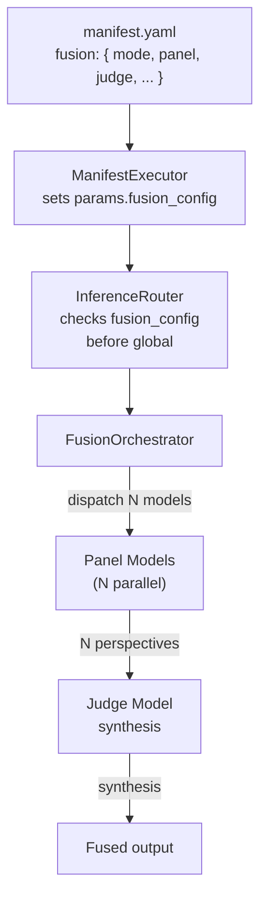
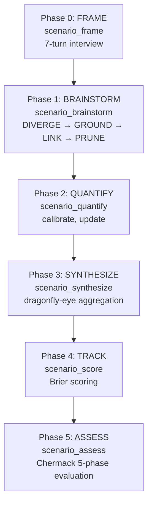
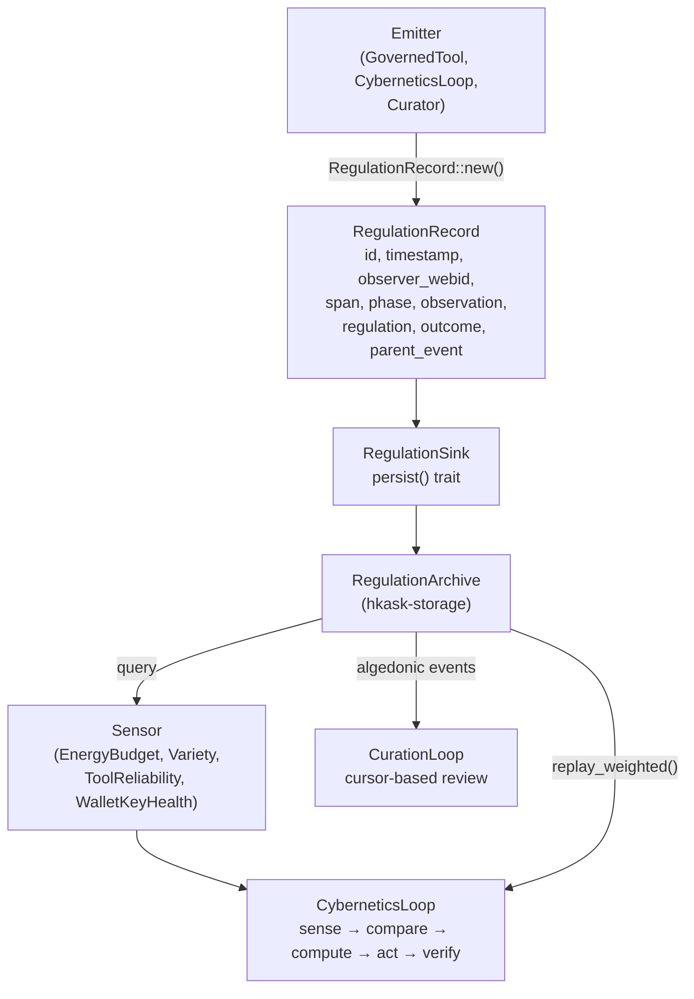
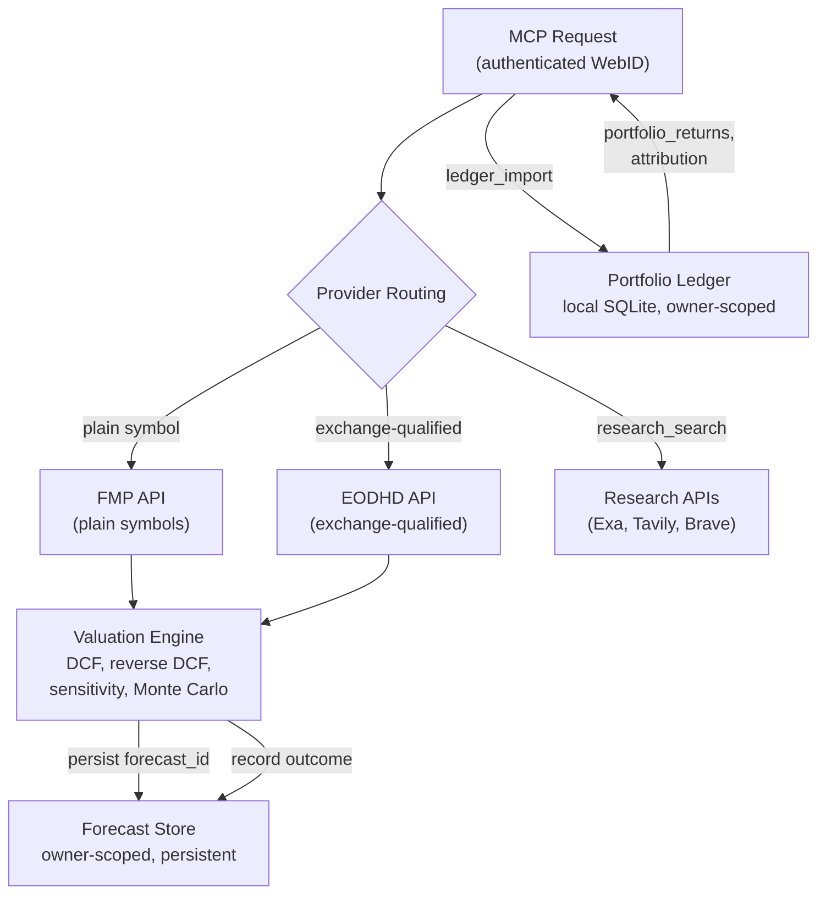
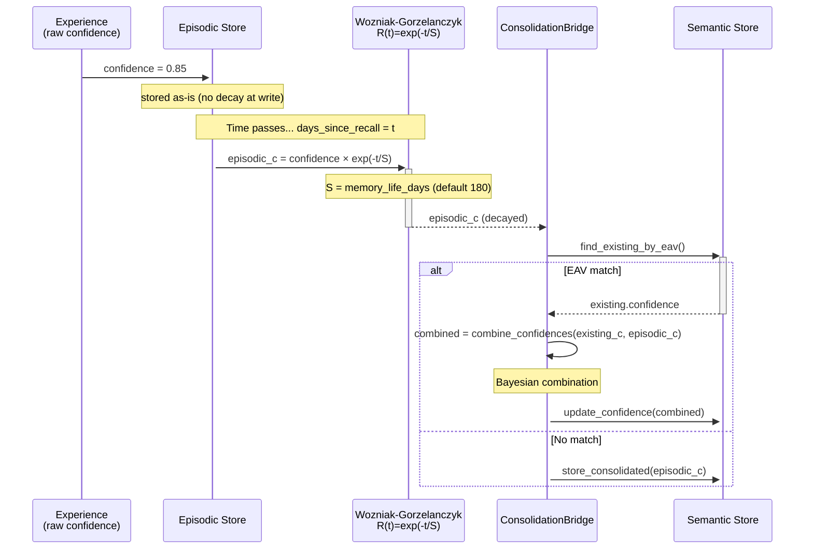
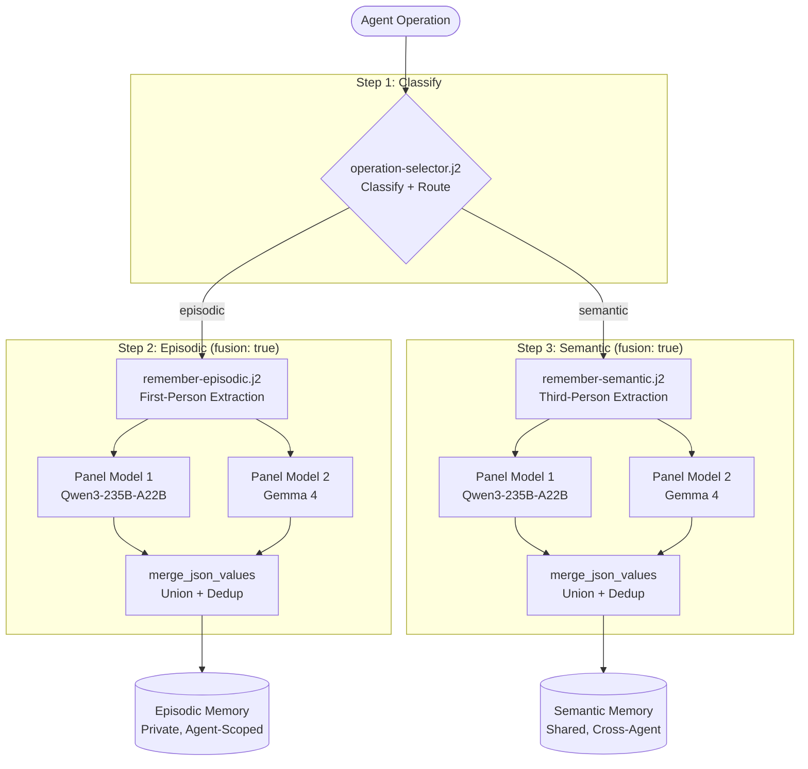
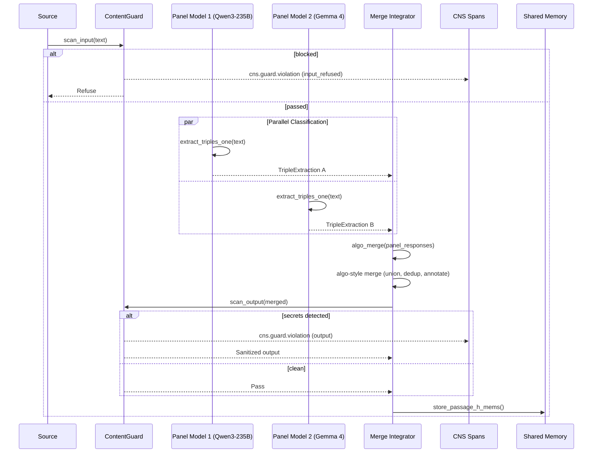

# Cognition and Replica

This document consolidates four topics that share a single theme: how hKask represents, processes, and forecasts cognitive artifacts. The fusion system design recommendations govern multi-model deliberation quality. The scenario forecasting pipeline integrates three research frameworks to build, forecast, and evaluate futures. The ν-event semantics define the atomic unit of observability that feeds the CNS. The Companies MCP server provides the investment research tooling that operationalizes forecasting and valuation. Together, they form the cognition layer — the mechanisms by which hKask agents perceive, reason about, and predict the world.

---

## 1. Fusion System Design Recommendations

### Statement

The fusion system enables multi-model deliberation: N panel models generate perspectives, a judge model synthesizes them into a single output. This design exists because single-model outputs are subject to the blind spots of one model; multi-model deliberation with a judge produces higher-quality outputs for generative analysis tasks. The recommendations below were derived through a structured design process using pragmatic-laziness, essentialist, grill-me, and coding-guidelines skills, and each recommendation is marked ADD, DON'T, or DEFER based on whether it adds capability or merely adds complexity.

### Evidence

The fusion system is configured per-manifest via a `FusionConfig` block with 5 fields. The executor sets `params.fusion_config` from `manifest.fusion`, the router checks `params.fusion_config` before falling back to global config, and the orchestrator dispatches to panel + judge. The per-manifest fusion config was verified end-to-end with 6 tests (3 router-level, 3 executor-level) covering the manifest → executor → router → orchestrator routing path.

Five design questions were evaluated:

**Q1: Should per-manifest FusionConfig support partial inheritance?** (Should `judge: null` mean "inherit global judge" while overriding only the panel?) — **DON'T.** The current all-or-nothing config is simpler. Partial inheritance adds a new concept (field-level null = inherit) that increases total system action. If a skill wants to inherit the global judge but customize the panel, the manifest author can read the global env vars and copy the values. Deletion test: delete partial inheritance → nothing breaks → do not add it.

**Q2: Should "fusion mode" be a first-class manifest concept?** (Should there be a top-level `fusion_mode: synthesis | critique | deliberation | best-of-n | pi | disabled` shorthand?) — **DON'T.** The `fusion:` block already IS the concept. Adding a shorthand `fusion_mode: synthesis` would duplicate what `fusion: { mode: synthesis }` already does. Two ways to say the same thing is more total action, not less. The full `FusionConfig` block is already minimal (5 fields, YAML-clean).

**Q3: How does the algo / no-judge path relate to fusion?** — The algo / no-judge path (`judge: "algo"`) **is** a fusion path. Setting the judge to `"algo"` routes panel responses through a deterministic, algorithmic merge instead of an LLM judge call. No separate `FusionMode` variant, no new `FusionConfig` fields — the existing 5-field config with a special judge value. The judge IS the strategy. The corpus pipeline routes through the same fusion orchestrator. The architecture anticipates additional algo / no-judge methods beyond the current recursive JSON merge (e.g., set intersection, vote/tally, schema-validated merge), to be added as sub-selectors on the `algo` judge value when needed.

**Q4: Should the scenario-builder quality gate skip implications when it fails?** — **ADD (implemented).** The `condition:` field already exists on `BundleManifestStep`. Adding `condition: "step_5_result.gate_pass"` to the implications step is zero new code — it uses an existing primitive. This is the path of least action: no new mechanism, just wiring an existing one. One-line change to one manifest, ~5000 gas saved per failed gate iteration.

**Q5: Should the superforecasting loop target be conditional?** (Should the loop restart at different steps depending on what the convergence check diagnoses?) — **DEFER.** The current fixed `loop_target: 2` (Fermi) is simpler. Conditional loop targets require the flow engine to evaluate conditions on the loop step, which is a new mechanism. The PDCA loop + `max_iterations` + `on_not_reached: escalate` handles the edge cases. Revisit if measured iteration waste justifies the complexity.

#### Follow-up Verifications

**Custom-judge unavailability:** `call_judge()` calls `router.resolve(judge_model)` → if the model's provider is not configured, returns `Err(InferenceError::Connection)` → the orchestrator propagates this → the executor receives `TemplateError::Inference(e)` → the flow engine treats it as a step failure. If panel models succeed but the judge fails, the panel results are lost — a fusion run without a judge is meaningless. Graceful error handling is already in place.

**Fusion for other skills:** Skills with generative analysis (diagnosis, design, critique) are effort hotspots where fusion's multi-model deliberation adds the most value per unit of cost. Skills with deterministic rubric evaluation are NOT hotspots — fusion adds noise without adding signal.

| Skill type | Fusion benefit | Examples |
|------------|---------------|----------|
| Generative analysis | High — diverse perspectives improve quality | diagnose, review, self-critique-revision, metacognition, improve-codebase-architecture, bug-hunt, idiomatic-rust, deep-module, refactor-service-layer |
| Deterministic rubric | Low — rubric evaluation does not benefit from multiple opinions | goal-analysis, skill-logic-audit, semantic-graph-audit, magna-carta-verifier |
| Interactive/dialogue | Medium — depends on use case | kata-coaching, grill-me, improv, essentialist, pragmatic-laziness |
| Infrastructure | None — not agent-facing | qa-*, cns-gas-tracking, bootstrap-sequence, dispatch |

#### Dead Field Cleanup

`improvement_ratio` exists in 49 manifests. ALL use `improvement_gate: threshold_only`, which means the field is never consulted by the executor's `check_convergence()` function. This is a Prohibition #3 violation (hidden parameter — the field is declared but unused). Recommendation: DELETE from all 49 manifests — the executor ignores it when `improvement_gate: threshold_only`.

### Diagram


<!-- DIAGRAM_ALIGNMENT
id: DIAG-COG-001
verified_date: 2026-07-12
verified_against: crates/hkask-types/src/event.rs, crates/hkask-memory/src/lib.rs
status: VERIFIED
-->

### Implications

The fusion design recommendations are an exercise in essentialist discipline — most proposed additions fail the deletion test. The system already has the concepts it needs (the `fusion:` block, the `condition:` field); adding shorthands, unified abstractions, or conditional routing would increase complexity without adding capability. The one addition that passed (Q4: conditional skip of implications on gate failure) is a one-line configuration change using an existing primitive — zero new code. This is the loom-and-thread philosophy applied to feature design: the loom (existing Rust primitives) constrains what the thread (YAML configuration) can express, and the right answer is usually to use the existing primitive rather than add a new one.

---

## 2. Scenario Forecasting and Planning

### Statement

The `hkask-mcp-scenarios` server integrates three complementary research frameworks to build futures, forecast their likelihood, and measure whether the project improved decision quality. Schwartz builds compelling narratives; Tetlock measures accuracy; Chermack evaluates effectiveness.[^schwartz][^tetlock][^chermack] None of the three is sufficient alone — Schwartz without Tetlock is a good story that might be wrong; Tetlock without Schwartz is precision without imagination; Chermack without either is assessment without methodology.

### Evidence

#### Theoretical Foundations

| Framework | Author | Core Question | Tool Stage |
|-----------|--------|---------------|------------|
| **Schwartz Method** | Peter Schwartz, *The Art of the Long View* (1991) | "What could happen?" | `scenario-builder` skill's 2×2 pipeline; companies 2×2 bridge |
| **Superforecasting** | Philip Tetlock, *Superforecasting* (2015) | "How likely is each event?" | `scenario_calibrate`, `scenario_update`, `scenario_score`, `scenario_synthesize`, `scenario_calibration` |
| **Performance-Based Scenario System** | Thomas Chermack, *Scenario Planning in Organizations* (2011) | "Did the project improve decision quality?" | `scenario_frame`, `scenario_assess` |

Schwartz developed his method at Royal Dutch Shell, anticipating the 1973 oil crisis, 1986 price collapse, and Soviet collapse — not by predicting any of them, but by having strategies ready for worlds where they could happen. Key concepts: focal question, driving forces (STEEP: Society, Technology, Economy, Environment, Politics), critical uncertainties (importance × uncertainty → 2×2 matrix), scenario narratives, robust strategies, early-warning indicators.

Tetlock's Good Judgment Project identified what makes the top 2% of forecasters different: better process, not higher IQ. The Ten Commandments encode this process: triage (Goldilocks-zone questions), Fermi-ize (break into sub-questions), outside view first (base rates), incremental belief updating (0.05 at a time), dragonfly-eye (integrate perspectives), degrees of doubt (full 0–100% scale), under/overconfidence balance, postmortems, team management, error-balancing.

Chermack's contribution is the evaluation framework. Most scenario planning literature describes how to build scenarios. Chermack asks: "Did it work? How do you know?" His five-phase Performance-Based Scenario System: Project Preparation, Scenario Exploration, Scenario Development, Scenario Implementation, Project Assessment.

#### Conversational Design

The `scenario_frame` tool is designed to invite rather than interrogate. Most scenario projects fail at the framing stage — not because the questions are wrong, but because they are asked in the wrong way. Formal diagnostic questions create resistance. The 7-turn conversational protocol is built on three pillars:

**Improv Postures** (hKask improv skill): Plussing (default — accept, build on, silently let go), Yes And (accept and extend), Yes But (constrain without contradicting).

**Kata Coaching** (hKask kata-starter skill): The agent is a coach, not an interviewer. The user is the domain expert. Target: 15-20 minutes.

**Behavioral Psychology**: Foot-in-the-door (Cialdini), curiosity gap (Loewenstein), loss aversion (Kahneman), social proof (Cialdini), peak-end rule (Kahneman), processing fluency, IKEA effect (Norton, Mochon, Ariely).

| Turn | Opening | Improv Mode | Psychology | What it captures |
|------|---------|-------------|------------|------------------|
| 1 | "So — tell me a bit about what's on your mind." | Plussing | Foot-in-the-door | Subject, context, emotional stakes |
| 2 | "If you had a clearer picture, what would you actually do differently?" | Yes, And | Curiosity gap | Decision at stake, focal question |
| 3 | "When do you actually need to make this call?" | Coaching | Temporal anchoring | Time horizon, action deadline |
| 4 | "Let's start with what's definitely NOT on the table." | Yes, But | Loss aversion | Out-of-scope, then in-scope |
| 5 | "Who else has skin in this game?" | Plussing | Social proof + contrarian | Stakeholders and perspectives |
| 6 | "What does 'good enough' look like?" | Yes, And | Peak-end begins | Success criteria, use case |
| 7 | "What are we assuming that might be completely wrong?" | Yes, But | Peak-end closes | Assumptions, constraints |

#### The Integrated Pipeline

**Phase 0: FRAME** — `scenario_frame` → 7-question Socratic interview protocol. Focal question + decision at stake (Schwartz Stage 1), time horizon + action deadline (Chermack Phase 1), scope boundaries, stakeholders, use case, success criteria, constraints.

**Phase 1: BRAINSTORM** — `scenario_brainstorm` → 4-round temperature-shifting protocol: DIVERGE (high temp, 4+ personas, 12+ candidate events), GROUND (medium temp, anchor in verified facts), LINK (low temp, causal chains), PRUNE (analytical, merge overlaps, converge to 4-8 events). Plus `scenario_research` (evidence-aware extraction from web search) and `scenario_triage` (classify as clocklike/goldilocks/cloudlike per Tetlock #1).

**Phase 2: QUANTIFY** — `scenario_quantify` (conditional probability tree, topological sort, marginals, joint, sensitivity ranking), `scenario_calibrate` (Fermi decomposition + outside-view base-rate blend per Tetlock #2-3), `scenario_update` (Bayesian evidence revision per Tetlock #4).

**Phase 3: SYNTHESIZE** — `scenario_synthesize` (dragonfly-eye aggregation per Tetlock #5 — Empirical-Bayes weighted average, disagreement scoring, dissent identification), `scenario_sensitivity` (variance contribution ranking per Tetlock #6).

**Phase 4: TRACK** — `scenario_score` (Brier scoring + auto-update suggestions per Tetlock #7-8), `scenario_calibration` (calibration curve with over/underconfidence detection per Tetlock #7).

**Phase 5: ASSESS** — `scenario_assess` → Five-phase evaluation (Chermack). Per-phase scores with strengths, gaps, recommendations. Answers: "Did this project improve decision quality?"

#### Key Design Decisions

1. **Events, not axes** (inspired by MAIA): Traditional Schwartz scenario planning crosses two critical uncertainties to produce four quadrant scenarios. The event-tree approach uses binomial events with conditional dependencies instead. This is more granular, more testable, and maps directly to Tetlock's Fermi decomposition.

2. **Computed certainty, not stored certainty**: The `certainty_tier` is derived from `probability` on access via `ScenarioEvent::certainty_tier()`. This prevents the stale-field divergence bug where a Bayesian update changes the probability but leaves the tier unchanged.

3. **Error types, not strings**: All error paths use the `ScenarioError` enum (via `thiserror`), following hKask conventions. The CI pipeline enforces this — `String` errors are prohibited by `scripts/check-string-errors.sh`.

4. **Journal-persisted forecast store with calibration tracking**: Forecasts are stored when scored and can be queried for calibration curves. The store uses append-only journal persistence (O(1) writes) with automatic snapshot compaction at 100 entries. Survives server restarts.

5. **Conditional independence assumption in event trees**: When an event has multiple parents, the server averages their single-parent conditional contributions for marginalization. This is an explicit heuristic, not conditional independence.

6. **Agent does research; server does math**: The scenarios server does not collect web research. The agent supplies raw research text to `scenario_research`; the server returns an extraction scaffold. The agent must create and review candidate events before quantification.

#### Architecture

```
mcp-servers/hkask-mcp-scenarios/
├── Cargo.toml
├── src/
│   ├── main.rs             # Binary entrypoint (bootstrap + run)
│   ├── lib.rs              # Server struct, 18 MCP tools, request types
│   ├── types.rs            # Core data model (events, trees, forecasts, assessment)
│   └── superforecast.rs    # Computation engine (Fermi, Bayes, Brier, trees, assessment)
```

Dependencies: `hkask-mcp`, `hkask-types`, `rmcp`, `thiserror`, `serde`/`serde_json`, `schemars`, `chrono`.

### Diagram


<!-- DIAGRAM_ALIGNMENT
id: DIAG-COG-002
verified_date: 2026-07-12
verified_against: crates/hkask-types/src/event.rs, crates/hkask-memory/src/lib.rs
status: VERIFIED
-->

### Implications

The scenario forecasting pipeline is the cognitive-forecasting analog of the CNS homeostatic loop. Where the CNS senses → compares → computes → acts → verifies on system metrics, the scenario pipeline frames → brainstorms → quantifies → synthesizes → tracks → assesses on future events. Both are PDCA cycles; both have convergence criteria (the scenario pipeline's convergence is the Brier score and calibration curve); both escalate when they cannot self-correct (the scenario pipeline's `on_not_reached: escalate` is the same mechanism as the CNS's `Escalate` action). The integration of three frameworks (Schwartz, Tetlock, Chermack) is itself a dragonfly-eye synthesis — each framework provides a different perspective, and the pipeline integrates them into a unified process that is stronger than any alone.

The conversational design of `scenario_frame` is noteworthy — it applies hKask's own improv and kata-coaching skills to the problem of eliciting decision-relevant information from users. This is the system consuming its own thread: the improv postures (Plussing, Yes And, Yes But) and the kata coaching posture (coach, not interviewer) are skills defined in `.agents/skills/`, and the `scenario_frame` tool operationalizes them in its 7-turn protocol. The behavioral psychology layer (foot-in-the-door, curiosity gap, loss aversion, social proof, peak-end, IKEA effect) grounds the conversational design in established cognitive science rather than ad-hoc intuition.

---

## 3. Nu-Event Semantics

### Statement

A ν-event (nu-event) is a thin domain event — a timestamped, attributed, namespaced observation that enters the cybernetic nervous system. It is the atomic unit of observability in hKask. A ν-event is an **assertion**, not a trace. It says "at time T, observer O witnessed fact F in domain D during phase P." It is persisted, queryable, and replayable. It feeds the CNS homeostatic loop. This design exists because the CNS needs structured observations, not raw log lines — the event carries who, when, what, which phase, and what was the regulatory outcome, all in a typed, queryable format.

### Evidence

The `RegulationRecord` struct at `crates/hkask-types/src/event.rs:16` carries:

- `id: EventID` — unique identifier
- `timestamp: DateTime<Utc>` — when the event occurred
- `observer_webid: WebID` — who observed it (the agent or system component)
- `span: Span` — a (namespace, path) pair identifying where in the system
- `phase: CyclePhase` — which phase of the cybernetic cycle (Sense, Compute, Compare, Act, Verify)
- `observation: Value` — arbitrary JSON payload describing what was observed
- `regulation: Option<Value>` — optional regulatory metadata
- `outcome: Option<Value>` — optional outcome data
- `recursion_depth: u8` — for nested/recursive operations
- `parent_event: Option<EventID>` — causal chain link
- `visibility: String` — `"private"` by default

#### ObservableSpan vs RegulationRecord

This distinction is crucial. `ObservableSpan` (at `crates/hkask-types/src/observable_span.rs:56`) is a trait that typed span enums implement — it produces a canonical dot-separated namespace string like `"cns.tool.web_search"`. `RegulationSpan` is the primary implementor, but the trait is designed to be domain-extensible: `FederationSpan`, `WalletSpan`, and other domain span enums can implement it. A span is a **trace** — it marks where in the system something happened.

A `RegulationRecord` contains a `Span`, but it adds: who, when, what, which phase, and what was the regulatory outcome. A span says "tool invoked"; a ν-event says "Agent A invoked the web_search tool in the Sense phase, observing {server, tool, estimated_cost}, with no regulation applied, at recursion depth 0."

The bridging function is `SpanNamespace::from_observable()` — it takes any `impl ObservableSpan`, validates against the canonical namespace set in `CANONICAL_NAMESPACES` (139 entries at v0.31.0), and produces a validated `SpanNamespace` for `RegulationRecord` construction. This design decouples domain span definitions from namespace validation: domain crates define their spans; the event system validates.

#### The Emission Contract

The emission contract has three participants:

- **Emitter** — Any system component that creates a `RegulationRecord`. `GovernedTool::invoke()` is the canonical emitter for tool invocations; `CyberneticsLoop` emits regulation spans; the Curator emits curation spans. The emitter constructs the event with `RegulationRecord::new(observer_webid, span, phase, observation, recursion_depth)`, optionally chaining `.with_outcome()`, `.with_regulation()`, `.with_parent()`, and `.with_visibility()`.

- **Sink** — `RegulationSink` (line 640) is the persistence trait. It has a single method: `fn persist(&self, event: &RegulationRecord) -> Result<(), InfrastructureError>`. The production implementation is `RegulationArchive` in `hkask-storage`. The sink is the durable boundary — once persisted, the event is available for CNS sensing, Curator review, and forensic audit.

- **Observer** — The CNS itself. `CurationLoop::sense()` reads algedonic-significant events from the store using cursor-based review. `CyberneticsLoop::sense()` reads via sensor providers (`Sensor` trait). Events are also replayed with decay weighting via `LedgerStoragePort::replay_weighted()`.

#### CNS Span Namespaces

The `RegulationSpan` enum at `crates/hkask-types/src/cns.rs:111` defines the core span identifiers:

| Variant | Namespace | Purpose |
|---------|-----------|---------|
| `Tool { subsystem }` | `cns.tool.{subsystem}` | 15 MCP subsystems: web_search, condenser, training, replica, research, communication, registry, wallet, media, kanban, memory, companies, docproc, filesystem, curator |
| `Inference` | `cns.inference` | LLM request/response |
| `AgentPod` | `cns.agent_pod` | Pod lifecycle events |
| `Gas` | `cns.gas` | Energy consumption tracking |
| `Curation` | `cns.curation` | Registry sync, pod sync, directive issuance |
| `SelfHeal` | `cns.heal` | Self-healing operations |
| `MemoryEncode` | `cns.memory.encode` | Memory encoding events |

The `SpanKind` enum at `event.rs:523` provides typed construction for common spans, eliminating string typos: `ToolInvoked`, `ToolCompleted`, `GasReserved`, `GasSettled`, `GasDepleted`, `CurationDirectiveAcknowledged`, `CurationEscalation`, `AgentPodRegistered`, `AgentPodActivated`, `VarietyAlgedonicAlert`, and the v0.31.0 regulation spans (`ImpactVerified`, `ActionSubstituted`, `ActionBlocked`, `RegulatoryPlateauDetected`, `LoopMetricsTelemetry`).

Beyond `RegulationSpan`, the `CANONICAL_NAMESPACES` array registers 139 namespace strings spanning architecture seams, chat, CI, classification, condenser, consent, consolidation, contracts, curation, cybernetics, deploy, federation (14 spans), gas, guard, healing, inference, kata, MCP media, memory, multi-agent, platform metrics (11 spans for PaaP/DORA/SPACE/Loyalty), QA (4 spans), regulation, userpod, semantic, skills, SLOs, sovereignty (5 spans), specs, storage, tools, variety, and wallet (10 sub-spans).

#### How ν-Events Feed the CNS Homeostatic Loop

The CNS loop is sense → compare → compute → act → verify. ν-events enter at sense — they are the afferent signals. `CyberneticsLoop::sense()` (at `cybernetics_loop.rs:733`) reads via pluggable `Sensor` implementations: `EnergyBudgetSensor`, `VarietySensor`, `WalletKeyHealthSensor`. Each sensor queries the ν-event store for relevant events and produces `Signal` values with metrics and set-points.

In the compare phase, signals are measured against set-points to produce `Deviation` values with direction (`AboveSetPoint` / `BelowSetPoint`). In compute, deviations map to `RegulatoryAction` with action types like `Calibrate`, `Escalate`, `Throttle`, `Notify`. In act, actions are executed. In verify_impact, the `ImpactReport` records whether actions were effective.

The `parent_event` field creates causal chains: the `cns.tool.completed` event has `parent_event` set to the `cns.tool.invoked` event's ID. This enables causality tracing through the event graph.

#### WeightedEvent and Decay

Events do not persist at full weight forever. `WeightedEvent` at `crates/hkask-ports/src/cns.rs:106` pairs a `RegulationRecord` with a `weight: f64`. `DecayConfig` (line 116) defines per-category exponential decay constants: cybernetics has a 5-minute half-life, curation 15 minutes, inference 2 minutes, episodic 10 minutes. Events below `weight_threshold` (default 0.001) are not replayed. This implements episodic memory — recent events matter more than ancient ones — and prevents the CNS from drowning in historical noise.

The `LedgerStoragePort::replay_weighted()` method provides time-decayed event replay, enabling the CNS to reconstruct system state from recent history without loading the entire event store. This is the computational expression of the least-action principle applied to observability: only the computationally cheapest (most recent, most salient) events factor into regulation decisions.

### Diagram


<!-- DIAGRAM_ALIGNMENT
id: DIAG-COG-003
verified_date: 2026-07-12
verified_against: crates/hkask-types/src/event.rs, crates/hkask-memory/src/lib.rs
status: VERIFIED
-->

### Implications

The ν-event design is the Good Regulator theorem applied to observability: the CNS's internal model of the system is built from ν-events, and the model's fidelity depends on the events' structure. A raw log line ("tool invoked at 14:32") is a poor model — it lacks who, what phase, what outcome, and what regulation was applied. A ν-event is a rich model — it carries all of these in a typed, queryable, replayable format. The 139-entry `CANONICAL_NAMESPACES` registry ensures that every namespace is validated against a known set — a typo in a span namespace is caught at construction time, not discovered during debugging. The decay-weighted replay is the least-action principle in action: the CNS does not need to load the entire event store to regulate the system; it needs only the recent, salient events. This is what makes cybernetic regulation computationally feasible — the regulator's model is bounded by decay, not by the full history of the system.

---

## 4. Companies MCP Server — Investment Research

### Statement

The `hkask-mcp-companies` server provides 41 tools for retrieving company data, calculating valuations, researching claims, maintaining durable forecast feedback, and managing a local investment ledger. It is the operational toolset that connects the scenario forecasting pipeline to real market data — the forecasting pipeline produces probabilities; the companies server provides the financial data that grounds those probabilities in reality.

### Evidence

The server requires both market-data credentials at startup. Research keys are optional:

```bash
kask keystore set HKASK_FMP_API_KEY "your-fmp-key"
kask keystore set HKASK_EODHD_API_KEY "your-eodhd-key"
# Optional research providers:
kask keystore set HKASK_EXA_API_KEY "your-exa-key"
kask keystore set HKASK_TAVILY_API_KEY "your-tavily-key"
kask keystore set HKASK_BRAVE_API_KEY "your-brave-key"
```

#### Retrieve Company Data

Use an exchange-qualified symbol when the listing is not a plain US-style ticker:

```text
company_profile AAPL
stock_quote MSFT
income_statement VOD.L
symbol_search "Tesla"
```

Eligible financial-data calls prefer FMP for plain symbols and EODHD for exchange-qualified symbols, then fall back after a provider failure. `company_screener` is FMP-only. `research_search` uses optional Exa, Tavily, and Brave providers instead of the financial-data route.

#### Run a Valuation

A DCF valuation builds a history-calibrated, two-stage projection and persists an owner-scoped `forecast_id`:

```text
dcf_valuation AAPL
reverse_dcf AAPL
sensitivity_analysis AAPL
monte_carlo_dcf AAPL
```

The active DCF model uses a Gordon-growth terminal value and subtracts net debt from enterprise value. It does not use exit multiples, a separate SG&A line, or other non-operating assets. The MCP boundary rejects non-finite values, out-of-range assumptions, invalid horizons, and terminal growth at or above the discount rate. `scenario_analysis` executes a fixed revenue-growth × gross-margin matrix.

#### Record a Forecast Outcome

`forecast_record` requires forecast and outcome values, not a free-text actuals summary:

```json
{
  "symbol": "AAPL",
  "forecast_date": "2025-01-01",
  "horizon": "1yr",
  "forecast_multiple": 30.0,
  "forecast_price_change": 0.10,
  "outcome_date": "2026-01-01",
  "actual_multiple": 28.0,
  "actual_price_change": 0.03,
  "forecast_id": "the-id-returned-by-dcf-valuation"
}
```

The identifier persists across restarts. Use `forecast_get` to retrieve one record and outcomes, or `forecast_list AAPL` to review the owner's history. Pass `revision_of` to `dcf_valuation` or `calibrate_forecast` to create a same-symbol revision linked to its predecessor.

#### Manage a Portfolio Ledger

Import transactions as CSV or JSON, then query portfolio analysis or add research records:

```text
ledger_import my_portfolio csv "type,date,symbol,quantity,price,commission,amount\nbuy,2024-01-15,AAPL,10,150,1,"
portfolio_returns my_portfolio 2024-01-01 2024-12-31
portfolio_attribution my_portfolio 2024-01-01 2024-12-31
note_add my_portfolio AAPL 2024-06-15 "Earnings review" "Raised guidance" ["earnings"]
```

Portfolio state is stored locally under `~/.config/hkask/portfolios/<sanitized-webid>/`, so the authenticated MCP `WebID` determines each caller's database and attachment namespace. Imports are limited to 5 MiB and 10,000 transactions; attachments are limited to 10 MiB encoded and 6 MiB decoded.

The former shared `portfolios/master.db` is not auto-migrated because it has no reliable owner identity. Export legacy data from a trusted single-principal deployment and import it into the correct owner-scoped server.

#### Ontology Annotations

Derived outputs may provide a `fibo` object with compact FIBO identifiers. Raw provider payloads are not field-mapped, and the server does not emit a JSON-LD context or Dublin Core/PKO mapping. Treat these identifiers as application metadata, not self-resolving semantic-web URIs. This is the dual-axis ontology's domain supplement layer in action — FIBO supplements the companies server's state axis where DC+BIBO is not specific enough for financial concepts.

### Diagram


<!-- DIAGRAM_ALIGNMENT
id: DIAG-COG-004
verified_date: 2026-07-12
verified_against: crates/hkask-types/src/event.rs, crates/hkask-memory/src/lib.rs
status: VERIFIED
-->

### Implications

The companies server is the bridge between the scenario forecasting pipeline and real market data. The forecasting pipeline produces probabilities for future events; the companies server provides the financial data (company profiles, income statements, valuations) that grounds those events in observable reality. The `forecast_record` tool closes the feedback loop: a forecast made today can be scored against actual outcomes tomorrow, and the Brier score from `scenario_score` can be computed using the actual multiples and price changes that `forecast_record` captures. This is the same PDCA cycle as the CNS — Plan (forecast), Do (invest), Check (score the forecast against reality), Act (calibrate future forecasts based on Brier score feedback).

The owner-scoped portfolio storage is P1 (User Sovereignty) and P12 (Authenticated Host Mandate) applied to financial data: each user's portfolio is stored under their own WebID namespace, not in a shared database. The import limits (5 MiB, 10,000 transactions) are resource governance — the same principle as gas budgets, applied to data ingestion. The FIBO ontology annotations are the dual-axis ontology's domain supplement layer — FIBO provides financial-specific vocabulary where DC+BIBO is not precise enough, following the same thin-bridge pattern as the core ontology crates.

---

## References

[^schwartz]: Schwartz, P. (1991). *The Art of the Long View: Planning for the Future in an Uncertain World*. Currency Doubleday.

[^tetlock]: Tetlock, P. E., & Gardner, D. (2015). *Superforecasting: The Art and Science of Prediction*. Crown.

[^chermack]: Chermack, T. J. (2011). *Scenario Planning in Organizations: How to Create, Use, and Assess Scenarios*. Berrett-Koehler.

- Brier, G. W. (1950). "Verification of forecasts expressed in terms of probability." *Monthly Weather Review*, 78(1), 1–3.
- Murphy, A. H. (1973). "A New Vector Partition of the Probability Score." *Journal of Applied Meteorology*, 12(4), 595–600.
- Cialdini, R. B. (2007). *Influence: The Psychology of Persuasion*. HarperCollins. (Foot-in-the-door, social proof)
- Loewenstein, G. (1994). "The Psychology of Curiosity: A Review and Reinterpretation." *Psychological Bulletin*, 116(1), 75–98.
- Kahneman, D. (2011). *Thinking, Fast and Slow*. Farrar, Straus and Giroux. (Loss aversion, peak-end rule)
- Norton, M. I., Mochon, D., & Ariely, D. (2012). "The IKEA effect: When labor leads to love." *Journal of Consumer Psychology*, 22(3), 453–460.
- Companies MCP Server Reference at `docs/reference/mcp-servers/README.md` (Companies MCP Server section)
---

## Embedding Architecture (Merged from EMBEDDING_ARCHITECTURE.md)


# Embedding Architecture — QA Pipeline

**Date:** 2026-07-10 | **Model:** Qwen3-Embedding-0.6B (1024-dim)

## Current State

| Component | Uses Embeddings? | How |
|-----------|-----------------|-----|
| `corpus_embed` | ✅ Produces | Embeds 20K+ chunks → EmbeddingStore |
| `corpus_salience` | ❌ No | Graph-centrality only |
| `build-prompts` | ❌ No | Salience + concepts only |
| `generate-qa` | ❌ No | Raw text → LLM |
| `ingest-qa` | ✅ Produces | Embeds QAs AFTER generation |
| `replica_build` | ✅ Produces | Embeds corpus for persona centroids |

## Gap: Embeddings Not Used in QA Generation

| Opportunity | Impact | Difficulty |
|-------------|--------|------------|
| **Chunk dedup** (cosine >0.95) | −15% inference cost | Medium — needs DB access in build-prompts |
| **MMR selection** (salience + diversity) | Fewer redundant QAs | Medium — needs vec0 KNN queries |
| **Semantic cross-ref** (embedding groups) | Better synthesis QAs | Hard — O(n²) without index |
| **QA-chunk alignment** (cosine validation) | Catch hallucinations | Easy — already have both embeddings |

## Why Keep Qwen3-Embedding-0.6B

| Factor | Analysis |
|--------|----------|
| MTEB retrieval | ~60% (adequate for dedup at 0.95 threshold) |
| Upgrade cost | Re-embed 20K chunks + 7K QAs → 4+ hours |
| Dim compatibility | 1024 matches EMBEDDING_DIM hardcoded everywhere |
| Academic consensus | Simple embeddings beat complex methods for data selection (Large-Scale Data Selection, 2025) |
| DEITA threshold | 0.9-0.95 for Repr Filter on OpenHermes/Tulu3 pools |

## Upgrade Path (when justified)

1. **Phase 1** (now): Use existing embeddings for concept coverage validation ✅
2. **Phase 2** (next): Add `--use-embeddings` flag to build-prompts for MMR selection
3. **Phase 3** (future): Evaluate bge-large-en-v1.5 vs Qwen3-Embedding-0.6B on investment lit
4. **Phase 4** (future): QA-chunk alignment validation in ingest-qa

## Ontological Anchoring

The `concepts` field in tagged_chunks.jsonl serves as a lightweight investment ontology:
- Competitive positioning: `competitive advantage`, `moat`, `barriers to entry`
- Valuation: `discounted cash flow`, `DCF`, `multiples`, `intrinsic value`
- Return analysis: `return on capital`, `ROIC`, `ROE`, `economic profit`
- Risk: `margin of safety`, `cost of capital`, `beta`, `uncertainty`
- Strategy: `capital allocation`, `reinvestment`, `growth`, `management quality`

Concept coverage is validated in the pipeline selection step — flags if critical concepts are missing from training QAs.

---

## Inlined Diagrams

The following Mermaid diagrams were inlined from the former `docs/diagrams/` directory per DOCUMENTATION_STANDARDS §1.

### Memory Pipeline — Episodic → Semantic

*Inlined from `docs/diagrams/sequence-memory-pipeline.md`*


# Memory Pipeline — Episodic → Semantic with Visibility Gating

## Description

The hKask memory pipeline implements a two-layer (episodic + semantic) psycho-cybernetic memory architecture. Tool call experiences enter through `record_experience()` into the private episodic store, scoped to the agent's `perspective` (WebID). Every 10 experiences, a narrative generation loop (`generate_narrative()`) triggers the `ConsolidationBridge` to promote episodic hMems into the shared semantic store. The consolidation is one-way and irreversible: episodic perspective is stripped, confidence is decayed via the Wozniak-Gorzelanczyk forgetting curve, and hMems are either Bayesian-combined with existing semantic matches or seeded as new entries. A `ConsentManager` gates visibility transitions: episodic stays private (sovereign), semantic requires Public/Shared visibility.

**Key source:** `crates/hkask-memory/src/episodic.rs:51-220` (`EpisodicMemory`), `crates/hkask-memory/src/semantic.rs:61-130` (`SemanticMemory`), `crates/hkask-memory/src/consolidation.rs:26-168` (`ConsolidationBridge`), `crates/hkask-memory/src/consolidation_service.rs:10-100` (`ConsolidationService`), `crates/hkask-services-runtime/src/daemon_impl.rs:227-400` (`store_experience`, `generate_narrative`).

### Visibility and Perspective Rules

| Store | `visibility` | `perspective` | Who can read? |
|-------|-------------|--------------|---------------|
| Episodic | `Private` only | `Some(agent_webid)` | Only owning agent |
| Semantic | `Shared` / `Public` | `None` | Any agent with capability token |

### Consolidation Rules

| Scenario | Action | Confidence |
|----------|--------|------------|
| EAV match in semantic | Bayesian combine | `combine_confidences(existing, episodic_decayed)` |
| No EAV match | Seed new semantic hMem | Decayed episodic confidence |
| Episodic hMem expired | Soft-delete via `valid_to` | Source removed from episodic |

```mermaid
sequenceDiagram
    participant Tool as Tool Call Handler
    participant Daemon as DaemonHandler<br/>(store_experience)
    participant Narr as generate_narrative<br/>(every 10 experiences)
    participant Epi as EpisodicMemory<br/>(Private · perspective-scoped)
    participant Cons as ConsentManager<br/>(visibility gate)
    participant Sem as SemanticMemory<br/>(Public · shared)
    participant Bridge as ConsolidationBridge
    participant Svc as ConsolidationService
    participant Sq as SQLCipher<br/>(per-agent isolation)
    participant CNS as CNS RegulationSink

    rect rgb(245, 248, 252)
        Note over Tool,Epi: Phase 1 — Tool Call Experience → Episodic Store

        Tool->>+Daemon: store_experience(userpod, entity, attribute, value, confidence)
        Note over Tool: e.g., "moat_check"<br/>outcome="success"<br/>confidence=0.85
        Daemon->>+Epi: record_experience() → store(h_mem)
        Note over Epi: access.visibility = Private<br/>access.perspective = Some(agent_webid)

        alt visibility is Shared or Public
            Epi-->>Epi: EpisodicMemoryError::InvalidVisibility
            Note over Epi: "Episodic memory is sovereign"<br/>— shared/public hMems rejected
        else perspective is None
            Epi-->>Epi: EpisodicMemoryError::MissingPerspective
        else valid Private + perspective
            Epi->>+Sq: h_mem_store.insert(&triple)
            Sq-->>-Epi: Ok(())
            Epi->>+CNS: persist(RegulationRecord { span: cns.memory.encode.episodic_stored })
            CNS-->>-Epi: ()

            Epi->>+Epi: storage_usage(perspective)
            opt usage > 80% of budget
                Note over Epi: EpisodicLoop produces<br/>Throttle action (self-targeted)
            end
            opt usage > 100% of budget
                Note over Epi: EpisodicLoop escalates to Curation
            end
        end
    end

    rect rgb(245, 252, 245)
        Note over Tool,Narr: Phase 2 — Narrative Generation Trigger (every 10 experiences)

        Daemon->>+Daemon: experience_count % 10 == 0?
        alt trigger threshold reached
            Daemon->>+Narr: tokio::spawn(generate_narrative)
            Narr->>+Epi: query_for_deduped("mcp_session", perspective)
            Note over Epi: Applies Wozniak-Gorzelanczyk decay:<br/>R(t) = exp(-t/S) where S=180 days
            Epi->>+Epi: dedup_h_mems() — EAV hash dedup
            Epi-->>-Narr: recent episodes (last 20, decayed)
            Narr->>+Narr: build session log → inference prompt
            Narr->>+Narr: inference.generate(prompt)
            Note over Narr: LLM produces semantic observations
            Narr->>+Sem: store(semantic_observation)<br/>(Shared/Public, no perspective)
        end
    end

    rect rgb(255, 252, 240)
        Note over Epi,Svc: Phase 3 — Consolidation Bridge (Episodic → Semantic)

        Note over Bridge: Triggered by EpisodicLoop.act()<br/>when budget pressure detected
        Bridge->>+Epi: consolidation_candidates(perspective, limit)
        Note over Epi: Selects oldest/lowest<br/>effective-confidence hMems
        Epi-->>-Bridge: Vec<hMem> (candidates)

        loop each candidate hMem
            Bridge->>+Bridge: Compute decayed confidence<br/>days_since = (now - recalled_at) / 86400<br/>episodic_c = confidence.memory_decay(days_since, S)

            Bridge->>+Sem: find_existing_by_eav(triple)

            alt EAV match found (combine)
                Sem-->>-Bridge: Some(existing)
                Bridge->>+Bridge: combined = combine_confidences(existing_c, episodic_c)
                Bridge->>+Sem: update_confidence(id, value, combined)
                Sem-->>-Bridge: Ok(())
                Note over Bridge: Bayesian combined —<br/>existing semantic hMem updated
            else No EAV match (seed)
                Sem-->>-Bridge: None
                Bridge->>+Bridge: new semantic hMem:<br/>· stripped perspective (None)<br/>· visibility → Shared/Public<br/>· confidence = episodic_c
                Bridge->>+Sem: store_consolidated(triple)
                Sem-->>-Bridge: Ok(())
                Note over Bridge: New semantic hMem seeded
            end

            Bridge->>+Epi: expire_triple(&id)
            Note over Epi: soft-delete via valid_to<br/>Frees episodic storage budget
            Epi-->>-Bridge: Ok(())
        end

        Bridge-->>-Svc: ConsolidationOutcome { consolidated_count, deleted_count, failed_count }
        Note over Bridge: tracing::info!(target: "cns.consolidation")
    end

    rect rgb(248, 245, 255)
        Note over Svc,Sem: Phase 4 — ConsolidationService Cleanup

        Svc->>+Svc: consolidate(perspective, request)
        Svc->>+Bridge: bridge.consolidate(perspective, limit)
        Bridge-->>-Svc: bridge_outcome

        opt confidence_floor specified
            Svc->>+Sem: low_confidence_h_mems(floor, MAX)
            loop each low-confidence hMem
                Svc->>+Sem: delete_h_mem(id)
            end
        end

        opt max_semantic_triples specified
            Svc->>+Sem: h_mem_count()
            alt count > max
                Svc->>+Sem: lowest_confidence_h_mems(count - max)
                loop each lowest-confidence hMem
                    Svc->>+Sem: delete_h_mem(id)
                end
            end
        end
    end

    rect rgb(245, 248, 252)
        Note over Cons,Sq: Visibility Gating — Private vs Public with SQLCipher Isolation

        Note over Epi: Episodic Recall (Private)
        Epi->>+Cons: has_consent(agent_webid, DataCategory)
        alt consent denied
            Cons-->>-Epi: false — fail-closed
        else consent granted
            Cons-->>-Epi: true
            Epi->>+Sq: query_by_entity(entity)
            Note over Sq: WHERE perspective = agent_webid<br/>(per-agent SQLCipher isolation)
            Sq-->>-Epi: hMems (decayed + deduped)
        end

        Note over Sem: Semantic Recall (Public)
        Sem->>+Sq: query_by_entity(entity)
        Note over Sq: WHERE visibility IN (Shared, Public)<br/>AND perspective IS NULL<br/>(cross-agent accessible)
        Sq-->>-Sem: hMems (deduped by EAV hash)
        Note over Sem: recall_dedup::dedup_h_mems(filtered)
    end
```
<!-- DIAGRAM_ALIGNMENT
id: DIAG-COG-005
verified_date: 2026-07-12
verified_against: crates/hkask-types/src/event.rs, crates/hkask-memory/src/lib.rs
status: VERIFIED
-->

## Confidence Flow Through Pipeline


## Per-Agent SQLCipher Isolation

| Dimension | Episodic | Semantic |
|-----------|----------|----------|
| Filter column | `perspective = agent_webid` | `visibility IN (Shared, Public)` |
| Encryption | Per-agent SQLCipher key | Shared encryption key |
| Dedup strategy | `recall_dedup::dedup_h_mems()` | `recall_dedup::dedup_h_mems()` |
| Confidence at read | Wozniak-Gorzelanczyk decay applied | Wozniak-Gorzelanczyk decay applied |
| Budget enforcement | `EpisodicLoop` (80%/100% thresholds) | `ConsolidationService` (confidence floor + max count) |

---

<!-- DIAGRAM_ALIGNMENT
id: DIAG-PL-003
verified_date: 2026-07-02
verified_against: >
  crates/hkask-memory/src/episodic.rs:51-220 (EpisodicMemory, store, query_for_deduped, storage_usage),
  crates/hkask-memory/src/episodic_loop.rs:26-80 (EpisodicLoop, budget enforcement),
  crates/hkask-memory/src/semantic.rs:61-175 (SemanticMemory, store, query_deduped with decay, store_consolidated),
  crates/hkask-memory/src/consolidation.rs:26-179 (ConsolidationBridge, consolidate with dual-decay Bayesian combine),
  crates/hkask-memory/src/consolidation_service.rs:10-100 (ConsolidationService, consolidate, cleanup),
  crates/hkask-memory/src/recall_dedup.rs:10-57 (eav_hash, dedup_h_mems, BLAKE3),
  crates/hkask-memory/src/ports.rs:1-216 (EpisodicStoragePort, SemanticStoragePort, StorageRequest, RecallRequest),
  crates/hkask-services-runtime/src/daemon_impl.rs:227-400 (store_experience, generate_narrative),
  crates/hkask-mcp/src/server/tool_span.rs:78-84 (ExperienceCallback, record_experience trigger)
status: VERIFIED
-->

## Cross-Reference

| Reference | Description |
|-----------|-------------|
| [`EpisodicMemory`](crates/hkask-memory/src/episodic.rs:51-220) | Private, perspective-scoped memory with confidence decay |
| [`SemanticMemory`](crates/hkask-memory/src/semantic.rs:61-175) | Shared, public memory with confidence decay and similarity-augmented recall |
| [`ConsolidationBridge`](crates/hkask-memory/src/consolidation.rs:26-168) | One-way episodic→semantic promotion with Bayesian combination |
| [`ConsolidationService`](crates/hkask-memory/src/consolidation_service.rs:10-100) | Combined consolidation + semantic cleanup |
| [`EpisodicLoop`](crates/hkask-memory/src/episodic_loop.rs:26-80) | Cybernetic loop with budget regulation |
| [`recall_dedup`](crates/hkask-memory/src/recall_dedup.rs:10-57) | BLAKE3 EAV-hash deduplication layer |
| [`MemoryPorts`](crates/hkask-memory/src/ports.rs:1-216) | Episodic and Semantic storage port traits |
| [`store_experience` / `generate_narrative`](crates/hkask-services-runtime/src/daemon_impl.rs:227-400) | Daemon-based experience recording and narrative generation |
| [`ToolSpanGuard` experience callback](crates/hkask-mcp/src/server/tool_span.rs:78-84) | Experience callback wiring for tool span guards |
| [Magna Carta P1](../reference/magna-carta.md#p1-user-sovereignty) | User Sovereignty — episodic memory as sovereign first-person |
| Consent flow sequence (inlined in `sovereignty-and-ocap.md`) | Consent flow for visibility gating (DIAG-TO-006-CM) |
| CNS span emission sequence (inlined in `cns-and-loops.md`) | CNS span emission for memory encode spans (DIAG-TO-004) |


### Memory Remember — Algo / No-Judge Template Cascade

*Inlined from `docs/diagrams/flowchart-memory-remember.md`*


# Memory Remember — Algo / No-Judge Template Cascade

FlowDef manifest for agent memory formation. Three-step cascade with algo /
no-judge rendering on every step. The `operation-selector.j2` classifies and
routes to episodic or semantic extraction. The fusion panel renders the same
template in parallel; outputs are merged via `merge_json_values()`.

Related: `registry/manifests/memory_remember.yaml`, `crates/hkask-templates/src/executor.rs`


<!-- DIAGRAM_ALIGNMENT
id: DIAG-COG-007
verified_date: 2026-07-12
verified_against: crates/hkask-types/src/event.rs, crates/hkask-memory/src/lib.rs
status: VERIFIED
-->


### Classification-to-Memory Sequence

*Inlined from `docs/diagrams/sequence-classify-to-memory.md`*


# Classification-to-Memory Sequence

Full flow from source text through algo / no-judge classification, guard scanning,
integration, and shared memory storage. All guard checks are mandatory;
the algo / no-judge path (`judge: algo`) runs the fusion panel in parallel and
merges responses algorithmically — no LLM judge call.

Related: `crates/hkask-inference/src/fusion_orchestrator.rs` (algo_merge)


<!-- DIAGRAM_ALIGNMENT
id: DIAG-COG-008
verified_date: 2026-07-12
verified_against: crates/hkask-types/src/event.rs, crates/hkask-memory/src/lib.rs
status: VERIFIED
-->


### Algo / No-Judge Classification Flow

*Inlined from `docs/diagrams/flowchart-algo-classification.md`*


# Algo / No-Judge Classification Flow

How classification operates via the algo / no-judge fusion path (`judge: algo`).
The fusion panel runs in parallel; `algo_merge()` folds the panelists' JSON
extractions into a single result (union, dedup, diverging fields annotated
`[A:... B:...]`) — no LLM judge call.

Related: `crates/hkask-inference/src/fusion_orchestrator.rs` (algo_merge), `crates/hkask-services-corpus/src/embed/service.rs`

```mermaid
flowchart TD
    S([Source Text])
    G{Guard Input Scan}
    R[Refuse + CNS Alert]
    P1[Panel Model 1\nKC/qwen3-235b]
    P2[Panel Model 2\nDI/gemma-4]
    R1[Response 1 (JSON)]
    R2[Response 2 (JSON)]
    I[algo_merge]
    GO{Guard Output Scan}
    RS[Strip Secrets\n+ CNS Alert]
    ST[Store in Shared Memory]
    M[Memory]

    S --> G
    G -->|pass| P1
    G -->|pass| P2
    G -->|block| R
    P1 --> R1
    P2 --> R2
    R1 --> I
    R2 --> I
    I --> GO
    GO -->|pass| ST
    GO -->|violation| RS
    RS --> ST
    ST --> M

    subgraph "Fusion Panel (parallel)"
        P1
        P2
    end

    subgraph "Epistemic Integration"
        I
    end
```
<!-- DIAGRAM_ALIGNMENT
id: DIAG-COG-009
verified_date: 2026-07-12
verified_against: crates/hkask-types/src/event.rs, crates/hkask-memory/src/lib.rs
status: VERIFIED
-->

