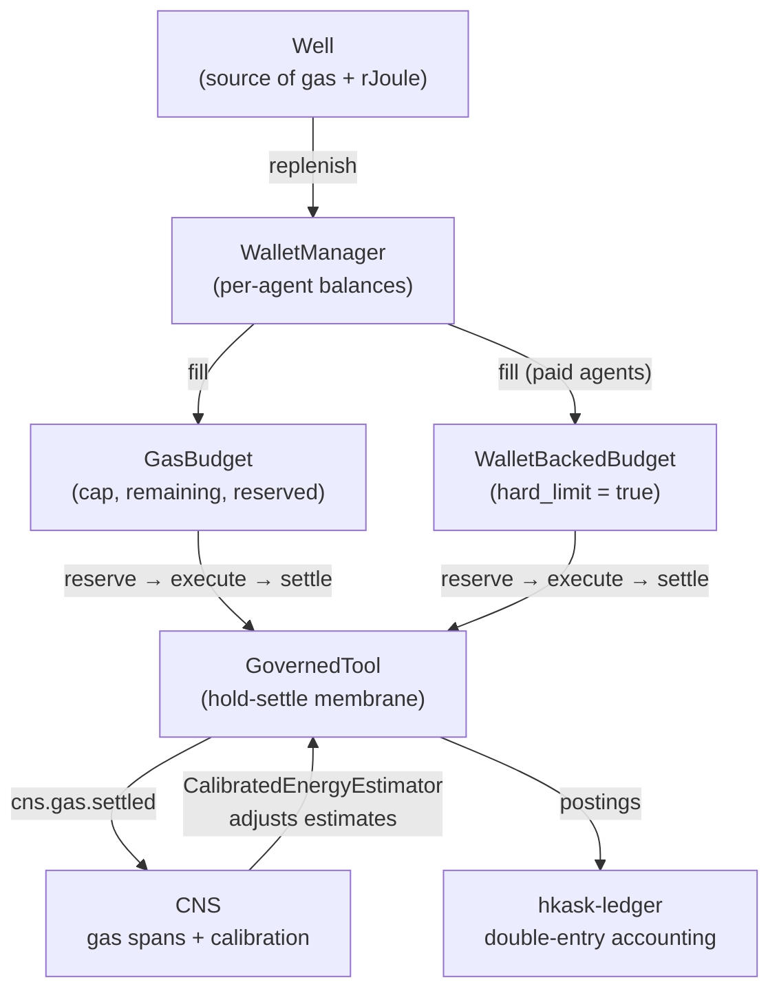
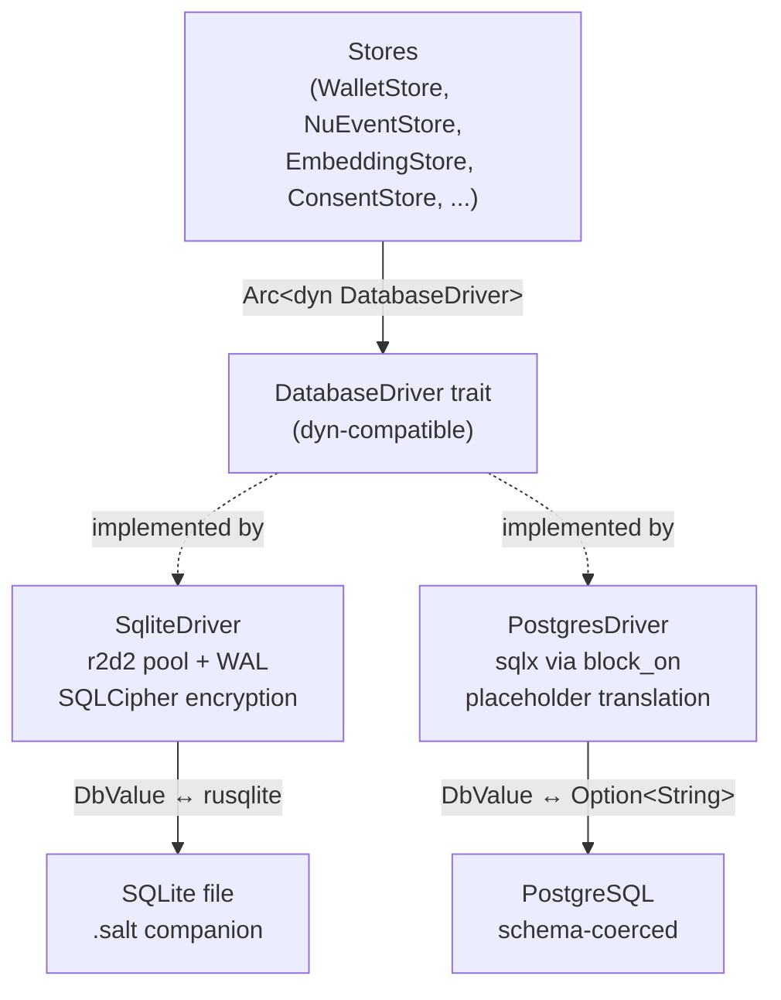

# Energy and Economy

This document consolidates three infrastructure themes that share a single concern: resource governance. The gas system makes computational resource consumption visible and governable. The database driver abstraction makes storage provider selection a deployment-time decision, not a code-level one. The LoRA adapter store makes model lifecycle — from training through deployment to teardown — an OCAP-gated, cost-tracked, CNS-observable pipeline. Together, they form the economic and storage backbone that enables hKask's autonomous agents to operate within bounded resources.

---

## 1. Energy, Gas, and rJoule

### Statement

Agent platforms face a fundamental problem: autonomous loops can consume resources without bound. An agent that retries failed operations indefinitely, or a skill that iterates without converging, becomes a resource sink. hKask addresses this with an explicit economic layer — gas budgets, energy tracking, and wallet accounting — that makes resource consumption visible, measurable, and governable. This is not cryptocurrency speculation. Gas is a dimensionless unit of computational work, analogous to Ethereum gas: it bounds execution and prevents infinite loops. rJoule is the unit of inference energy — the scarce resource that powers LLM calls. Together they form a dual-currency system: gas for compute, rJoules for inference.

### Evidence

#### GasBudget: The Entry Point

The `GasBudget` struct (`crates/hkask-cns/src/energy.rs`) is the primary enforcement mechanism. Every skill and agent carries a budget with a `cap`, a `remaining` balance, a `reserved` hold, and a `replenish_rate`. Fields are private; invariants like `remaining + reserved ≤ cap` are enforced structurally — one cannot construct a `GasBudget` that violates them.

```rust
pub struct GasBudget {
    cap: GasCost,
    remaining: GasCost,
    replenish_rate: GasCost,
    alert_threshold: f64,
    hard_limit: bool,
    reserved: GasCost,
    priority: f64,
    last_reservation: Option<chrono::DateTime<chrono::Utc>>,
}
```

The hold-settle pattern is the core mechanism:

1. **Reserve** — `budget.reserve(gas)` allocates gas from `remaining` to `reserved`. Returns `GasError::BudgetExceeded` if the hard limit is breached. The reservation is timestamped for stale-reservation detection.
2. **Execute** — The tool or operation runs, consuming resources.
3. **Settle** — `budget.settle(reserved, actual)` releases the reservation and deducts actual cost from remaining. If actual < reserved, the difference is refunded — preventing gas leaks from overestimation.

Stale reservations older than 300 seconds (`RESERVATION_TIMEOUT_SECS`) are auto-released. This prevents leaked reservations from permanently reducing available budget. An `AgentGasStatus` snapshot (`cap`, `remaining`, `reserved`, `available`, `usage_ratio`) is derived from any budget for observability.

#### The Well: Source of All Gas

Gas does not materialize from nowhere. A `Well` (`crates/hkask-cns/src/well.rs`) is the sole source of new gas and rJoules entering the system. One default Well per installation. Wells produce gas and rJoules on a replenishment schedule — `gas_rate` and `rjoule_rate` — and agents draw from Wells to fill their wallets.

```rust
pub struct Well {
    pub config: WellConfig,
    pub gas_available: GasCost,
    pub rjoule_available: u64,
}
```

`WellManager` manages multiple Wells with dampening logic: when the default Well is exhausted, it emits an algedonic alert, but `was_already_exhausted` prevents re-alerting every tick. Wells persist their state via JSON serialization so gas production survives restarts.

#### Wallets: Per-Agent Balances

Where the Well is the source, the `WalletManager` (`crates/hkask-cns/src/wallet_manager.rs`) is distribution. Backed by SQLite via `WalletStore`, it creates per-agent wallets on userpod registration, manages deposits and spending, and auto-draws from the Well when balances run low.

The `WalletBackedBudget` (`crates/hkask-cns/src/wallet_budget.rs`) extends this for paid agents. Unlike standard `GasBudget` which replenishes from a dimensionless pool, `WalletBackedBudget` converts gas costs to rJoules and debits a real wallet. It always has `hard_limit = true` — rJoules represent real value. When an API key is attached, it checks encumbrance (allocated rJoule reservation) rather than raw wallet balance.

#### RJoule: The Currency of Inference

rJoule is defined in `hkask-wallet-types`. The conversion rate is configured via `GAS_PER_RJOULE` — 250,000 gas cycles = 1 rJoule, reflecting the cost differential between cheap local compute and expensive LLM inference. This rate is runtime-adjustable; the CNS calibration loop in `CalibratedEnergyEstimator` updates it based on observed settlement data.

The `hkask-wallet` crate (`crates/hkask-wallet/src/lib.rs`) provides the full wallet infrastructure: multi-chain support via `ChainPort` trait (Hedera port is feature-gated), self-custody via HKDF-derived keys, API key issuance, price feeds for fee estimation, and zeroizing wrappers on all secret key material.

#### The Ledger: Double-Entry Accounting

`hkask-ledger` (`crates/hkask-ledger/src/lib.rs`) provides immutable **double-entry** accounting backed by SQLite. Three domain ledgers (cost, crypto, securities) share this crate with separate database files. Every transaction is composed of `Posting` entries — source account, destination account, asset, amount — and transactions are committed with a `reference` for idempotency.

```rust
pub struct Posting {
    pub source: String,
    pub destination: String,
    pub asset: String,
    pub amount: i64,  // in asset's smallest integer unit
}
```

Three invariants are structurally enforced: idempotency (same reference, identical postings → no-op; different postings → `IdempotencyConflict`), double-entry (postings must sum to zero), and immutability (committed transactions are never modified or deleted).

#### CNS Feedback Loop

The economic layer feeds directly into CNS regulation. `cns.gas` spans emit on every reserve, settle, consume, and reset operation. `GasReport` (`crates/hkask-cns/src/gas_report.rs`) queries these events and produces per-agent `AgentGasSummary` reports with per-tool breakdowns (`ToolGasBreakdown`: reserved, consumed, depleted, invocations).

`CalibratedEnergyEstimator` (`crates/hkask-cns/src/calibrated_energy_estimator.rs`) closes the Good Regulator feedback loop. It wraps `CompositeEnergyEstimator` and keeps its per-server table in sync with observed `cns.gas.settled` events via `DynamicGasTable`. A background calibration task refreshes estimates every 5 minutes, adjusting by exponential moving average. This is P9 (Homeostatic Self-Regulation) at work: estimates are continuously validated against reality and adjusted to minimize prediction error.

#### Provider Intelligence

`EnergyEstimator` (`crates/hkask-cns/src/governed_tool.rs`) is the trait that enables cost-aware routing. Different tool categories have different cost models: `InferenceEnergyEstimator` estimates by token count; `TableEnergyEstimator` uses flat per-server costs. The `GovernedTool` membrane — which wraps every tool invocation — checks OCAP authority, reserves gas, invokes the tool, settles actual cost, and emits CNS spans. This is where the economic layer becomes the enforcement layer.

### Diagram


<!-- DIAGRAM_ALIGNMENT
id: DIAG-ENG-001
verified_date: 2026-07-12
verified_against: crates/hkask-cns/src/energy.rs, crates/hkask-ledger/src/lib.rs
status: VERIFIED
-->

### Implications

The dual-currency system (gas for compute, rJoules for inference) means that hKask can regulate two distinct resource dimensions independently. A skill that does heavy local compute (parsing, sorting, embedding) consumes gas; a skill that calls expensive LLM APIs consumes rJoules. The CNS can throttle one without throttling the other — an agent with plenty of gas but depleted rJoules can still do local work but cannot call inference. The hold-settle pattern prevents over-estimation waste: if a tool is estimated to cost 1000 gas but actually costs 400, the 600 difference is refunded. The `CalibratedEnergyEstimator` closes the loop by adjusting future estimates based on observed actuals — the system learns the true cost of each tool and tightens reserves over time. This is the Good Regulator theorem applied to economics: the regulator's model of tool costs converges toward reality through continuous feedback.

---

## 2. Database Driver Abstraction

### Statement

hKask's storage layer faces a common tension: the local-first architecture demands SQLite with encryption for pod databases, but remote deployments may need PostgreSQL. Without an abstraction, every store would contain provider-specific connection logic, and adding a new backend would touch every crate. The `DatabaseDriver` trait solves this by defining a dyn-compatible trait that all stores code against.

### Evidence

The `DatabaseDriver` trait (`crates/hkask-database/src/driver.rs`) defines the storage abstraction:

```rust
pub trait DatabaseDriver: Send + Sync {
    fn execute(&self, sql: &str, params: &[DbValue]) -> Result<usize, DbError>;
    fn execute_batch(&self, sql: &str) -> Result<(), DbError>;
    fn query(&self, sql: &str, params: &[DbValue]) -> Result<Vec<DbRow>, DbError>;
    fn query_optional(&self, sql: &str, params: &[DbValue]) -> Result<Option<DbRow>, DbError>;
    fn provider(&self) -> DbProvider;
    // ... transaction, pool access
}
```

Stores hold `Arc<dyn DatabaseDriver>` instead of raw `rusqlite::Connection`. Provider-specific logic is isolated in two implementations: `SqliteDriver` and `PostgresDriver`. A third provider could be added without changing any store code.

Two free functions provide ergonomic query patterns: `query_map()` maps rows to domain types via closures, and `query_row()` returns an optional single row.

#### SQLite: The Local Backend

`SqliteDriver` (`crates/hkask-database/src/sqlite.rs`) wraps an `r2d2::Pool<SqliteConnectionManager>` with WAL mode enabled. Connection pooling via r2d2 enables concurrent read access — each `execute`/`query` acquires a connection from the pool and returns it on completion. The pool is configured with `max_size(4)` and `SqliteConnectionManager` with WAL mode, busy timeout (5000ms), synchronous=NORMAL, and foreign keys ON.

The driver translates between hKask's type-agnostic `DbValue` enum (`Null`, `Integer`, `Real`, `Text`, `Blob`, `Bool`) and `rusqlite`'s native types. The `acquire_raw()` method provides escape-hatch access to the raw `rusqlite::Connection` for stores that need it — sqlite-vec virtual tables, for instance, do not work through the `DbValue` abstraction.

For testing, `in_memory_driver()` returns an `Arc<dyn DatabaseDriver>` backed by an in-memory SQLite database.

#### PostgreSQL: The Remote Backend

`PostgresDriver` (`crates/hkask-database/src/postgres.rs`) bridges async `sqlx` to the sync `DatabaseDriver` trait via `tokio::runtime::Handle::block_on`. This has an important constraint: calling from within a tokio context panics with "Cannot start a runtime from within a runtime." Callers must ensure PostgresDriver operations happen from a non-async context or a dedicated thread.

The driver translates SQLite-style `?N` placeholders to PostgreSQL `$N`. Parameters are serialized to `Option<String>` — PostgreSQL coerces text to the target column type. Row decoding tries integer first (most common), then real, bool, blob, text — matching PostgreSQL's internal type representation.

#### Schema Auto-Initialization

The `from_driver()` pattern is how stores bootstrap themselves. Rather than each store checking whether tables exist, the driver handles schema initialization at construction time:

```rust
pub fn from_driver(driver: Arc<dyn DatabaseDriver>) -> Self {
    driver.execute_batch("CREATE TABLE IF NOT EXISTS wallets (...)").unwrap();
    Self { driver }
}
```

For file-backed databases, `Database::connect()` (`crates/hkask-storage-core/src/database.rs`) handles this at a lower level. Schema SQL is embedded via `include_str!("sql/schema.sql")` and executed on the first connection from the pool. The embedding dimension is templated (`$DIM` → configured value) at runtime. This means a fresh database file is fully initialized — tables, indexes, foreign keys — the moment the first connection is opened.

#### SQLCipher Encryption

hKask's threat model requires local databases to be encrypted at rest. SQLCipher provides this at the SQLite engine level. The `Database` struct in `hkask-storage-core` manages the encryption lifecycle:

1. **Salt generation** — When a database is created, a 16-byte random salt is written to `{path}.salt`.
2. **Key derivation** — The user's passphrase + salt → Argon2id → 256-bit key. The key is held in memory only during pool construction.
3. **PRAGMA key** — On new databases, `PRAGMA cipher_plaintext_header_size = 32` is set before `PRAGMA key` to reserve space for the encryption header. On existing databases, only `PRAGMA key` is needed.
4. **Passphrase verification** — Schema initialization doubles as passphrase verification. A wrong passphrase produces a "file is not a database" error, which is mapped to `DatabaseError::PassphraseMismatch`.

The `open_or_repair()` function verifies that the database opens with the supplied passphrase. A passphrase failure is returned to the caller; it never deletes or replaces the database or salt file. Destructive recovery must be an explicit, separately authorized operation.

#### Column-Level Encryption

Beyond full-database SQLCipher encryption, `hkask-database::encrypt` (`crates/hkask-database/src/encrypt.rs`) provides column-level AES-256-GCM encryption for `DbValue::Text` values. When a passphrase is configured, text values are encrypted before storage and decrypted on retrieval. The format `ENCv1:<base64(nonce || tag || ct)>` enables automatic detection — plaintext passes through unchanged. The key is derived from the passphrase via BLAKE3, not shared with the SQLCipher key. This provides defense-in-depth: even if the database file is decrypted, individually encrypted columns remain opaque without the column-level passphrase.

#### Transactions

`TransactionHandle` in `hkask-database` provides RAII-guarded transactions. `driver.transaction()` begins a transaction and returns a guard. If the guard is dropped without calling `.commit()`, the transaction is rolled back. This prevents leaked transactions from leaving the database in an inconsistent state.

```rust
let tx = driver.transaction()?;
driver.execute("INSERT INTO t VALUES (?)", &[DbValue::Integer(42)])?;
tx.commit()?;  // or drop(tx) for rollback
```

#### Migration Receipts and Backup

Migration receipts are handled at the `Database` level. The schema is versioned and `CREATE TABLE IF NOT EXISTS` ensures migrations are idempotent — running them on an already-migrated database is a no-op. Backup and restore are enabled by the file-based nature of SQLite: the `.db` file and its `.salt` companion can be copied as a single unit, providing a consistent snapshot under WAL mode.

### Diagram


<!-- DIAGRAM_ALIGNMENT
id: DIAG-ENG-002
verified_date: 2026-07-12
verified_against: crates/hkask-cns/src/energy.rs, crates/hkask-ledger/src/lib.rs
status: VERIFIED
-->

### Implications

The `DatabaseDriver` abstraction means that storage is a deployment-time decision, not a code-level one. A developer runs hKask locally with SQLite + SQLCipher; a production deployment uses PostgreSQL. The same store code (`WalletStore`, `NuEventStore`, `EmbeddingStore`, etc.) works with both — the only difference is which driver is injected at construction time. The `from_driver()` pattern ensures that schema initialization is automatic and idempotent — there is no manual migration step. The column-level encryption layer provides defense-in-depth for sensitive data, with a separate key from the SQLCipher key, so that a compromise of one encryption layer does not compromise the other. The `TransactionHandle` RAII pattern prevents leaked transactions — a dropped guard rolls back automatically, ensuring the database is never left in an inconsistent state by a panic or early return.

---

## 3. LoRA Adapter Store — Lifecycle, Routing, and Deployment

### Statement

The LoRA adapter store governs the full lifecycle of trained LoRA adapters in hKask: from training provenance through storage, composition with base models, cloud deployment, cost-tracked inference, and teardown. Every operation is OCAP-gated via `DelegationToken`. Every state transition emits a CNS span. Every adapter has an owner WebID (P12 — no anonymous artifacts). This is the energy-and-economy theme applied to model lifecycle: adapters are resources that must be stored, provisioned, metered, and cleaned up — just like gas and rJoules.

### Evidence

#### Adapter Lifecycle

An adapter moves through five macro-stages:

| Stage | What Happens | Key Type | CNS Span |
|-------|-------------|----------|----------|
| Train | LoRA fine-tuning via `hkask-mcp-training` | `TrainedLoRAAdapter` | — |
| Store | Persist metadata + weights in `AdapterStore` | `TrainedLoRAAdapter` | `AdapterStored` |
| Load | Retrieve by ID, expertise, or owner filter | `TrainedLoRAAdapter` | `AdapterRetrieved` |
| Compose | Select provider, upload adapter, provision endpoint | `InferenceEndpointHandle` | `EndpointCreateStarted`, `EndpointCreateConfirmed` |
| Deploy | Run inference, accrue cost, monitor budget | `EndpointLifecycle` | `EndpointInference`, `EndpointCostAccrued` |
| Teardown | Drain in-flight requests, terminate endpoint | `EndpointGuard` (RAII) | `EndpointDraining`, `EndpointTerminated` |

#### AdapterStore CRUD

The `AdapterStore` (in `crates/hkask-adapter/src/adapter_store.rs`) is a SQLite-backed persistence layer for trained adapters. It follows the `hkask-storage` `define_store!` pattern — auto-migrated schema, content-addressed storage, owner-scoped access.

The `TrainedLoRAAdapter` type carries: `id` (Uuid), `owner` (WebID), `expertise` (Expertise), `base_model_family` (String), `source` (AdapterSource), `checksum` (Checksum — SHA-256 of adapter weights), `storage_path` (String), `version` (Option<String>), `size_bytes` (Option<u64>), `skill_name` (Option<String>), `lifecycle` (AdapterLifecycle: Durable | Ephemeral), `created_at` (ISO 8601 timestamp).

The `AdapterSource` enum is designed for extension — currently `HuggingFace { repo: String }`, with the enum structured to accept additional distribution sources. The `repo` field holds the full HF repository path (e.g. `"mdz-axolotl/solidity-audit-v1"`). Providers pull adapter weights from this source during endpoint provisioning.

Error variants: `NotFound`, `ExpertiseNotFound`, `ChecksumMismatch`, `Database`, `Infra`, `Serialization`.

#### AdapterRouter — Composition and Routing

The `AdapterRouter` (in `crates/hkask-adapter/src/adapter_router/mod.rs`) composes adapters with base models via cloud inference providers. It implements the `AdapterPort` trait — the 6-method, OCAP-gated boundary for all adapter lifecycle operations:

| Method | Capability Required | Purpose |
|--------|-------------------|---------|
| `list_adapters(expertise?, token)` | `adapter:read` | List adapters owned by the caller |
| `estimate_composition(adapter_id, provider, token)` | `adapter:deploy` | Estimate cost + setup time for a provider |
| `create_endpoint(adapter_id, provider, token)` | `adapter:deploy` | Provision an inference endpoint |
| `endpoint_status(endpoint_id, token)` | `adapter:read` | Query endpoint phase + cost |
| `infer(endpoint_id, prompt, params, token)` | `adapter:infer` | Run inference against a composed endpoint |
| `teardown_endpoint(endpoint_id, token)` | `adapter:teardown` | Transition to Draining → Terminated |

No ambient access. No silent operations. Every call carries a provable capability.

The router architecture:

```
AdapterRouter
  ├── AdapterStore (Arc-shared, SQLite)
  ├── HashMap<ProviderId, AdapterProviderBackend>
  │     ├── TogetherAdapterBackend  (real HTTP upload + inference)
  │     ├── RunpodAdapterBackend    (vLLM skeleton)
  └── Mutex<HashMap<Uuid, EndpointRecord>>  (active endpoints)
```

#### Provider Selection (P2 Affirmative Consent)

Before creating an endpoint, select a provider:

```rust
let selection = router.select_provider(adapter_id, budget_limit, &token)?;
// selection.providers — all compatible providers, sorted cheapest first
// selection.within_budget_count — how many fall within budget
// selection.single_candidate — if exactly one provider is compatible
//   (but requires_confirmation is ALWAYS true — P2)
```

The `ProviderSelection` struct always requires user confirmation — even when only one provider is compatible. This is P2 (Affirmative Consent): the system never silently selects a provider.

#### EndpointGuard — RAII Teardown (P5)

Every created endpoint is wrapped in an `EndpointGuard`:

```rust
pub struct EndpointGuard {
    endpoint_id: Uuid,
    router: Weak<AdapterRouter>,
    consumed: bool,  // prevents double-teardown
}
```

The guard's `Drop` implementation calls `teardown_endpoint()` automatically — ensuring resources are released even on panic, session exit, or budget exhaustion. No dangling endpoints. No leaked GPU billing. This is P5 (Generative Space) — the system cleans up after itself.

#### EndpointLifecycle — 5-Phase State Machine

Every inference endpoint is governed by a validated state machine (`crates/hkask-adapter/src/endpoint_lifecycle.rs`):

| From | To | Allowed? | CNS Span |
|------|----|----------|----------|
| `Provisioning` | `Ready` | Yes | `EndpointCreateConfirmed` |
| `Ready` | `Active` | Yes | `EndpointInference` |
| `Ready` | `Draining` | Yes (direct teardown) | `EndpointDraining` |
| `Active` | `Active` | Yes (self-loop) | `EndpointInference` |
| `Active` | `Draining` | Yes | `EndpointDraining` |
| `Draining` | `Terminated` | Yes | `EndpointTerminated` |
| `Provisioning` | `Active` | No | — |
| `Terminated` | *anything* | No | — |

Any invalid transition returns `EndpointPhaseError::InvalidTransition` — the phase does not change.

#### Cost Accrual (P9 Homeostasis)

Three phases are billable: `Provisioning`, `Ready`, and `Active`. Cost accrues automatically on phase transitions. `Draining` and `Terminated` do NOT accrue cost. Budget enforcement is built-in:

```rust
if lc.is_over_budget(50.0) {
    // Emits: cns.endpoint.cost.budget_warning
    // Trigger teardown
}
let remaining = lc.time_until_budget_exceeded(50.0);
// Returns seconds until budget cap is hit
```

#### Ownership Model (P12)

Every adapter has an owner. The `TrainedLoRAAdapter.owner` field is a `WebID` — a sovereign identity URI. This is P12 (Replicant Host Mandate): no anonymous artifacts, no anonymous agency. The `list_owner(webid)` method returns only adapters owned by that WebID. Every `EndpointInference` CNS span carries the owning WebID. No root. No `sudo`. No shared "admin" adapter pool. Every adapter is sovereign-scoped.

#### Provider Support

Three cloud inference providers are supported, each with a `CostModel` and `ProviderCapability` for transparent pricing:

| Provider | LoRA Compose | Hourly Rate (USD) | Setup Time | Max Adapter | Base Models |
|----------|-------------|-------------------|------------|-------------|-------------|
| **Together AI** | Real HTTP | $1.10/hr | ~3 min | 500 MB | llama-3.3-70b, llama-3.1-70b, qwen2.5-72b |
| **Runpod** | vLLM skeleton | $0.79/hr | ~5 min | 500 MB | llama-3.3-70b, llama-3.1-70b, qwen2.5-72b, mixtral-8x7b |

```rust
pub struct CostModel {
    pub provider: ProviderId,
    pub gpu_hourly_rate: f64,
    pub estimated_setup_minutes: u32,
    pub estimated_teardown_grace_seconds: u32,
    pub currency: String,
}
```

Cost estimates are transparent and user-visible before provisioning. Some providers (`DeepInfra`) do not support LoRA composition; their `ProviderCapability::supports_lora_composition` is `false`, and `can_compose()` returns `false` for all base models. The `select_provider()` method filters them out automatically.

### Diagram

```mermaid
stateDiagram-v2
    [*] --> Provisioning: EndpointLifecycle::new()
    Provisioning --> Ready: Provider confirms endpoint URL
    Ready --> Active: First inference request
    Ready --> Draining: Direct teardown
    Active --> Active: Subsequent inference
    Active --> Draining: Teardown requested
    Draining --> Terminated: In-flight requests complete
    Terminated --> [*]

    note right of Provisioning: Billable
    note right of Ready: Billable
    note right of Active: Billable
    note right of Draining: NOT billable
    note right of Terminated: NOT billable
```
<!-- DIAGRAM_ALIGNMENT
id: DIAG-ENG-003
verified_date: 2026-07-12
verified_against: crates/hkask-cns/src/energy.rs, crates/hkask-ledger/src/lib.rs
status: VERIFIED
-->

### Implications

The LoRA adapter store is the model-lifecycle analog of the gas system. Just as gas budgets bound computational work and rJoules bound inference energy, the `EndpointLifecycle` state machine bounds cloud GPU spending. The `is_over_budget()` and `time_until_budget_exceeded()` methods provide the same homeostatic regulation that the CNS provides for gas — the system knows when it is approaching a budget cap and can take action (teardown) before the cap is breached. The `EndpointGuard` RAII pattern is the same principle as the `TransactionHandle` in the database layer: resources are released automatically on scope exit, preventing leaks from panics or early returns.

The P2 (Affirmative Consent) enforcement on provider selection is noteworthy — the system never silently selects a provider, even when only one is compatible. This means that a user always knows which cloud provider they are paying and what the rate is before any GPU is provisioned. The `CostModel` struct makes pricing transparent and machine-readable, enabling the CNS to reason about endpoint costs alongside gas and rJoule costs. This is the energy-and-economy theme unified: all resources — local compute, inference, and cloud GPU — are governed by the same principles of budgeting, observability, and consent.

---

## References

- `crates/hkask-cns/src/energy.rs` — GasBudget struct and hold-settle pattern
- `crates/hkask-cns/src/well.rs` — Well and WellManager
- `crates/hkask-cns/src/wallet_manager.rs` — WalletManager
- `crates/hkask-cns/src/wallet_budget.rs` — WalletBackedBudget
- `crates/hkask-cns/src/calibrated_energy_estimator.rs` — CalibratedEnergyEstimator
- `crates/hkask-ledger/src/lib.rs` — Double-entry ledger
- `crates/hkask-database/src/driver.rs` — DatabaseDriver trait
- `crates/hkask-database/src/sqlite.rs` — SqliteDriver
- `crates/hkask-database/src/postgres.rs` — PostgresDriver
- `crates/hkask-database/src/encrypt.rs` — Column-level AES-256-GCM encryption
- `crates/hkask-adapter/src/adapter_store.rs` — AdapterStore + TrainedLoRAAdapter
- `crates/hkask-adapter/src/adapter_router/mod.rs` — AdapterRouter + EndpointGuard
- `crates/hkask-adapter/src/adapter_port.rs` — AdapterPort trait (6 OCAP-gated methods)
- `crates/hkask-adapter/src/endpoint_lifecycle.rs` — 5-phase state machine
- `crates/hkask-adapter/src/provider_cost.rs` — CostModel + ProviderCapability
