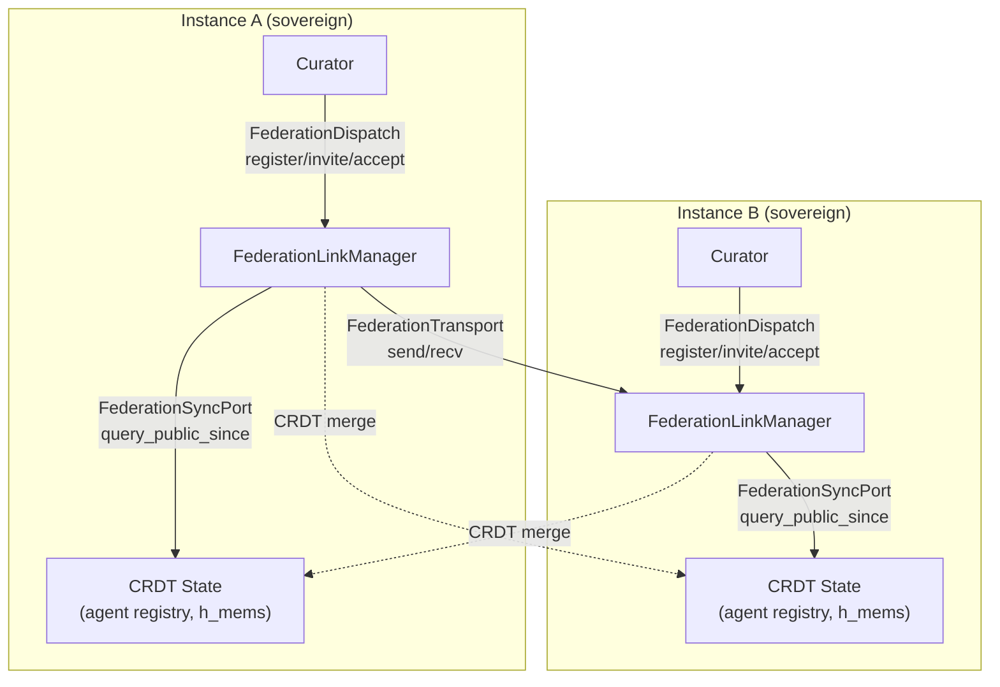
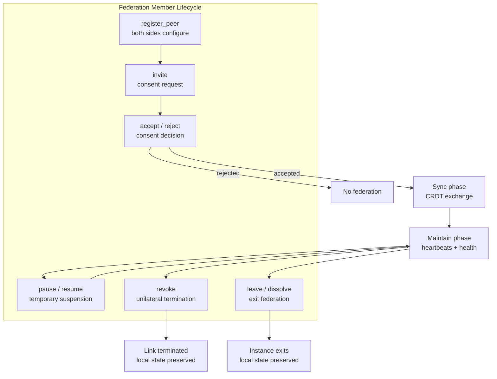
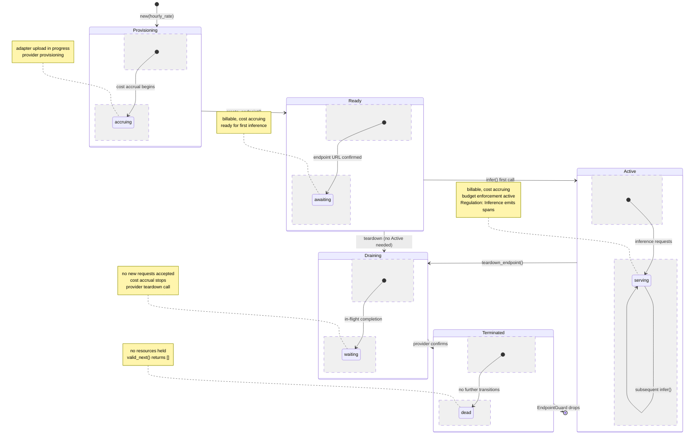

# Federation and Transport

This document explains hKask's cross-instance federation protocol — how agents running on different hKask instances discover each other, synchronize state, and communicate as if they shared a single namespace. Federation is the mechanism by which sovereign instances choose to collaborate without surrendering sovereignty.

---

## 1. Why Federation?

### Statement

hKask instances are sovereign by design (P1). Each instance owns its data, its agents, and its delegation boundaries. But agents need to communicate across instances — a Curator on instance A may need to coordinate with a skill-execution agent on instance B. Federation solves this without violating sovereignty. Instances remain independent; they choose to federate. The protocol is opt-in, consent-bound, and revocable — consistent with P2 (Affirmative Consent).

### Evidence

The federation architecture has three layers: the transport layer (raw message passing), the sync layer (CRDT-based state synchronization), and the dispatch layer (high-level lifecycle orchestration). Each layer is a port trait in `hkask-ports`, with a concrete implementation in `hkask-federation`.

#### The FederationDispatch Contract

The `FederationDispatch` trait at `crates/hkask-ports/src/federation.rs:90` defines the high-level port contract. Its methods model the full federation member lifecycle:

```rust
pub trait FederationDispatch: Send + Sync {
    async fn register_peer(
        &self,
        replica: ReplicaId,
        server_domain: String,
        matrix_domain: String,
        matrix_id: String,
    );
    async fn invite(
        &self,
        peer: ReplicaId,
        message: Option<String>,
    ) -> Result<(), FederationDispatchError>;
    async fn accept(&self, peer: ReplicaId) -> Result<(), FederationDispatchError>;
    async fn reject(
        &self,
        peer: ReplicaId,
        reason: Option<String>,
    ) -> Result<(), FederationDispatchError>;
    async fn pause(&self, peer: ReplicaId, reason: String) -> Result<(), FederationDispatchError>;
    async fn resume(&self, peer: ReplicaId) -> Result<(), FederationDispatchError>;
    async fn revoke(&self, peer: ReplicaId, reason: String) -> Result<(), FederationDispatchError>;
    async fn leave(&self, reason: String) -> Result<(), FederationDispatchError>;
    async fn dissolve(&self, reason: String) -> Result<(), FederationDispatchError> { ... }
    async fn linked_peers(&self) -> Vec<ReplicaId>;
    async fn link_state(&self, peer: &ReplicaId) -> Option<String>;
}
```

The lifecycle is: `register_peer` → `invite` → `accept`/`reject` → `pause`/`resume` → `revoke` → `leave`/`dissolve`. This trait lives in the ports layer — instances can swap federation implementations without changing the agents that use them. The concrete implementor is `FederationLinkManager` in `hkask-federation`.

The error type `FederationDispatchError` has a single variant: `OperationFailed(String)`. This is a port boundary — the trait hides implementation details of the concrete link manager. Implementors map their domain errors into this vocabulary via `From` conversion.

#### The Transport Layer

`FederationTransport` at `crates/hkask-ports/src/federation.rs:51` is the raw message-passing boundary:

```rust
pub trait FederationTransport: Send + Sync {
    async fn send(
        &self,
        peer: &ReplicaId,
        message: FederationMessage,
    ) -> Result<(), FederationTransportError>;
    async fn recv(&self) -> Result<(ReplicaId, FederationMessage), FederationTransportError>;
    fn simulate_partition(&self, _peer: &ReplicaId) {}
    fn heal_partition(&self, _peer: &ReplicaId) {}
}
```

The `simulate_partition()` and `heal_partition()` methods are testing primitives — they allow the federation test suite to simulate network partitions without real network failures. The `FederationMessage` enum models three message types: `SyncRequest` (version vector), `SyncResponse` (deltas + version vector), and `InvitationRequest`/`InvitationResponse` (the consent handshake).

#### The Sync Layer

`FederationSyncPort` at `crates/hkask-ports/src/federation.rs:70` is the CRDT cursor-based synchronization boundary:

```rust
pub trait FederationSyncPort: Send + Sync {
    fn query_public_since(
        &self,
        cursor: u64,
        limit: usize,
    ) -> Result<Vec<FederatedTriple>, FederationSyncError>;
    fn cursor_for(&self, source: &ReplicaId) -> u64;
    fn advance_cursor(&self, source: &ReplicaId, cursor: u64);
}
```

This trait abstracts the CRDT state synchronization behind a cursor-based API. `query_public_since()` returns public triples that have changed since the given cursor; `cursor_for()` retrieves the current sync position for a given peer; `advance_cursor()` updates it. The `FederatedTriple` type carries entity, attribute, value (JSON), and confidence — a minimal representation that avoids depending on `hkask-storage`.

### Diagram


<!-- DIAGRAM_ALIGNMENT
id: DIAG-FED-001
verified_date: 2026-07-12
verified_against: crates/hkask-ports/src/federation.rs, crates/hkask-federation/src/lib.rs
status: VERIFIED
-->

---

## 2. CRDT-Based Sync

### Statement

Federation uses Conflict-free Replicated Data Types (CRDTs) for state synchronization. This design exists because CRDTs have a key property: any two replicas that have seen the same set of updates will converge to the same state, regardless of the order in which they received those updates.[^crdt] This eliminates the need for consensus protocols, enables offline operation, and tolerates network partitions.

### Evidence

CRDTs provide three properties that make them ideal for federation:

- **No consensus protocol needed** — there is no leader election, no voting, no quorum. Each instance independently applies updates as they arrive.
- **Instances can go offline and resync** — when an instance comes back online, it exchanges version vectors with its peers and catches up on missed deltas. No conflict resolution is required.
- **Network partitions are tolerated** — each side continues operating independently during a partition. When the partition heals, the CRDT merge reconciles state automatically.

The `crdt` module in `hkask-federation` implements the CRDT data structures used for agent registry synchronization. The `FederationDelta` type carries `h_mems: Vec<FederatedTriple>` and `triples_added: u64` — the incremental state changes since the last sync.

### Implications

The CRDT choice means that hKask federation is eventually consistent, not strongly consistent. This is deliberate: strong consistency would require a consensus protocol (Raft, Paxos), which introduces leader election, network quorums, and partition sensitivity — all of which conflict with hKask's sovereignty-first design. A sovereign instance should not be dependent on a leader in another instance for its operations. CRDTs allow each instance to remain fully autonomous while still converging with its peers over time.

---

## 3. Link Lifecycle

### Statement

Federation links follow a four-phase lifecycle: Discover, Connect, Sync, Maintain. Each phase implements a specific sovereignty guarantee.

### Evidence

1. **Discover** — Instance A discovers Instance B via a configured registry URL or manual peer list. Discovery is mutual — both sides must know about each other.

2. **Connect** — A sends a link request containing its `ReplicaId` and public key. B validates the request against its consent policy and accepts or rejects. This step implements P2: federation is opt-in and consent-bound. The `InvitationRequest` message carries `from_replica`, `server_domain`, `matrix_domain`, `curator_matrix_id`, and an optional `message`. The `InvitationResponse` carries `accepted: bool`, `from_replica`, and an optional `reason`.

3. **Sync** — Once linked, the instances exchange CRDT state. The first sync is a full state transfer; subsequent syncs are incremental (delta-based). The sync protocol ensures eventual consistency via version vectors.

4. **Maintain** — Periodic heartbeat syncs keep state current. Link health is monitored: if a peer is unreachable for a configurable threshold, the link is marked degraded and a Regulation span is emitted.

---

## 4. Merged Registries

### Statement

When instances federate, their agent registries merge. A Curator on instance A can discover agents on instance B as if they were local. The merge is namespace-aware — agent IDs are qualified by their home instance to prevent collisions.

### Evidence

The merge is implemented as a CRDT merge of the registry state. Each instance contributes its own agents; the merged registry is the union. Conflicts (same agent ID on two instances) are resolved by `ReplicaId` precedence — the instance with the lexicographically lower `ReplicaId` wins.

### Implications

The namespace-aware merge means that federation never creates identity collisions. An agent `alice` on instance A and an agent `alice` on instance B remain distinct — they are qualified as `A:alice` and `B:alice` in the merged registry. This is critical for OCAP enforcement: a delegation token issued by `A:alice` cannot be used to access resources owned by `B:alice`, because the token's `delegated_from` field carries the full qualified WebID.

---

## 5. Regulation Integration

### Statement

Federation events emit Regulation spans for observability. If federation links degrade across the board, the Regulation can escalate to the Curator for investigation.

### Evidence

Federation spans:

| Span | When Emitted |
|------|-------------|
| `reg.federation.link.established` | New federation link created |
| `reg.federation.link.degraded` | Peer unreachable, link health degraded |
| `reg.federation.link.terminated` | Link explicitly terminated |
| `reg.federation.sync.completed` | CRDT sync finished successfully |
| `reg.federation.sync.failed` | Sync error (will retry) |

These spans feed the Regulation homeostatic loop. The `SetPoints` struct includes 8 federation health fields: sync latency (warning 5s, critical 30s), CRDT divergence (2× baseline), link downtime (warning 1h, critical 24h), pause duration (24h), invitation rate (5/hr), and registry divergence (10 entries/sync). When any of these thresholds are breached, the Regulation escalates to the Curator.

### Implications

Federation is not a separate observability stack — it is integrated into the same Regulation that monitors all other system operations. This means the Curator's metacognition layer can reason about federation health alongside energy health, variety health, and seam health. A federation degradation event is treated the same as any other algedonic signal: it flows through the `AlgedonicManager`, produces an `EscalationAlert`, and reaches the `MetacognitionLoop` for assessment and potential directive issuance.

---

## 6. Sovereignty Guarantees

### Statement

Federation does not weaken hKask's sovereignty guarantees. The four guarantees below are structural, not configurable.

### Evidence

- **No ambient sharing:** An instance only federates with peers it explicitly configures. The `register_peer` method is the only way to add a peer, and it requires explicit server and Matrix domain information.

- **Revocable:** Any instance can terminate a federation link at any time via `revoke`, `leave`, or `dissolve`. The CRDT state on the local side continues operating independently — the instance does not lose data when a link is terminated.

- **OCAP-preserving:** Federation messages pass through the OCAP membrane. A federated agent cannot access tools or data that its capability tokens do not authorize. The `DelegationToken` carries `delegated_from` and `delegated_to` WebIDs that are namespace-qualified by home instance, preventing cross-instance capability confusion.

- **P4-compliant:** Each instance's pod boundary remains its OCAP enforcement perimeter. Federation does not create cross-pod access paths. The `PerPodToolBinding` struct prevents a pod from even addressing another pod's governed tool, regardless of whether that pod is local or federated.

### Diagram


<!-- DIAGRAM_ALIGNMENT
id: DIAG-FED-002
verified_date: 2026-07-12
verified_against: crates/hkask-ports/src/federation.rs, crates/hkask-federation/src/lib.rs
status: VERIFIED
-->

### Implications

Federation is the mechanism by which hKask scales beyond a single instance while preserving sovereignty. The design is explicitly opt-in at every level: an instance chooses to register a peer, chooses to invite, chooses to accept, and can revoke at any time. The CRDT-based sync means that no instance is dependent on another for correctness — each instance's state is independently valid, and convergence is eventual, not required. The Regulation integration means that federation health is monitored with the same rigor as all other system health dimensions. This is P1 (User Sovereignty) and P2 (Affirmative Consent) applied to the federation layer: the system never federates without explicit consent, and it never surrenders local autonomy to a federated peer.

---

## 7. Relationship to Other Subsystems

| Subsystem | Federation Role |
|-----------|----------------|
| **Regulation** | Monitors link health, emits federation spans, escalates degraded links to Curator |
| **Registry** | Merged agent registries via CRDT sync — namespace-aware to prevent identity collisions |
| **Curator** | Receives federation escalations (degraded links, sync failures), can issue directives to adjust federation set-points |
| **A2A** | Agent-to-agent messages route through federation when agents are on different instances — the `FederationTransport` carries the message, the OCAP membrane enforces authorization |
| **Consent** | Federation links require mutual consent (P2) — the invite/accept/reject handshake is the consent protocol |

---

## References

[^crdt]: Shapiro, M., Preguiça, N., Baquero, C., & Zawirski, M. (2011). "Conflict-free replicated data types." *International Symposium on Stabilization, Safety, and Security of Distributed Systems*, 386–400. The foundational CRDT paper establishing the convergence properties that make federation without consensus possible.

- Miller, M. (2006). "Robust Composition." The OCAP model that ensures federation does not create cross-instance capability confusion.
- Magna Carta at `docs/architecture/core/magna-carta.md` — P1 (User Sovereignty) and P2 (Affirmative Consent) principles that govern federation design.
---

## Inlined Diagrams

The following Mermaid diagrams were inlined from the former `docs/diagrams/` directory per DOCUMENTATION_STANDARDS §1.

### Adapter Endpoint Lifecycle State Machine

*Inlined from `docs/diagrams/state-adapter-lifecycle.md`*


# Adapter Endpoint Lifecycle State Machine

## Description

The `EndpointLifecycle` in `hkask-mcp-training::adapter` governs every inference endpoint through five strictly-validated phases. Construction enters `Provisioning`. The `create_endpoint()` flow in `AdapterRouter` uploads the adapter and transitions to `Ready`. First inference triggers `Ready → Active`. Teardown (explicit or via RAII `EndpointGuard` drop) moves through `Draining` to `Terminated`. Cost accrues only in billable phases (`Provisioning`, `Ready`, `Active`). Every transition is validated by `valid_next()` and emits a Regulation span.

**Key source:** `mcp-servers/hkask-mcp-training/src/adapter/endpoint_lifecycle.rs:14-45` (enum + `valid_next`), `mcp-servers/hkask-mcp-training/src/adapter/adapter_router/mod.rs:464-649` (transition triggers).


<!-- DIAGRAM_ALIGNMENT
id: DIAG-FED-003
verified_date: 2026-07-12
verified_against: crates/hkask-ports/src/federation.rs, crates/hkask-federation/src/lib.rs
status: VERIFIED
-->

## Transition Table

| From | To | Trigger | Source Location |
|------|----|---------|-----------------|
| `[*]` | `Provisioning` | `EndpointLifecycle::new(hourly_rate)` | `endpoint_lifecycle.rs:103` |
| `Provisioning` | `Ready` | `AdapterRouter::create_endpoint()` after upload + provision | `adapter_router/mod.rs:506` |
| `Ready` | `Active` | `AdapterRouter::infer()` first call | `adapter_router/mod.rs:585` |
| `Ready` | `Draining` | `AdapterRouter::teardown_endpoint()` (skip Active) | `adapter_router/mod.rs:613` |
| `Active` | `Active` | `AdapterRouter::infer()` subsequent calls (self-loop) | `adapter_router/mod.rs:568` |
| `Active` | `Draining` | `AdapterRouter::teardown_endpoint()` graceful drain | `adapter_router/mod.rs:613` |
| `Draining` | `Terminated` | Provider teardown completes, state committed | `adapter_router/mod.rs:631` |
| `Terminated` | `[*]` | `EndpointGuard` RAII drop (fire-and-forget spawn) | `adapter_router/mod.rs:700` |

## Guard Conditions

- **Provisioning → Ready:** Provider confirms deployment URL; `valid_next()` enforces this is the only exit.
- **Ready → Draining:** Permitted by `valid_next()` — endpoint can be torn down without ever serving traffic.
- **Active → Active:** Self-loop allowed; `is_billable()` returns true; cost continues accruing.
- **Any billable → Draining:** Cost accrued for time spent in billable phase before transition.
- **Terminated:** `valid_next()` returns empty slice — no further transitions possible.

## Budget Enforcement

`EndpointLifecycle` tracks cost via `hourly_rate * elapsed_hours` in billable phases. `is_over_budget(budget_limit)` gates whether the endpoint should be drained. `drain_all_owner()` in `AdapterRouter` drains all billable endpoints.

---

## Cross-Reference

- [`hKask-architecture-master.md` § LoRA Adapter Lifecycle & Inference Composition](../architecture/core/hKask-architecture-master.md#lora-adapter-lifecycle--inference-composition)
- [`endpoint_lifecycle.rs`](mcp-servers/hkask-mcp-training/src/adapter/endpoint_lifecycle.rs) — `EndpointPhase` enum, `valid_next()`, `EndpointLifecycle::transition()`
- [`adapter_router/mod.rs`](mcp-servers/hkask-mcp-training/src/adapter/adapter_router/mod.rs) — `create_endpoint()`, `infer()`, `teardown_endpoint()`, `EndpointGuard`

