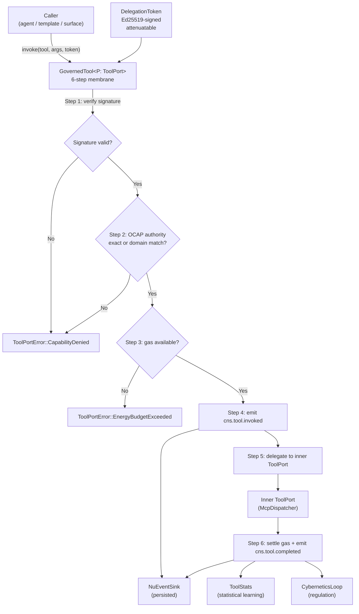
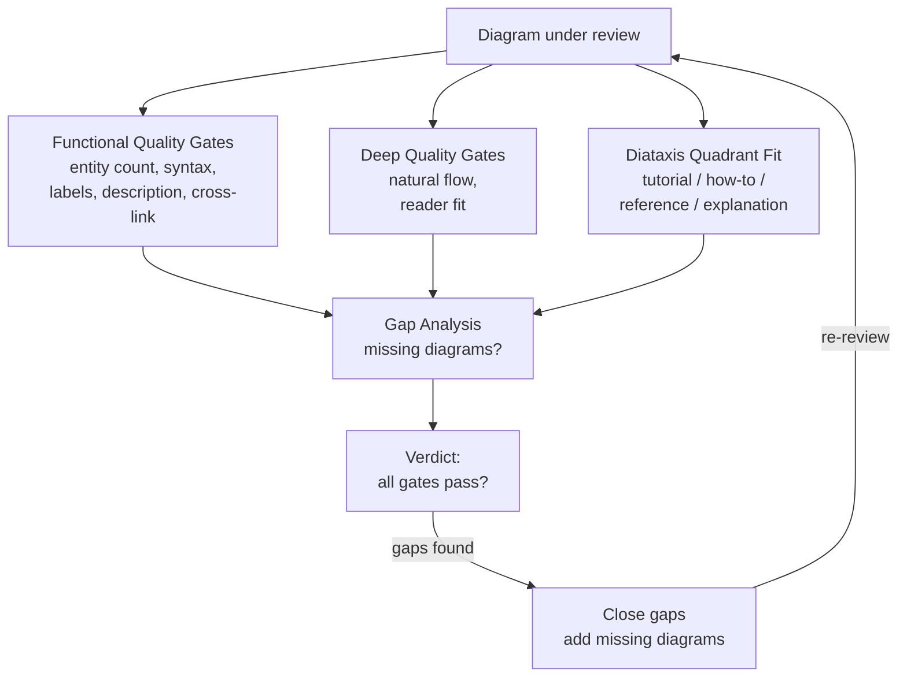
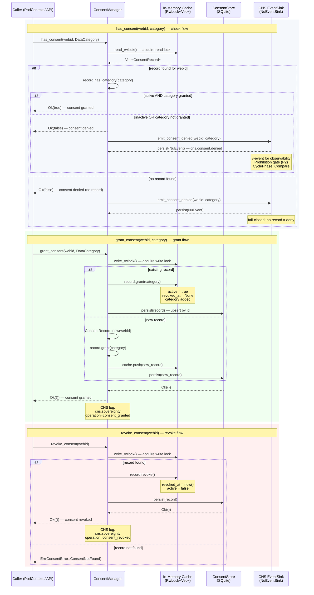
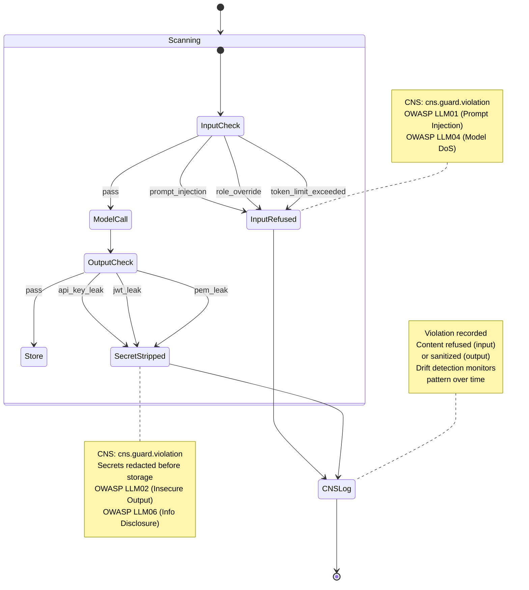
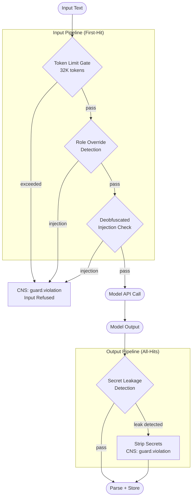

# Sovereignty and OCAP

This document consolidates hKask's sovereignty enforcement architecture: the Object Capability (OCAP) MCP dispatch membrane and the Diataxis quality review methodology that audits the system's diagrams. These two topics share a single theme — boundary enforcement. OCAP enforces the security boundary at every tool invocation; the Diataxis review enforces the documentation quality boundary at every diagram. Both are guardrails that exist because unenforced boundaries are not boundaries at all.

---

## 1. Object Capability (OCAP) MCP Dispatch

### Statement

Object Capability (OCAP) security is a design discipline rooted in Mark Miller's work: one can only access something if one holds an unforgeable reference (a "capability") to it.[^miller] In hKask, the capability is a `DelegationToken` — an Ed25519-signed, attenuatable bearer proof that the holder has authority from a specific issuer to perform a specific action on a specific resource. This design exists because hKask's Magna Carta P4 (Clear Boundaries) requires that every agent, pod, and template invocation operates within explicit, unforgeable capability boundaries. There is no ambient authority. No "god token." No admin override. Every access path goes through the same gate.

### Evidence

#### The DelegationToken

Located in `crates/hkask-capability/src/token_types.rs`, the `DelegationToken` struct carries:

- `resource: DelegationResource` — what kind of thing (Tool, Template, Registry, Key)
- `resource_id: String` — which specific thing (e.g., `"cns_health"`, `"cns"`)
- `action: DelegationAction` — Read, Write, or Execute
- `delegated_from: WebID` and `delegated_to: WebID` — provenance chain
- `signature: TokenSignature` — 64-byte Ed25519 signature
- `public_key: Ed25519PublicKey` — asymmetric verification key
- `attenuation_level: u8` / `max_attenuation: u8` — bounded to `SYSTEM_MAX_ATTENUATION` (7)
- `caveats: Vec<Caveat>` — additive restrictions inherited by children

Tokens are built via `DelegationTokenBuilder` and signed using the issuer's Ed25519 `SigningKey`. The token ID is a SHA-256 hash of (resource + resource_id + action + from + to), making tokens content-addressable. The `verify()` method at line 274 reconstructs the canonical signing payload byte-for-byte and checks the signature against the token's embedded public key. This is asymmetric — one only needs the public key to verify, not a shared secret.

#### Attenuation

The `attenuate()` method (line 355) creates a child token with `attenuation_level + 1`, 1-hour expiry, and a chained context nonce (`"root-attenuated-uuid"`). All caveats are inherited. `can_attenuate()` returns false when `attenuation_level >= max_attenuation`, enforcing that tokens can only be weakened, never strengthened — the core OCAP property.

#### The GovernedTool Membrane

The `GovernedTool<P: ToolPort>` at `crates/hkask-cns/src/governed_tool.rs` is the singular membrane through which all MCP tool invocations pass. It implements `ToolPort` itself — this is Miller's membrane object pattern: the wrapper IS a tool port, indistinguishable to callers, but it adds governance.

#### The 6-Step Dispatch

The `invoke()` method (line 200) enforces a strict sequence:

1. **Check (cryptographic)** — `token.verify()` performs Ed25519 signature verification. Failure returns `ToolPortError::CapabilityDenied`. No further steps execute.

2. **Check (OCAP authority)** — Two-path verification. Path 1 (exact): `verify_capability_exact()` checks `token.is_valid_for(DelegationResource::Tool, tool_name, DelegationAction::Execute)`. This handles ad-hoc invocation tokens minted with the exact tool name. Path 2 (domain): `verify_capability_domain_fallback()` looks up the tool's `required_capability` metadata and uses `capabilities_match()` to test whether the token's domain covers the required domain. For example, an agent token for `tool:cns:execute` grants access to any tool whose `required_capability` is `tool:cns:execute` (via `capabilities_match` at `crates/hkask-capability/src/resources.rs:122`). The action hierarchy is Execute ≥ Write ≥ Read.

3. **Reserve (gas)** — `CyberneticsLoop::can_proceed()` checks whether the agent's gas budget has enough remaining capacity. If `ToolStats` is wired (Layer 1), the reserve uses the 90th percentile of the fitted LogNormal cost distribution; otherwise it falls back to the `EnergyEstimator` point estimate. If insufficient, a `cns.gas.depleted` span is emitted and `ToolPortError::EnergyBudgetExceeded` is returned. Then `reserve_gas()` atomically decrements the budget. This is the hold-settle pattern: gas is reserved before invocation, then settled after with the actual cost. If actual < reserved, the difference is refunded — preventing gas leaks from over-estimation.

4. **ν-event (invoked)** — A `NuEvent` with span `SpanNamespace("cns.tool")` and path `"invoked"` is persisted via `NuEventSink`. The phase is `CyclePhase::Sense`, marking this as an observation entering the CNS. The payload carries server, tool, estimated_cost, and `settled: false`.

5. **Delegate** — The inner `ToolPort` is called. This is the only step that does actual work. Everything before was permission; everything after is accounting.

6. **Settle + ν-event (completed)** — `settle_gas()` refunds the difference between reserved and actual cost. A `cns.gas.settled` span is emitted. Then a `cns.tool.completed` span is emitted with the parent set to the invoked event's ID, creating a causal chain. Additionally, `ToolStats::record()` logs the outcome for statistical learning, and `ToolConsumptionEvent` is sent on a direct `mpsc` channel to CyberneticsLoop.

#### Fail-Closed Semantics

Every step in the chain fails closed. Cryptographic verification fails? Denied. OCAP check fails? Denied. Gas budget exhausted? Denied. The `governed_tool.rs` tests at line 505 verify this: `exact_match_denies_wrong_tool`, `domain_capability_denies_different_domain`. The `CapabilityDenied` error is returned before any resource is consumed. In the `sovereignty.rs` module, `SovereigntyChecker::can_access()` adds a second gate: even with a valid capability token, sovereign data requires the requester to BE the owner AND have explicit consent. `DenyAllConsent` is the default at `crates/hkask-agents/src/sovereignty.rs:31` — a misconfigured checker always denies.

#### PerPodToolBinding — Structural Pod Isolation

At `crates/hkask-agents/src/pod/deployment.rs`, `PodDeployment` holds `tools: PerPodToolBinding`, which wraps `mcp_runtime: Arc<dyn MCPRuntimePort>` and an optional `governed_tool: Option<Arc<GovernedTool<RawMcpToolPort>>>`. A pod can invoke tools only through its own binding and the configured system/A2A trust roots; cross-pod access requires a valid `DelegationToken`. SQLCipher database encryption is a separate concern and consistently uses the canonical `HKASK_DB_PASSPHRASE` resolver.

This means P4.1 (pod boundary = OCAP perimeter) is enforced by construction: the type system prevents a pod from even addressing another pod's governed tool. The only path is through the proper delegation chain.

### Diagram


<!-- DIAGRAM_ALIGNMENT
id: DIAG-SOV-001
verified_date: 2026-07-12
verified_against: crates/hkask-capability/src/lib.rs, crates/hkask-cns/src/governed_tool.rs
status: VERIFIED
-->

### Implications

The Magna Carta at `docs/architecture/core/magna-carta.md` defines P4 as a dual enforcement gate: `require_capability` (does one hold a token?) and `require_sovereignty` (does the data owner consent?). `GovernedTool` enforces the capability half; `SovereigntyChecker` enforces the sovereignty half. Together they form the unbypassable two-gate membrane. Every tool invocation, memory access, and template execution passes through both. The `CapabilityChecker` at `crates/hkask-capability/src/verification.rs` provides a unified check entry point, combining both gates into a single fail-closed decision.

The system trusts the type system, not runtime configuration. If the code compiles with these membranes in place, the boundaries hold. The `DenyAllConsent` default ensures that a misconfigured system denies everything rather than allowing everything — fail-closed is not a preference, it is the only safe default for a sovereignty-enforcing system.

The 6-step sequence is structural, not configurable. This is the loom-and-thread separation applied to security: the thread (YAML manifests, agent definitions) cannot reorder, skip, or bypass any step in the membrane. A manifest that declares `"gas_bypass": true` is a parse error. The membrane is the loom.

---

## 2. Diataxis Quality Review — Algo Classification + Guard

### Statement

The Diataxis quality review is the methodology hKask uses to audit its own documentation diagrams against the Diataxis framework (tutorial, how-to, reference, explanation) and the `diataxis-diagram` skill registry's quality gates. It exists because documentation diagrams are architectural artifacts — they must be accurate, complete, and consistent with source code, or they become misleading rather than illuminating. An unreviewed diagram is a liability; a reviewed diagram is an asset.

### Evidence

The review evaluated four diagrams against Diataxis quality gates:

| Diagram | Type | File | Quadrant |
|---|---|---|---|
| Algo-Style Classification Flow | flowchart | `flowchart-algo-classification.md` | Reference |
| Guard Pipeline | flowchart | `flowchart-guard-pipeline.md` | Reference |
| Classification-to-Memory Sequence | sequence | `sequence-classify-to-memory.md` | Explanation |
| Guard Violation Lifecycle | state | `state-guard-violations.md` | Reference |

#### Functional Quality Gates

| Gate | Dual Flowchart | Guard Flowchart | Sequence | State |
|---|---|---|---|---|
| Entity count matches source | 15 nodes, 12 edges — covers classify_one, extract_triples_one, merge_extractions | 9 nodes, 9 edges — covers all 4 active scanners (TokenLimit, RoleOverride, Deobfuscate, Secrets) | 7 participants, 6 alt/par blocks — covers full path | 4 states, 6 transitions — covers all violation types |
| Mermaid syntax valid | flowchart TD, correct node shapes | flowchart TD, correct node shapes | sequenceDiagram, correct par/alt/loop | stateDiagram-v2, correct note placement |
| Plain-English labels | No raw identifiers | OWASP risk numbers on notes | Participant aliases used | OWASP categories in notes |
| Description paragraph | Above diagram | Above diagram | Above diagram | Above diagram |
| Cross-link to code | Source file paths | Source + OWASP ref | Source file paths | Source + OWASP ref |

#### Deep Quality Gates

| Diagram | Assessment |
|---|---|
| **Dual Flowchart** | Clear top-down flow: source → guard → models → integrate → store. The parallel model subgraph and epistemic integration subgraph correctly separate concerns. Readable without knowing Rust. |
| **Guard Flowchart** | First-hit pipeline on input, all-hits on output — the subgraph division makes this explicit. The distinction between "Input Pipeline" and "Output Pipeline" is visually clear. |
| **Sequence Diagram** | Shows temporal ordering that the flowchart cannot: parallel model calls, sequential guard checks, CNS emission interleaved with processing. The alt blocks precisely capture the decision points. |
| **State Diagram** | The composite state `Scanning` with nested transitions correctly models the guard as a state machine. Notes connect each violation to its OWASP category. |

#### Diataxis Quadrant Fit

| Diagram | Quadrant | Assessment |
|---|---|---|
| Dual Flowchart | Reference | Austere, complete, mirrors code structure. No alternatives shown — just the actual path. |
| Guard Flowchart | Reference | Neutral, descriptive. Lists what happens, not why. |
| Sequence | Explanation | Shows context and relationships. The flow from source to memory with guard interleaving explains why the architecture is structured this way. |
| State | Reference | Maps violation types to OWASP categories. Consultable, not tutorial. |

#### Gaps Found and Closed

Two gaps were identified during review, all closed:

1. **No Remember Template Diagram** — Closed by adding `flowchart-memory-remember.md`, showing the 3-step FlowDef cascade (operation-selector → remember-episodic → remember-semantic) with algo fusion judge (`judge: algo`) with `merge_json_values` integration on each step.

2. **No Architecture Overview** — Closed by adding `flowchart-architecture-overview.md`, showing how all four subsystems compose under P3.1 governance. Includes OWASP alignment table and subsystem-to-crate mapping.

### Diagram


<!-- DIAGRAM_ALIGNMENT
id: DIAG-SOV-002
verified_date: 2026-07-12
verified_against: crates/hkask-capability/src/lib.rs, crates/hkask-cns/src/governed_tool.rs
status: VERIFIED
-->

### Implications

The Diataxis review is itself a feedback loop — the same sense→compare→compute→act→verify cycle that governs the CNS. The functional gates are the sense phase (does the diagram match the code?); the deep quality gates are the compare phase (does it fit the reader's need?); the quadrant fit is the compute phase (is it in the right Diataxis quadrant?); the gap analysis and closure are the act phase. The review is not a one-time audit — it is a recurring process that catches drift between documentation and code, just as the `SeamWatcher` catches drift between specification and implementation. A diagram that was accurate when drawn may become inaccurate when the code changes; the Diataxis review is the mechanism that detects and corrects this drift.

The OWASP anchoring of the guard and state diagrams is deliberate — security-relevant diagrams must connect to established threat taxonomies, not invent their own. This is the same principle as the dual-axis ontology: hKask does not invent ontologies, it bridges to existing ones. The guard diagrams bridge to OWASP LLM Top 10; the state diagram maps violation types to specific OWASP risk numbers.

---

## References

[^miller]: Miller, M. (2006). "Robust Composition: Towards a Unified Approach to Access Control and Concurrency Control." PhD thesis, Johns Hopkins University. The membrane object pattern and the OCAP security model underlying `GovernedTool` and `DelegationToken`.

- Diataxis Framework. (2021). Diataxis: A framework for documentation thinking. https://diataxis.fr/
- OWASP. (2024). OWASP Top 10 for LLM Applications. https://owasp.org/www-project-top-10-for-large-language-model-applications/
- Magna Carta document at `docs/architecture/core/magna-carta.md` — P4 (Clear Boundaries) principle definition.
---

## Inlined Diagrams

The following Mermaid diagrams were inlined from the former `docs/diagrams/` directory per DOCUMENTATION_STANDARDS §1.

### OCAP Delegation Token Attenuation Chain

*Inlined from `docs/diagrams/class-ocap-attenuation.md`*


# OCAP Delegation Token Attenuation Chain

## Description

The OCAP (Object Capability) delegation system in `hkask-capability` uses Ed25519-signed `DelegationToken` instances with cryptographic attenuation. A root token at depth 0 is minted by a trusted issuer (e.g., the A2A root authority). Each delegation step calls `attenuate()` / `attenuate_with_expiry()`, incrementing `attenuation_level` and chaining `context_nonce` (e.g. `root-attenuated-uuid-...`). The `CapabilityChecker` verifies token integrity, root trust, holder match, and resource/action alignment. Attenuation is bounded by `SYSTEM_MAX_ATTENUATION` (7) — a token at depth 7 cannot be further attenuated. Each level reduces authority: the attenuated token inherits parent caveats and gains a 1-hour default expiry.

**Key source:** `crates/hkask-capability/src/token_types.rs:17` (`SYSTEM_MAX_ATTENUATION = 7`), `token_types.rs:347-398` (`attenuate`, `attenuate_with_expiry`), `verification/checker.rs:20-33` (`CapabilityChecker`), `resources.rs` (`capabilities_match`).

```mermaid
classDiagram
    class DelegationToken {
        +WebID delegated_from
        +WebID delegated_to
        +DelegationResource resource
        +String resource_id
        +DelegationAction action
        +u8 attenuation_level
        +u8 max_attenuation
        +String context_nonce
        +Vec~Caveat~ caveats
        +Option~i64~ expires_at
        +verify() bool
        +attenuate(WebID, SigningKey, i64) Option~DelegationToken~
        +can_attenuate() bool
        +is_valid_for(DelegationResource, String, DelegationAction) bool
        +is_expired(i64) bool
        +holder() WebID
        +issuer() WebID
        +caveat_ids() Vec~str~
        +verify_attenuation_chain(String, u8) bool
        +grants_resource(DelegationResource) bool
    }

    class CapabilityChecker {
        -Option~SigningKey~ signing_key
        -Vec~Ed25519PublicKey~ trusted_roots
        -bool enforce_roots
        +check(DelegationToken, WebID, DelegationResource, String, DelegationAction) bool
        +verify(DelegationToken) bool
        +verify_with_time(DelegationToken, i64) bool
        +grant(DelegationResource, String, DelegationAction, WebID, WebID) DelegationToken
        +attenuate(DelegationToken, WebID, i64) Option~DelegationToken~
        +grant_tool(String, WebID, WebID) DelegationToken
        +grant_registry(DelegationAction, WebID, WebID) DelegationToken
    }

    class RootToken {
        attenuation_level: 0
        max_attenuation: 7
        "full authority"
    }
    class Depth1 {
        attenuation_level: 1
        "1hr default expiry"
    }
    class Depth2 {
        attenuation_level: 2
    }
    class Depth7Max {
        attenuation_level: 7
        "cannot attenuate further"
    }

    CapabilityChecker --> DelegationToken : verifies
    CapabilityChecker --> DelegationToken : grants/attenuates

    RootToken --> Depth1 : attenuate()
    Depth1 --> Depth2 : attenuate()
    Depth2 --> "..." : attenuate()
    "..." --> Depth7Max : attenuate()

    note for RootToken "Root token minted by\ntrusted issuer (A2A root)"
    note for Depth1 "Authority reduced:\nexpiry enforced\ncaveats inherited"
    note for Depth7Max "Terminal depth:\ncan_attenuate() → false\nSYSTEM_MAX_ATTENUATION = 7"
```
<!-- DIAGRAM_ALIGNMENT
id: DIAG-SOV-003
verified_date: 2026-07-12
verified_against: crates/hkask-capability/src/lib.rs, crates/hkask-cns/src/governed_tool.rs
status: VERIFIED
-->

## Attenuation Chain Rules

| Depth | `can_attenuate()` | Expiry Behavior | Context Nonce |
|-------|-------------------|-----------------|---------------|
| 0 (Root) | `true` (0 < 7) | None by default | `root-uuid` |
| 1 | `true` (1 < 7) | Default 1hr from `current_time` | `root-attenuated-uuid1` |
| 2–6 | `true` | Inherits parent expiry if set | Chains `-attenuated-` separator |
| 7 (Max) | **`false`** | N/A — cannot attenuate | N/A |

## Verification Flow

1. **Ed25519 signature check** (`token.verify()`) — verifies self-signature integrity.
2. **Root trust enforcement** (`enforce_roots`) — if enabled, token's `public_key` must be in `trusted_roots`. Fail-closed: empty `trusted_roots` rejects all tokens.
3. **Expiry check** — `token.is_expired(current_time)` gate.
4. **Holder match** — `token.delegated_to == holder`.
5. **Resource + Action match** — `token.is_valid_for(resource, resource_id, action)`.

---

## Cross-Reference

- [`hKask-architecture-master.md` § OCAP Capability Model](../architecture/hKask-architecture-master.md#ocap-capability-model)
- [`token_types.rs`](crates/hkask-capability/src/token_types.rs) — `DelegationToken`, `SYSTEM_MAX_ATTENUATION`, `attenuate()`, `verify_attenuation_chain()`
- [`verification/checker.rs`](crates/hkask-capability/src/verification/checker.rs) — `CapabilityChecker`, `check()`, `verify()`, `grant()`
- [`resources.rs`](crates/hkask-capability/src/resources.rs) — `capabilities_match()`, `CapabilitySpec`


### Consent Check and Grant/Revoke Sequence

*Inlined from `docs/diagrams/sequence-consent-flow.md`*


# Consent Check and Grant/Revoke Sequence

## Description

The `ConsentManager` in `hkask-agents` enforces Magna Carta P1 (User Sovereignty) and P2 (Affirmative Consent) through explicit, scoped, revocable consent grants. Every data access check flows through `has_consent()`, which validates: (1) an active `ConsentRecord` exists for the user's `WebID`, (2) the requested `DataCategory` is in `granted_categories`, and (3) the record is not revoked (`active == true`). On denial, a `cns.consent.denied` ν-event is emitted to the CNS `NuEventSink` for observability — this is a Prohibition-gate observation, not a regulatory feedback loop. The `SovereigntyConsent` trait implementation translates storage errors into `false` (fail-closed). `grant_consent()` and `revoke_consent()` modify the in-memory cache and persist to the SQLite-backed `ConsentStore`.

**Key source:** `crates/hkask-agents/src/consent.rs:136-144` (`ConsentManager` struct), `consent.rs:316-338` (`has_consent`), `consent.rs:243-273` (`grant_consent`), `consent.rs:283-300` (`revoke_consent`), `consent.rs:344-366` (`emit_consent_denied`), `consent.rs:388-395` (`SovereigntyConsent` impl).


<!-- DIAGRAM_ALIGNMENT
id: DIAG-SOV-004
verified_date: 2026-07-12
verified_against: crates/hkask-capability/src/lib.rs, crates/hkask-cns/src/governed_tool.rs
status: VERIFIED
-->

## Consent Record Lifecycle

| Operation | `active` | `granted_categories` | `revoked_at` | Persisted |
|-----------|----------|---------------------|-------------|-----------|
| `ConsentRecord::new()` | `true` | `{}` (empty) | `None` | Not yet |
| `grant(category)` | `true` | `category` added | `None` | Yes |
| `revoke()` | `false` | Unchanged | `Some(now)` | Yes |
| `has_category(cat)` | Must be `true` | Must contain `cat` | N/A | Read-only |

## Denial Observability (CNS)

When `has_consent()` returns `false`, the `emit_consent_denied()` method fires a `cns.consent.denied` ν-event if an `event_sink` is configured. This is a **Prohibition-gate observation** — the denial is terminal; the event records the fact for audit. The event carries:

- **Span namespace**: `cns.consent`
- **Span name**: `denied`
- **CyclePhase**: `Compare`
- **Payload**: `{ "webid": "...", "category": "..." }`

The `SovereigntyConsent` trait impl translates storage errors into `false`, enforcing the Magna Carta's fail-closed default deny.

---

## Cross-Reference

- [`hKask-architecture-master.md` § Sovereignty & Consent](../architecture/hKask-architecture-master.md#sovereignty--consent)
- [`consent.rs`](crates/hkask-agents/src/consent.rs) — `ConsentManager`, `ConsentRecord`, `has_consent()`, `grant_consent()`, `revoke_consent()`
- [`sovereignty.rs`](crates/hkask-agents/src/sovereignty.rs) — `SovereigntyConsent` trait
- [Magna Carta P1 — User Sovereignty](../reference/magna-carta.md#p1-user-sovereignty)
- [Magna Carta P2 — Affirmative Consent](../reference/magna-carta.md#p2-affirmative-consent)


### Guard Violation Lifecycle

*Inlined from `docs/diagrams/state-guard-violations.md`*


# Guard Violation Lifecycle

States and transitions for content safety guard violations. Aligned with
OWASP LLM Top 10 risk categories (LLM01, LLM02, LLM04, LLM06).

Related: `crates/hkask-guard/src/pipeline.rs`, `crates/hkask-types/src/cns.rs`


<!-- DIAGRAM_ALIGNMENT
id: DIAG-SOV-005
verified_date: 2026-07-12
verified_against: crates/hkask-capability/src/lib.rs, crates/hkask-cns/src/governed_tool.rs
status: VERIFIED
-->


### Content Safety Guard Pipeline

*Inlined from `docs/diagrams/flowchart-guard-pipeline.md`*


# Content Safety Guard Pipeline

Mandatory input/output scanning aligned with OWASP LLM Top 10. Core scanners
are always active — not configurable off. Powered by `llm-guard` (pure Rust,
zero-copy, sub-millisecond).

Related: `crates/hkask-guard/src/pipeline.rs`, OWASP LLM Top 10


<!-- DIAGRAM_ALIGNMENT
id: DIAG-SOV-006
verified_date: 2026-07-12
verified_against: crates/hkask-capability/src/lib.rs, crates/hkask-cns/src/governed_tool.rs
status: VERIFIED
-->

