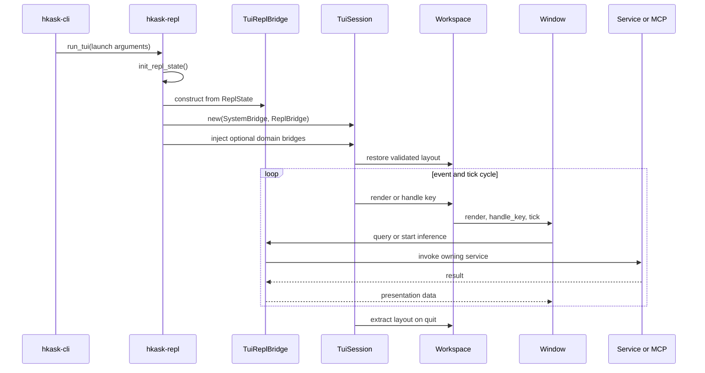

# Terminal UI Architecture

The `hkask-tui` crate is a Ratatui presentation surface. It owns workspace state, rendering, key routing, window-local state, and presentation-facing bridge traits. `hkask-repl` owns the production adapter, `TuiReplBridge`, because it can reach inference, MCP, storage, wallet, and service state without reversing the dependency direction into the UI crate. The CLI owns launch policy and selects either the TUI or line REPL.

For operating instructions, see [Agents and Pods](../how-to/agents-and-pods.md#using-the-terminal-ui). For the public type inventory, see the [API reference](../reference/api-reference.md#tui-window-trait-hierarchy).

## Runtime boundary

The boundary follows a ports-and-adapters shape: presentation code defines the capabilities it consumes, while an outer runtime supplies implementations.[^cockburn-hexagonal] The current implementation uses one required `SystemBridge`, one required `ReplBridge`, and 15 optional domain data bridges. Optional bridges permit degraded startup, but a window must not present missing or failed data as authoritative empty state.

<!-- DIAGRAM_ALIGNMENT
id: DIAG-TUI-005
verified_date: 2026-07-20
verified_against: crates/hkask-cli/src/commands/tui.rs:16-92, crates/hkask-repl/src/lib.rs:285-374, crates/hkask-tui/src/lib.rs:73-227, crates/hkask-tui/src/workspace.rs:280-409, crates/hkask-tui/src/window_catalog.rs:48-240
reference_sources: cockburn-hexagonal
status: VERIFIED
-->

### Ownership and invariants

| Concern | Current owner | Required invariant |
|---------|---------------|--------------------|
| Terminal lifecycle | `TuiSession` | Alternate-screen/raw-mode state is restored on every exit path. |
| Workspace structure | `Workspace` | At least one valid tab exists; `active_tab` indexes it. |
| Window metadata and construction | `WindowKind::META` + `window_catalog` | Every kind has metadata and a factory arm. |
| Layout persistence | `layout` + `Workspace` | Only version 1, known window kinds, valid active tabs, and split ratios in `0.1..=0.9` are restored. |
| Inference execution | `TuiReplBridge` | A completion is delivered only to the window/request that started it. |
| Domain data | Owning service through a bridge | Missing, failed, loading, and empty states remain distinguishable. |

The layout invariant is enforced before workspace mutation. Invalid persisted layouts leave the default workspace intact. The splash screen does not save layout; persistence occurs only on normal event-loop exit.

## Current implementation status

This table records observed implementation behavior, not intended future behavior.

| Area | Status | Evidence |
|------|--------|----------|
| Window catalog | Implemented: 22 kinds | `crates/hkask-tui/src/window.rs:18-265` |
| Domain bridge surface | Implemented: 15 optional traits | `crates/hkask-tui/src/bridges/mod.rs:7-37` |
| MCP-tabbed behavior | Implemented by 11 windows; Scenarios uses custom section keys | `crates/hkask-tui/src/windows/`, `crates/hkask-tui/src/window.rs:219-224` |
| Layout validation | Implemented | `crates/hkask-tui/src/layout.rs:49-112` |
| Configuration snapshot | Recursive-lock defect removed | `crates/hkask-repl/src/tui_bridges.rs:40-63` |
| Inference routing | Degraded: one global pending receiver and stream buffer | `crates/hkask-repl/src/lib.rs:378-393,428-530` |
| Render isolation | Degraded: some windows query bridges during render | `crates/hkask-tui/src/windows/kanban.rs:254-383`, `crates/hkask-tui/src/windows/media.rs:161-168` |
| Domain-state fidelity | Degraded: several adapters collapse errors or return placeholders | `crates/hkask-repl/src/tui_bridges.rs` |
| Text editing | Degraded: several cursors mix character increments with byte indexing | `crates/hkask-tui/src/windows/chat.rs:429-435,673-687` |
| Terminal creation | Degraded: recoverable PTY failures can panic | `crates/hkask-tui/src/windows/terminal.rs:102-144` |

## Adversarial architecture review

The review applies the deletion test before proposing a new abstraction: a module is justified only when deleting it causes non-trivial complexity to reappear in callers.[^ousterhout-design] Each open recommendation also names evidence that could disprove it.

| Priority | Observed problem (`IS`) | Smallest next component (`OUGHT`) | Essentialist / skeptical challenge |
|----------|-------------------------|-----------------------------------|------------------------------------|
| P0 | Inference uses one destructive global completion slot although multiple Chat and MCP windows can start work. | Add a failing two-producer routing test that proves overwrite or cross-delivery before selecting an API. | Do not build an event bus unless request IDs plus one owner map are insufficient. Falsifier: demonstrate that the workspace enforces one producer at runtime. |
| P0 | MCP windows start scoped inference but do not consume completion into their `McpChatState`. | Add one end-to-end scoped-chat completion test for a single MCP window. | Do not generalize across all windows until one vertical path works. |
| P1 | Domain/service calls occur in render paths on the event-loop thread. | Measure bridge-call count and frame latency for one Kanban render; then move one domain to a cached `Loading/Ready/Failed` snapshot. | A global cache is presumptively unnecessary. Falsifier: measured calls are bounded and remain below the frame budget under realistic storage latency. |
| P1 | Service errors, unavailable capabilities, and empty data often collapse to the same value. | Introduce an explicit status on one high-consequence snapshot, starting with Backup. | Do not create bespoke error enums for every getter; one domain snapshot should carry one status. |
| P1 | Unicode text input can create invalid UTF-8 byte indices. | Write a multibyte edit/render regression test for Chat, then extract the minimal cursor primitive only when the same fix is repeated. | A shared editor module is justified only if complexity reappears in at least two callers. |
| P1 | PTY setup uses `expect`/`unwrap`, so opening Terminal can terminate unrelated work. | Make terminal construction fallible and render an unavailable window state. | Do not redesign the whole window factory; first test one missing-shell/PTY failure seam. |
| P2 | `can_close` and `allows_multiple` describe policy that workspace operations do not enforce. | Write policy tests, then either enforce each policy or delete the metadata. | Metadata with no actuator fails the contract gate; keeping it requires observable behavior. |
| P2 | TUI bootstrap repeats REPL initialization on terminal failure. | Separate terminal acquisition from already-created application state. | Avoid a broad “application runtime” abstraction unless state recovery cannot be expressed directly. |

### Pragmatic component order

Each component is intended to be independently testable and revertible:

1. Reproduce two-producer inference overwrite.
2. Define the minimum request ownership type.
3. Route one ordinary Chat completion by owner.
4. Route one MCP scoped completion by owner.
5. Reject or queue a second request according to an explicit policy.
6. Measure one render-bound domain query.
7. Add one domain snapshot state.
8. Refresh that snapshot outside `render`.
9. Repeat only for domains whose measurements show the same problem.
10. Add one Unicode regression test.
11. Repair one editor path.
12. Extract shared cursor behavior only after a second repair proves duplication.
13. Make PTY construction return a typed result.
14. Render terminal unavailability without ending the session.
15. Test lifecycle metadata and either enforce or remove each unused contract.

This ordering treats the UI as a regulator: sensing must preserve fidelity, decisions must identify their owning request, actions must not block the sensing loop, and effects must return through a closed feedback path.[^conant-ashby]

## Why the current bridge split remains

The bridge boundary survives the deletion test. Removing it would force Ratatui windows to depend directly on REPL state, MCP wire schemas, storage locks, and service implementations; test doubles would then need to recreate those dependencies. The open problem is not the existence of bridges but their granularity and semantics: repeated getters encourage render-time calls, infallible return types erase disturbances, and the global inference slot cannot represent the variety produced by multiple windows.

A single monolithic “TUI service” is therefore not recommended. The next deepening step is a small number of domain snapshots and request-owned inference operations, introduced one vertical path at a time.

[^cockburn-hexagonal]: Cockburn, A. (2005). *Hexagonal architecture*. https://alistair.cockburn.us/hexagonal-architecture/.
[^ousterhout-design]: Ousterhout, J. (2018). *A Philosophy of Software Design*. Yaknyam Press. https://web.stanford.edu/~ouster/cgi-bin/book.php.
[^conant-ashby]: Conant, R. C., & Ashby, W. R. (1970). Every good regulator of a system must be a model of that system. *International Journal of Systems Science, 1*(2), 89–97. https://doi.org/10.1080/00207727008920220.
