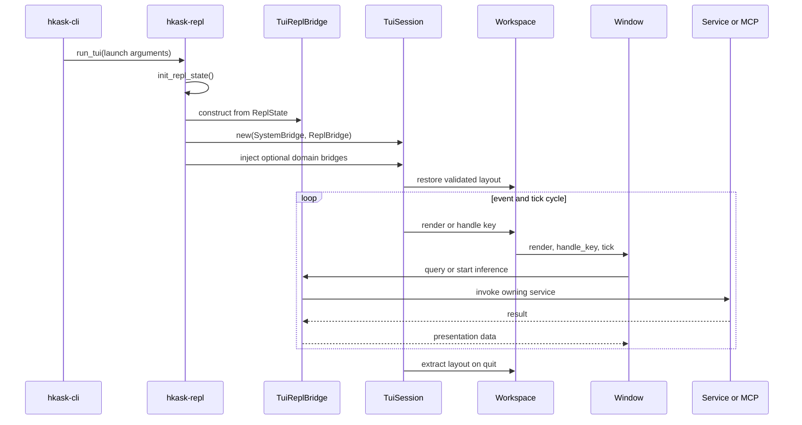

# Terminal UI Architecture

The `hkask-repl` crate is a Ratatui presentation surface. It owns workspace state, rendering, key routing, window-local state, and presentation-facing bridge traits. `hkask-repl` owns the production adapter, `TuiReplBridge`, because it can reach inference, MCP, storage, wallet, and service state without reversing the dependency direction into the UI crate. The CLI owns launch policy and selects either the TUI or line REPL.

For operating instructions, see [Agents and Pods](../how-to/install-and-configure.md#using-the-terminal-ui). For the public type inventory, see the [API reference](../reference/api-reference.md#tui-window-trait-hierarchy).

## Runtime boundary

The boundary follows a ports-and-adapters shape: presentation code defines the capabilities it consumes, while an outer runtime supplies implementations.[^cockburn-hexagonal] The current implementation uses one required `SystemBridge`, one required `ReplBridge`, and 15 optional domain data bridges. Optional bridges permit degraded startup, but a window must not present missing or failed data as authoritative empty state.

<!-- DIAGRAM_ALIGNMENT
id: DIAG-TUI-005
verified_date: 2026-07-20
verified_against: crates/hkask-cli/src/commands/tui.rs:16-92, crates/hkask-repl/src/lib.rs:285-374, crates/hkask-repl/src/tui/src/lib.rs:73-227, crates/hkask-repl/src/tui/src/workspace.rs:280-409, crates/hkask-repl/src/tui/src/window_catalog.rs:48-240
reference_sources: cockburn-hexagonal
status: VERIFIED
-->

### Ownership and invariants

| Concern | Current owner | Required invariant |
|---------|---------------|--------------------|
| Terminal lifecycle | `TuiSession` | Alternate-screen/raw-mode state is restored on every exit path. |
| Workspace structure | `Workspace` | At least one valid tab exists; `active_tab` indexes it. |
| Window metadata and construction | `WindowKind::META` + `window_catalog` | Every kind has metadata and a factory arm. |
| Layout persistence | `layout` + `Workspace` | Only version 1, known window kinds, valid active tabs, and split ratios in `0.1..=0.9` are restored. |
| Inference execution | `TuiReplBridge` | A completion is delivered only to the window/request that started it. |
| Domain data | Owning service through a bridge | Missing, failed, loading, and empty states remain distinguishable. |

The layout invariant is enforced before workspace mutation. Invalid persisted layouts leave the default workspace intact. The splash screen does not save layout; persistence occurs only on normal event-loop exit.

## Current implementation status

This table records observed implementation behavior, not intended future behavior.

| Area | Status | Evidence |
|------|--------|----------|
| Window catalog | Implemented: 16 kinds | `crates/hkask-repl/src/tui/src/window.rs:18-265` |
| Domain bridge surface | Implemented: 15 optional traits | `crates/hkask-repl/src/tui/src/bridges/mod.rs:7-37` |
| MCP-tabbed behavior | Implemented by 11 windows; Scenarios uses custom section keys | `crates/hkask-repl/src/tui/src/windows/`, `crates/hkask-repl/src/tui/src/window.rs:219-224` |
| Layout validation | Implemented | `crates/hkask-repl/src/tui/src/layout.rs:49-112` |
| Configuration snapshot | Recursive-lock defect removed | `crates/hkask-repl/src/tui_bridges.rs:40-63` |
| Inference routing | Implemented: request-owned receiver and stream state; one active request per window | `crates/hkask-repl/src/tui/src/repl_bridge.rs`, `crates/hkask-repl/src/lib.rs`, `crates/hkask-repl/src/tui/src/mcp_tabbed.rs` |
| Render isolation | Degraded: domain bridge calls still execute on the TUI event-loop thread; the timed `tick` cache experiment was reverted because it did not provide asynchronous isolation | `crates/hkask-repl/src/tui/src/windows/` |
| Domain-state fidelity | Partial: Backup and Wallet use explicit `Unavailable/Ready/Failed` snapshots; pod scan failure is optional rather than fabricated | `crates/hkask-repl/src/tui/src/bridges/backup.rs`, `crates/hkask-repl/src/tui/src/bridges/wallet.rs`, `crates/hkask-repl/src/tui/src/repl_bridge.rs` |
| Text editing | Implemented: shared UTF-8 byte-boundary cursor operations cover Chat, Curator, Terminal, and Editor | `crates/hkask-repl/src/tui/src/text_cursor.rs` |
| Terminal creation | Implemented: PTY and shell failures render an unavailable state instead of panicking | `crates/hkask-repl/src/tui/src/windows/terminal.rs` |
| Window lifecycle policy | Implemented: singleton kinds refocus; `Ctrl+W` closes closeable focused leaves; persistent Logo is protected | `crates/hkask-repl/src/tui/src/workspace.rs` |
| TUI fallback | Implemented: initialized `ReplState` is recovered for line-REPL fallback | `crates/hkask-repl/src/lib.rs` |

## Adversarial architecture review

The review applies the deletion test before proposing a new abstraction: a module is justified only when deleting it causes non-trivial complexity to reappear in callers.[^ousterhout-design] Each open recommendation also names evidence that could disprove it.

| Priority | Observed problem (`IS`) | Smallest next component (`OUGHT`) | Essentialist / skeptical challenge |
|----------|-------------------------|-----------------------------------|------------------------------------|
| Resolved P0 | Inference previously used one destructive global completion slot. | `InferenceRequestId` now owns receiver and streaming state; two-window routing is regression-tested. | No event bus was added; one request map proved sufficient. |
| Resolved P0 | MCP windows previously discarded scoped completions. | Shared `McpTabbedWindow` helpers bind and poll window-owned requests. | Generalization followed a working Training vertical test. |
| Open P1 | Domain/service calls can block the event-loop thread. | Measure user-visible latency before changing architecture; do not move synchronous calls from `render` to `tick` and call that isolation. | The timed cache experiment was rejected and reverted because `tick` runs on the same thread. |
| Partial P1 | Service failures and empty data were conflated. | Backup, Wallet, and pod scanning now preserve unavailability; migrate another domain only when consequence or evidence warrants it. | Snapshot enums are domain-local, not a generic status framework. |
| Resolved P1 | Unicode input could create invalid UTF-8 byte indices. | A private byte-boundary cursor module serves four input surfaces with multibyte regressions. | Extraction occurred only after duplication was confirmed in four callers. |
| Resolved P1 | PTY setup panicked on recoverable failures. | Fallible PTY setup renders a terminal-unavailable message. | The window factory remains unchanged. |
| Resolved P2 | `can_close` and `allows_multiple` had no actuator. | Workspace operations now enforce both contracts. | Metadata is retained because behavior and tests now depend on it. |
| Resolved P2 | TUI failure repeated REPL initialization. | Fallback recovers the existing `ReplState` and enters the extracted line loop. | No application-runtime abstraction was introduced. |

### Pragmatic component order

Each component is intended to be independently testable and revertible:

1. ✅ Reproduce two-producer inference overwrite.
2. ✅ Define the minimum request ownership type.
3. ✅ Route ordinary Chat completion by owner.
4. ✅ Route MCP scoped completion by owner.
5. ✅ Enforce one active request per window.
6. ✅ Counted repeated render-bound calls; no latency claim was established.
7. ❌ Rejected and reverted timed per-window caches.
8. ⏳ Measure user-visible event-loop latency before proposing another implementation.
9. ⏳ If blocking is confirmed, compare explicit refresh, genuine background execution, and disabling live views.
10. ✅ Add multibyte regressions.
11. ✅ Repair all four known editor paths.
12. ✅ Extract shared cursor behavior after duplication was demonstrated.
13. ✅ Make PTY construction fallible.
14. ✅ Render terminal unavailability without ending the session.
15. ✅ Enforce lifecycle metadata contracts.
16. ✅ Reuse initialized state during line-REPL fallback.
17. ⏳ Add explicit domain snapshots only where failures remain consequential and currently indistinguishable.

This ordering treats the UI as a regulator: sensing must preserve fidelity, decisions must identify their owning request, actions must not block the sensing loop, and effects must return through a closed feedback path.[^conant-ashby]

## Why the current bridge split remains

The bridge boundary survives the deletion test. Removing it would force Ratatui windows to depend directly on REPL state, MCP wire schemas, storage locks, and service implementations; test doubles would then need to recreate those dependencies. Request-owned inference now represents multiple windows without a global event bus. Remaining friction is domain-specific: repeated getters can encourage render-time calls, and some infallible return types still erase disturbances.

A single monolithic “TUI service” is therefore not recommended. Continue with measured, domain-local snapshots one vertical path at a time.

[^cockburn-hexagonal]: Cockburn, A. (2005). *Hexagonal architecture*. https://alistair.cockburn.us/hexagonal-architecture/.
[^ousterhout-design]: Ousterhout, J. (2018). *A Philosophy of Software Design*. Yaknyam Press. https://web.stanford.edu/~ouster/cgi-bin/book.php.
[^conant-ashby]: Conant, R. C., & Ashby, W. R. (1970). Every good regulator of a system must be a model of that system. *International Journal of Systems Science, 1*(2), 89–97. https://doi.org/10.1080/00207727008920220.
