# DDMVSS Corpus Semantic Audit — v0.23.0

**Purpose:** RDF/Turtle graph mapping every active document under `docs/` (excluding `archive/`) to DDMVSS categories with role classification, plus mermaid ERD and discrepancy list.

**RDF Graph:** [`ddmvss-corpus-graph.ttl`](ddmvss-corpus-graph.ttl)

---

## Mermaid ERD — Document ↔ Category Topology

```mermaid
erDiagram
    Domain ||--o{ doc_domain : "has"
    Capability ||--o{ doc_capability : "has"
    Interface ||--o{ doc_interface : "has"
    Composition ||--o{ doc_composition : "has"
    Trust ||--o{ doc_trust : "has"
    Observability ||--o{ doc_observability : "has"
    Persistence ||--o{ doc_persistence : "has"
    Lifecycle ||--o{ doc_lifecycle : "has"
    Curation ||--o{ doc_curation : "has"

    doc_domain {
        string domain_and_capability "SPEC"
        string DDMVSS "FRAMEWORK"
        string PRINCIPLES "FRAMEWORK"
        string loop_architecture "FRAMEWORK"
        string hKask_hLexicon "REFERENCE"
        string hKask_Curator_persona "REFERENCE"
        string okapi_integration "REFERENCE"
        string hlexicon_validation "REFERENCE"
        string AGENT_POD_CREATION_GUIDE "REFERENCE"
        string COMMON_AGENT_PATTERNS "REFERENCE"
    }

    doc_capability {
        string domain_and_capability "SPEC"
        string DDMVSS "FRAMEWORK"
        string PRINCIPLES "FRAMEWORK"
        string loop_architecture "FRAMEWORK"
        string ports_inventory "REFERENCE"
        string ADR_030 "DECISION"
        string ADR_032 "DECISION"
    }

    doc_interface {
        string interface_and_composition "SPEC"
        string DDMVSS "FRAMEWORK"
        string ports_inventory "REFERENCE"
        string utoipa_implementation "REFERENCE"
        string cli_reference "REFERENCE"
    }

    doc_composition {
        string interface_and_composition "SPEC"
        string DDMVSS "FRAMEWORK"
        string template_header_standard "REFERENCE"
        string hlexicon_validation "REFERENCE"
        string ADR_024 "DECISION"
        string ADR_030 "DECISION"
    }

    doc_trust {
        string trust_security_observability "SPEC"
        string DDMVSS "FRAMEWORK"
        string magna_carta "FRAMEWORK"
        string ADR_022 "DECISION"
        string ADR_025 "DECISION"
        string ADR_027 "DECISION"
        string ADR_031 "DECISION"
        string ADR_032 "DECISION"
        string ADR_033 "DECISION"
    }

    doc_observability {
        string trust_security_observability "SPEC"
        string DDMVSS "FRAMEWORK"
        string loop_architecture "FRAMEWORK"
        string ADR_033 "DECISION"
    }

    doc_persistence {
        string persistence_and_lifecycle "SPEC"
        string DDMVSS "FRAMEWORK"
        string hKask_erd "REFERENCE"
        string registry_erd "REFERENCE"
        string subsystem_erds "REFERENCE"
        string ADR_026 "DECISION"
    }

    doc_lifecycle {
        string persistence_and_lifecycle "SPEC"
        string DDMVSS "FRAMEWORK"
        string CI_CD_GUIDE "SPEC"
        string DEPLOYMENT "SPEC"
        string DEPENDENCY_POLICY "SPEC"
    }

    doc_curation {
        string DDMVSS "FRAMEWORK"
        string WRITING_EXCELLENCE "SPEC"
        string ADR_TEMPLATE "SPEC"
        string PRINCIPLES "FRAMEWORK"
        string loop_architecture "FRAMEWORK"
    }
```

---

## Discrepancy List

### (a) Documents claiming multiple categories that serve only one function

| Document | Claimed Categories | Actual Function | Recommendation |
|----------|-------------------|-----------------|----------------|
| `DDMVSS.md` | All 9 | FRAMEWORK (taxonomy + methodology) — serves all categories by definition | **Keep** — the DDMVSS is the meta-framework; claiming all 9 is correct |
| `DDMVSS_SCAFFOLD.md` | All 9 | SPEC (generation guideline for docs) — applies to all categories | **Keep** — the scaffold governs document placement for all categories |
| `DOCUMENTATION_STANDARDS.md` | All 9 | SPEC (verification gate for docs) — applies to all categories | **Keep** — standards govern verification for all categories |
| `REQUIREMENTS.md` | All 9 | SPEC (goal specs) — requirements span all categories | **Keep** — correct |
| `TRACEABILITY_MATRIX.md` | All 9 | SPEC (traceability) — traces span all categories | **Keep** — correct |
| `TESTING_STANDARDS.md` | All 9 | SPEC (testing protocol) — applies to all categories | **Keep** — correct |
| `test-program.md` | All 9 | SPEC (test program) — applies to all categories | **Keep** — correct |
| `TODO.md` | All 9 | STATUS (open work) — spans all categories | **Keep** — correct |
| `DIAGRAMS_INDEX.md` | All 9 | INDEX (diagram registry) — covers diagrams from all categories | **Keep** — correct |
| `README.md` | All 9 | INDEX (portal) — indexes all docs | **Keep** — correct |
| `hKask-architecture-master.md` | All 9 | INDEX (architecture index) | **Keep** — correct |
| `hlexicon-validation-report.md` | Domain, Composition | REFERENCE (validation report) — primarily Domain | **Narrow to Domain** — the composition link is indirect |
| `hhh-alignment-research.md` | Domain, Capability, Observability, Curation | REFERENCE (research doc) — spans multiple genuinely | **Keep** — HHH mode genuinely affects all 4 categories |
| `ADR-032-mcp-gateway-membrane.md` | Capability, Trust | DECISION — genuinely spans both | **Keep** — correct |
| `ADR-033-dampener-override-cooldown.md` | Trust, Observability | DECISION — genuinely spans both | **Keep** — correct |

### (b) Categories with no authoritative SPEC document

| Category | Authoritative Document | Status |
|----------|----------------------|--------|
| Domain | `domain-and-capability.md` | ✅ Has SPEC |
| Capability | `domain-and-capability.md` | ✅ Has SPEC |
| Interface | `interface-and-composition.md` | ✅ Has SPEC |
| Composition | `interface-and-composition.md` | ✅ Has SPEC |
| Trust & Security | `trust-security-observability.md` | ✅ Has SPEC |
| Observability | `trust-security-observability.md` | ✅ Has SPEC |
| Persistence | `persistence-and-lifecycle.md` | ✅ Has SPEC |
| Lifecycle | `persistence-and-lifecycle.md` | ✅ Has SPEC |
| Curation | `DDMVSS.md` + `WRITING_EXCELLENCE.md` | ✅ Has SPEC (split across two docs) |

**All 9 categories have authoritative SPEC documents.** No gaps.

### (c) Orphan documents not reachable from the portal (`docs/README.md`)

| Document | In Portal? | Action |
|----------|-----------|--------|
| `hlexicon-validation-report.md` | ❌ Not in portal | **Add** to architecture section |
| `TESTING_STANDARDS.md` | ❌ Not in portal | **Add** to specifications section |
| `test-program.md` | ❌ Not in portal | **Add** to specifications section |
| `ADR-032-mcp-gateway-membrane.md` | ✅ Listed (Draft) | — |
| `ADR-033-dampener-override-cooldown.md` | ✅ Listed (Draft) | — |
| `GENERATED/ddmvss-corpus-graph.ttl` | N/A (generated) | No action — generated artifact |
| `GENERATED/openapi.json` | N/A (generated) | No action — generated artifact |

**3 documents are orphaned from the portal.** These should be added in the next portal update.

---

## Summary

| Metric | Value |
|--------|-------|
| Total active documents | 48 |
| Documents in RDF graph | 48 |
| Categories with authoritative SPEC | 9/9 |
| Orphan documents (not in portal) | 3 |
| Multi-category documents needing narrow | 1 (`hlexicon-validation-report.md`) |
| Spec-document vs code-implementation conflation errors | **0** (corrected in this audit) |

*ℏKask - A Minimal Viable Container for Agents — v0.23.0*