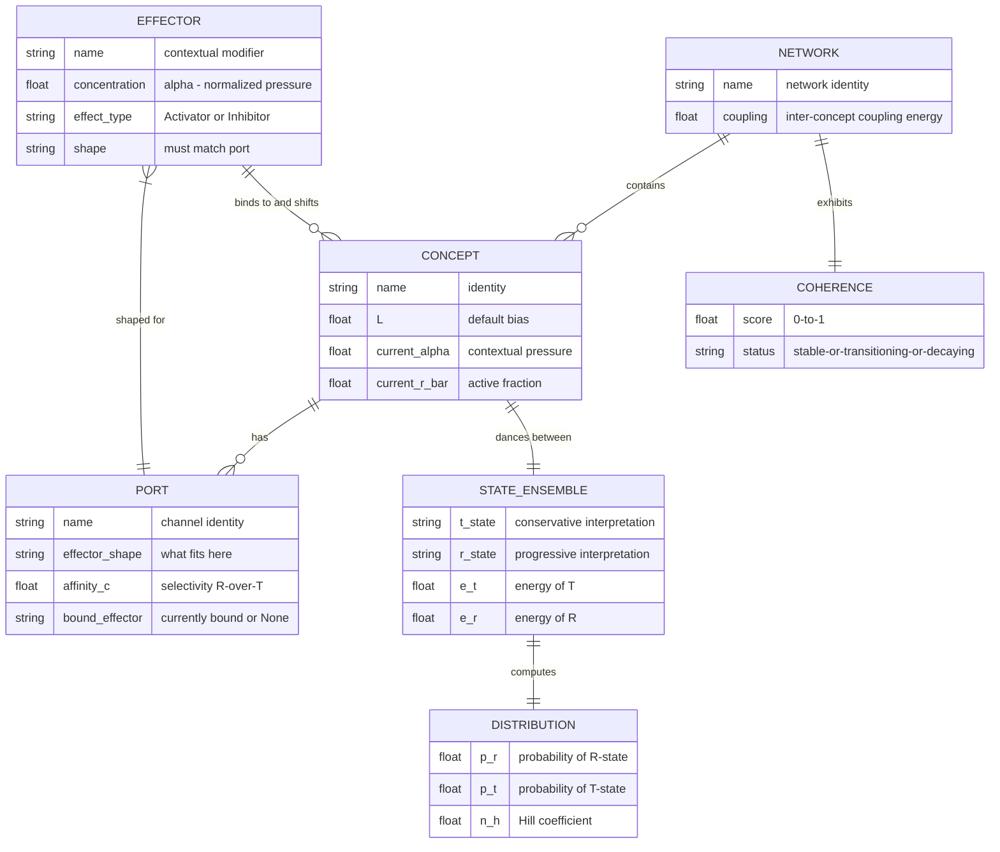

# GML Task 1: Domain-Independent Allosteric Pattern — Kernel ERD

**Version:** 0.1.0  
**Status:** Task 1 Deliverable  
**Date:** 2026-06-02

---

## 1. Biochemistry → Abstract Domain Mapping

| Biochemical | Abstract/Conceptual | hKask Operational |
|-------------|---------------------|------------------|
| Protein | **Concept** — node that dances between states | Any decision point, regulation gate, confidence assessment |
| Conformational states (T/R) | **Interpretation frames** — closed/open, suppress/express, inhibit/activate | T = "don't proceed" / R = "proceed" |
| Allosteric site | **Port** — where context binds and shifts the frame | Input channel for regulatory signals |
| Ligand/Effector | **Contextual modifier** — evidence, pressure, signal | Input signal, metric reading, confidence score |
| Cooperativity (n_H) | **Amplification** — co-present ideas amplify each other | Cascade sensitivity, multi-signal gates |
| Partition function Z | **Probability landscape** over interpretations | Confidence distribution over outcomes |
| Homeostasis | **Self-reinforcing coherence** in networks | System stability, loop equilibrium |
| Logic gates (AND/OR/NAND/NOR) | **Process flow gates** — conditional routing | Decision gates in loop cycles |
| XOR | **Structurally forbidden** | Exclusive choice requires extension beyond basic MWC |

---

## 2. Lean Kernel ERD (≤7 entities)



---

## 3. Entity Definitions

### CONCEPT

An idea, decision point, or regulation gate with multiple interpretive states. The fundamental allosteric unit.

- Has a default bias (L) — which interpretation is favored without contextual pressure
- Has ports where effectors bind
- Exists as a probability distribution over interpretations, not a fixed state
- **In hKask terms:** Any point in the system where a binary decision or graded response occurs

### PORT

An allosteric site where effectors bind to shift the concept's equilibrium.

- Each port has an effector shape (what kind of signal fits)
- Each port has an affinity ratio (c) — does binding favor R or T?
- Ports enforce OCAP: effectors bind only to ports they are shaped for

### STATE_ENSEMBLE

The pair of interpretive states a concept oscillates between.

- T-state: closed/suppressed/conservative — "don't proceed", "inhibit", "suppress"
- R-state: open/expressed/progressive — "proceed", "activate", "express"
- Energy difference determines L: L = exp(-(E_T - E_R)/kT)

### EFFECTOR

A contextual modifier that binds to ports and shifts equilibrium.

- Activators (c < 1): favor R-state — increase confidence, enable progression
- Inhibitors (c > 1): favor T-state — decrease confidence, block progression
- Concentration (α): the magnitude of contextual pressure

### DISTRIBUTION

The probability landscape over a concept's states.

- p_r = R̄ = fraction in active state (confidence, readiness to proceed)
- p_t = 1 - R̄ = fraction in suppressed state
- n_H = Hill coefficient (cooperativity, switching sensitivity)

### NETWORK

A collection of interconnected concepts with allosteric relations.

- Concepts can cooperate (positive feedback) or inhibit each other
- Coupling energy determines whether the network is graded or switch-like
- **In hKask terms:** The 6-loop system is itself an allosteric network

### COHERENCE

The homeostatic measure of a network's self-reinforcing stability.

- Score > 0.8: Stable (self-reinforcing equilibrium)
- 0.5 < Score < 0.8: Transitioning (perturbed but recovering)
- Score < 0.5: Unstable (decaying, intervention required)
- **In hKask terms:** The CNS health check IS a coherence assessment

---

## 4. The Allosteric Gate — Process Flow Regulator

The key insight from the MWC formal structure: **the MWC equation IS a logic gate.**

By tuning (L, c, n), a single gate can implement:

| Gate Type | MWC Configuration | Process Flow Semantics | Parameters Measurable? |
|-----------|-------------------|----------------------|----------------------|
| **PASS** | L << 1, no effectors needed | Always proceed (default R-state) | ✅ L from neutral decision log |
| **BLOCK** | L >> 1, no effectors sufficient | Never proceed (default T-state) | ✅ L from neutral decision log |
| **THRESHOLD** | L >> 1, one activator (c << 1) | Proceed only when α > EC50 | ✅ α from Signal values |
| **AND** | L >> 1, two activators (γ₁,γ₂ << 1) | Both signals required to proceed | ✅ from multi-channel calibration |
| **OR** | L >> 1, two activators (e^{-βΔε} << 1/γ) | Either signal sufficient | ✅ from multi-channel calibration |
| **NAND** | L << 1, inhibitors swap roles | Block only when all inhibitors present | ✅ inverted roles |
| **DAMPEN** | L moderate, n_H < 1 | Graded response — no sharp switching | ✅ τ from settling time measurement |
| **SWITCH** | L >> 1, n_H > 1 | Sharp transition — ultrasensitive | ✅ n_H from response curve |

**Critical constraint:** XOR is structurally forbidden in basic MWC. Exclusive choice requires extension (third ligand as logic switch, or sequential gates).

### Process Flow Interpretation

For any decision point in hKask:
- **R̄ = confidence** — the system's assessment that it should proceed
- **α = evidence** — the contextual pressure (signal magnitude, metric value)
- **L = skepticism** — the default bias toward NOT proceeding (conservative by default)
- **c = signal quality** — how much this evidence shifts confidence
- **n_H = cascade sensitivity** — do co-occurring signals amplify?
- **τ = relaxation time** — how fast the gate settles after input change
- **hysteresis** — recent R-state activity lowers effective L

### Scope Distinction (per internal review)

The MWC equation serves two use cases:

1. **Conceptual analysis** (Allosteric Thinking as KnowAct): qualitative heuristic. L, c, α are analyst encodings. Quantitative R̄ values are illustrative, not derived. Robustness analysis required.

2. **Process flow regulation** (Allosteric Gate in CNS): L, c, α are measurable operational quantities. R̄ is testable against actual system decisions. Empirical calibration required.

The category error identified in the review (MWC variables undefined for concepts) applies to use case 1 but NOT to use case 2. In regulation, the system IS a physical system with observable state transitions, measurable decision frequencies, and conservable resources.

### The `cooperate` Operation (revised per review)

The original `cooperate(a, b) → n_H_a × n_H_b` is semantically undefined (Hill coefficients from separate systems have no inter-system meaning). **Replaced with coupling coefficients in a network graph:**

```
cooperate(A, B) = w_AB · (∂R̄_B/∂α_B) · (∂α_B/∂R̄_A)
```

Where w_AB is the coupling weight (how much A's state feeds into B's α). This connects to the RBM W matrix.

### The `homeostasis` Operation (revised per review)

The original `homeostasis(network) → mean(1 - |R̄_i - target|)` is monitoring only. **Extended with:**
- `target_r_bar` per gate (normative coherence)
- `rebalance` operation (search for effectors that restore coherence)
- Descriptive vs. normative coherence distinction

---

*ℏKask — Planck's Constant of Agent Systems — ARL v0.1.0*