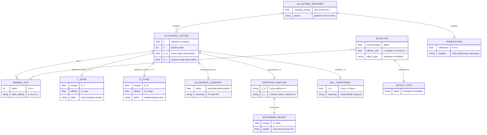

# GML Task 0: MWC Formal Structure — RDF Triples & Kernel ERD

**Version:** 0.1.0  
**Status:** Task 0 Deliverable  
**Date:** 2026-06-02

---

## 1. RDF Triples — MWC Entity Definitions

```turtle
@prefix mwc: <http://hkask.org/mwc#> .
@prefix gml: <http://hkask.org/gml#> .
@prefix rdfs: <http://www.w3.org/2000/01/rdf-schema#> .
@prefix rdf: <http://www.w3.org/1999/02/22-rdf-syntax-ns#> .

# =============================================================================
# Core MWC Entities
# =============================================================================

mwc:AllostericSystem a rdfs:Class ;
    rdfs:comment "A system with ≥2 conformational states whose relative probabilities are modulated by effector binding. The fundamental unit of allosteric regulation." ;
    mwc:hasStates mwc:TState, mwc:RState ;
    mwc:hasEquilibriumConstant mwc:AllostericConstant ;
    mwc:hasCooperativity mwc:HillCoefficient ;
    mwc:regulatedBy mwc:Effector ;
    mwc:describedBy mwc:PartitionFunction .

mwc:TState a rdfs:Class ;
    rdfs:comment "Tense/Inactive state. Low activity, low ligand affinity. Default when L >> 1." ;
    mwc:energy "E_T" ;
    mwc:affinity "K_T (low)" ;
    mwc:label "closed/conservative/suppressed" .

mwc:RState a rdfs:Class ;
    rdfs:comment "Relaxed/Active state. High activity, high ligand affinity." ;
    mwc:energy "E_R" ;
    mwc:affinity "K_R (high)" ;
    mwc:label "open/progressive/expressed" .

mwc:AllostericConstant a rdfs:Class ;
    rdfs:comment "L = [T]₀/[R]₀ = exp(-(E_T - E_R)/kT). The intrinsic equilibrium constant — default bias without effectors." ;
    mwc:symbol "L" ;
    mwc:range xsd:double ;
    mwc:formula "L = exp(-β·Δε) where β = 1/kT, Δε = E_T - E_R" ;
    mwc:interpretation "L >> 1: defaults to T-state; L << 1: defaults to R-state; L = 1: balanced" .

mwc:Cooperativity a rdfs:Class ;
    rdfs:comment "Emergent switching behavior from concerted T↔R transition + differential affinity. Measured by Hill coefficient n_H." ;
    mwc:measuredBy mwc:HillCoefficient ;
    mwc:emergesFrom "concerted transition + K_R ≠ K_T" ;
    mwc:constraint "XOR is structurally forbidden in basic MWC" .

mwc:HillCoefficient a rdfs:Class ;
    rdfs:comment "Effective cooperativity measure. n_H > 1 = switch-like (ultrasensitive), n_H = 1 = independent, n_H < 1 = graded." ;
    mwc:symbol "n_H" ;
    mwc:range "0 < n_H ≤ n" ;
    mwc:formula "n_H = d·ln(p/(1-p)) / d·ln(c) | evaluated at EC50" .

mwc:Effector a rdfs:Class ;
    rdfs:comment "Contextual ligand that binds to ports and shifts equilibrium through selective stabilization, NOT instruction." ;
    mwc:subclasses mwc:Activator, mwc:Inhibitor .

mwc:Activator a rdfs:Class ;
    rdfs:comment "Effector with higher affinity for R-state (γ = K_R/K_T < 1). Stabilizes active interpretation." ;
    mwc:affinityRatio "c < 1" ;
    mwc:effect "shifts R̄ toward 1" .

mwc:Inhibitor a rdfs:Class ;
    rdfs:comment "Effector with higher affinity for T-state (γ = K_R/K_T > 1). Stabilizes suppressed interpretation." ;
    mwc:affinityRatio "c > 1" ;
    mwc:effect "shifts R̄ toward 0" .

mwc:PartitionFunction a rdfs:Class ;
    rdfs:comment "Z = Σᵢ exp(-Eᵢ/kT). Normalizes probabilities. The bridge between microscopic energies and macroscopic observables." ;
    mwc:symbol "Z" ;
    mwc:formula "Z = (1+α)ⁿ + L·(1+cα)ⁿ" ;
    mwc:interpretation "Sum of Boltzmann weights over all microstates" .

mwc:Homeostasis a rdfs:Class ;
    rdfs:comment "Self-reinforcing coherence in a network of allosteric systems. Emerges from collective equilibrium, not imposed." ;
    mwc:emergesFrom mwc:AllostericNetwork ;
    mwc:measuredBy "network coherence score" ;
    mwc:phaseTransition "lattice allostery can produce all-or-none collective switching" .

# =============================================================================
# Key Relationships
# =============================================================================

mwc:AllostericSystem mwc:hasState mwc:TState .
mwc:AllostericSystem mwc:hasState mwc:RState .
mwc:AllostericSystem mwc:hasEquilibriumConstant mwc:AllostericConstant .
mwc:AllostericSystem mwc:hasCooperativity mwc:HillCoefficient .
mwc:AllostericSystem mwc:regulatedBy mwc:Effector .
mwc:PartitionFunction mwc:computesFrom mwc:EnergyStates .
mwc:Homeostasis mwc:emergesFrom mwc:AllostericNetwork .

# =============================================================================
# Phenotypic Parameters (observable consequences of L, K_R, K_T, n)
# =============================================================================

mwc:Leakiness a mwc:Phenotype ;
    rdfs:comment "p_active(c=0) = 1/(1+L). Basal activity without effectors. Always > 0 in MWC." ;
    mwc:formula "1/(1+L)" .

mwc:Saturation a mwc:Phenotype ;
    rdfs:comment "p_active(c→∞) = 1/(1+L·cⁿ). Maximum achievable activation." ;
    mwc:formula "1/(1+Lcⁿ)" .

mwc:DynamicRange a mwc:Phenotype ;
    rdfs:comment "Saturation - Leakiness. The responsive interval." ;
    mwc:formula "L(1-cⁿ)/((1+L)(1+Lcⁿ))" .

mwc:EC50 a mwc:Phenotype ;
    rdfs:comment "Ligand concentration at midpoint transition." ;
    mwc:formula "depends on L, K_R, K_T, n" .

# =============================================================================
# Logic Gate Properties (from Galstyan et al.)
# =============================================================================

mwc:LogicGate a rdfs:Class ;
    rdfs:comment "Boolean logic that emerges from MWC parameter tuning without changing structure." ;
    mwc:realizable mwc:AND, mwc:OR, mwc:NAND, mwc:NOR ;
    mwc:forbidden mwc:XOR, mwc:XNOR ;
    mwc:switchable "AND → OR by increasing n_i or modulating L" .

# =============================================================================
# Multi-Ligand Extension
# =============================================================================

mwc:MultiLigandMWC a rdfs:Class ;
    rdfs:comment "Extended MWC with N independent effector types, each with n_i binding sites." ;
    mwc:formula "p_active = ∏ᵢ(1+[Lᵢ]/K_{A,i})^{n_i} / (∏ᵢ(1+[Lᵢ]/K_{A,i})^{n_i} + e^{-βΔε}·∏ᵢ(1+[Lᵢ]/K_{I,i})^{n_i})" ;
    mwc:ratiometricSensing "When one activator + one repressor: p_active ∝ [L₂]/[L₁]" .
```

---

## 2. Kernel Mermaid ERD — MWC Formal Structure



---

## 3. MWC Equations Reference

### 3.1 State Function (Normalized Form)

```
R̄ = (1 + α)ⁿ / ((1 + α)ⁿ + L·(1 + cα)ⁿ)
```

Where:
- **R̄** = fraction in active/relaxed state
- **L** = exp(-(E_T - E_R)/kT) = [T]₀/[R]₀ = allosteric constant
- **c** = K_R/K_T = affinity ratio (selectivity)
- **n** = number of binding sites (cooperativity dimensionality)
- **α** = [X]/K_R = normalized ligand concentration (contextual pressure)

### 3.2 Partition Function

```
Z = (1 + α)ⁿ + L·(1 + cα)ⁿ
  = Z_R + Z_T
  = Σᵢ exp(-Eᵢ/kT)    [Boltzmann interpretation]
```

### 3.3 Boltzmann Equivalence

```
P(R) = exp(-E_R/kT) / (exp(-E_R/kT) + exp(-E_T/kT))
     = 1 / (1 + L)    where L = exp(-(E_T - E_R)/kT)
```

### 3.4 Multi-Ligand Extension (N effectors)

```
p_active([L₁],...,[L_N]) = ∏ᵢ(1+[Lᵢ]/K_{A,i})^{n_i} / 
  (∏ᵢ(1+[Lᵢ]/K_{A,i})^{n_i} + e^{-βΔε}·∏ᵢ(1+[Lᵢ]/K_{I,i})^{n_i})
```

### 3.5 Phenotypic Parameters

| Phenotype | Definition | Formula |
|-----------|------------|---------|
| **Leakiness** | Basal activity without effectors | 1/(1+L) |
| **Saturation** | Maximum achievable activation | 1/(1+Lcⁿ) |
| **Dynamic Range** | Responsive interval | L(1-cⁿ)/((1+L)(1+Lcⁿ)) |
| **EC50** | Midpoint transition | Depends on L, K_R, K_T, n |
| **Hill n_H** | Cooperativity measure | d·ln(p/(1-p)) / d·ln(c) at EC50 |

### 3.6 Logic Gate Properties

| Gate | MWC Realization | Parameter Condition |
|------|-----------------|---------------------|
| **AND** | Both effectors needed | γ₁,γ₂ << 1; 1/γ₁γ₂ << e^{-βΔε} |
| **OR** | Either effector sufficient | γ₁,γ₂ << 1; e^{-βΔε} << 1/γ₁, 1/γ₂ |
| **NAND** | Inverted AND | Swap activator/inhibitor roles |
| **NOR** | Inverted OR | Swap activator/inhibitor roles |
| **XOR** | **Structurally forbidden** | Cannot realize with basic MWC |
| **Switch** | AND → OR by modulating L or n_i | Tunable logic without structural change |

---

*ℏKask — Planck's Constant of Agent Systems — GML v0.1.0*