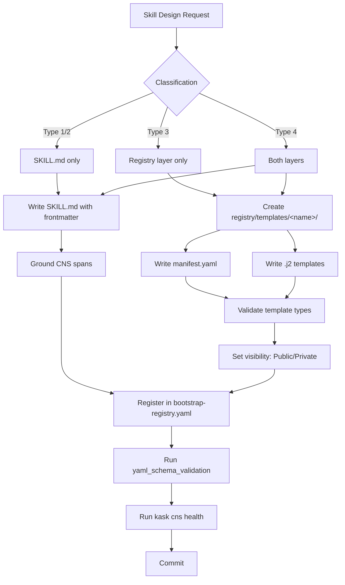

# hKask Skill Designer Guide

**Purpose:** Definitive reference for designing, building, and maintaining skills in the hKask FlowDef-first architecture. Covers skill process manifests, template crate composition, template_type discipline, visibility (P11), CNS span grounding, registration, and testing.

**Companion docs:** [`PRINCIPLES.md`](../architecture/core/PRINCIPLES.md) (P1-P12).

---

## 1. The Skill Model (FlowDef-First)

In the current hKask definition, a production skill is a **FlowDef process** that composes WordAct/KnowAct templates inside a PDCA loop.

Every skill is represented across up to three artifacts:

| Layer | Location | Format | Purpose |
|-------|----------|--------|---------|
| **Skill process layer (authoritative)** | `registry/manifests/<skill>.yaml` | FlowDef manifest | Declares convergence rails, gas rails, step wiring, and explicit `loop` behavior |
| **Template crate layer** | `registry/templates/<skill>/` | `manifest.yaml` + `.j2` files | Declares and implements template steps referenced by `template_ref` |
| **Zed companion layer** | `.agents/skills/<name>/SKILL.md` | Markdown with YAML frontmatter | Teaches the Zed coding agent usage methodology and activation heuristics |

### 1.1 Required Skill Invariants

A skill process manifest must include:

1. `manifest.functional_role: flowdef`
2. top-level `convergence` block including `convergence_field`
3. top-level `gas` block
4. at least one explicit `action: loop` step
5. stable `step_n_result` wiring between steps
6. template references that resolve to registered template ids

### 1.2 Bundle Exception

`Bundle` remains a composition construct (for example `kata`) and is not a replacement for FlowDef skill processes. Bundles orchestrate multiple skills; each constituent skill still follows the FlowDef+PDCA model.

### 1.3 Fusion — Runtime Multi-Model Deliberation

Skills that invoke inference (classification, generation, critique) automatically benefit from Fusion when enabled. No skill-level configuration needed — the inference router transparently routes eligible calls through the Fusion pipeline. See the [skill user guide](../../docs/user-guides/skill-user-guide.md#34-fusion--multi-model-deliberation-for-skills) for configuration and usage.

Design consideration: skills that make many small inference calls (e.g., per-item classification in a tight loop) may want to batch those calls or mark them with `bypass_fusion=true` to avoid the 4-5× cost multiplier per call.

---

## 2. Creating a SKILL.md (Zed Agent Layer)

### 2.1 Structure

```markdown
---
name: my-skill
visibility: Public
description: One-sentence purpose statement. When to activate. Use when...
---

# My Skill

## Domain

Brief domain context the agent needs.

## Procedure

### Step 1: ...

### Step 2: ...

## Constraints

1. Principle-backed constraints
2. ...

## Key Files

| File | Purpose |
|------|---------|
| `path/to/file.rs` | What it does |
```

### 2.2 Frontmatter Rules

| Field | Required | Values | Notes |
|-------|----------|--------|-------|
| `name` | Yes | kebab-case, matches directory name | Must match `.agents/skills/<name>/` |
| `visibility` | Yes | `Public` or `Private` | P11 — governs who can discover and load the skill |
| `description` | Yes | Single line, ~80 chars | Shown in `kask skill list`; must include activation trigger |
| `activation` | **Yes** | Trigger phrase the user says | The exact words that activate this skill. Must be unique across the corpus. Validated by `skill-manager`. |

**No other frontmatter fields are required.** The SKILL.md body is freeform Markdown.

### 2.3 CNS Span References

Every SKILL.md must reference only canonical CNS spans from `crates/hkask-types/src/cns.rs`. Never invent span names or use wildcard patterns (`cns.*`, `cns.tool.*`).

**Correct:**
- `cns.tool.condenser` — tool invocation governance
- `cns.inference.router` — inference routing
- `kata.cycle.start` — kata cycle span

**Incorrect (will fail CNS health check):**
- `cns.cybernetics.*` — wildcard, not canonical
- `cns.inference` — underspecified; use `cns.inference.router`
- `kask /status` — hallucinated CLI command; use `kask cns health`

### 2.4 Checklist: SKILL.md Quality Gate

- [ ] `name` matches directory name
- [ ] `visibility` is `Public` or `Private` (not `Shared`)
- [ ] `description` includes activation trigger ("Use when...")
- [ ] `activation` field present with unique trigger phrase
- [ ] CNS spans reference canonical names from `cns.rs`
- [ ] No `kask /status` or other hallucinated CLI commands
- [ ] Constraints are grounded in PRINCIPLES.md (cite P# where applicable)
- [ ] `## Composition` section lists skills this skill composes with
- [ ] A "Which Skill for What?" entry exists describing the problem this skill solves

### 2.5 Composition Affinities

Every SKILL.md should include a `## Composition` section declaring which skills this skill composes with and how. This feeds the global `skill-composition-guide.md` and the "Which Skill for What?" table in `skill-user-guide.md`.

Each entry describes the problem the skill solves in user-facing language:

```markdown
## Composition

### Which Skill for What?

- **I need to find the simplest path through a design** → use this skill before `essentialist`
- **I need to make a calibrated prediction** → use this skill, then feed output to `decision-journal`
```

When creating or updating a skill, add its entries to:
1. The skill's own SKILL.md `## Composition` section
2. `docs/user-guides/skill-user-guide.md` §4.14 ("Which Skill for What?")

---

## 3. Creating a Manifest + Templates (Registry Layer)

### 3.1 Directory Structure

```
registry/manifests/<skill-name>.yaml     # FlowDef skill process manifest (authoritative)
registry/templates/<skill-name>/
├── manifest.yaml                         # Template crate metadata + template registry
├── step-one.j2                           # WordAct or KnowAct template
└── step-two.j2                           # WordAct or KnowAct template
```

### 3.2 Template Crate `manifest.yaml` Structure

```yaml
# Template crate manifest for <skill-name>
# ℏKask v0.28.0

crate:
  name: <skill-name>
  version: "0.30.0"
  description: >
    Skill purpose. What it does, when it activates, what principles it enforces.

templates:
  - id: <skill-name>/template-id
    path: template-id.j2
    type: WordAct          # WordAct | KnowAct | FlowDef
    lexicon_terms: [term1, term2, term3]
    description: >
      What this specific template does.
```

**Manifest rules:**
- `crate.name` must match the directory name
- `crate.version` must match the hKask version
- `templates[].type` must be one of: `WordAct`, `KnowAct`, `FlowDef`
- `templates[].lexicon_terms` must reference real terms from the known vocabulary (`crates/hkask-templates/src/vocabulary.rs`)
- **`type` in `manifest.yaml` is correct as `FlowDef`** — this is NOT the same as `template_type` in `.j2` frontmatter (see §3.3)

### 3.3 .j2 Template Structure

Each `.j2` file has a TOML-format frontmatter block followed by `---` and Jinja2 template content:

```toml
[inference]
template_type: WordAct    # WordAct | KnowAct (NOT FlowDef in .j2)
lexicon_terms:
- term1
- term2
contract:
  input:
    field_name: string
    field_name: object
  output:
    result_field: string
energy_cap: 5120
visibility: Public
---
{# Template: <skill-name>/<template-id>.j2 #}
{# WordAct — Description of what this template does #}
{# ℏKask v0.28.0 #}

You are...
```

### 3.4 template_type Discipline — CRITICAL

This is the most common skill design error. The rules are:

| File type | Correct `template_type` values | Prohibited values |
|-----------|-------------------------------|-------------------|
| `manifest.yaml` `type:` field | `WordAct`, `KnowAct`, `FlowDef` | `Cognition`, `Prompt`, `Process`, `DDMVSS`, `Compositor` |
| `.j2` frontmatter `template_type:` | `WordAct`, `KnowAct` | `FlowDef`, `DDMVSS`, `Cognition`, `Prompt`, `Process`, `Compositor` |

**The DDMVSS aliases are specification-only.** `Cognition`→`KnowAct`, `Prompt`→`WordAct`, `Process`→`FlowDef` are conceptual mappings from the DDMVSS model. They must **never** appear in `.j2` frontmatter or `manifest.yaml` `type:` fields. This is Constraint #3 of the dual-layer model.

**FlowDef goes in manifests, not `.j2` files.** A `.j2` file with `template_type: FlowDef` is malformed. FlowDef templates live in `manifest.yaml` as orchestration manifests that reference WordAct/KnowAct `.j2` files by id.

**How to classify a template:**

| If the template... | template_type is... |
|--------------------|---------------------|
| Produces text or structured output for an agent action | `WordAct` |
| Reasons, classifies, evaluates, or decides | `KnowAct` |
| Orchestrates other templates | Declare orchestration in `registry/manifests/<skill>.yaml` (FlowDef), not as a `.j2` `template_type` |

### 3.5 Visibility (P11 — Digital Public/Private Sphere)

P11 governs what is discoverable and loadable. The **only** canonical values are `Public` and `Private`:

| Value | Meaning | When to use |
|-------|---------|-------------|
| `Public` | Discoverable by all agents and users | Default for shared skills, templates in the registry |
| `Private` | Only discoverable by the owning replicant/namespace | Internal experiments, personal workflows, unreleased skills |

**`Shared` is a deprecated runtime synonym.** All manifests and `.j2` files now use canonical `Public`/`Private`. `Shared` must not appear in any new template.

**Visibility appears in two places per template:**
1. The `manifest.yaml` entry (if the template has one)
2. The `.j2` frontmatter contract

Both must agree on the canonical value.

### 3.6 Lexicon Grounding

All `lexicon_terms` must reference real terms defined in the known vocabulary (`crates/hkask-templates/src/vocabulary.rs`). Template IDs should use the `namespace/action` naming convention (e.g., `coding-guidelines/guidelines-assess`).

---

## 4. Registration in bootstrap-registry.yaml

After creating a registry template directory, add entries to `registry/templates/bootstrap-registry.yaml`:

```yaml
- id: wordact/<skill-name>-<action>
  template_type: WordAct
  name: "Human-readable name"
  lexicon_terms:
    - relevant
    - terms
  description: "What this template does"
  source_path: registry/templates/<skill-name>/<file>.j2
  required_capabilities: []
  cascade_level: 0
  matroshka_limit: 7
```

**Bootstrap registry rules:**
- `id` format: `wordact/` or `knowact/` prefix, then kebab-case name
- `template_type`: `WordAct`, `KnowAct`, or `FlowDef`
- `source_path`: relative from workspace root
- `cascade_level`: always 0 at bootstrap (runtime sets this)
- `required_capabilities`: always `[]` at bootstrap

**Verification:**
```bash
# Check for drift — every template directory should have a bootstrap entry
diff <(ls -d registry/templates/*/ | sed 's|registry/templates/||;s|/||') \
     <(grep "source_path:" registry/templates/bootstrap-registry.yaml | \
       sed 's|.*templates/||;s|/.*||' | sort -u)
```

---

## 5. CNS Span Grounding

Every manifest must declare its CNS span for observability. The canonical span registry is `crates/hkask-types/src/cns.rs` (`CnsSpan`).

### 5.1 Manifest CNS Declaration

```yaml
manifest:
  id: my-skill-v1
  name: "My Skill"
  description: "..."
  version: "0.27.0"
  visibility: Public
  cns_span: cns.skill.my-skill    # Must match a canonical span
```

### 5.2 SKILL.md CNS References

SKILL.md files should reference CNS spans in their debug/troubleshooting sections:

```markdown
## Debug

- CNS spans: `cns.tool.condenser` for tool invocation governance
- Check `kask cns health` for current CNS state
```

**Common errors:**
- Using `kask /status` instead of `kask cns health` (hallucinated CLI command)
- Wildcard spans like `cns.*` — use concrete canonical names only
- Forgetting the `cns.` prefix

---

## 6. Testing

### 6.1 Schema Validation Test

The test in `crates/hkask-templates/tests/yaml_schema_validation.rs` validates every `registry/manifests/*.yaml` file. It checks:

- `manifest.id` is non-empty
- `manifest.name` is non-empty
- `manifest.version` is non-empty
- `manifest.visibility` is `Public` or `Private` (P11)

Run it:
```bash
cargo test -p hkask-templates yaml_schema_validation
```

**Before committing a new manifest:**
1. Ensure all required fields are present
2. Ensure `visibility` is `Public` or `Private`
3. Run the test locally

### 6.2 Contract Completeness

If a `.j2` template declares a `contract.input`/`contract.output`, the manifest should reference these types consistently.

### 6.3 CNS Health

After adding a new skill with CNS spans:
```bash
kask cns health
```

---

## 7. Bundles — Composing Skills

A **bundle** is a curated composition of already-active primary skills. It is NOT a first-class template type and does NOT replace FlowDef.

### 7.1 When to Create a Bundle

| Condition | Action |
|-----------|--------|
| Multiple skills compose a coherent workflow | Create a bundle manifest in `registry/manifests/` |
| A single skill needs orchestration of its own templates | Implement orchestration in the skill FlowDef manifest (`registry/manifests/<skill>.yaml`) — do NOT create a bundle |
| Every constituent skill scores ≥ 0.8 | Bundle can be created |
| Some constituents are uncalibrated (< 0.8) | Calibrate first, then bundle |

### 7.2 Bundle Manifest Location

Bundles live in `registry/manifests/`, NOT in `registry/templates/`. They are `BundleManifest` structs, not `RegistryEntry` structs.

Example: `registry/manifests/kata-pattern.yaml` bundles `kata-starter`, `kata-improvement`, and `kata-coaching`.

---

## 8. Common Pitfalls

| # | Pitfall | Symptom | Fix |
|---|---------|---------|-----|
| 1 | `template_type: FlowDef` in a `.j2` file | Malformed template — FlowDefs go in manifests only | Change to `WordAct` or `KnowAct`, or move to manifest |
| 2 | DDMVSS aliases (`Cognition`, `Prompt`, `Process`) in frontmatter | Invalid type — not recognized by the runtime | Use canonical `KnowAct`, `WordAct`, `FlowDef` |
| 3 | `visibility: Shared` in manifests or `.j2` contracts | Deprecated synonym — P11 requires canonical values | Replace with `Public` (or `Private` if explicitly private) |
| 4 | Missing skill FlowDef manifest for a user-facing skill | Runtime cannot execute convergent skill lifecycle | Add `registry/manifests/<skill>.yaml` with convergence + gas + loop rails |
| 5 | Dynamic `template_ref` in a skill process (`{{ ... }}`) | Fragile/non-deterministic dispatch and lint failures | Use stable template ids and route through explicit step wiring |
| 6 | Legacy `ordinal_` wiring in modern manifests | Downstream mapping drift and parse errors | Use `step_n_result`/`step_n_populated` consistently |
| 7 | Forgetting to register templates in crate `manifest.yaml` | Process references template id that cannot resolve | Add missing `templates[].id` entries and re-run schema/render tests |
| 8 | Hallucinated CNS spans or CLI commands | CNS health check fails; agents get wrong diagnostics | Use only canonical spans from `cns.rs`; use `kask cns health` not `kask /status` |

---

## 9. Lifecycle Checklist

### New Skill: From Zero to Production

1. **Define the skill process** — create `registry/manifests/<skill>.yaml` as FlowDef (`functional_role: flowdef`)
2. **Add convergence rails** — `threshold`, `improvement_ratio`, `convergence_field`, iteration bounds
3. **Add gas rails** — `gas.cap` and related limits
4. **Compose steps explicitly** — stable `template_ref` ids and `step_n_result` wiring
5. **Add explicit loop step** — `action: loop` with deterministic `loop_target`
6. **Create/update template crate** — `registry/templates/<skill>/manifest.yaml` + `.j2` templates (WordAct/KnowAct)
7. **Set visibility** (§3.5) — `Public` or `Private` (not `Shared`)
8. **Ground CNS spans** (§5) — canonical names from `cns.rs`
9. **Register in bootstrap-registry.yaml** (§4) — add entries for each template where required
10. **Run validation** — `cargo test -p hkask-templates`
11. **Run CNS health** — `kask cns health`
12. **Update docs** — `skill-user-guide.md` summary/usage tables and composition guide if needed
13. **Commit** with message: `feat(skills): add <skill-name> — <one-line purpose>`

### Existing Skill: Maintenance

1. **Check template_type correctness** — no DDMVSS aliases, no `FlowDef` in `.j2`
2. **Verify visibility** — `Public`/`Private` only
3. **Check registration** — bootstrap-registry.yaml is current (no drift)
4. **Run schema validation** after any manifest change
5. **Run CNS health** after any span change

---

## 10. Architecture Diagram



---

## References

- [PRINCIPLES.md](../architecture/core/PRINCIPLES.md) — P1–P12 architecture principles
- [AGENTS.md](../../AGENTS.md) — Agent operating guide and prohibitions
- [CNS Domain Specification](../architecture/core/CNS-DOMAIN-SPECIFICATION.md) — CNS span registry and health checks
- [Testing Discipline](../architecture/core/TESTING_DISCIPLINE.md) — Contract testing and principle anchoring
- `crates/hkask-types/src/cns.rs` — Canonical CNS span definitions
- `crates/hkask-templates/src/vocabulary.rs` — Canonical vocabulary terms
