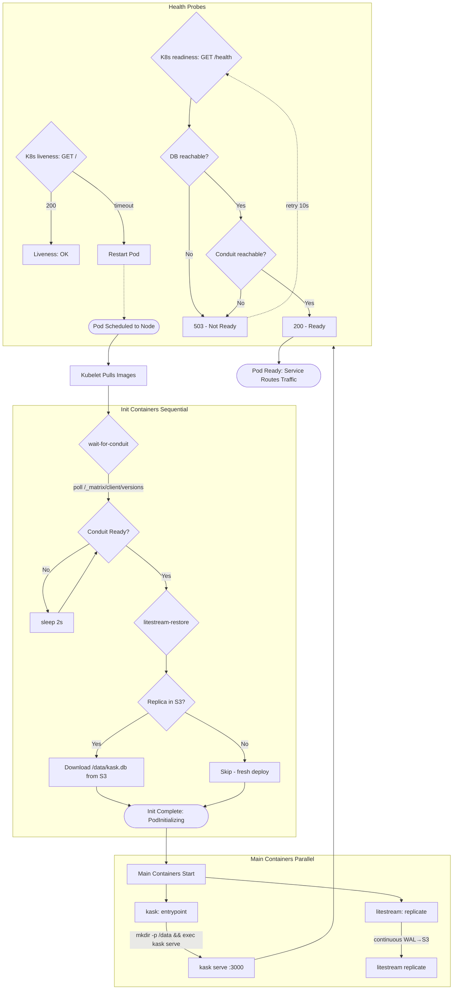
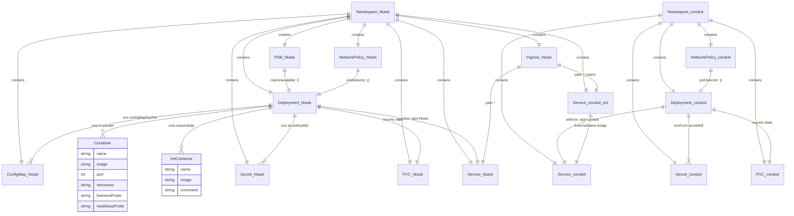
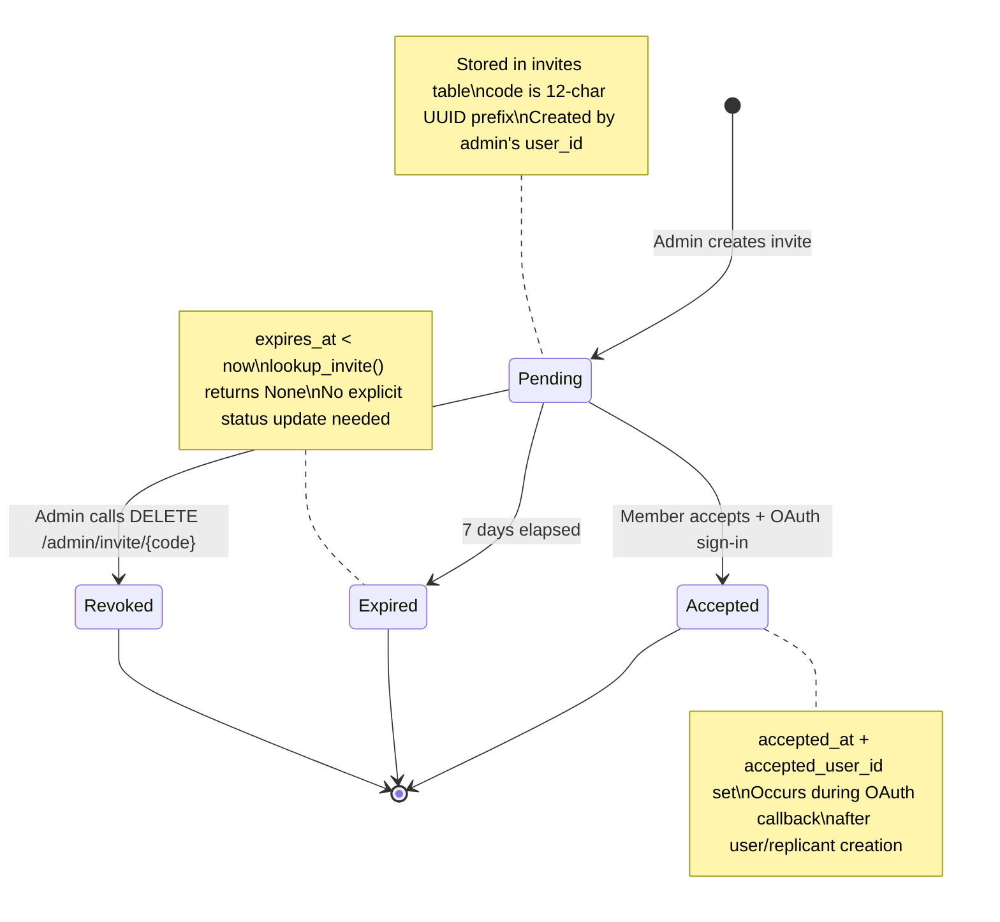

# Deployment and Transport

Deploy hKask on Kubernetes with the Conduit Matrix homeserver sidecar, configure Matrix transport for agent-to-agent communication, and manage backup and restore operations. These three operational concerns are tightly coupled: the K8s deployment includes the Matrix sidecar, and Litestream provides continuous backup within the same deployment.

---

## Kubernetes Deployment

### Architecture Overview

The deployment consists of two Pods in separate namespaces:

```
Your Domain (hkask.yourdomain.com)
        │
        ▼
┌──────────────────────────────────────────┐
│  Ingress (nginx)                          │
│  /         → kask (port 3000)            │
│  /_matrix  → conduit (port 8008)         │
└──────────┬───────────────────────────────┘
           │
    ┌──────┴──────┐
    ▼             ▼
┌─────────┐  ┌──────────┐
│  kask   │  │ conduit  │
│  Pod    │  │  Pod     │
│ [kask]  │  │[conduit] │
│[litestr]│  │          │
│ /data   │  │ /data    │
│  PVC    │  │  PVC     │
└────┬────┘  └──────────┘
     │
     ▼
┌────────────────────────────┐
│  S3 Object Storage          │
│  Litestream streams WAL     │
│  Restores on pod restart    │
└────────────────────────────┘

Namespace: hkask       Namespace: conduit
```

### The Conduit Sidecar

Conduit is a lightweight Matrix homeserver deployed as a separate Pod in the `conduit` namespace. It provides:

- **Agent-to-agent (A2A) communication**: Replicants register as Matrix users and communicate through rooms.
- **7R7 listener integration**: The `SevenR7Listener` polls Matrix rooms and emits CNS observation spans.
- **Thread-based attention**: Agents monitor threads via watchlists; the Curator decides escalation.

Conduit runs as its own Deployment because it has a different lifecycle from kask — a Conduit crash does not restart the main application.

### Litestream Sidecar

Litestream runs as a sidecar container in the kask Pod, sharing the `/data` PersistentVolume. It continuously streams SQLite WAL (write-ahead log) changes to S3-compatible object storage. On pod restart, an **init container** runs `litestream restore` before kask starts, ensuring the database is fully restored.

Configure these in `deploy/k8s/configmap.yaml`:
- `litestream-bucket`: S3 bucket name
- `litestream-endpoint`: S3 endpoint URL
- `litestream-region`: S3 region
- `litestream-force-path-style`: `"true"` or `"false"`

And in `deploy/k8s/secret.yaml`:
- `litestream-access-key-id`: S3 access key
- `litestream-secret-access-key`: S3 secret key

The master passphrase for SQLCipher encryption goes in `deploy/k8s/secret.yaml` as `master-passphrase`.

### Namespace Isolation

Two namespaces provide security boundaries:
- **`hkask`**: kask Deployment, ConfigMap, Secret, PVC, Service, Ingress
- **`conduit`**: Conduit Deployment, Service, NetworkPolicy

NetworkPolicies restrict cross-namespace traffic. If Conduit is compromised, it cannot access kask's Secrets.

### Pod Startup Sequence

1. Init container runs `litestream restore` to pull the latest database from S3
2. Litestream sidecar starts streaming WAL changes to S3
3. kask container starts, opens the restored database, and begins serving

### Key Operational Commands

```bash
# View pods
kubectl -n hkask get pods
kubectl -n conduit get pods

# View logs
kubectl -n hkask logs deploy/kask
kubectl -n hkask logs deploy/kask -c litestream

# Restart
kubectl -n hkask rollout restart deploy/kask

# Check resource usage
kubectl -n hkask top pods

# Shell into the container
kubectl -n hkask exec -it deploy/kask -- /bin/sh

# Verify backups
kubectl -n hkask exec deploy/kask -c litestream -- litestream snapshots /data/kask.db
```

### Deployment Files

The full deployment in `deploy/k8s/` includes 18 YAML files: `namespace.yaml`, `secret.yaml`, `configmap.yaml`, `pvc.yaml`, `deployment.yaml`, `service.yaml`, `ingress.yaml`, `entrypoint.sh`, `conduit/*`, `conduit-external-service.yaml`, `networkpolicy.yaml` (both namespaces), and `pdb.yaml`.

For the full step-by-step walkthrough (including Hetzner setup, K3s installation, DNS, and TLS), see `docs/plans/k8s-admin-guide.md`.

### Pod Export to K8s

You can export an agent pod as K8s manifests directly from the CLI:

```bash
kask pod export-k8s <pod_id> [--volume-size-gb 10] [--max-replicas 3] [--output ./k8s-manifests]
```

This generates K8s manifests tailored for Hetzner K3s deployment. You can also export a pod as a container build context:

```bash
kask pod export-container <pod_id> [--output ./pod-build]
```

---

## Matrix Transport Setup

Configure hKask to communicate via the Matrix protocol for agent-to-agent (A2A) messaging.

### Prerequisites

A running Matrix homeserver (e.g., Conduit, Synapse), or a Matrix.org account. The `matrix` feature must be enabled (it is on by default in `hkask-communication`).

### Step 1: Enable the Matrix Feature

```bash
cargo build --features matrix
```

If you disabled it previously, re-enable it in your `.cargo/config.toml` or pass `--features matrix` to build commands.

### Step 2: Configure Matrix Credentials

Set these environment variables:

```bash
export HKASK_MATRIX_HOMESERVER="https://matrix.example.com"
export HKASK_MATRIX_USERNAME="@my-agent:example.com"
export HKASK_MATRIX_PASSWORD="your-password"
```

Alternatively, add them to `~/.hkask/settings.yaml`:

```yaml
matrix:
  homeserver: "https://matrix.example.com"
  username: "@my-agent:example.com"
  password: "your-password"
```

### Step 3: Deploy the Matrix Sidecar

Deploy a Conduit sidecar locally (for non-K8s deployments):

```bash
kask matrix deploy-sidecar --domain "example.com" [--with-web-client] [--output ./conduit-manifests]
```

### Step 4: Register Your Agent

Agents are registered on the Matrix homeserver via the CLI. The `register-agent` subcommand creates a Matrix account for the agent:

```bash
kask matrix register-agent "my-agent" --homeserver "https://matrix.example.com"
```

To create a human user account instead, use:

```bash
kask matrix register-user "my-username" --homeserver "https://matrix.example.com"
```

### Step 5: Verify Registration

```bash
kask matrix status-sidecar
```

Expected output shows:
- Docker container health (Conduit, Caddy)
- API reachability
- Database status

### Step 6: Test A2A Message Delivery

A2A messaging is performed through the REPL, not the CLI. Start a chat session and use the `/msg` slash command:

```bash
kask chat
```

Inside the REPL:

```
/msg <room_id> "Hello from hKask"
```

See [Agents and Pods](agents-and-pods.md) for the full `/matrix` and `/msg` slash command reference.

### Step 7: Monitor Message Flow

Matrix transport events emit CNS spans. Subscribe to the communication namespace:

```bash
kask cns subscribe --agent curator --spans cns.communication
```

### Troubleshooting

| Issue | Likely Cause | Fix |
|-------|-------------|-----|
| `Connection refused` | Homeserver unreachable | Verify URL and network access |
| `Authentication failed` | Invalid credentials | Check username/password |
| `Room not found` | Agent not registered | Run `kask matrix register-agent` |
| `Feature not enabled` | `matrix` feature disabled | Rebuild with `--features matrix` |

### Notes

- Matrix transport requires the `hkask-communication` crate with the `matrix` feature enabled.
- Full MatrixTransport integration tests require a running Conduit homeserver (Docker sidecar). Unit tests for AgentRegistry (record, resolve, deregister, monitor, watchers) run without a homeserver.
- The 7R7 listener processes incoming messages on a dedicated Matrix room listener thread.

---

## Backup and Restore

hKask uses SQLCipher-encrypted SQLite databases with Litestream for continuous backup to S3-compatible object storage. Backups are managed at two levels: Litestream continuous WAL streaming (Kubernetes deployment) and CLI on-demand snapshots.

Backups are stored at `~/.config/hkask/backups/` in encrypted SQLCipher format (`.db` files).

### CLI Backup Commands

The `kask backup` subcommands:

```bash
# Create a point-in-time snapshot of all tracked storage types
kask backup snapshot [--scope <scope>]

# List all stored snapshots with timestamps, artifact counts, and trigger types
kask backup list [--limit <n>]

# Restore the database from a snapshot (destructive — replaces current state)
kask backup restore [--pod <pod>] [--date <date>] [--commit <commit>]

# Verify that stored snapshots are not corrupted
kask backup verify

# Show backup configuration and status
kask backup status
```

### Backup Configuration

The `BackupDataBridge` in `crates/hkask-tui/src/bridges/backup.rs` exposes configuration fields:

- **Auto-Snapshot**: Enable/disable automatic snapshots on a schedule
- **Verify After Snapshot**: Run integrity verification after each snapshot
- **Encryption**: Enable/disable encryption of backup files (enabled by default with SQLCipher)
- **Tracked Types**: Number of storage artifact types included in backups
- **Retention**: Daily snapshot count and weekly snapshot count

### Kubernetes Litestream Backup

In the K8s deployment, Litestream runs as a sidecar in the kask Pod. Verify backups:

```bash
# Check Litestream snapshots
kubectl -n hkask exec deploy/kask -c litestream -- litestream snapshots /data/kask.db

# Check Litestream replication status
kubectl -n hkask logs deploy/kask -c litestream | grep "replicating"
```

Litestream configuration is in `deploy/k8s/configmap.yaml` (bucket, endpoint, region) and `deploy/k8s/secret.yaml` (access key, secret key).

### Backing Up the Keystore

The hKask keystore (`crates/hkask-keystore/`) stores cryptographic material. Back it up separately:

```bash
# The keystore is at ~/.config/hkask/keystore/
cp -r ~/.config/hkask/keystore/ ~/backups/hkask-keystore-$(date +%Y%m%d)/
```

The keystore path is configurable via environment:

```bash
export HKASK_KEYSTORE_PATH="/secure/path/keystore"
```

### Disaster Recovery

To fully restore from backup:

1. **Restore the database** from the most recent snapshot or Litestream S3 backup
2. **Restore the keystore** from your separate keystore backup
3. **Verify integrity**: Run `kask backup verify`
4. **Start kask**: The init container (K8s) or manual `litestream restore` (bare metal) ensures the database is complete before kask starts

The Litestream init container (`litestream restore`) in the K8s deployment runs before kask starts, guaranteeing the database is on disk when the application opens it.

---

## Related

- [Install and Configure hKask](install-and-configure.md) — Build and initial setup
- [Agents and Pods](agents-and-pods.md) — Pod export to K8s manifests
- [Sovereignty and Observability](sovereignty-and-observability.md) — CNS monitoring for deployment health
---

## Inlined Diagrams

The following Mermaid diagrams were inlined from the former `docs/diagrams/` directory per DOCUMENTATION_STANDARDS §1.

### K8s Deployment Architecture

*Inlined from `docs/diagrams/flowchart-deployment-architecture.md`*


# K8s Deployment Architecture

How hKask resources connect in the Kubernetes cluster. Two namespaces, one Ingress, two PVC-backed pods with sidecars. Extracted from `deploy/k8s/` manifests and the admin guide.

```mermaid
flowchart TD
    User([Browser / Matrix Client])
    DNS[(DNS: hkask.example.com)]

    User --> DNS
    DNS --> Ingress

    subgraph Cluster
        Ingress[Ingress: nginx + cert-manager TLS]
        Ingress -->|"/"| KaskSvc[kask Service :3000]
        Ingress -->|"/_matrix"| ConduitBridge[conduit ExternalName Service]
        ConduitBridge -.->|cross-ns DNS| ConduitSvc[conduit Service :8008]

        subgraph ns_hkask[Namespace: hkask]
            KaskSvc --> KaskPod

            subgraph KaskPod[Pod: hkask]
                InitWfc[init: wait-for-conduit]
                InitRestore[init: litestream-restore]
                KaskContainer[kask serve]
                LitestreamSidecar[litestream replicate]
                InitWfc --> InitRestore --> KaskContainer
                LitestreamSidecar -.->|shared /data| DataPV[(PVC: app-data 20Gi<br/><i>K8s resource, not a crate</i>)]
                KaskContainer --> DataPV
            end

            NP_hkask[NetworkPolicy: deny-all]
            NP_hkask -.-> KaskPod

            KaskSecrets[Secret: app-secrets<br/><i>(K8s resource, not a crate)</i>] -.-> KaskPod
            KaskConfig[ConfigMap: app-config<br/><i>(K8s resource, not a crate)</i>] -.-> KaskPod
            KaskPDB[PDB: maxUnavailable 0] -.-> KaskPod
        end

        subgraph ns_conduit[Namespace: conduit (external Conduit homeserver, not an hKask crate)]
            ConduitSvc --> ConduitPod

            subgraph ConduitPod[Pod: conduit]
                ConduitContainer[conduit :8008]
                ConduitContainer --> ConduitData[(PVC: conduit-data 10Gi)]
            end

            NP_conduit[NetworkPolicy: deny-all] -.-> ConduitPod
            ConduitSecrets[Secret: conduit-secrets] -.-> ConduitPod
        end

        KaskContainer -->|HTTP Matrix API| ConduitSvc
    end

    LitestreamSidecar -->|WAL replication| S3[(S3 Object Storage)]
    InitRestore -->|restore from| S3
```
<!-- DIAGRAM_ALIGNMENT
id: DIAG-DEP-001
verified_date: 2026-07-12
verified_against: crates/hkask-cli/src/main.rs, crates/hkask-communication/src/lib.rs
status: VERIFIED
-->

**Readiness flow:** `GET /health` → DB query + Conduit reachability → 200 if both OK, 503 otherwise. K8s readiness probe uses this.
**Liveness flow:** `GET /` → static HTML → always 200 (fast, only proves HTTP server is alive).

For the startup sequence, see `docs/diagrams/flowchart-pod-startup.md`.
For resource relationships, see `docs/diagrams/erd-k8s-resources.md`.
For the full admin guide, see `docs/plans/k8s-admin-guide.md`.


### K8s Pod Startup Sequence

*Inlined from `docs/diagrams/flowchart-pod-startup.md`*


# K8s Pod Startup Sequence

The exact sequence when a new hKask pod is created. Understanding this helps debug startup failures. Extracted from `deploy/k8s/deployment.yaml` and the admin guide §7.


<!-- DIAGRAM_ALIGNMENT
id: DIAG-DEP-002
verified_date: 2026-07-12
verified_against: crates/hkask-cli/src/main.rs, crates/hkask-communication/src/lib.rs
status: VERIFIED
-->

The two init containers run sequentially: first `wait-for-conduit` polls until the Matrix homeserver responds, then `litestream-restore` pulls the database from S3. Main containers start in parallel. The pod is only Ready when both DB and Conduit are reachable.

For the architecture overview, see `docs/diagrams/flowchart-deployment-architecture.md`.
For the full startup sequence explanation, see `docs/plans/k8s-admin-guide.md` §7.


### K8s Resource Relationships — ERD

*Inlined from `docs/diagrams/erd-k8s-resources.md`*


# K8s Resource Relationships

How Kubernetes resources in the hKask deployment relate to each other — what owns what, what references what. Extracted from `deploy/k8s/*.yaml`. Uses ERD notation for K8s resource dependency mapping.


<!-- DIAGRAM_ALIGNMENT
id: DIAG-DEP-003
verified_date: 2026-07-12
verified_against: crates/hkask-cli/src/main.rs, crates/hkask-communication/src/lib.rs
status: VERIFIED
-->

**Key relationships:**
- **Namespace** owns all resources within it — deleting a namespace cascades to everything
- **Deployment** manages pods via label selectors — changing the selector orphans existing pods
- **PVC** persists independently of the Deployment — survives pod restarts and node failures
- **Service** bridges ephemeral pod IPs to a stable DNS name via label selector
- **ExternalName Service** bridges the `hkask` namespace to the Conduit namespace (named `hkask` + `-conduit`; Conduit is the external Matrix homeserver) so the Ingress can route `/_matrix`
- **PDB** prevents voluntary eviction of the sole pod — `maxUnavailable: 0`

For the architecture overview, see `docs/diagrams/flowchart-deployment-architecture.md`.
For the startup sequence, see `docs/diagrams/flowchart-pod-startup.md`.


### Authentication Flow — OAuth Sequence

*Inlined from `docs/diagrams/sequence-auth-flow.md`*


# OAuth Authentication Flow

## Description

The hKask API authenticates users through GitHub/Google OAuth. The flow follows the standard Authorization Code Grant: the user is redirected to the provider's authorize URL, the provider returns an authorization code, and the server exchanges the code for an access token. The server then creates a session cookie scoped to the authenticated WebID (P12 — no anonymous agency). Every subsequent request carries the session cookie, which the auth middleware validates into a DelegationToken with scoped OCAP permissions (P4).

**Key source:** `crates/hkask-api/src/routes/auth.rs:1-300` (login + callback handlers), `crates/hkask-api/src/middleware/session.rs` (cookie extraction), `crates/hkask-api/src/middleware/auth.rs` (token validation).

**Related:** [MDS.md](../architecture/core/MDS.md) §4.2 (API Surface), [PRINCIPLES.md](../architecture/core/PRINCIPLES.md) P1 (User Sovereignty), P4 (OCAP), P12 (Anonymous Agency)

---

## Authentication Flow Sequence

```mermaid
sequenceDiagram
    actor User
    participant Browser
    participant Axum as hKask API
    participant OAuth as GitHub/Google OAuth
    participant SessionMgr as Auth Session Manager
    participant Keychain as OS Keychain

    User->>Browser: Navigate to /terminal
    Browser->>Axum: GET /api/v1/auth/login?provider=github
    Axum->>Keychain: retrieve OAuth client_id/secret
    Keychain-->>Axum: OAuthConfig
    Axum->>OAuth: Redirect to GitHub authorize URL
    OAuth-->>Browser: GitHub login page
    User->>OAuth: Authorize hKask
    OAuth-->>Browser: Redirect with code+state
    Browser->>Axum: GET /api/v1/auth/callback?provider=github&code=XXX&state=YYY
    Axum->>OAuth: POST /login/oauth/access_token (code)
    OAuth-->>Axum: access_token
    Axum->>OAuth: GET /user (access_token)
    OAuth-->>Axum: GitHub user profile
    Axum->>SessionMgr: Create session (WebID, provider, avatar)
    SessionMgr-->>Axum: Session cookie
    Axum-->>Browser: Set-Cookie: auth-session; Redirect to /terminal
    Browser->>Axum: GET /terminal (with cookie)
    Axum->>SessionMgr: Validate cookie
    SessionMgr-->>Axum: WebID + scoped DelegationToken
    Axum-->>Browser: Terminal UI (authenticated)
```
<!-- DIAGRAM_ALIGNMENT
id: DIAG-DA-003
verified_date: 2026-07-01
verified_against: >
  crates/hkask-api/src/routes/auth.rs:1-300
  crates/hkask-api/src/middleware/session.rs
  crates/hkask-api/src/middleware/auth.rs
status: VERIFIED
-->

## Guard Conditions

| Phase | Guard | Failure Mode |
|-------|-------|-------------|
| Login initiation | Provider must be "github" or "google" | 400 Bad Request |
| Callback | CSRF state cookie must match `state` param | 400 Bad Request (CSRF check failed) |
| Code exchange | Valid OAuth authorization code | Provider error (redirect back with error) |
| Session creation | User must exist (auto-created on first sign-in) | 500 Internal Server Error |
| Cookie validation | Session cookie present, not expired | 401 Unauthorized |

## Cross-Reference

- Source: `crates/hkask-api/src/routes/auth.rs`
- Session middleware: `crates/hkask-api/src/middleware/session.rs`
- Auth middleware (token validation): `crates/hkask-api/src/middleware/auth.rs`
- Architecture: `docs/architecture/core/hKask-architecture-master.md` Pattern C, P4 OCAP


### OAuth Registration & Onboarding Flow

*Inlined from `docs/diagrams/flowchart-oauth-registration.md`*

# OAuth Registration & Onboarding Flow

Decision flowchart for hKask's OAuth sign-in pipeline, covering open/closed registration modes, invite validation, and Matrix onboarding.

## Diagram

```mermaid
flowchart TD
    A([User visits hKask server]) --> B{Has session?}
    B -->|Yes| T[/Redirect to /terminal]
    B -->|No| C{OAuth sign-in}
    C --> D[GitHub OAuth flow]
    D --> E[OAuth callback received]
    
    E --> F{Invite cookie present?}
    F -->|Yes| G[Extract invite code]
    F -->|No| H[Verify CSRF state]
    G --> H
    
    H --> I{CSRF valid?}
    I -->|No| J([403 Forbidden])
    I -->|Yes| K[Exchange OAuth code for token]
    
    K --> L[Fetch GitHub user info]
    L --> M{ServerConfig loaded?}
    M -->|No| N[Skip guard: allow]
    M -->|Yes| O{Registration mode?}
    
    O -->|Open| N
    O -->|Closed| P{Invite code valid?}
    P -->|No| Q([403: Invite required])
    P -->|Yes| N
    
    N --> R[find_or_create_oauth_user]
    R --> S{Is invite flow?}
    S -->|Yes| U[accept_invite in DB]
    S -->|No| V[Create session]
    U --> V
    
    V --> W[Set session cookie]
    W --> X[Fire-and-forget: Matrix onboarding]
    X --> Y{Invite flow?}
    Y -->|Yes| Z[/Redirect to /onboarding]
    Y -->|No| T
    
    subgraph "Matrix Onboarding (tokio::spawn)"
        M1[Register human Matrix account] --> M2[Register replicant Matrix account]
        M2 --> M3{Accounts created?}
        M3 -->|Yes| M4[Ensure chat room exists]
        M4 --> M5[Invite users to room]
        M3 -->|No| M6[Log warning: Conduit offline]
    end
    
    X -.-> M1
```
<!-- DIAGRAM_ALIGNMENT
id: DIAG-DEP-005
verified_date: 2026-07-12
verified_against: crates/hkask-cli/src/main.rs, crates/hkask-communication/src/lib.rs
status: VERIFIED
-->

## Key Decision Points

| Node | Decision | Outcome |
|------|----------|---------|
| **F** | Invite cookie? | Bypasses CSRF check — the invite code is the anti-forgery token |
| **M** | Config loaded? | If corrupt/missing, registration guard is skipped (open access fallback) |
| **O** | Open vs Closed | Closed servers require a valid invite code |
| **P** | Invite valid? | Validated against `invites` table (pending + unexpired) |

## Non-Blocking Design

Matrix onboarding runs as a `tokio::spawn` fire-and-forget task. If Conduit is unreachable, the user still gets their session and can use the terminal. Matrix failures are logged but never block sign-in.

## Cross-References

- Server config: `crates/hkask-types/src/server_config.rs`
- Registration guard: `crates/hkask-api/src/routes/auth.rs` (callback handler, lines 281-316)
- Matrix onboarding: `crates/hkask-api/src/routes/auth.rs` (onboard_matrix, lines 728-778)
- Invite lifecycle: `docs/diagrams/state-invite-lifecycle.md`
- ERD: `docs/diagrams/erd-multi-user.md`


### Invite Lifecycle State Machine

*Inlined from `docs/diagrams/state-invite-lifecycle.md`*

# Invite Lifecycle State Machine

State diagram for hKask's multi-user invitation system. Invites have a 7-day expiry and two terminal states.

## Diagram


<!-- DIAGRAM_ALIGNMENT
id: DIAG-DEP-006
verified_date: 2026-07-12
verified_against: crates/hkask-cli/src/main.rs, crates/hkask-communication/src/lib.rs
status: VERIFIED
-->

## Invite Lifecycle States

| State | Trigger | DB Fields Set | Reversible? |
|-------|---------|--------------|-------------|
| **Pending** | `POST /api/v1/admin/invite` or `kask replicant invite` | `invite_id`, `created_by`, `code`, `status='pending'`, `created_at`, `expires_at` | No (only Accepted or Expired) |
| **Accepted** | OAuth callback after invite validation | `status='accepted'`, `accepted_at`, `accepted_user_id` | No (terminal) |
| **Expired** | 7 days after creation (checked on lookup) | None (implicit — `lookup_invite` checks `expires_at > now`) | No (terminal) |

## Invite Code Format

- Generated from `uuid::Uuid::new_v4().to_string().replace('-', "")[..12]`
- Example: `a1b2c3d4e5f6` (12 alphanumeric chars)
- Delivered via `hkask_invite_code` HttpOnly cookie (10-minute TTL) during redirect from `/api/v1/auth/accept-invite`

## CNS Observability

| Span | When Emitted | Status |
|------|-------------|--------|
| `cns.deploy.invite` (invite_accepted) | After `accept_invite()` succeeds in callback | ✅ Implemented |
| `InviteSent` | When admin creates invite | ❌ Not yet implemented |
| `InviteExpired` | When expired invite is looked up | ❌ Not yet implemented |

## Cross-References

- OAuth flow: `docs/diagrams/flowchart-oauth-registration.md`
- ERD: `docs/diagrams/erd-multi-user.md`
- Functional spec §3.16: `docs/architecture/core/FUNCTIONAL_SPECIFICATION.md`
- Invite storage: `crates/hkask-storage/src/user_store.rs` (create_invite, lookup_invite, accept_invite)

