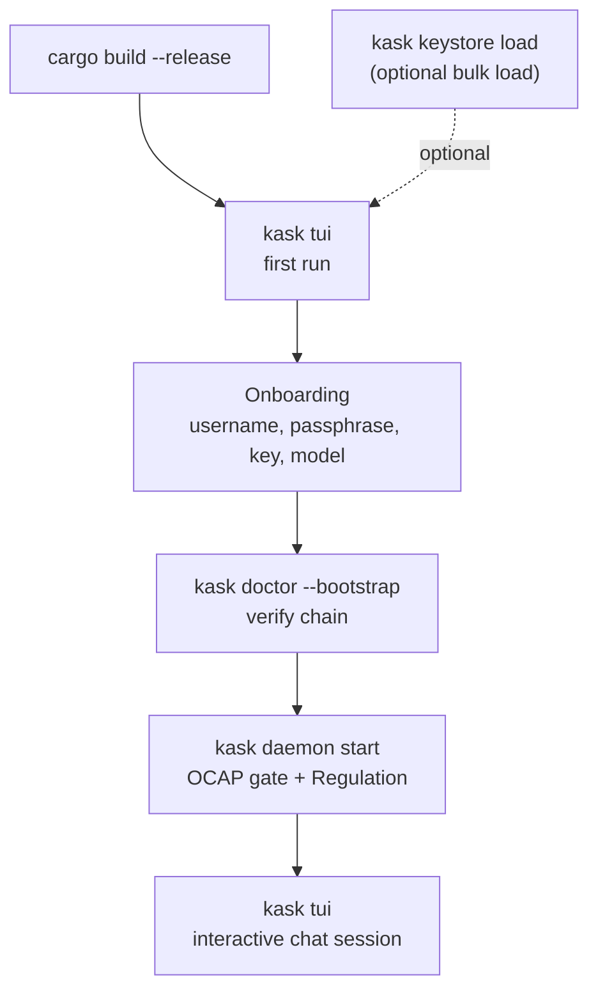

# Getting Started with hKask

**Purpose:** Take a new user from zero to a working `kask` session in under 15
minutes. By the end, you will have compiled hKask, created your userpod, run a
chat session in the TUI, invoked an MCP tool, and inspected Regulation health.

**Prerequisites:** Rust toolchain (stable, edition 2024), git, a terminal.
At least one inference-provider API key (e.g. DeepInfra, OpenRouter, or a
local Ollama instance).

**Orientation:** hKask is a **minimal viable container for users and AI tools**.
A single install serves a group of users; each user gets exactly one userpod
(their sovereign identity, memory, and consent boundary within the install).
This tutorial walks one user through the local `kask tui` path end-to-end.

---

## 1. Clone and Build

```bash
git clone https://github.com/mdz-axo/hKask.git
cd hKask
cargo build --release
```

The workspace contains 53 core crates and 16 MCP servers (69 workspace
members, excluding fuzz). The initial build takes several minutes.

Verify the binary:

```bash
./target/release/kask --version
```

Expected: `kask 0.31.0`

---

## 2. First Run — Create Your UserPod

The primary entry point is `kask tui`, a ratatui workspace that embeds the
REPL. On first run it walks you through onboarding:

```bash
./target/release/kask tui
```

Onboarding prompts for:

1. **Username** — becomes your userpod name (your sovereign identity).
2. **Email, first/last name** — stored in your encrypted local database.
3. **Master passphrase** — encrypts your SQLCipher database (min 8 chars;
   store securely, cannot be recovered).
4. **Provider key** — at least one inference provider (e.g. `DI_API_KEY` for
   DeepInfra, `OR_API_KEY` for OpenRouter, or a local Ollama base URL).
5. **Model** — pick from the dynamically discovered catalog (OpenRouter
   discovery → filtered top 12 → fallback).

Onboarding creates:

- `~/.local/share/hkask/hkask.db` — encrypted personal database
- `~/.local/share/hkask/agents/<your-name>/pod.db` — your per-pod SQLCipher DB
- OS keychain entries for the master passphrase, A2A secret, and provider keys
- `~/.config/hkask/settings.json` — configuration

### Bulk-Loading Keys (Optional)

If you already have a `.env` with all your keys, load them into the OS
keychain in one step. `.env` is a **setup-time only** file; after loading,
`kask` resolves all settings from the keychain and `.env` is no longer needed.

```bash
cp key_load_template.env .env
# Edit .env: DI_API_KEY, OR_API_KEY, KC_API_KEY, HKASK_OR_MAX_PRICE, ...
./target/release/kask keystore load --path .env --prefix HKASK_ --overwrite --shred
```

`--shred` securely deletes `.env` after loading. Then run `kask tui` —
onboarding detects existing keys and skips provider setup.

---

## 3. Health Check — `kask doctor`

Verify the full bootstrap chain (daemon socket, keychain entries, DB
passphrase, MCP server discovery):

```bash
./target/release/kask doctor --bootstrap
```

To check only inference-provider credentials (lightweight API call per
configured provider):

```bash
./target/release/kask doctor
```

`kask doctor --bootstrap` is the diagnostic to reach for when the REPL stalls
or MCP servers fail to register. It prints a per-check ✅/❌ report with the
exact `kask` command to remediate each failure.

---

## 4. Start the Daemon (Background)

The hKask daemon is a persistent background process that serves OCAP gate
verification (auth, assignment, capability) to MCP server binaries over a
Unix domain socket, and runs the Regulation monitoring loops. Without it,
MCP servers fall back to direct mode and bypass OCAP verification.

```bash
./target/release/kask daemon start &
./target/release/kask daemon status    # pings the socket, not just file existence
```

Expected: `Daemon is running (socket: ...)`

> **Note:** `kask tui` auto-starts the daemon if it is not already running,
> and onboarding creates a UserStore session for your userpod. Starting the
> daemon explicitly is recommended for first-run clarity and for environments
> where you want the daemon running independently of the TUI session. See
> [ADR-035](../architecture/ADRs/ADR-035-userpod-server-mode.md) for the full
> daemon architecture.

---

## 5. Your Chat Session — `kask tui`

```bash
./target/release/kask tui
```

You are now in the interactive workspace. The Curator persona responds to
your turns with direct, technical, no-filler output. Type a message and press
Enter:

```
kask> What skills are available?
```

Exit with `/quit` (or `q` / `exit`) or `Ctrl+D`.

### Non-Interactive Mode

For one-shot file/stdin input (streaming, no TUI):

```bash
./target/release/kask tui -f input.txt        # stream a file
echo "Summarize this." | ./target/release/kask tui -f -   # stream stdin
```

Load specific MCP servers before a non-interactive turn with `--mcp <server>`
(repeatable).

---

## 6. REPL Slash Commands

The real slash commands available inside `kask tui` (verified against
`crates/hkask-repl/src/commands.rs`):

| Command | Aliases | Action |
|---------|---------|--------|
| `/help [cmd]` | `h`, `?` | Show help, or details for a specific command |
| `/quit` | `q`, `exit` | End the session |
| `/clear` | `cls` | Clear the screen |
| `/status` | `st` | System status (Regulation, agent, pod count) |
| `/agent [name]` | `a` | Switch agent, or show current |
| `/agents` | `ls` | List registered agents |
| `/model [name\|query\|list\|refresh]` | `m` | Switch model, fuzzy search, list, or refresh catalog |
| `/fusion [off\|on\|status]` | | Multi-model deliberation toggle |
| `/tools` | | List MCP tools |
| `/mcp list\|start <server\|all>` | | Manage MCP server connections |
| `/invoke <server>/<tool> [args]` | `inv` | Invoke an MCP tool |
| `/skill list [public\|private] \| status <name> \| audit` | `sk` | Skill discovery, status, auditing |
| `/bundle [skill1 skill2 ...] \| list \| apply <id> \| off` | `b` | Compose / apply skill bundles |
| `/consolidate` | `cons` | Trigger episodic→semantic memory consolidation |
| `/metacognition` | `meta` | Run a metacognition cycle |
| `/sovereignty` | `sov` | Show sovereignty status |
| `/escalations` | `esc` | List pending escalations |
| `/resolve <id>` / `/dismiss <id>` | | Resolve / dismiss an escalation |
| `/kata list \| show <name> \| start <name>` | | Kata practice cycles |
| `/kanban ...` | `kb` | Kanban board and task coordination |
| `/thread list \| switch <id> \| new` | `th` | Manage chat threads |
| `/repl [setting] [value]` | | Show or set REPL inference settings |
| `/start` | `tour`, `onboarding` | Guided tour of hKask capabilities |

> Skills are PDCA loops invoked at runtime through the TUI REPL (`/skill`,
> `/bundle apply`, or the cascade via the `hkask-mcp-skill` MCP server). The
> CLI's `kask skill` subcommand is a **CI audit gate**, not a runtime invoker
> (see §8).

---

## 7. Invoke an MCP Tool

MCP tools are the 16 built-in servers (research, memory, codegraph, media,
filesystem, regulation, …). List the inventory from the shell (read-only):

```bash
./target/release/kask mcp list-servers
./target/release/kask mcp list-tools
./target/release/kask mcp get-tool memory_recall
```

Invoke a tool inside the TUI:

```
kask> /invoke memory/search "sovereignty"
```

The tool dispatch flows through `hkask-guard` (LLM boundary scan) and the
OCAP capability gate before execution.

---

## 8. Skill Audit (CI Gate)

The `kask skill` CLI subcommand audits the skill corpus and exits non-zero if
any skill's health score falls below the threshold. It is the CI gate, not a
runtime invoker:

```bash
./target/release/kask skill audit --fail-below 0.8
./target/release/kask skill audit --json    # machine-readable report
```

Runtime skill invocation happens in the TUI via `/skill`, `/bundle`, or the
`hkask-mcp-skill` MCP server.

---

## 9. Sovereignty Audit

Run a Magna Carta structural audit against the codebase (P1–P4 compliance):

```bash
./target/release/kask sovereignty verify
./target/release/kask sovereignty verify --principle P1 --json
```

---

## 10. HTTP API (Optional)

To expose the HTTP API (shares state with the CLI) — useful for browser-based
or programmatic access:

```bash
./target/release/kask serve --port 3000 --host 127.0.0.1
```

OpenAPI spec is generated at `docs/generated/openapi.json`.

---

## 11. First-Run Bootstrap Flow



<!-- DIAGRAM_ALIGNMENT
id: DIAG-GS-001
verified_date: 2026-07-21
verified_against: crates/hkask-cli/src/cli/mod.rs (Commands::Tui, Doctor, Daemon, Keystore); crates/hkask-cli/src/onboarding.rs (run_onboarding → create_first_userpod_flow); crates/hkask-cli/src/commands/doctor.rs (run_bootstrap_check)
status: VERIFIED
-->

---

## 12. Next Steps

- **How-To Guides:** [Install and configure](install-and-configure.md), [Skills & composition](skills-and-composition.md), [Sovereignty & observability](sovereignty-and-observability.md)
- **Reference:** [Crate API reference](../reference/api-reference.md), [Skill registry](../reference/skills/README.md), [Regulation span registry](../reference/regulation-spans.md), [MCP servers](../reference/mcp-servers/README.md)
- **Explanation:** [Regulation homeostatic loop](../explanation/regulation-and-loops.md), [Hexagonal ports](../explanation/architecture-patterns.md), [OCAP dispatch](../explanation/sovereignty-and-ocap.md)
- **Architecture:** [hKask architecture master](../architecture/core/hKask-architecture-master.md), [Magna Carta](../architecture/core/magna-carta.md)

---

*Verified against `crates/hkask-cli/src/cli/mod.rs`, `crates/hkask-cli/src/cli/actions.rs`,
`crates/hkask-repl/src/commands.rs`, and `crates/hkask-cli/src/onboarding.rs` (2026-07-21).
If any step fails, file an issue — documentation drift is a bug.*