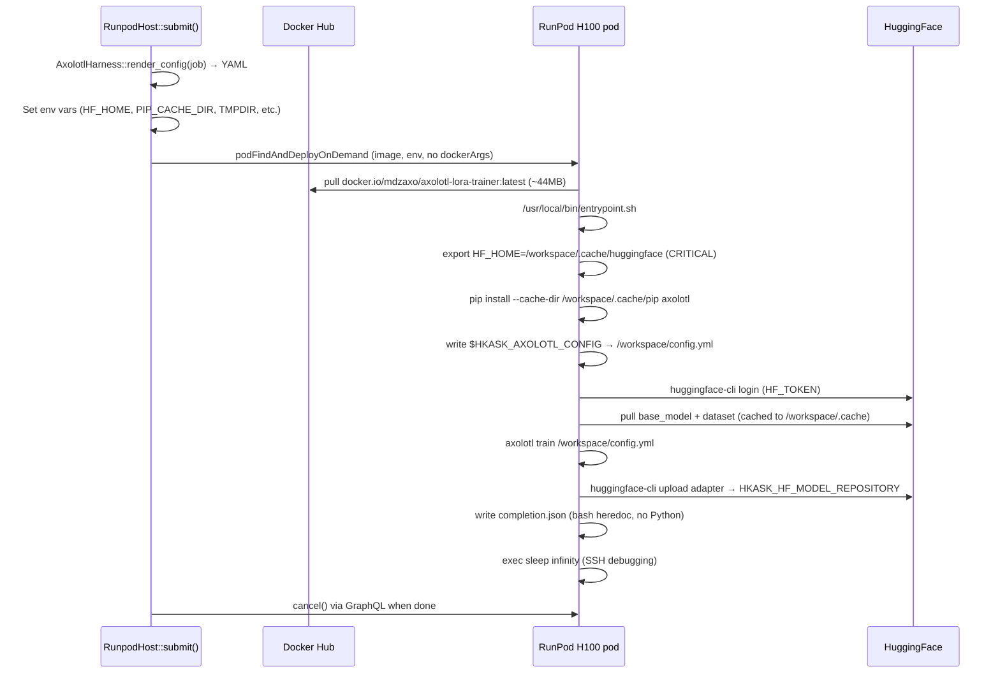

# RunPod LoRA Training Guide — Lessons for Agents

> **Purpose**: This guide consolidates hard-won lessons from RunPod LoRA training
> runs so that agents (human and AI) can learn from each other's mistakes without
> repeating them. Each lesson is grounded in a specific failure that cost real
> money or time. Update this guide after every training run — new failures,
> new fixes, new patterns.
>
> **Last updated**: 2026-07-20 (after ~$600 of failed runs + this session's debugging)

---

## Quick Reference: The Working Pod Configuration

If you only read one section, read this. These are the non-negotiable settings
that must be set for a RunPod training pod to work.

### Environment variables (MUST be set in the pod)

```bash
export HF_HOME=/workspace/.cache/huggingface      # Model + dataset cache on workspace volume
export PIP_CACHE_DIR=/workspace/.cache/pip          # Pip cache on workspace volume
export TMPDIR=/workspace/tmp                         # Temp files on workspace volume
export PYTORCH_CUDA_ALLOC_CONF=expandable_segments:True  # Reduce GPU fragmentation
export HF_TOKEN=<your_token>                         # HuggingFace auth
export HF_HUB_ENABLE_HF_TRANSFER=1                  # Faster HF downloads
```

**Why**: The RunPod container disk is only ~60GB. Without `HF_HOME` and
`PIP_CACHE_DIR` pointing to the 200GB+ workspace volume, the container disk
fills up during pip install / dataset tokenization and causes
`No space left on device` → SIGSEGV crash → pod restart loop. This is the
**#1 cause of restart loops** (see Lesson 1).

### Pod sizing

| Model size | GPU | Container disk | Min memory | Min vCPU |
|---|---|---|---|---|
| ≤14B | RTX 4090 (or H100 for speed) | 50GB | 24GB | 8 |
| 20-70B | A100 80GB or H100 80GB | 200GB | 80GB | 8 |
| 70B+ | H100 80GB | 200GB | 80GB | 8 |

### Axolotl config (minimum viable)

```yaml
base_model: <hf-model-repo>
adapter: lora
sequence_len: 4096
bf16: true
trust_remote_code: true

lora_r: 16
lora_alpha: 32
lora_dropout: 0
lora_target_modules: [q_proj, k_proj, v_proj, o_proj, gate_proj, up_proj, down_proj]

datasets:
  - path: <hf-dataset-repo>
    data_files: <filename>
    type: chat_template

num_epochs: 3
micro_batch_size: 1
gradient_accumulation_steps: 16    # MUST be set — axolotl 0.18+ requires 2 of 3 batch fields
eval_batch_size: 1
gradient_checkpointing: true
learning_rate: 1e-4
lr_scheduler: cosine
warmup_steps: 100
weight_decay: 0.01
max_grad_norm: 0.3
optim: adamw_8bit

val_set_size: 0.05
eval_steps: 200
save_steps: 200
save_total_limit: 5
early_stopping_patience: 25

liger_kernel: true
flash_attention: false             # SDPA, no flash-attn compile needed
cut_cross_entropy: true

output_dir: /workspace/outputs
strict: false
```

---

## Lesson 1: Disk Space — The #1 Cause of Restart Loops

**Symptom**: Pod restarts every 15-20 minutes. Port changes between status
queries. No adapter uploaded. No error visible in RunPod's GraphQL API.

**Root cause**: The RunPod container disk is ~60GB. Without `HF_HOME` and
`PIP_CACHE_DIR` pointing to the workspace volume:
- pip install of axolotl + torch + CUDA libs writes ~5GB to the container disk
- HuggingFace model download writes ~3.5GB (1.7B) to ~140GB (70B) to the container disk
- Dataset tokenization caches write GBs to the container disk
- The disk fills up → `No space left on device` → SIGSEGV crash → RunPod restarts the container → repeat

**Fix**: Set `HF_HOME=/workspace/.cache/huggingface`, `PIP_CACHE_DIR=/workspace/.cache/pip`,
and `TMPDIR=/workspace/tmp` in the pod's environment. The workspace volume is
200GB+ and persists across container restarts.

**Detection**: Check `df -h` inside the pod. If `/` (container disk) is >90% full,
this is the issue. The workspace volume (`/workspace`) should have plenty of space.

**Cost wasted**: ~$600 in the 2026-07-19 post-mortem + ~$15 in this session.

---

## Lesson 2: Axolotl Config Validation — `gradient_accumulation_steps` Required

**Symptom**: `axolotl train` exits immediately with:
```
Value error, At least two of micro_batch_size, gradient_accumulation_steps, batch_size must be set
```

**Root cause**: Axolotl 0.18+ requires at least two of `micro_batch_size`,
`gradient_accumulation_steps`, and `batch_size` to be set in the YAML. If
`gradient_accumulation_steps` is omitted (because it defaults to 1), the
config fails validation.

**Fix**: Always emit `gradient_accumulation_steps` in the YAML, even when it's 1.
The `AxolotlHarness::render_config()` in `harness.rs` now does this.

**Detection**: Run `axolotl train /workspace/config.yml` locally (without GPU)
and check for the validation error. It fails before any GPU work starts.

---

## Lesson 3: Dataset Path — Use HuggingFace Repo, Not Local Path

**Symptom**: `axolotl train` fails with `RepositoryNotFoundError` or
`FileNotFoundError` when loading the dataset.

**Root cause**: `AxolotlHarness::render_config()` was writing `job.dataset_path`
(a local path like `/tmp/smoke_test_dataset.jsonl`) into the YAML. The pod
doesn't have that local file — it needs a HuggingFace dataset repo.

**Fix**: When `job.artifacts` is set, the harness now writes
`artifacts.dataset.repository` + `artifacts.dataset.path` (the HuggingFace
dataset repo) instead of the local path. The pod pulls the dataset from
HuggingFace at runtime.

**Detection**: Check the rendered YAML's `datasets: - path:` field. If it's a
local path (`/tmp/...`), this is the issue. It should be a HuggingFace repo
id (`org/dataset-name`).

---

## Lesson 4: `dockerArgs` vs ENTRYPOINT — Let the Image Run Naturally

**Symptom**: Pod restarts immediately (every ~60 seconds). Port changes on
every status query.

**Root cause**: RunPod's `dockerArgs` field overrides the Docker CMD, not the
ENTRYPOINT. When the image uses `ENTRYPOINT ["/usr/local/bin/entrypoint.sh"]`
and no CMD, setting `dockerArgs: "/usr/local/bin/entrypoint.sh"` causes the
script to be passed as an argument to itself, or overrides the entrypoint
entirely, causing unexpected behavior.

**Fix**: Don't set `dockerArgs` when using an image with ENTRYPOINT. Let the
image's ENTRYPOINT run naturally. `RunpodHost::submit()` now defaults
`dockerArgs` to empty (overridable via `RUNPOD_DOCKER_ARGS`).

**Detection**: If the pod restarts every ~60 seconds and the entrypoint hasn't
finished even the first step (pip install), check if `dockerArgs` is set in the
GraphQL mutation.

---

## Lesson 5: Pod ID Persistence — Don't Lose Track of Billing Pods

**Symptom**: Process restart loses all pod IDs. Pods keep billing on RunPod
with no way to cancel them. ~$600 wasted.

**Root cause**: `RunpodHost.jobs` was `Arc<Mutex<HashMap<String, String>>>`
(in-memory only). Process restarts lost all pod_ids.

**Fix**: Added JSON file persistence (`data/training-pods.json`, configurable
via `HKASK_PODS_FILE`). Pod IDs are loaded on startup and persisted atomically
(temp + rename) after every `submit` and `cancel`. Added `drain_all_pods()`
method for graceful shutdown.

**Detection**: Check `data/training-pods.json` after submit. If it doesn't
contain the pod_id, persistence is broken.

---

## Lesson 6: PiSSA Portability — Use EVA Instead

**Symptom**: Adapter trained with PiSSA (`peft_init_lora_weights: pissa_niter_4`)
produces garbage output when loaded with a different transformers/torch version.

**Root cause**: PiSSA initializes LoRA matrices from the SVD of the base weight.
The residual base is stored in the adapter. When the library version changes
(e.g., transformers 5.5.0 → 5.9.0), the residual base mismatch causes
~40-50% relative error per layer → garbage output.

**Fix**: Use EVA (`peft_init_lora_weights: eva`) instead. EVA uses
activation-vector SVD (not weight-SVD), producing a standard portable LoRA
adapter (A initialized with activation variance, B=0). See
`corpus/lora/axolotl-lora.yaml` for the canonical EVA config.

**Detection**: If the adapter was trained with PiSSA and produces garbage on
inference, check the transformers version mismatch. The fix is to retrain
with EVA.

---

## Lesson 7: Early Stopping Patience — Let the Cosine LR Decay

**Symptom**: Training stops too early. Eval_loss plateaus at 0.225 but the
model is undertrained.

**Root cause**: `early_stopping_patience: 7` is too aggressive for a cosine LR
schedule. The LR is still at 99% of peak when early stopping triggers. The
"plateau" is oscillation at high LR, not convergence.

**Fix**: Set `early_stopping_patience: 25`. Rule of thumb: set patience high
enough that `patience × eval_steps` covers at least 3-5% of total steps, so
the LR has time to start decaying. With patience=25, the model continued
improving: 0.225 (step 1800) → 0.205 (step 2000) → 0.198 (step 3200).

**Detection**: Plot eval_loss over steps. If it's still decreasing when
training stops, patience is too low.

---

## Lesson 8: Attention Backends — Don't Compile flash-attn

**Symptom**: `pip install flash-attn` takes 20-30 minutes and may fail due to
CUDA version mismatches.

**Root cause**: flash-attn compiles from source and is sensitive to CUDA
version mismatches.

**Fix**: Use PyTorch SDPA (`flash_attention: false` in axolotl). SDPA uses
native flash attention on H100 — nearly as fast for standard attention layers.
Do NOT install `flash-attn` unless you need `sample_packing: true` (which
requires flash-attn for cross-sample masking).

**Detection**: If `pip install flash-attn` fails or takes too long, switch to
`flash_attention: false` and disable `sample_packing`.

---

## Lesson 9: Process Management on RunPod

**Symptom**: SSH session killed when you `pkill -f "python"`. Background
processes don't survive SSH disconnect.

**Root cause**: `pkill -f "python"` matches the SSH session's Python too.
Plain `&` doesn't survive SSH disconnect.

**Fix**:
- Use targeted `kill <PID>` after finding PIDs with `pgrep`.
- Use `nohup bash -c '...' &` for background processes that survive SSH disconnect.
- Environment variables set during pod creation are NOT inherited by SSH sessions.
  Always `export` them explicitly in every SSH command.

---

## Lesson 10: Use Pre-Built Axolotl Image — Don't pip Install at Startup

**Symptom**: Pod restarts every 15-20 minutes. Port changes between status
queries. No adapter uploaded. No error visible.

**Root cause**: pip-installing axolotl at pod startup downloads ~2GB of wheels
(torch, CUDA libs, transformers, peft) and uses ~2GB of memory. This causes
OOM kills or container crashes during the pip install phase, before training
even starts. RunPod restarts the container, which starts pip install again,
creating a restart loop.

**Fix**: Use a pre-built axolotl template (RunPod template ID `24s5mdxz26` —
`winglian/axolotl-cloud:main-latest`). Axolotl and all dependencies are
pre-installed in the image. The pod starts training immediately — no pip
install delay, no OOM risk.

**Detection**: If the pod restarts every 15-20 min and the port changes, check
if the image is `python:3.11-slim` (pip install at startup) vs
`winglian/axolotl-cloud:main-latest` (pre-built). The pre-built image is the
fix.

**Cost wasted**: ~$30 in this session across multiple restart-loop pods.

**Note**: The minimal Docker image (`docker.io/mdzaxo/axolotl-lora-trainer:latest`)
remains useful for debugging and as a fallback, but production training should
use the pre-built axolotl template. The minimal image is ~129MB vs the
pre-built axolotl image which is ~10GB+ but has all deps ready.

---

## Lesson 11: Minimal Docker Image — Don't Bake In Heavy Deps

**Symptom**: Docker image is 22-31GB. Push takes hours. Pull on RunPod is slow.

**Root cause**: Baking in CUDA toolkit, PyTorch, Unsloth, and Python config
generators produces bloated images that violate the minimal design ethic.

**Fix**: Use `python:3.11-slim` base (~130MB) for the minimal image. But for
production training, use the pre-built axolotl template (Lesson 10). The
minimal image is for debugging and fallback only.

**Image**: `docker.io/mdzaxo/axolotl-lora-trainer:latest` (minimal, ~129MB)
**Template**: `24s5mdxz26` (pre-built axolotl, production use)

---

## Lesson 11: Rust-Only Tooling Policy — No Python in Our Code

**Symptom**: Policy violation. Python scripts baked into the image for config
generation and manifest writing.

**Root cause**: Previous attempts embedded Python scripts in the image for
config generation and completion manifest writing, violating the project's
Rust-only tooling policy.

**Fix**: The axolotl YAML config is generated by Rust
(`AxolotlHarness::render_config()` in `harness.rs`) and passed to the pod as
the `HKASK_AXOLOTL_CONFIG` env var. The entrypoint writes it to
`/workspace/config.yml` with `printf`. The completion manifest is written
with a bash heredoc (no Python). Python is only used by axolotl itself
(installed at runtime), not by our code.

---

## Debugging Checklist

When a RunPod training pod fails, check these in order:

1. **Port stability**: Query the pod's `runtime.ports[0].publicPort` every 60s.
   If it changes, the container is restarting. → Lesson 1 (disk space) or
   Lesson 4 (dockerArgs).

2. **Container disk**: SSH in and run `df -h`. If `/` is >90% full, the disk
   space issue (Lesson 1). Check that `HF_HOME` and `PIP_CACHE_DIR` point to
   `/workspace/.cache/...`.

3. **Entrypoint log**: Check `/workspace/logs/entrypoint.log` (if the entrypoint
   has `exec > >(tee -a ...) 2>&1`). The last lines show where it failed.

4. **Axolotl config validation**: Run `axolotl train /workspace/config.yml`
   locally (without GPU). If it fails with "At least two of micro_batch_size,
   gradient_accumulation_steps, batch_size must be set" → Lesson 2.

5. **Dataset path**: Check the rendered YAML's `datasets: - path:` field. If
   it's a local path, → Lesson 3.

6. **PiSSA vs EVA**: If the adapter was trained with PiSSA and produces
   garbage on inference, → Lesson 6.

7. **Pod ID persistence**: Check `data/training-pods.json`. If the pod_id
   isn't there, → Lesson 5.

---

## End-to-End Flow



---

## Key Files

| File | Purpose |
|---|---|
| `docker/axolotl-lora-trainer/Dockerfile` | Minimal image (~129MB) |
| `docker/axolotl-lora-trainer/entrypoint.sh` | Pure bash entrypoint |
| `mcp-servers/hkask-mcp-training/src/providers/harness.rs` | `AxolotlHarness::render_config()` — Rust config generation |
| `mcp-servers/hkask-mcp-training/src/providers/runpod.rs` | `RunpodHost::submit()` — pod creation + env vars |
| `corpus/lora/axolotl-lora.yaml` | Canonical axolotl config (EVA, r=32) |
| `docs/reference/lora-training-catalog.md` | LoRA method + gate catalog |
| `.agents/skills/lora-training/SKILL.md` | lora-training skill |
| `docs/post-mortem/2026-07-19-training-providers.md` | Post-mortem from $600 billing leak |

---

## Change Log

| Date | Author | Change |
|---|---|---|
| 2026-07-19 | mdz-axo | Initial PiSSA guide (deleted; superseded by this guide) |
| 2026-07-19 | mdz-axo | Post-mortem: $600 billing leak, PiSSA→EVA, pod persistence |
| 2026-07-20 | agent | Consolidated guide: Lessons 1-11 from this session's debugging |
