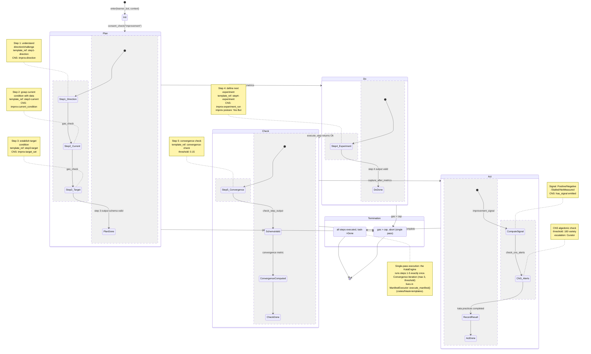
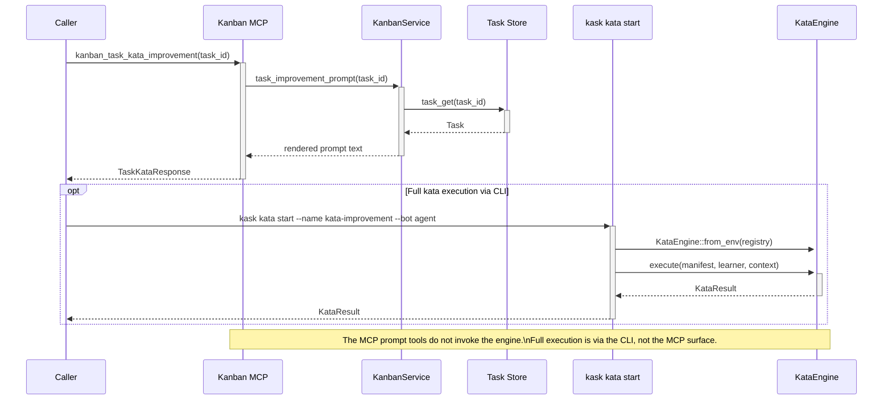

# Skills and Composition

Design, invoke, audit, publish, and compose hKask skills. Skills are PDCA (Plan-Do-Check-Act) templates loaded from a two-zone model. This guide also covers building MCP servers that provide tool surfaces for skills and agents.

---

## Skill Anatomy

A skill consists of three layers:

```
.agents/skills/my-skill/               ← Private zone (source of truth)
├── SKILL.md                            ← YAML front matter + markdown body

registry/templates/my-skill/            ← Registry layer (canonical per P5.1)
├── manifest.yaml                       ← FlowDef manifest
└── *.j2                                ← Jinja2 templates
```

- **`SKILL.md`** has YAML front matter (`name`, `visibility`, `namespace`, `description`) and a markdown body. It is a generated companion for development tooling.
- **`manifest.yaml`** declares the template set and, for FlowDef skills, convergence criteria and energy budget.
- **`*.j2` files** are Jinja2 templates rendered at invocation time with context variables.

### Two-Zone Model

| Zone | Directory | Purpose |
|------|-----------|---------|
| Private | `.agents/skills/` | Source of truth, author's working copies |
| Public | `skills/` | Export surface, generated by `kask skill publish` |

```
.agents/skills/                    (private zone — source of truth)
├── coding-guidelines/
│   └── SKILL.md
├── diagnose/
│   └── SKILL.md
└── ...

skills/                             (public zone — export surface)
├── mdz-axolotl--bugstalker/
│   └── SKILL.md  (visibility: public, namespace: mdz-axolotl)
└── ...

registry/templates/                 (registry layer — canonical source per P5.1)
├── coding-guidelines/
│   ├── manifest.yaml
│   └── *.j2
├── diagnose/
│   ├── manifest.yaml
│   └── *.j2
└── ...
```

**P5.1 rule:** The registry crate (`manifest.yaml` + `*.j2`) is the canonical source. `SKILL.md` is a generated companion. When they disagree, the registry is authoritative.

### Skill Domain Types

Skills fall into three domains, inferred from their registry manifest by `SkillLoader::infer_domain_from_registry()`:

| Domain | Template Type | Behavior |
|--------|--------------|----------|
| **FlowDef** | `FlowDef` | PDCA cycle with convergence threshold, energy budget, and loop action — the skill iterates autonomously |
| **KnowAct** | `KnowAct` | Knowledge-action template — provides reasoning guidance (one-shot) |
| **WordAct** | `WordAct` | Word-action template — provides language-level guidance (one-shot) |

FlowDef is the most powerful: it runs until it converges on a quality threshold, exhausts its energy budget, or escalates to the Curator.

Domain inference rules:
- If any `FlowDef` template exists in `manifest.yaml` → `FlowDef`
- Else if any `KnowAct` template exists → `KnowAct`
- Else if any `WordAct` template exists → `WordAct`
- Else (no registry layer) → `KnowAct` (reasoning companion)

---

## Listing and Checking Skills

### List Available Skills

```bash
# List all skills
kask skill list

# Filter by visibility
kask skill list --visibility public
kask skill list --visibility private
```

Output:

```
  private zone (.agents/skills/):
    coding-guidelines           visibility=private  namespace=-              hash=abc123def456
    diagnose                    visibility=private  namespace=-              hash=789012abc345
    ...

  public zone (skills/):
    mdz-axolotl--bugstalker     visibility=public   namespace=mdz-axolotl   hash=def456abc123
    ...
```

### Check Skill Status

Compare private source vs. published copy:

```bash
kask skill status <skill-name>
```

Output (private only):

```
Skill: diagnose
  Private zone: .agents/skills/diagnose
  Visibility:   private
  Source hash:  abc123def456
  Public zone:  (not published)
  Status:       private (not exported)
```

Output (published, in sync):

```
  Public zone:  skills/mdz-axolotl--diagnose
  Published by: mdz-axolotl
  Public hash:  abc123def456
  Status:       in sync
```

Output (stale):

```
  Status:  local changes since last publish — run `kask skill publish diagnose` to update
```

### Skill Auditing

Run a dual-layer audit to check skill health:

```bash
# Human-readable report
kask skill audit

# JSON output for CI
kask skill audit --json

# Fail if any skill scores below threshold (default threshold: 0.8)
kask skill audit --fail-below 0.70
```

The audit checks:
- Registry manifest presence (`registry/templates/<id>/manifest.yaml`)
- Template file existence (Jinja2 `.j2` files referenced in manifest)
- Content hash consistency between private and public zones
- SKILL.md front matter validity

Output example:

```
Skill audit report (fail_below=0.80)

skill                          score         status active defects
my-skill                        1.00         active    yes 0
coding-guidelines               1.00         active    yes 0
diagnose                        0.85         active    yes 1
    - Template "analyze.j2" referenced in manifest but not found
```

---

## Designing a Skill

### Writing a `manifest.yaml`

Create `registry/templates/my-skill/manifest.yaml`:

```yaml
# Manifest for my-skill
templates:
  - path: plan.j2
    type: FlowDef
  - path: do.j2
    type: FlowDef
  - path: check.j2
    type: FlowDef
  - path: act.j2
    type: FlowDef

# FlowDef-specific fields
convergence:
  threshold: 0.05        # Output delta must drop below this to converge
  max_iterations: 10     # Hard cap on PDCA iterations

gas:
  cap: 500               # Maximum energy budget in abstract units
  per_iteration: 50      # Energy reserved per iteration

loop:
  action: "If not converged, iterate with refined context"
```

**Convergence threshold** controls when the PDCA cycle stops. After each iteration, the output delta (difference from the previous iteration) is measured. If delta < threshold, the skill converges and returns its output.

- **Threshold = 0.0**: converge on zero delta (exact match to previous output)
- **Threshold = 0.05**: converge when outputs are 95%+ similar (typical for reasoning skills)
- **Threshold = 0.10+**: converge earlier (use for skills where refinement has diminishing returns)

**Gas budget** represents the skill's energy budget. Each iteration reserves a portion. The PDCA cycle stops when gas is exhausted. Gas uses a hold-settle pattern: reserved before invocation, settled after, with refunds for over-estimates.

**Loop action** is a natural-language instruction injected between PDCA iterations. It guides the LLM on how to refine its approach based on the previous output.

### Writing Templates (`.j2` Files)

Templates are Jinja2 files rendered with context variables at invocation time. The standard PDCA structure:

**`plan.j2` — Plan phase:**

```jinja2
You are executing the "my-skill" skill. This is the PLAN phase.

Context: {{ context }}

Based on the context above, develop a structured plan for achieving the goal.
Consider:
1. What information is needed
2. What tools should be used
3. What intermediate outputs are required

Return your plan as a numbered list.
```

**`do.j2` — Do phase:**

```jinja2
You are executing the "my-skill" skill. This is the DO phase.

Plan:
{{ plan_output }}

Context: {{ context }}

Execute the plan above. Use the available tools. Report your results.
```

**`check.j2` — Check phase:**

```jinja2
You are executing the "my-skill" skill. This is the CHECK phase.

Expected outcome: {{ plan_output }}
Actual outcome: {{ do_output }}

Evaluate:
1. Did the execution match the plan?
2. Are the results complete and correct?
3. What gaps or errors exist?

Return a concise assessment.
```

**`act.j2` — Act phase:**

```jinja2
You are executing the "my-skill" skill. This is the ACT phase.

Assessment: {{ check_output }}

Based on the assessment:
1. If issues were found, propose corrective actions
2. If complete, produce the final output
3. If stuck, request escalation to the Curator

Return your action.
```

### Context Variables

The following context variables are automatically available during template rendering:

| Variable | Source | Description |
|----------|--------|-------------|
| `{{ context }}` | User-supplied | The original invocation context (query, prompt, parameters) |
| `{{ plan_output }}` | Previous PDCA phase | Output from the Plan phase |
| `{{ do_output }}` | Previous PDCA phase | Output from the Do phase |
| `{{ check_output }}` | Previous PDCA phase | Output from the Check phase |
| `{{ iteration }}` | FlowDef engine | Current PDCA iteration number |

### Writing the `SKILL.md`

Create `.agents/skills/my-skill/SKILL.md`:

```markdown
---
name: my-skill
visibility: private
namespace: my-namespace
description: A custom PDCA skill for automated code review
---

# My Skill

This skill performs an automated code review using a PDCA cycle:
- **Plan:** Analyze the code structure and identify review targets
- **Do:** Execute the review using available tools
- **Check:** Validate findings against quality criteria
- **Act:** Produce a review report with recommendations
```

The `visibility` field controls where the skill appears:

| Value | Zone | Description |
|-------|------|-------------|
| `private` | `.agents/skills/` only | Author's working copy; not exported |
| `public` | Both zones | Available to all; published to `skills/` |
| `shared` | Both zones | Available to authenticated replicants |

### Deriving SKILL.md from the Registry

The `kask skill derive` command reverse-translates the SKILL.md companion from the registry crate. It reads `registry/templates/<name>/manifest.yaml` + `*.j2`, renders the `skill-maintenance/skill-maintenance-reverse` KnowAct template, infers the SKILL.md content via the default model, and writes `.agents/skills/<name>/SKILL.md`. This is the P5.1 derivation path — SKILL.md is generated, not hand-authored.

```bash
kask skill derive my-skill
```

---

## Testing a Skill Locally

### Step 1: Verify Discovery

```bash
kask skill list
```

Your skill should appear in the private zone.

### Step 2: Check Status

```bash
kask skill status my-skill
```

### Step 3: Audit Health

```bash
kask skill audit
```

### Step 4: Invoke from the REPL

```bash
kask chat
```

Inside the REPL:

```
/skill my-skill "Review the authentication module in src/auth.rs"
```

The REPL routes this through the `hkask-mcp-skill` MCP server:

1. **Lookup** — Skill ID resolved against the loaded registry
2. **Template rendering** — Jinja2 templates rendered with context variables
3. **System prompt prepended** — Tool-awareness preamble added automatically
4. **Inference** — Rendered template sent to inference port (`temperature: 0.3`, `max_tokens: 2048`)
5. **CNS span** — `cns.tool.skill_execute` emitted

---

## Publishing Skills

To make a private skill available in the public zone:

```bash
kask skill publish <skill-name>
```

This:
1. Copies the skill directory from `.agents/skills/<name>/` to `skills/<namespace>--<name>/`
2. Sets `visibility: public` in the published copy's SKILL.md
3. Sets `namespace` to the current replicant name (from `HKASK_REPLICANT_NAME`, git `user.name`, or `"local"`)
4. Emits a `cns.skill` span (`skill_published`)

Output:

```
Published 'diagnose' as 'mdz-axolotl--diagnose' to public zone: skills/mdz-axolotl--diagnose
  Sortable by replicant: mdz-axolotl
  Sortable by skill:    diagnose
```

After publishing, verify:

```bash
kask skill status my-skill
```

---

## Invoking Skills

Direct CLI invocation (`kask skill execute <name>`) is **not yet implemented**. Skills are invoked through the `hkask-mcp-skill` MCP server, which requires a running REPL/TUI session or API context.

### Via the REPL

```bash
kask chat
```

Inside the REPL:

```
/skill diagnose "My application crashes on startup"
```

The REPL routes this through the `SkillsDataBridge`, which calls `skill_execute` on the `hkask-mcp-skill` MCP server. If `/skill` is not available, use the MCP invoke path:

```
/invoke skill skill_execute skill_id=diagnose context="My app crashes on startup"
```

Alternatively, skills can be invoked through bundles:

```
/bundle diagnose coding-guidelines
```

### Via the TUI

In the TUI, navigate to the Skills window (`Ctrl+S` or workspace menu), select a skill, and use the Execute tab to run it with context.

### Via the API

List skills:

```http
GET /skills
Authorization: Bearer $HKASK_API_KEY
```

Execute a skill through the MCP protocol:

```http
POST /mcp/tools/call
Authorization: Bearer $HKASK_API_KEY
Content-Type: application/json

{
  "method": "tools/call",
  "params": {
    "name": "skill_execute",
    "arguments": {
      "skill_id": "diagnose",
      "context": {
        "error_message": "connection refused",
        "stack_trace": "..."
      }
    }
  }
}
```

### What Happens During Execution

When `skill_execute` is called:

1. **Lookup** — The skill ID is resolved against the `SkillsServer`'s in-memory map of loaded `SkillDef` entries.
2. **Template rendering** — The skill's Jinja2 template is rendered with the provided context variables.
3. **System prompt prepended** — A tool-awareness preamble is added:

   ```
   You are executing a skill template. Follow its instructions precisely.
   The calling agent has access to MCP tools including filesystem
   (fs.read, fs.write, fs.edit, fs.search, shell.exec), memory
   (episodic/semantic recall), web search, and context condensation.
   If the skill references tools outside this set, adapt the approach
   or report the missing capability.
   ```

4. **Inference** — The rendered template is sent to the inference port with `temperature: 0.3`, `max_tokens: 2048`.
5. **CNS span** — `cns.tool.skill_execute` is emitted with the skill ID and result.

### Convergence (FlowDef Skills Only)

FlowDef skills have a convergence threshold declared in their manifest. The PDCA cycle iterates until:

1. The output delta between iterations falls below the convergence threshold, OR
2. The energy budget is exhausted, OR
3. The maximum iteration count is reached

Convergence is validated by `FlowDefValidationReport` in `hkask-ports::flowdef_validation`.

### Gas Consumption

Every skill execution consumes **gas** from the agent's energy budget:

1. `GovernedTool` estimates cost via `EnergyEstimator::estimate_cost()`
2. Gas is **reserved** before invocation (hold-settle pattern)
3. After invocation, actual gas is **settled** — if actual < reserved, the difference is refunded

Gas consumption is observable via CNS spans. Run `kask cns alerts` and look for `cns.tool.invoked` (pre-invocation) and `cns.tool.completed` (post-invocation with settled cost).

### Error Handling

| Error | Cause | Resolution |
|-------|-------|------------|
| `Skill 'X' not found` | Skill ID not in the loaded registry | Run `kask skill list` to see available IDs; ensure REPL was started from the skill's project root |
| `Inference failed` | Inference port error | Check inference backend configuration; set `HKASK_DEFAULT_PROVIDER` and the corresponding `XX_API_KEY` |
| `Template render error` | Jinja2 syntax error in skill template | Run `kask skill audit` to detect template drift |

---

## Composing Skill Bundles

hKask's `BundleService` in `crates/hkask-services-skill/src/bundle.rs` composes multiple skills into a coordinated `BundleManifest` using inference-driven analysis.

### Creating a Bundle via CLI

```bash
kask bundle compose --skills coding-guidelines,idiomatic-rust --name rust-review-bundle --visibility shared
```

### Creating a Bundle Programmatically

```rust
use hkask_services_skill::bundle::BundleService;
use hkask_types::Visibility;

let result = BundleService::compose(
    &ctx,
    &["coding-guidelines".into(), "idiomatic-rust".into()],
    Some("rust-review-bundle"),
    Visibility::Shared,
    inference_port,
    "alice",
).await?;
```

### What Happens During Composition

The `compose()` method performs these steps:

1. **Resolve skills** from the registry — validates that all skill IDs exist
2. **Smart deduplication** — checks if a bundle with these exact skills already exists; returns it with a warning if so
3. **Polarity classification** — each skill is classified as Generative, Evaluative, Regulative, or Procedural
4. **Conflict detection** — identifies conflicting skill polarities and declares resolutions
5. **Complementarity identification** — finds skills that enhance each other
6. **Phase separation** — skills are organized into Pre → Core → Post cascade phases
7. **Inference-driven manifest generation** — the LLM produces a `BundleManifest` JSON
8. **Validation** — the manifest passes through `BundleManifest::validate()`
9. **Registration** — the bundle is stored in `BundleRegistryIndex`

### Cascade Ordering

The composition prompt enforces these ordering rules:

- Divergent (Generative) and convergent (Evaluative) skills must not share a phase
- Cascade depth must not exceed 7
- At least one Procedural (productive) skill is required
- Each skill may have ≤10 lexicon terms
- A convergence criterion must be declared

The resulting manifest's `steps` array carries `phase` (Pre/Core/Post), `ordinal`, `action`, `gas_cap`, and `timeout_seconds` for each step in the cascade.

### Bundle Management Commands

```bash
# List all bundles
kask bundle list

# Show a specific bundle
kask bundle show rust-review-bundle

# Apply a bundle to the current session
kask bundle apply rust-review-bundle

# Evolve a bundle when skills change (old bundle removed, new one registered)
kask bundle evolve rust-review-bundle

# List skills in the active bundle
kask bundle skills

# Deactivate the current bundle (no-op — bundles are session-scoped)
kask bundle off
```

### Bundle Manifest Structure

```json
{
  "id": "rust-review-bundle",
  "name": "Rust Review Bundle",
  "description": "Reviews Rust code against idiomatic patterns and coding guidelines",
  "version": "1.0.0",
  "editor": "alice",
  "visibility": "shared",
  "skills": [
    {"id": "coding-guidelines", "polarity": "regulative", "lexicon_terms": [...]},
    {"id": "idiomatic-rust", "polarity": "evaluative", "lexicon_terms": [...]}
  ],
  "conflicts": [],
  "complementarities": [],
  "steps": [
    {"ordinal": 1, "action": "analyze", "phase": "pre", "gas_cap": 2000},
    {"ordinal": 2, "action": "review", "phase": "core", "gas_cap": 5000}
  ]
}
```

### Testing Composed Skills

1. **Check warnings**: `result.warnings` contains zone-visibility mismatches and composition notes
2. **Verify validation**: If `manifest.validate().is_valid()` fails, inspect `validation.errors`
3. **Test cascade execution**: Run each step in order and verify outputs match expectations
4. **Check idempotency**: Composing the same skill set twice returns the existing bundle

---

## Building MCP Servers

hKask has 15 MCP servers (memory, condenser, research, companies, communication, curator, media, docproc, training, replica, kanban, skill, filesystem, codegraph, scenarios). Every server follows the same bootstrap pattern defined in `hkask-mcp`.

### Prerequisites

- hKask source tree with `crates/hkask-mcp/` built
- A new crate under `mcp-servers/` named `<your-mcp-package>`
- Familiarity with the `rmcp` crate (the MCP protocol library hKask uses)

Add to your new crate's `Cargo.toml`:

```toml
[dependencies]
hkask-mcp = { path = "../../crates/hkask-mcp" }
hkask-types = { path = "../../crates/hkask-types" }
hkask-ports = { path = "../../crates/hkask-ports" }
hkask-inference = { path = "../../crates/hkask-inference" }  # if you need inference
rmcp = { workspace = true }
serde = { workspace = true }
serde_json = { workspace = true }
tokio = { workspace = true }
tracing = { workspace = true }
dotenvy = { workspace = true }
```

### Step 1: Define the Server Struct

Use the `mcp_server!` macro from `hkask-mcp`. It generates the struct with mandatory fields (`webid`, `replicant`, `daemon`) plus your domain-specific fields, along with a `new()` constructor and a `ToolContext` implementation.

```rust
// mcp-servers/<your-mcp-package>/src/lib.rs

use hkask_mcp::mcp_server;
use std::sync::Arc;
use hkask_ports::InferencePort;

mcp_server! {
    /// Example MCP server — demonstrates the bootstrap pattern.
    pub struct ExampleServer {
        /// Optional inference port for LLM calls.
        inference_port: Option<Arc<dyn InferencePort>>,
        /// Your domain-specific state.
        items: std::collections::HashMap<String, String>,
    }
}
```

The macro generates a struct with `webid`, `replicant`, `daemon`, and your custom fields, a `new()` constructor, and a `ToolContext` implementation. The server struct can have zero custom fields using the `;` variant:

```rust
mcp_server! {
    pub struct MinimalServer;
}
```

### Step 2: Define Tool Methods

Annotate methods with `#[tool(description = "...")]` and use `execute_tool` for CNS span emission:

```rust
use hkask_mcp::server::execute_tool;
use rmcp::tool;

#[tool(description = "Liveness check")]
async fn example_ping(&self) -> String {
    execute_tool(self, "example_ping", async {
        Ok(serde_json::json!({
            "status": "ok",
            "server": "example",
        }))
    }).await
}
```

`execute_tool` wraps your logic with CNS span emission (`cns.tool.{tool_name}`) and error mapping. Always use it for tool methods — never return raw `Result` from a `#[tool]` function.

For request types, derive `serde::Deserialize` and `rmcp::schemars::JsonSchema`:

```rust
use rmcp::schemars;
use serde::Deserialize;

#[derive(Debug, Deserialize, schemars::JsonSchema)]
pub struct StoreRequest {
    pub key: String,
    pub value: String,
}
```

### Step 3: Apply the `tool_router` Macro

Use rmcp's `#[tool_router(server_handler)]` attribute on the `impl` block that contains your `#[tool]`-annotated methods. It generates the `Server` trait implementation automatically — no manual `Server` impl is needed.

```rust
use rmcp::tool_router;

#[tool_router(server_handler)]
impl ExampleServer {
    #[tool(description = "Liveness check")]
    pub async fn example_ping(&self) -> String {
        execute_tool(self, "example_ping", async {
            Ok(serde_json::json!({"status": "ok", "server": "example"}))
        }).await
    }
}
```

### Step 4: Write the `run()` Function

Every hKask MCP server has a `run()` function that accepts the bootstrap result and calls `run_server()` with a factory closure:

```rust
use hkask_mcp::{DaemonClient, McpError, run_server};

pub async fn run(
    replicant: String,
    daemon_client: Option<DaemonClient>,
) -> Result<(), McpError> {
    run_server(
        "example",
        env!("CARGO_PKG_VERSION"),
        |_ctx| {
            let webid = hkask_types::WebID::new();
            let server = ExampleServer::new(
                webid,
                replicant.clone(),
                daemon_client.clone(),
                None,
                std::collections::HashMap::new(),
            );
            Ok(server)
        },
        vec![],
    ).await
}
```

Two variants are available:
- **`run_server()`** — standard stdio server with MCP negotiation
- **`run_server_with_preloaded()`** — passes preloaded env vars (used by servers that need custom credentials before MCP handshake)

### Step 5: Write the Binary Entry Point

```rust
// mcp-servers/<your-mcp-package>/src/main.rs

#[tokio::main]
async fn main() -> Result<(), hkask_mcp::McpError> {
    let bootstrap = hkask_mcp::bootstrap_mcp_server(
        "example",
        "hkask.mcp.example",
        "HKASK_MCP_HOST",
    ).await;

    hkask_mcp_example::run(
        bootstrap.replicant,
        bootstrap.daemon_client,
    ).await
}
```

`bootstrap_mcp_server` does:
1. **Loads `.env`** — calls `dotenvy::dotenv().ok()`
2. **Reads replicant identity** — from the env var you specify (default: `HKASK_MCP_HOST`)
3. **Verifies P4 startup gates** — calls `verify_startup_gates()` against the daemon
4. **Falls back to direct mode** — if the daemon is unavailable, warns and returns `daemon_client: None`

### Startup Gate Behaviour

| Gate | Failure | Result |
|------|---------|--------|
| Gate 1 (auth) | Replicant not authenticated | `McpError::Auth` — server fails to start |
| Gate 2 (assignment) | Replicant not assigned to role | `McpError::RoleAssignment` — server fails to start |
| Gate 3 (capability) | Some tools denied | Non-fatal — server starts, denied tools are unavailable |
| Daemon unavailable | Cannot reach daemon socket | Falls back to direct mode (`daemon_client: None`) |

Gate 3 capability denials are non-fatal — the server starts in degraded mode. This matches the OCAP principle that tools are individually gated, not the whole server.

### Step 6: Register in BUILTIN_SERVERS

Add your server to the canonical registry in `crates/hkask-mcp/src/lib.rs`:

```rust
pub const BUILTIN_SERVERS: &[(&str, &str)] = &[
    ("memory", "hkask-mcp-memory"),
    ("condenser", "hkask-mcp-condenser"),
    ("research", "hkask-mcp-research"),
    // ... existing entries ...
    ("example", "<your-mcp-package>"),   // ← add this line
];
```

The tuple is `(server_id, binary_name)`. The `server_id` is used by `kask mcp start example` and `McpRuntime::start_server("example")`.

### Testing the Server

Manual test (stdio):

```bash
cargo build -p <your-mcp-package>
HKASK_MCP_HOST=test-replicant cargo run -p <your-mcp-package>
```

Daemon mode test:

```bash
# Terminal 1: start daemon
kask daemon start

# Terminal 2: run server with daemon
HKASK_MCP_HOST=alice cargo run -p <your-mcp-package>
```

### Common Pitfalls

| Pitfall | Fix |
|---------|-----|
| Missing `#[tool]` attribute | Every public async method that should be an MCP tool must have `#[tool(description = "...")]` |
| Duplicate `ToolContext` impl | `mcp_server!` already calls `impl_tool_context!` — do not duplicate it |
| No CNS spans emitted | Always wrap tool logic in `execute_tool(self, "tool_name", async { ... }).await` |
| Server starts as `"anonymous"` | Set `HKASK_MCP_HOST` (or your `host_env_var`) before starting |
| `kask mcp start example` says "unknown server" | Add your `(server_id, binary_name)` to `BUILTIN_SERVERS` |
| Tool name conflicts | Tool names are global across all MCP servers. Use a prefix convention (e.g., `example_ping`) |

---

## Common Skill Pitfalls

### Skill Not Found in REPL

**Symptom:** `/skill my-skill` says "Skill 'my-skill' not found."

**Fix:** Ensure the REPL was started from the project root containing `.agents/skills/`. Skills are loaded at REPL startup via `SkillLoader::load_into()` — they are not hot-reloaded.

### Published Skill Has Stale Content

**Symptom:** `kask skill status my-skill` shows "local changes since last publish."

**Fix:** Run `kask skill publish my-skill` to update the public zone copy.

### Zone-Visibility Mismatch

**Symptom:** Warning in REPL startup: "Skill 'X' is in the public zone but declares visibility: private."

**Fix:** Either move the skill to `.agents/skills/` (private zone), or change `visibility: public` or `visibility: shared` in the SKILL.md front matter.

### Manifest Not Found

**Symptom:** `kask skill list` shows the skill but `kask skill audit` reports no manifest.

**Fix:** Create `registry/templates/my-skill/manifest.yaml`. Without it, the skill domain defaults to `KnowAct` (reasoning companion).

### Template Rendering Fails

**Symptom:** `skill_execute` returns "Template render error."

**Fix:** Validate Jinja2 syntax in all `.j2` files. Ensure context variable names (`{{ context }}`, `{{ plan_output }}`, etc.) match exactly. Run `kask skill audit` to detect missing templates.

---

## Related

- [Agents and Pods](agents-and-pods.md) — Pod management and REPL/TUI usage
- [Sovereignty and Observability](sovereignty-and-observability.md) — CNS spans emitted by skill execution
- [Magna Carta Reference](../reference/magna-carta.md) — P5.1 registry canonical source rule
---

## Inlined Diagrams

The following Mermaid diagrams were inlined from the former `docs/diagrams/` directory per DOCUMENTATION_STANDARDS §1.

### Kata PDCA Lifecycle State Machine

*Inlined from `docs/diagrams/state-kata-pdca.md`*


# Kata PDCA Lifecycle State Machine

## Description

The Improvement Kata PDCA cycle in `hkask-services-kata-kanban` executes as a 5-step **single-pass** sequential pipeline within the `KataEngine` that maps to four conceptual PDCA phases. Each step runs an LLM inference via the registered template (e.g., `kata-improvement/improvement-step1-direction`), validates output against the step's `output_schema`, records a `StepExperience`, and emits CNS spans. The `KataEngine::run_improvement_from()` iterates through steps **exactly once** (`for step in &manifest.steps` — no re-entry loop). The cycle is bounded by `gas.cap` (default 15,000). Metric capture flanks the execution: `metric_before` is captured pre-cycle and `metric_after` post-cycle, yielding an `ImprovementSignal` (Positive/Negative/Stalled/NotMeasured). CNS algedonic alerts fire if variety deficit exceeds threshold.

**Convergence iteration lives elsewhere:** The convergence loop (`max_iterations`, threshold, re-entry with updated data) is implemented in `ManifestExecutor::execute_manifest()` in `crates/hkask-templates/src/executor.rs` — the Pattern A Skills Model execution engine. The kata engine is a *step executor* called within that loop; it does not drive convergence itself. The CLI `kask kata start` command constructs `KataEngine` directly and calls `execute()`; the kanban service exposes only prompt generation for MCP/REPL surfaces.

**Key source:** `crates/hkask-services-kata-kanban/src/kata/mod.rs:333-486` (`execute` — single-pass orchestration), `crates/hkask-services-kata-kanban/src/kata/improvement.rs:20-121` (`run_improvement_from` — single-pass `for` loop, no re-entry), `crates/hkask-services-kata-kanban/src/kata/metrics.rs:6-133` (metric capture + signal).

**Convergence loop source:** `crates/hkask-templates/src/executor.rs:267-679` (`execute_manifest` — `'cascade: loop` with convergence check and re-entry at step 0), `crates/hkask-templates/src/executor.rs:746-799` (`check_convergence` — threshold + improvement ratio gating).



## Transition Summary

| From | To | Trigger | Source Location |
|------|----|---------|-----------------|
| `[*]` | `Init` | `KataEngine::execute("improvement", learner_bot, context)` | `kata/mod.rs:345` |
| `Init` | `Plan` | `consent_check("improvement", learner_bot)` passes | `kata/mod.rs:360-361` |
| `Step1_Direction` | `Step2_Current` | `execute_step()` returns, `gas + step_gas <= cap`, `check_step_output()` | `improvement.rs:54` |
| `Step2_Current` | `Step3_Target` | Same gas + output validation gates | `improvement.rs:54` |
| `Plan` | `Do` | `capture_before_metrics()` records CNS counters | `kata/mod.rs:364` |
| `Do` | `Check` | `execute_step()` returns step 4 output | `improvement.rs:54` |
| `Check` | `Act` | `capture_after_metrics()` records post-cycle CNS counters | `kata/mod.rs:379` |
| `Act` | `Done` | `improvement_signal` computed, `KataResult` returned (single pass complete) | `kata/mod.rs:380-398` |
| Any phase | `GasExceeded` | `gas_consumed + step_gas > gas.cap` | `improvement.rs:47-48` |
| *(Convergence iteration)* | — | Loop handled by `ManifestExecutor::execute_manifest()` (`crates/hkask-templates/src/executor.rs:267-679`), **not** in kata engine | `executor.rs:267` |

## PDCA → Kanban State Mapping

| PDCA Phase | Kanban `TaskStatus` | CNS Event | Trigger |
|------------|---------------------|-----------|---------|
| **Plan** | `Backlog` | `cns.tool.kanban` (task created) | `kask kata start` (CLI constructs KataEngine directly) |
| **Do** | `InProgress` | `cns.tool.kanban` (task moved) | Coaching Q4: "What is your next step?" |
| **Check** | `Review` | `cns.tool.kanban` (task verified) | Coaching Q5: task transitions to Review |
| **Act** | `Done` | `cns.tool.kanban` (task completed) | Verification passes |
| **Act** (fail) | `InProgress` | `cns.kata.improv.effectiveness` (degradation) | Verification fails → rework |

## Guard Conditions

- **Init → Plan:** Curator consent required for Improvement Kata; `consent_check` must return `Ok(())`. Self-consent suffices for Starter; Learner consent for Coaching.
- **Gas gate (any step):** `state.gas_consumed + step_gas > manifest.gas.cap` → `Err(KataError::GasExceeded)`. No soft continue; hard abort per `error_handling.on_gas_exceeded: abort`.
- **Output schema check:** If step has `output_schema`, all `properties` keys must exist in the inference output JSON. Missing keys → CNS `debug!` log, check returns `false`.
- **Convergence threshold:** Default 0.15; `improvement_gate: threshold_only`. On `not_reached: escalate`, Curator is notified. **Note:** Convergence checking and re-iteration (`max_iterations: 3`, `min_iterations: 1`) are performed by `ManifestExecutor::execute_manifest()` in `crates/hkask-templates`, **not** by the kata engine. The kata engine is a single-pass executor consumed within that outer loop.
- **CNS algedonic: `algedonic_threshold: 100` variety deficit → warning emitted to `cns.kata` target with `escalation_target: Curator`.

## CNS Span Diagram

```
cns.prompt.kata.improvement
├── [pre-cycle]  kata_type="improvement", bot=<learner>
├── [per-step]   step=<ordinal>, action=<action>, bot=<learner>
├── [per-step]   step=<ordinal>, passed_check=<bool>
├── [post-step]  step=<ordinal>, gas=<consumed>
├── [post-cycle] steps=<completed>, gas=<consumed>, has_signal=<bool>
└── [algedonic]  namespace=<...>, severity, deficit, threshold
```

---

<!-- DIAGRAM_ALIGNMENT
id: DIAG-FW-005
verified_date: 2026-07-01
verified_against: crates/hkask-services-kata-kanban/src/kata/mod.rs (execute:333-486), crates/hkask-services-kata-kanban/src/kata/improvement.rs (run_improvement_from:20-121 — single-pass for loop, no re-entry), crates/hkask-services-kata-kanban/src/kata/metrics.rs (capture_before/after:6-105, compute_improvement_signal:76-105), crates/hkask-services-kata-kanban/src/kata/manifest.rs (KataStep, KataManifest, convergence config), crates/hkask-services-kata-kanban/src/kanban/types/status.rs (TaskStatus transitions), registry/manifests/kata-improvement.yaml (step definitions, convergence parameters, CNS spans:150-160), crates/hkask-templates/src/executor.rs (execute_manifest:209-686 — convergence loop, check_convergence:746-799), crates/hkask-cli/src/commands/kata.rs (start_kata — CLI constructs KataEngine directly)
status: VERIFIED (v2 — corrected: kata engine is single-pass; convergence loop is ManifestExecutor concern)
-->

## Cross-Reference

- [`hKask-architecture-master.md` § Kata — Cybernetic Capability Development](../architecture/core/hKask-architecture-master.md#kata--cybernetic-capability-development)
- [`PRINCIPLES.md` § P6 — Space for Replicants & Bots](../architecture/core/PRINCIPLES.md#p6--space-for-replicants--bots)
- [`kata/mod.rs`](crates/hkask-services-kata-kanban/src/kata/mod.rs) — `KataEngine::execute()` dispatch (L333-486)
- [`kata/improvement.rs`](crates/hkask-services-kata-kanban/src/kata/improvement.rs) — `run_improvement_from()` single-pass step loop (L20-121)
- [`executor.rs`](crates/hkask-templates/src/executor.rs) — `ManifestExecutor::execute_manifest()` convergence loop (L209-686), `check_convergence()` (L746-799)
- [`kata/metrics.rs`](crates/hkask-services-kata-kanban/src/kata/metrics.rs) — before/after capture, signal computation (L6-133)
- [`kanban/types/status.rs`](crates/hkask-services-kata-kanban/src/kanban/types/status.rs) — `TaskStatus` column-ordered transitions
- [`registry/manifests/kata-improvement.yaml`](registry/manifests/kata-improvement.yaml) — canonical step definitions, convergence params, CNS spans


### Kata-Kanban Execution Boundary

*Inlined from `docs/diagrams/sequence-kata-kanban-execution.md`*


# Kata-Kanban Execution Boundary

This reference sequence separates the two Kata paths. The Kanban MCP exposes task-scoped **prompt generation**. Full Kata execution is available through the CLI `kask kata start` command, which constructs `KataEngine` directly and calls `execute()`. The MCP prompt tools do not invoke the engine; the distinction is operationally important because prompt generation does not execute the manifest’s convergence, budget, or OCAP declarations.



<!-- DIAGRAM_ALIGNMENT
id: DIAG-FW-006
verified_date: 2026-07-20
verified_against: mcp-servers/hkask-mcp-kata-kanban/src/lib.rs:656-686 (kanban_task_kata_improvement calls task_improvement_prompt); crates/hkask-services-kata-kanban/src/kanban/service_impl/kata.rs:104-177 (task_improvement_prompt); crates/hkask-services-kata-kanban/src/kata/mod.rs:334-498 (KataEngine::execute); crates/hkask-cli/src/commands/kata.rs:225-287 (start_kata constructs KataEngine directly)
status: VERIFIED (v2 — bridge deleted; CLI is the full-execution path)
-->

## Cross-reference


- [Kata PDCA lifecycle state machine](#kata-pdca-lifecycle-state-machine)
- [Architecture master: Kata](../architecture/core/hKask-architecture-master.md#kata--cybernetic-capability-development)

