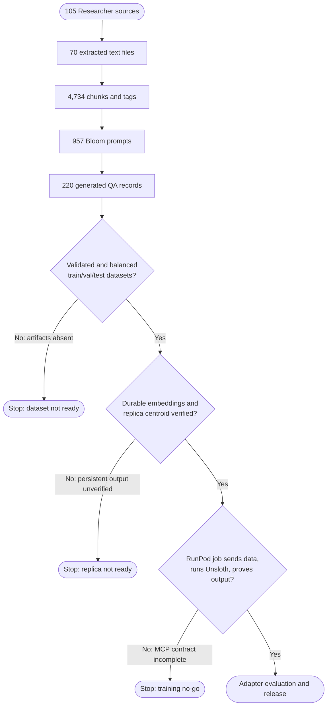
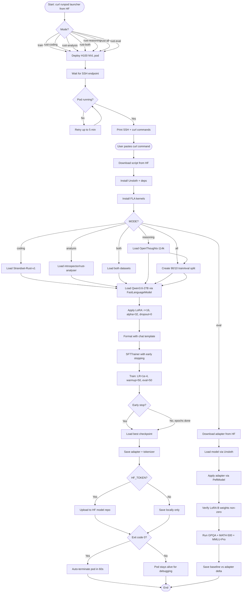
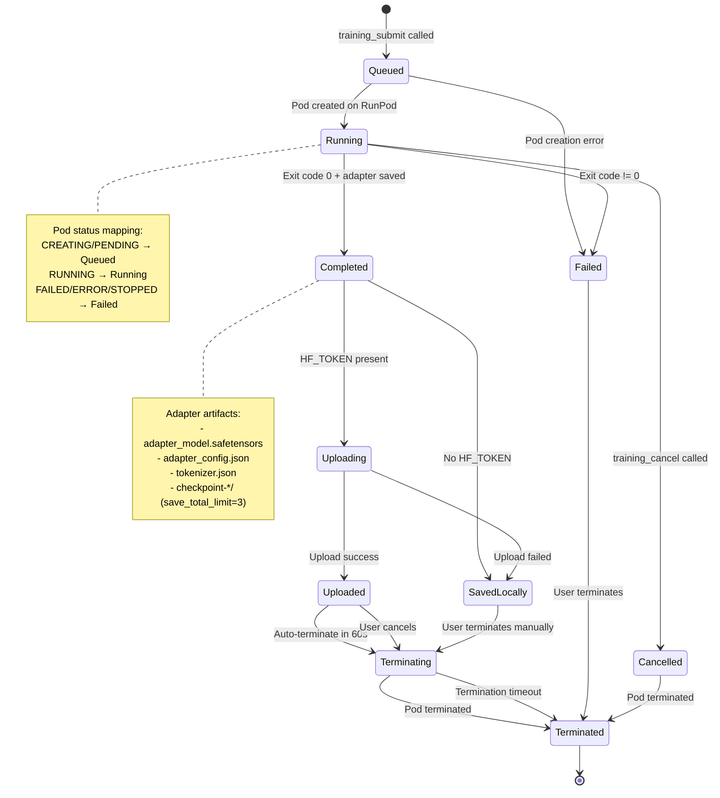

# Training and Adapters

Fine-tune LoRA adapters for Qwen3.6-27B on RunPod with Unsloth, evaluate them, and manage the adapter lifecycle through the `kask adapter` CLI commands. hKask provides standalone RunPod/Unsloth training scripts that are verified on H100 NVL and A100 80GB GPUs.

---

## Training Overview

hKask's training path uses shell scripts hosted on HuggingFace (`Axolotl-Partners/rust-adapter-scripts`) that launch RunPod pods, execute Unsloth/Axolotl-based fine-tuning, and auto-upload LoRA adapters to HuggingFace. The scripts are not in the hKask repo — hKask is a Rust project and Python is not an acceptable dependency. The MCP submission path (`hkask-mcp-training`) provides job submission, status tracking, and adapter lifecycle management, but the end-to-end contract for dataset transfer, training execution, artifact recovery, and adapter registration has not been verified through an automated integration test.

### Training Scripts (on HuggingFace)

All training scripts live in the HuggingFace repo `Axolotl-Partners/rust-adapter-scripts`, not in the hKask repo. hKask is a Rust project — Python is not an acceptable project dependency.

| Script | Purpose | Location |
|--------|---------|----------|
| `train_rust_adapter.sh` | Rust coding + analysis + reasoning adapters | HF: `Axolotl-Partners/rust-adapter-scripts` |
| `eval_rust_adapter.sh` | Rust adapter evaluation | HF: `Axolotl-Partners/rust-adapter-scripts` |
| `runpod_unsloth.sh` | Pod launcher (all modes) | HF: `Axolotl-Partners/rust-adapter-scripts` |
| `axolotl_rust_all.yml` | Axolotl config (PiSSA LoRA) | HF: `Axolotl-Partners/rust-adapter-scripts` |

### Current Limitations

The generic CLI commands `kask docproc ingest`, `kask training create-dataset`, `kask training start`, and `kask training status` are **not implemented CLI commands**. Do not use them. Training is driven by the HF-hosted scripts (curl-piped to RunPod pods) and the `kask adapter` lifecycle commands described below.

---

## Train Rust Adapters on RunPod with Unsloth

Train LoRA adapters for Qwen3.6-27B specialized for Rust programming:

| Mode | Dataset | Size | Focus | HF Repo |
|------|---------|------|-------|---------|
| `--rust-coding` | `Fortytwo-Network/Strandset-Rust-v1` | 191K | Code generation, bug detection, review, refactoring, docs | `qwen36-rust-coding-lora` |
| `--rust-analysis` | `introspector/rust-analyser` | 533K | Symbol resolution, type inference, semantic analysis | `qwen36-rust-analysis-lora` |
| `--rust-both` | Combined Rust | 724K | All Rust coding + analysis | `qwen36-rust-combined-lora` |
| `--rust-reasoning` | `Axolotl-Partners/openthoughts-114k-linked` | 114K | General reasoning with ontology sidecar metadata | `qwen36-reasoning-lora` |
| `--rust-all` | All three combined | 838K | Rust coding + analysis + reasoning | `qwen36-rust-reasoning-all-lora` |

### Step 1: Launch a Pod

```bash
curl -sL https://huggingface.co/datasets/Axolotl-Partners/rust-adapter-scripts/raw/main/runpod_unsloth.sh | bash -s -- --rust-coding
```

This launches an H100 NVL pod (falls back to A100 80GB) and prints the SSH command + dashboard URL.

### Step 2: Start Training

Paste the one command shown in the output. For example:

```bash
MODE=coding curl -sL https://huggingface.co/datasets/Axolotl-Partners/rust-adapter-scripts/raw/c369209c955e4bed07d9460ecff1965b272ca996/train_rust_adapter.sh | bash
```

The command returns immediately — all output goes to `/workspace/training.log`.

### Step 3: Monitor

```bash
ssh root@<SSH_HOST> -p <SSH_PORT> 'tail -f /workspace/training.log'
```

### Step 4: Evaluate the Adapter

After training completes and the adapter is uploaded to HF, launch an eval pod:

```bash
curl -sL https://huggingface.co/datasets/Axolotl-Partners/rust-adapter-scripts/raw/main/runpod_unsloth.sh | bash -s -- --rust-eval
```

Then paste the eval command:

```bash
curl -sL https://huggingface.co/datasets/Axolotl-Partners/rust-adapter-scripts/raw/9408c631d5722629ea99229799e923687c914714/eval_rust_adapter.sh | bash
```

The eval script:
- Loads the Strandset-Rust-v1 test split (225 examples, 15 per category)
- Runs baseline (no adapter) and adapter inference on all 225 examples
- Scores per-category using category-appropriate metrics:
  - **Naming tasks** (function/variable): exact match
  - **Text tasks** (summary/explanation/docstring): word overlap ≥30%
  - **Code tasks** (generation/bug/review/refactor/optimization/completion/search/test/comment): token overlap ≥50%
- Prints per-category accuracy and overall delta (adapter - baseline)
- Saves results to `/workspace/eval_results/rust_eval_*.json`

Monitor:

```bash
ssh root@<SSH_HOST> -p <SSH_PORT> 'tail -f /workspace/rust_eval.log'
```

### Training Configuration

| Parameter | Value | Rationale |
|-----------|-------|-----------|
| Model | `unsloth/Qwen3.6-27B` | Unsloth-optimized BF16 checkpoint |
| LoRA Rank | 16 | Lower rank reduces overfit risk |
| LoRA Alpha | 32 | α=2r (standard scaling ratio) |
| LoRA Dropout | 0 | Required for PiSSA — random dropout would discard principal components |
| LoRA Init | `pissa_niter_4` | SVD-based init from principal singular values. 30-50% faster convergence |
| Learning Rate | 1e-4 | Conservative for large datasets |
| Max Seq Length | 6144 | Accommodates code + context |
| Epochs | 3 | With early stopping (patience=7) |
| Warmup | 50 steps | Fixed steps — avoids excessive warmup |
| Eval Steps | 50 | Frequent eval to catch best checkpoint |
| Eval Ratio | 2% | Dynamic re-sampling from training set |
| Batch Size | 1 × 4 accumulation = 4 | Fits 80GB VRAM |

### Datasets

**Strandset-Rust-v1 (Apache-2.0):** 191K verified Rust examples across 15 task categories:

| Category | Count | Description |
|----------|-------|-------------|
| `code_generation` | 17K | Generate functions from specs |
| `docstring_generation` | 17K | Produce API documentation |
| `code_explanation` | 17K | Explain what code does |
| `comment_generation` | 16K | Add inline comments |
| `code_summarization` | 16K | Summarize function purpose |
| `function_naming` | 16K | Suggest idiomatic names |
| `variable_naming` | 16K | Generate semantic names |
| `code_review` | 15K | Critique and improve |
| `code_completion` | 15K | Fill missing sections |
| `code_refactoring` | 14K | Improve readability |
| `bug_detection` | 13K | Identify and fix bugs |
| `code_optimization` | 13K | Optimize algorithms |
| `code_search` | 4K | Return relevant code |
| `test_generation` | 3K | Generate unit tests |
| `api_usage_prediction` | 490 | Predict next API call |

94.3% compilation success verified with `rustc`. Peer-reviewed via Fortytwo's Swarm Inference.

**introspector/rust-analyser (AGPL-3.0):** 533K semantic analysis traces from rust-analyzer analyzing its own codebase:

- `name_resolution` — Symbol binding, scope analysis, import resolution
- `type_inference` — Type checking, inference decisions
- `parsing` — Syntax tree generation, tokenization

Adapters trained on this data may require AGPL-compatible distribution terms.

**OpenThoughts-114k Linked (Apache-2.0):** 114K verified reasoning traces from DeepSeek-R1, covering math, science, code, and puzzles. The linked dataset (`Axolotl-Partners/openthoughts-114k-linked`) includes:

- `train.jsonl` — Clean ChatML training data (original system prompts, no ontology noise)
- `metadata.jsonl` — Sidecar with extracted PKO reasoning steps (avg 160.7 steps/example, 93.9% unique step distributions), Dublin Core annotations, and 5W1H grounding

The metadata sidecar is for downstream tooling (filtering, knowledge graphs, analysis) — it is not embedded in the training data.

### Output

On success:
- LoRA adapter weights uploaded to the corresponding HF model repo
- Training log preserved in `/workspace/training.log`
- Pod auto-terminates (60s grace period)

On failure:
- Error logged with exit code
- Pod stays alive for debugging

---

## Adapter Lifecycle via CLI

The `kask adapter` commands manage trained adapter deployment to cloud inference providers. These commands delegate to the training MCP server.

### List Trained Adapters

```bash
kask adapter list
kask adapter list --skill <skill-name>
```

### Deploy an Adapter

Deploy an adapter to a cloud inference provider:

```bash
kask adapter deploy <adapter-name> --provider together
```

The `--provider` flag accepts `together` (default) or `runpod`.

### Check Deployment Status

```bash
kask adapter status <deployment_id>
```

Use the deployment ID returned by the `deploy` command.

### Tear Down a Deployed Endpoint

```bash
kask adapter teardown <deployment_id>
```

This removes the deployed inference endpoint and releases associated resources.

---

## References

- [Unsloth LoRA fine-tuning Hyperparameters Guide](https://unsloth.ai/docs/get-started/fine-tuning-llms-guide/lora-hyperparameters-guide) — Default SFT parameters
- [Unsloth Qwen3.5 Fine-tuning Guide](https://unsloth.ai/docs/models/qwen3.5/fine-tune) — QLoRA not recommended for Qwen3.5/3.6
- [QwenLM Qwen3 Training with Unsloth](https://github.com/QwenLM/Qwen3/blob/main/docs/source/training/unsloth.md) — 75% reasoning / 25% non-reasoning dataset ratio
- [Qwen3.6 Training Reference](#qwen36-training-hyperparameters-merged-from-qwen36-training-hyperparametersmd) — Full hyperparameter rationale and literature survey
- [Replica, Corpus, and Training Readiness](../status/userpod-corpus-training-readiness.md) — Verified state of training paths
---

## Qwen3.6 Training Hyperparameters

See the Rust adapter training configuration table above for current hyperparameters. The following sections contain inlined diagrams for the training pipeline.

<!-- The old distillation hyperparameters reference has been removed. -->

---

## Inlined Diagrams

The following Mermaid diagrams document the training pipeline.

### Full Training Pipeline (Rust + Reasoning Adapters)
# Replica, Corpus, and Training Readiness Flowchart

This reference flowchart distinguishes artifacts that exist from transitions that are not yet verified end-to-end. The replica server can dispatch four `corpus_*` write operations to `corpus-ingest`, but its pipeline executor cannot dispatch the manifest's Docproc or training steps. The `Library/Researcher` corpus has reached partial QA generation; it has not reached a verified John Brooks replica, durable training dataset, or RunPod-trained adapter.


<!-- DIAGRAM_ALIGNMENT
id: DIAG-TRAIN-002
verified_date: 2026-07-10
verified_against: corpus/chunks/chunks.jsonl; corpus/chunks/tagged_chunks.jsonl; corpus/qa_pairs/prompts_bloom.jsonl; corpus/qa_pairs/gen_bloom_all.jsonl; mcp-servers/hkask-mcp-docproc/src/tools/storage.rs; mcp-servers/hkask-mcp-replica/src/lib.rs:1061-1324; crates/hkask-types/src/pipeline_runner.rs; mcp-servers/hkask-mcp-training/src/providers/runpod.rs
status: VERIFIED
-->

The operational assessment and remediation sequence are in [Replica, Corpus, and Training Readiness](../status/userpod-corpus-training-readiness.md).


### Replica Pipeline Dispatch

*Inlined from `docs/diagrams/flowchart-replica-pipeline-dispatch.md`*


# Replica Pipeline Dispatch Flowchart

This reference flowchart shows the current executable boundary of `replica_pipeline_run`. The replica MCP server parses a `PipelineManifest`, resumes from checkpoint state, and dispatches only its four `corpus_*` steps to the `corpus-ingest` binary. Other manifest tools are deliberately not dispatched by this executor and stop the run with an external-execution error. A `requires_consent` step is rejected before execution; the runner has no approval input, so a consent-required training step cannot proceed through this path.


`execute_tool` wraps the MCP call with a tool span and records success or error against the caller's WebID. That is observability, not authorization: per [P4 — Clear Boundaries](../architecture/core/PRINCIPLES.md#p4--clear-boundaries-ocap), operators must not treat this dispatcher as a replacement for an OCAP check. The checkpoint/result path supports [P9 — Homeostatic Self-Regulation](../architecture/core/PRINCIPLES.md#p9--homeostatic-self-regulation) by retaining the last step outcome for inspection and retry.

The complete, aspirational corpus workflow is in [`corpus/pipeline-capabilities-researcher.yaml`](../../corpus/pipeline-capabilities-researcher.yaml); its initial `docproc_convert` step is outside this executor's current dispatch set. See also [Replica, Corpus, and Training Readiness](../status/userpod-corpus-training-readiness.md) and [the replica server reference](../reference/mcp-servers/README.md).

<!-- DIAGRAM_ALIGNMENT
id: DIAG-TRAIN-003
verified_date: 2026-07-10
verified_against: mcp-servers/hkask-mcp-replica/src/lib.rs:1061-1324; crates/hkask-types/src/pipeline_runner.rs:37-142; crates/hkask-types/src/pipeline_manifest.rs:49-91; crates/hkask-mcp/src/server/tool_span.rs:247-261
status: VERIFIED
-->


### Full Training Pipeline (Reasoning + Rust Adapters)

*Inlined from `docs/diagrams/flowchart-training-pipeline.md`*

# Training Pipeline Flowchart

This diagram traces the control flow of the hKask adapter training pipeline, from pod launch through training completion and upload.


<!-- DIAGRAM_ALIGNMENT
id: DIAG-TRN-004
verified_date: 2026-07-12
verified_against: mcp-servers/hkask-mcp-training/src/adapter/mod.rs, crates/hkask-inference/src/lib.rs
status: VERIFIED
-->

## Key Decision Points

| Decision | Condition | Branches |
|----------|-----------|----------|
| Mode selection | CLI flag (`--rust-coding`, `--eval`, etc.) | 5 paths: train, eval, coding, analysis, both |
| Pod readiness | RunPod `desiredStatus == RUNNING` | Retry loop, max 5 min |
| Dataset selection | `MODE` env var | 3 formatting paths + 1 eval path |
| Early stopping | `eval_loss` no improvement for 10 evals | Load best checkpoint vs continue |
| Upload | `HF_TOKEN` present | Upload vs local-only |
| Pod lifecycle | Exit code 0 | Auto-terminate vs keep alive |


### Training Job Lifecycle State Diagram

*Inlined from `docs/diagrams/state-training-lifecycle.md`*

# Training Job Lifecycle State Diagram

This diagram shows the states and transitions for a training job as it moves through the hKask training pipeline. It covers both the MCP server's `TrainingJobStatus` enum and the RunPod pod lifecycle.


<!-- DIAGRAM_ALIGNMENT
id: DIAG-TRN-005
verified_date: 2026-07-12
verified_against: mcp-servers/hkask-mcp-training/src/adapter/mod.rs, crates/hkask-inference/src/lib.rs
status: VERIFIED
-->

## State Definitions

| State | Meaning | Pod Alive? |
|-------|---------|------------|
| Queued | Job submitted, pod not yet created | No |
| Running | Pod is running, training in progress | Yes |
| Completed | Training finished successfully, adapter saved | Yes (grace period) |
| Failed | Training error or pod crash | Yes (for debugging) |
| Cancelled | User cancelled the job | Yes (until terminated) |
| Uploading | Adapter being uploaded to HF | Yes |
| Uploaded | Upload complete | Yes (60s grace) |
| SavedLocally | Adapter saved but not uploaded | Yes |
| Terminating | Pod termination in progress | Yes |
| Terminated | Pod destroyed | No |


### Training Server Class Diagram

*Inlined from `docs/diagrams/class-training-server.md`*

# Training Server Class Diagram

This diagram shows the trait hierarchy and struct composition of the hKask MCP training server's provider layer. It maps the relationships between training hosts, harnesses, and parameter types.


<!-- DIAGRAM_ALIGNMENT
id: DIAG-TRN-006
verified_date: 2026-07-12
verified_against: mcp-servers/hkask-mcp-training/src/adapter/mod.rs, crates/hkask-inference/src/lib.rs
status: VERIFIED
-->

## Design Notes

- `TrainingHost` is the seam for compute backends — new providers (e.g., Baseten, Modal) add without changing the router
- `HarnessAdapter` is the seam for training tooling — renders config in the harness's native format (YAML for Axolotl, Python for Unsloth)
- `RunpodHost` composes a `HarnessAdapter` — the host delegates config generation to the harness
- `TrainingParams` is a deep struct: it contains all hyperparameters as nested sub-structs, giving callers a single entry point
- `LoraParams` defaults: r=16, alpha=32, dropout=0, 7 target modules (all attention + MLP projections)
- `TrainingParams` defaults: LR=1e-4, 3 epochs, batch_size=4

