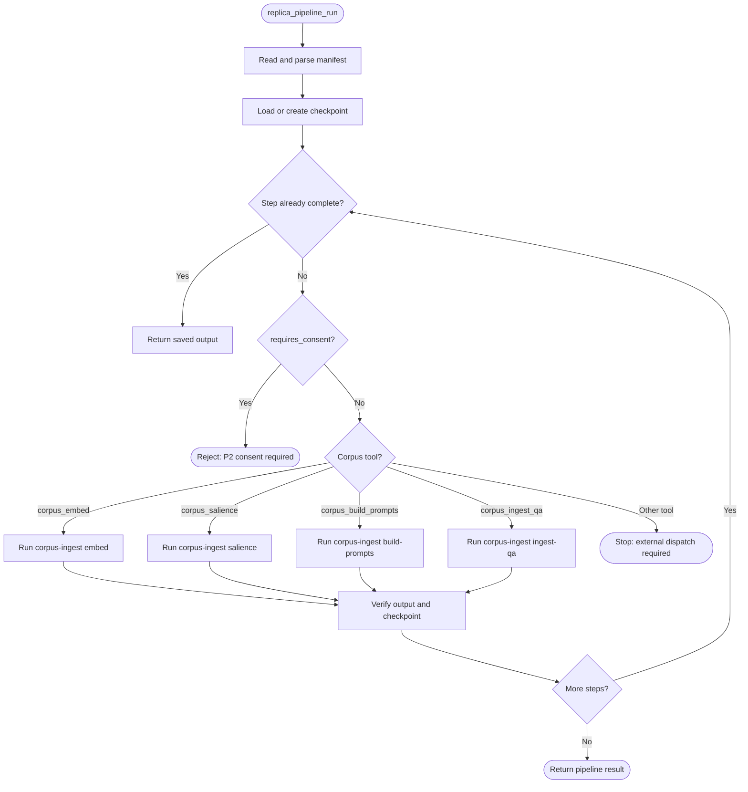
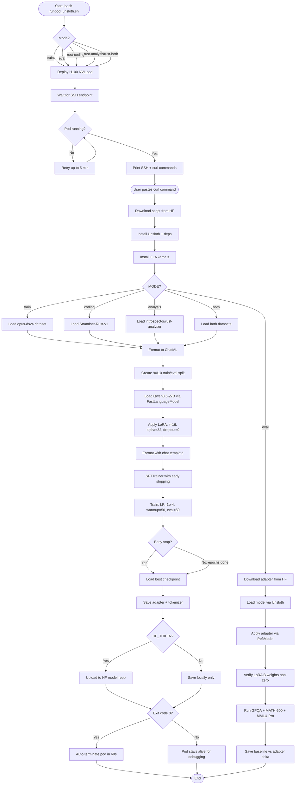
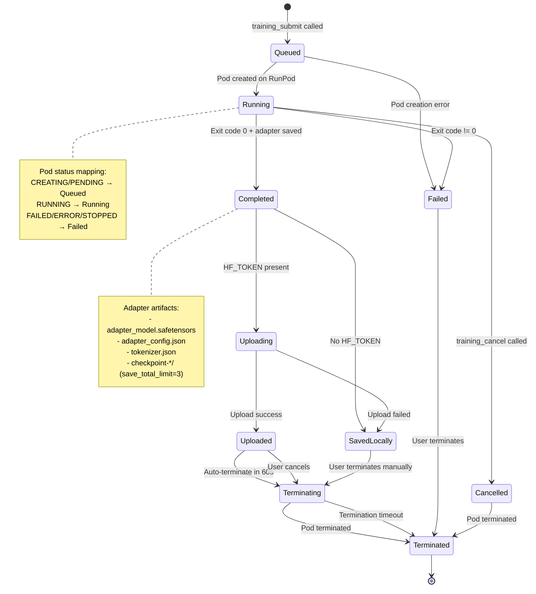
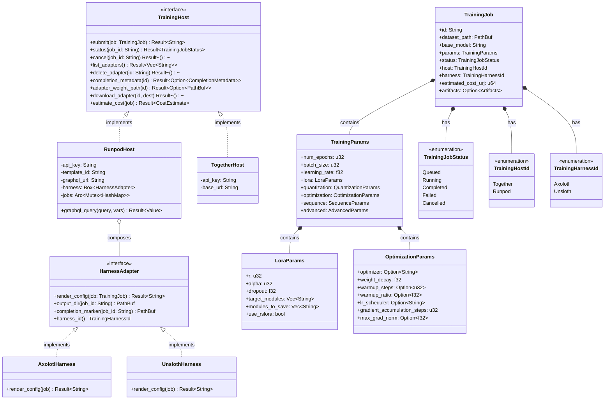

# Training and Adapters

Fine-tune LoRA adapters for Qwen3.6-27B on RunPod with Unsloth, evaluate them, and manage the adapter lifecycle through the `kask adapter` CLI commands. hKask provides standalone RunPod/Unsloth training scripts that are verified on H100 NVL and A100 80GB GPUs.

---

## Training Overview

hKask's training path uses standalone shell scripts that launch RunPod pods, execute Unsloth-based fine-tuning, and auto-upload LoRA adapters to HuggingFace. The MCP submission path (`hkask-mcp-training`) provides job submission, status tracking, and adapter lifecycle management, but the end-to-end contract for dataset transfer, training execution, artifact recovery, and adapter registration has not been verified through an automated integration test.

### Working Training Scripts

| Script | Purpose | Status |
|--------|---------|--------|
| `scripts/train_unsloth.sh` | Qwen3.6-27B reasoning distillation | Verified |
| `scripts/train_rust_adapter.sh` | Rust coding + analysis adapters | Available |
| `scripts/eval_unsloth.sh` | Adapter evaluation with baseline comparison | Verified |
| `scripts/eval_rust_adapter.sh` | Rust adapter evaluation | Available |
| `scripts/runpod_unsloth.sh` | Pod launcher (all modes) | Verified |

### Current Limitations

The generic CLI commands `kask docproc ingest`, `kask training create-dataset`, `kask training start`, and `kask training status` are **not implemented CLI commands**. Do not use them. Training is driven by the standalone scripts and the `kask adapter` lifecycle commands described below.

For the verified state of the replica, corpus, and RunPod/Unsloth paths, see `docs/status/replica-corpus-training-readiness.md`.

---

## Train Qwen3.6-27B on RunPod with Unsloth

Fine-tune a BF16 LoRA adapter for Qwen3.6-27B on distillation data using a single A100 or H100 GPU on RunPod, then auto-upload the adapter to HuggingFace.

### Prerequisites

- RunPod API key in `.env`
- HuggingFace write token in `.env`
- SSH public key added to RunPod account settings

### Step 1: Launch the Pod

From the project root:

```bash
bash scripts/runpod_unsloth.sh
```

This first tries a secure-cloud H100 NVL, then falls back to a community-cloud A100 PCIe 80GB if the H100 is unavailable, with:
- 60GB container disk, 200GB `/workspace` volume
- Environment variables: `HF_TOKEN`, `PYTORCH_CUDA_ALLOC_CONF`, `HF_DEACTIVATE_ASYNC_LOAD`
- 4-hour inactivity timeout
- Web terminal + SSH access

The script prints a web terminal URL. Open it in your browser.

### Step 2: Start Training

Paste one command in the web terminal:

```bash
curl -sL https://huggingface.co/datasets/Axolotl-Partners/qwen36-distill-opus-dsv4/raw/bfedff55f47bcf0286ff49584635e25912147c97/train_unsloth.sh | bash
```

The command returns immediately — all output is redirected to `/workspace/training.log`. Monitor progress:

```bash
tail -f /workspace/training.log
```

### Step 3: Training Stages

| Stage | Duration | What to Check |
|-------|----------|---------------|
| Dependency install | 3-5 min | `Install complete.` |
| SDPA FlashAttn check | < 5s | `SDPA-FlashAttn: True` — if False, VRAM will be tighter |
| Dataset validation | 1-2 min | All 3 checks must show `OK` |
| Model download | 15-30 min | `Loading unsloth/Qwen3.6-27B...` then GPU memory report |
| Token length analysis | 2-5 min | P50, P95, max reported; seq may auto-adjust |
| Training | 20-40h | Loss numbers every 10 steps; eval every 200 steps |
| Early stopping | Automatic | If eval_loss doesn't improve for 5 evals (=1000 steps) |
| Save + Upload | 3-10 min | Hugging Face client retries transient failures |
| Pod cleanup | 60s | Auto-terminates on success; stays alive on failure |

### Step 4: Training Configuration

The default hyperparameters are aligned with Unsloth's SFT recommendations and published Qwen3.6-27B training examples:

| Parameter | Value | Rationale |
|-----------|-------|-----------|
| Model | `unsloth/Qwen3.6-27B` | Unsloth-optimized BF16 checkpoint |
| Method | BF16 LoRA (not QLoRA) | QLoRA not recommended for Qwen3.5/3.6 |
| LoRA Rank | 16 | Lower rank reduces overfit risk on small datasets |
| LoRA Alpha | 32 | α=2r (standard scaling ratio) |
| LoRA Dropout | 0 | Required for Unsloth kernel fusion |
| Learning Rate | 1e-4 | Conservative for small datasets; prevents overfit |
| Max Seq Length | 6144 | Auto-adjusted down if P95 tokens < 3072 |
| Epochs | 3 | With early stopping (patience=10 evals) |
| Batch Size | 1 × 4 accumulation = 4 | Fits 80GB VRAM |
| Warmup | 50 steps | Fixed steps — avoids wasting training on excessive warmup |
| Eval Steps | 50 | Frequent eval to catch best checkpoint early |
| Data Ratio | 75% reasoning / 25% chat | Preserves thinking capabilities |

### Step 5: Output

On success:
- LoRA adapter weights uploaded to `Axolotl-Partners/qwen36-distill-opus-dsv4-lora`
- Training log preserved in `/workspace/training.log`
- Pod auto-terminates (60s grace period, Ctrl-C to cancel)

On failure:
- Error message logged with exit code
- Pod kept alive for debugging
- `/workspace/outputs` may contain partial checkpoints

### Step 6: Post-Training

After training completes, evaluate the adapter:

1. Download from HF: `huggingface-cli download Axolotl-Partners/qwen36-distill-opus-dsv4-lora`
2. Merge LoRA: `model.merge_and_unload()` in Unsloth
3. Run benchmarks: GPQA Diamond, MATH-500, MMLU-Pro
4. Manual review: inspect 20-30 thinking traces for quality

### Cost

| GPU | Spot Rate | Est. Time | Est. Cost |
|-----|-----------|-----------|-----------|
| A100 PCIe 80GB | ~$1.19/hr | 30-40h | ~$35-48 |
| A100 SXM 80GB | ~$1.39/hr | 25-35h | ~$35-49 |
| H100 NVL 80GB | ~$2.59/hr | 10-15h | ~$26-39 |

Costs are approximate. Spot prices fluctuate. The pod auto-terminates on completion, so you never pay for idle time.

---

## Train Rust Adapters on RunPod with Unsloth

Train LoRA adapters for Qwen3.6-27B specialized for Rust programming:

| Mode | Dataset | Size | Focus | HF Repo |
|------|---------|------|-------|---------|
| `--rust-coding` | `Fortytwo-Network/Strandset-Rust-v1` | 191K | Code generation, bug detection, review, refactoring, docs | `qwen36-rust-coding-lora` |
| `--rust-analysis` | `introspector/rust-analyser` | 533K | Symbol resolution, type inference, semantic analysis | `qwen36-rust-analysis-lora` |
| `--rust-both` | Combined | 724K | All of the above | `qwen36-rust-combined-lora` |

### Step 1: Launch a Pod

```bash
bash scripts/runpod_unsloth.sh --rust-coding
```

This launches an H100 NVL pod (falls back to A100 80GB) and prints the SSH command + dashboard URL.

### Step 2: Start Training

Paste the one command shown in the output. For example:

```bash
MODE=coding curl -sL https://huggingface.co/datasets/Axolotl-Partners/qwen36-distill-opus-dsv4/raw/1394b763400304f2cfe70c50d16a34a916c6c580/train_rust_adapter.sh | bash
```

The command returns immediately — all output goes to `/workspace/training.log`.

### Step 3: Monitor

```bash
ssh root@<SSH_HOST> -p <SSH_PORT> 'tail -f /workspace/training.log'
```

### Step 4: Evaluate the Adapter

After training completes and the adapter is uploaded to HF, launch an eval pod:

```bash
bash scripts/runpod_unsloth.sh --rust-eval
```

Then paste the eval command:

```bash
curl -sL https://huggingface.co/datasets/Axolotl-Partners/qwen36-distill-opus-dsv4/raw/eae9bcdd2605a0b80e81af728d89278b0c368ce9/eval_rust_adapter.sh | bash
```

The eval script:
- Loads the Strandset-Rust-v1 test split (225 examples, 15 per category)
- Runs baseline (no adapter) and adapter inference on all 225 examples
- Scores per-category using category-appropriate metrics:
  - **Naming tasks** (function/variable): exact match
  - **Text tasks** (summary/explanation/docstring): word overlap ≥30%
  - **Code tasks** (generation/bug/review/refactor/optimization/completion/search/test/comment): token overlap ≥50%
- Prints per-category accuracy and overall delta (adapter - baseline)
- Saves results to `/workspace/eval_results/rust_eval_*.json`

Monitor:

```bash
ssh root@<SSH_HOST> -p <SSH_PORT> 'tail -f /workspace/rust_eval.log'
```

### Training Configuration

| Parameter | Value | Rationale |
|-----------|-------|-----------|
| Model | `unsloth/Qwen3.6-27B` | Unsloth-optimized BF16 checkpoint |
| LoRA Rank | 16 | Lower rank reduces overfit risk |
| LoRA Alpha | 32 | α=2r (standard scaling ratio) |
| LoRA Dropout | 0 | Unsloth kernel optimization requires 0 |
| Learning Rate | 1e-4 | Conservative for large datasets |
| Max Seq Length | 6144 | Accommodates code + context |
| Epochs | 3 | With early stopping (patience=10) |
| Warmup | 50 steps | Fixed steps — avoids excessive warmup |
| Eval Steps | 50 | Frequent eval to catch best checkpoint |
| Batch Size | 1 × 4 accumulation = 4 | Fits 80GB VRAM |

### Datasets

**Strandset-Rust-v1 (Apache-2.0):** 191K verified Rust examples across 15 task categories:

| Category | Count | Description |
|----------|-------|-------------|
| `code_generation` | 17K | Generate functions from specs |
| `docstring_generation` | 17K | Produce API documentation |
| `code_explanation` | 17K | Explain what code does |
| `comment_generation` | 16K | Add inline comments |
| `code_summarization` | 16K | Summarize function purpose |
| `function_naming` | 16K | Suggest idiomatic names |
| `variable_naming` | 16K | Generate semantic names |
| `code_review` | 15K | Critique and improve |
| `code_completion` | 15K | Fill missing sections |
| `code_refactoring` | 14K | Improve readability |
| `bug_detection` | 13K | Identify and fix bugs |
| `code_optimization` | 13K | Optimize algorithms |
| `code_search` | 4K | Return relevant code |
| `test_generation` | 3K | Generate unit tests |
| `api_usage_prediction` | 490 | Predict next API call |

94.3% compilation success verified with `rustc`. Peer-reviewed via Fortytwo's Swarm Inference.

**introspector/rust-analyser (AGPL-3.0):** 533K semantic analysis traces from rust-analyzer analyzing its own codebase:

- `name_resolution` — Symbol binding, scope analysis, import resolution
- `type_inference` — Type checking, inference decisions
- `parsing` — Syntax tree generation, tokenization

Adapters trained on this data may require AGPL-compatible distribution terms.

### Output

On success:
- LoRA adapter weights uploaded to the corresponding HF model repo
- Training log preserved in `/workspace/training.log`
- Pod auto-terminates (60s grace period)

On failure:
- Error logged with exit code
- Pod stays alive for debugging

---

## Adapter Lifecycle via CLI

The `kask adapter` commands manage trained adapter deployment to cloud inference providers. These commands delegate to the training MCP server.

### List Trained Adapters

```bash
kask adapter list
kask adapter list --skill <skill-name>
```

### Deploy an Adapter

Deploy an adapter to a cloud inference provider:

```bash
kask adapter deploy <adapter-name> --provider together
```

The `--provider` flag accepts `together` (default) or `runpod`.

### Check Deployment Status

```bash
kask adapter status <deployment_id>
```

Use the deployment ID returned by the `deploy` command.

### Tear Down a Deployed Endpoint

```bash
kask adapter teardown <deployment_id>
```

This removes the deployed inference endpoint and releases associated resources.

---

## References

- [Unsloth LoRA fine-tuning Hyperparameters Guide](https://unsloth.ai/docs/get-started/fine-tuning-llms-guide/lora-hyperparameters-guide) — Default SFT parameters
- [Unsloth Qwen3.5 Fine-tuning Guide](https://unsloth.ai/docs/models/qwen3.5/fine-tune) — QLoRA not recommended for Qwen3.5/3.6
- [QwenLM Qwen3 Training with Unsloth](https://github.com/QwenLM/Qwen3/blob/main/docs/source/training/unsloth.md) — 75% reasoning / 25% non-reasoning dataset ratio
- [Qwen3.6 Training Reference](#qwen36-training-hyperparameters-merged-from-qwen36-training-hyperparametersmd) — Full hyperparameter rationale and literature survey
- [Replica, Corpus, and Training Readiness](../status/replica-corpus-training-readiness.md) — Verified state of training paths
---

## Qwen3.6 Training Hyperparameters (Merged from qwen36-training-hyperparameters.md)


# Qwen3.6-27B Training Hyperparameters — Reference

This document catalogs every hyperparameter choice for the Qwen3.6-27B distillation training pipeline, with provenance for each value. Use it to reproduce the training run or to understand the rationale when tuning.

## Model Loading

| Parameter | Value | Source | Rationale |
|-----------|-------|--------|-----------|
| `model_name` | `unsloth/Qwen3.6-27B` | Unsloth Hub | Unsloth-optimized BF16 checkpoint. Do NOT use the `-MTP-GGUF` or `-NVFP4` variants — those are inference-only, not trainable[^nvfp4-bug]. |
| `max_seq_length` | 4096 | [QevosAgent][^qevosagent] | Default. Auto-reduced to `P95_tokens × 1.2` if P95 < 2048. |
| `load_in_4bit` | `False` | [Unsloth Qwen3.5 guide][^unsloth-qlora] | QLoRA is not recommended for Qwen3.5/3.6 due to quantization error. |
| `load_in_16bit` | `True` | [Unsloth SFT guide][^unsloth-sft] | BF16 LoRA — the recommended training method for Qwen3.5/3.6. |
| `full_finetuning` | `False` | VRAM constraint | Full fine-tuning needs ~224GB. BF16 LoRA needs 56GB[^unsloth-vram]. |

## LoRA Configuration

| Parameter | Value | Source | Rationale |
|-----------|-------|--------|-----------|
| `r` | 64 | [rico03][^rico03] | Matches the only published Claude→Qwen3.6 distillation precedent. High end of the 16-64 range; provides capacity for complex reasoning transfer. |
| `lora_alpha` | 64 | [Unsloth defaults][^unsloth-sft] | α=r (standard ratio). Doubling to α=2r provides no benefit per Unsloth docs. |
| `lora_dropout` | 0 | [Unsloth kernels][^unsloth-kernels] | **Required.** Setting > 0 disables Unsloth's Triton kernel fusion, costing 2x speed. |
| `target_modules` | `[q,k,v,o,gate,up,down]_proj` | [Unsloth defaults][^unsloth-sft] | All 7 attention + MLP projections. Consensus across all published Qwen3.6 examples. `out_proj` inclusion (rico03) is an outlier. |
| `bias` | `none` | [Unsloth defaults][^unsloth-sft] | Bias terms are not trained in LoRA. |
| `use_gradient_checkpointing` | `unsloth` | [Unsloth docs][^unsloth-sft] | Unsloth's optimized gradient checkpointing; reduces VRAM by ~30%. |

## Training Configuration

| Parameter | Value | Source | Rationale |
|-----------|-------|--------|-----------|
| `learning_rate` | 2e-4 | [Unsloth SFT guide][^unsloth-sft] | Standard SFT learning rate for BF16 LoRA. The QevosAgent used 2e-5 for narrow-domain (Verilog) adaptation; our broad distillation task uses the SFT default. |
| `num_train_epochs` | 3 | [Unsloth SFT guide][^unsloth-sft] | 1-3 range. Upper end for complex task. Early stopping (patience=5) will halt early if loss plateaus. |
| `per_device_train_batch_size` | 1 | VRAM constraint | Single sample per step to fit 27B in 80GB. |
| `gradient_accumulation_steps` | 4 | VRAM constraint | Effective batch size = 4. |
| `warmup_ratio` | 0.05 | [QevosAgent][^qevosagent] | 5% of total steps. Matches all published Qwen3.6 examples. |
| `lr_scheduler_type` | `cosine` | [Unsloth SFT guide][^unsloth-sft] | Standard cosine decay. |
| `optim` | `adamw_8bit` | [Unsloth SFT guide][^unsloth-sft] | 8-bit AdamW for memory efficiency. |
| `weight_decay` | 0.01 | [Unsloth SFT guide][^unsloth-sft] | Light L2 regularization. |
| `max_grad_norm` | 0.3 | [Unsloth SFT guide][^unsloth-sft] | Gradient clipping for LoRA stability. |
| `bf16` | `True` | [QevosAgent][^qevosagent] | A100/H100 natively support BF16. |
| `eval_steps` | 200 | Heuristic | ~150 eval points across 3 epochs. Fine enough for early stopping (patience=5 evals = 1000 steps of no improvement). |
| `save_steps` | 400 | Must be multiple of eval_steps | 2× eval interval. Checkpoints every ~3% of an epoch. |
| `early_stopping_patience` | 5 | Heuristic | 5 evals × 200 steps = 1000 steps (~10% of an epoch) without improvement before halting. |
| `save_total_limit` | 3 | Disk constraint | Keep 3 most recent checkpoints. |

## Data Configuration

| Parameter | Value | Source | Rationale |
|-----------|-------|--------|-----------|
| Reasoning dataset | `Axolotl-Partners/qwen36-distill-opus-dsv4` | This project | 13,435 Claude Opus + DeepSeek v4 Pro distillation samples. All have `reasoning_content` on assistant turns. |
| Chat dataset | `mlabonne/FineTome-100k` | [Qwen3 docs][^qwen3-docs] | 100,000 ShareGPT conversations. Used for the 25% non-reasoning portion. |
| Reasoning ratio | 0.75 | [Qwen3 docs][^qwen3-docs] | 75/25 reasoning/chat to preserve thinking capabilities. |
| Fable-5 | **Removed** | This project | 4,600 agentic tool-use traces. Excluded because agentic tool-use reasoning may compete with mathematical decomposition reasoning. Flagged for ablation study. |

## Infrastructure Configuration

| Parameter | Value | Rationale |
|-----------|-------|-----------|
| Docker image | `runpod/pytorch:2.4.0-py3.11-cuda12.4.1-devel-ubuntu22.04` | Stable RunPod template with PyTorch 2.4.0 + CUDA 12.4. |
| `containerDiskInGb` | 60 | Docker image + pip packages only. Model and data go on volume. |
| `volumeInGb` | 200 | Model weights (~55GB) + HF cache (~5GB) + outputs (~1GB). |
| `PYTORCH_CUDA_ALLOC_CONF` | `expandable_segments:True` | Prevents fragmentation OOM — the #1 crash mode across Unsloth issues[^unsloth-oom]. |
| `HF_DEACTIVATE_ASYNC_LOAD` | `1` | Prevents system RAM explosion during weight loading[^unsloth-ram]. |
| `POD_INACTIVITY_TIMEOUT` | `14400` (4 hours) | Grace period for web terminal disconnection during training. |
| Self-management | GraphQL `podTerminate` mutation on success | Auto-terminates 60s after training completes (discovers pod ID via `hostname`). Stays alive on failure. Ctrl-C during countdown cancels. |

## Safety Gates (in execution order)

| Gate | When | Catches |
|------|------|---------|
| SDPA FlashAttn check | Before model download | CUDA/torch issues; warns if FlashAttention unavailable |
| Dataset validation | Before model download | Missing fields (`messages`, `conversations`), empty datasets |
| Disk space check | Before model download | Insufficient space for model + outputs |
| Token length analysis | After model load, before training | Over-provisioned `max_seq_length` (auto-adjusts) |
| Data format validation | Before training merge | ShareGPT conversion, chat template application, `assistant` presence |

[^unsloth-sft]: Unsloth. (2026). *LoRA fine-tuning Hyperparameters Guide*. https://unsloth.ai/docs/get-started/fine-tuning-llms-guide/lora-hyperparameters-guide

[^unsloth-qlora]: Unsloth. (2026). *Qwen3.5 Fine-tuning Guide*. https://unsloth.ai/docs/models/qwen3.5/fine-tune

[^unsloth-kernels]: Unsloth. (2026). *LoRA Hyperparameters Guide*. https://unsloth.ai/docs/get-started/fine-tuning-llms-guide/lora-hyperparameters-guide

[^unsloth-vram]: Unsloth. (2026). *Qwen3.5 Fine-tuning Guide*. https://unsloth.ai/docs/models/qwen3.5/fine-tune
    Qwen3.5-27B bf16 LoRA VRAM: 56GB.

[^unsloth-oom]: Unsloth. (2025). *Issue #2285: OOM on A100 for 4bit 7B model with batch size = 2*. https://github.com/unslothai/unsloth/issues/2285

[^unsloth-ram]: Unsloth. (2026). *Issue #4188: Extremely high CPU/VRAM usage and slow training with Qwen3.5*. https://github.com/unslothai/unsloth/issues/4188

[^qevosagent]: QevosAgent. (2026). *Fine-tuning Qwen3.6-27B for Verilog Code Generation with Unsloth*. https://qevos.ai/blog/en/2026-05-03-qwen36-verilog-lora-finetuning.html

[^rico03]: rico03. (2026). *Qwen3.6-27B-Claude-Opus-Reasoning-Distilled*. https://huggingface.co/rico03/Qwen3.6-27B-Claude-Opus-Reasoning-Distilled

[^qwen3-docs]: QwenLM. (2025). *Qwen3 — Training with Unsloth*. https://github.com/QwenLM/Qwen3/blob/main/docs/source/training/unsloth.md

[^nvfp4-bug]: Unsloth. (2026). *Issue #6023: Qwen3.6 NVFP4 model fails to load due to CompressedTensorsConfig / BitsAndBytesConfig conflict*. https://github.com/unslothai/unsloth/issues/6023

---

## Inlined Diagrams

The following Mermaid diagrams were inlined from the former `docs/diagrams/` directory per DOCUMENTATION_STANDARDS §1.

### Unsloth Qwen3.6-27B Training Pipeline

*Inlined from `docs/diagrams/flowchart-unsloth-training-pipeline.md`*


# Training Pipeline Flowchart — Qwen3.6-27B on RunPod

This flowchart shows the end-to-end training pipeline from pod launch through self-management. Each decision node represents a validation gate; failures are handled by preserving the pod for debugging rather than silently exiting.

```mermaid
flowchart TD
    A([Launch: bash runpod_unsloth.sh]) --> B{GPU Available?}
    B -->|No| C([Exit: SUPPLY_CONSTRAINT])
    B -->|Yes| D[Pod Boots: 5 min]
    D --> E[User Pastes: curl ... | bash]
    E --> F[Install Dependencies: pip + apt]
    F --> G{SDPA FlashAttn?}
    G -->|No| H([Warn: VRAM Tight])
    G -->|Yes| I[Validate Datasets]
    I --> J{Datasets OK?}
    J -->|No| K([Exit: Format Error])
    J -->|Yes| L[Download Model: 65GB, 20 min]
    L --> M[Apply LoRA: r=64, alpha=64]
    M --> N[Format Data: Chat Templates]
    N --> O[Measure Token Lengths]
    O --> P{P95 < 50% of max_seq?}
    P -->|Yes| Q[Auto-Reduce max_seq_length]
    P -->|No| R[Keep max_seq_length]
    Q --> S[Train: SFTTrainer, 3 Epochs]
    R --> S
    S --> T{Loss Improving?}
    T -->|No for 5 evals| U[Early Stop]
    T -->|Yes| V[Complete All Epochs]
    U --> W[Save Best Checkpoint]
    V --> W
    W --> X[Save LoRA Adapter]
    X --> Y[Upload to HF: 5 Retries]
    Y --> Z{Upload OK?}
    Z -->|No| AA([Pod Kept Alive: Manual Recovery])
    Z -->|Yes| AB[60s Countdown]
    AB --> AC{Ctrl-C?}
    AC -->|Yes| AD([Pod Kept Alive])
    AC -->|No| AE[Terminate Pod]
    AE --> AF([Done: $0/hr])
```
<!-- DIAGRAM_ALIGNMENT
id: DIAG-TRN-001
verified_date: 2026-07-12
verified_against: crates/hkask-adapter/src/lib.rs, crates/hkask-inference/src/lib.rs
status: VERIFIED
-->

<!-- DIAGRAM_ALIGNMENT
id: DIAG-TRAIN-001
verified_date: 2026-07-10
verified_against: scripts/train_unsloth.sh; scripts/runpod_unsloth.sh
reference_sources: unsloth.ai/docs/models/qwen3.5/fine-tune; docs.runpod.io/sdks/graphql/manage-pods
status: VERIFIED
-->


### Replica, Corpus, and Training Readiness

*Inlined from `docs/diagrams/flowchart-replica-corpus-training-readiness.md`*


# Replica, Corpus, and Training Readiness Flowchart

This reference flowchart distinguishes artifacts that exist from transitions that are not yet verified end-to-end. The replica server can dispatch four `corpus_*` write operations to `corpus-ingest`, but its pipeline executor cannot dispatch the manifest's Docproc or training steps. The `Library/Researcher` corpus has reached partial QA generation; it has not reached a verified John Brooks replica, durable training dataset, or RunPod-trained adapter.


<!-- DIAGRAM_ALIGNMENT
id: DIAG-TRN-002
verified_date: 2026-07-12
verified_against: crates/hkask-adapter/src/lib.rs, crates/hkask-inference/src/lib.rs
status: VERIFIED
-->

<!-- DIAGRAM_ALIGNMENT
id: DIAG-TRAIN-002
verified_date: 2026-07-10
verified_against: corpus/chunks/chunks.jsonl; corpus/chunks/tagged_chunks.jsonl; corpus/qa_pairs/prompts_bloom.jsonl; corpus/qa_pairs/gen_bloom_all.jsonl; mcp-servers/hkask-mcp-docproc/src/tools/storage.rs; mcp-servers/hkask-mcp-replica/src/lib.rs:1061-1324; crates/hkask-ports/src/pipeline_runner.rs; mcp-servers/hkask-mcp-training/src/providers/runpod.rs
status: VERIFIED
-->

The operational assessment and remediation sequence are in [Replica, Corpus, and Training Readiness](../status/replica-corpus-training-readiness.md).


### Replica Pipeline Dispatch

*Inlined from `docs/diagrams/flowchart-replica-pipeline-dispatch.md`*


# Replica Pipeline Dispatch Flowchart

This reference flowchart shows the current executable boundary of `replica_pipeline_run`. The replica MCP server parses a `PipelineManifest`, resumes from checkpoint state, and dispatches only its four `corpus_*` steps to the `corpus-ingest` binary. Other manifest tools are deliberately not dispatched by this executor and stop the run with an external-execution error. A `requires_consent` step is rejected before execution; the runner has no approval input, so a consent-required training step cannot proceed through this path.


<!-- DIAGRAM_ALIGNMENT
id: DIAG-TRN-003
verified_date: 2026-07-12
verified_against: crates/hkask-adapter/src/lib.rs, crates/hkask-inference/src/lib.rs
status: VERIFIED
-->

`execute_tool` wraps the MCP call with a tool span and records success or error against the caller's WebID. That is observability, not authorization: per [P4 — Clear Boundaries](../architecture/core/PRINCIPLES.md#p4--clear-boundaries-ocap), operators must not treat this dispatcher as a replacement for an OCAP check. The checkpoint/result path supports [P9 — Homeostatic Self-Regulation](../architecture/core/PRINCIPLES.md#p9--homeostatic-self-regulation) by retaining the last step outcome for inspection and retry.

The complete, aspirational corpus workflow is in [`corpus/pipeline-capabilities-researcher.yaml`](../../corpus/pipeline-capabilities-researcher.yaml); its initial `docproc_convert` step is outside this executor's current dispatch set. See also [Replica, Corpus, and Training Readiness](../status/replica-corpus-training-readiness.md) and [the replica server reference](../reference/mcp-servers/README.md).

<!-- DIAGRAM_ALIGNMENT
id: DIAG-TRAIN-003
verified_date: 2026-07-10
verified_against: mcp-servers/hkask-mcp-replica/src/lib.rs:1061-1324; crates/hkask-ports/src/pipeline_runner.rs:37-142; crates/hkask-ports/src/pipeline_manifest.rs:49-91; crates/hkask-mcp/src/server/tool_span.rs:247-261
status: VERIFIED
-->


### Full Training Pipeline (Reasoning + Rust Adapters)

*Inlined from `docs/diagrams/flowchart-training-pipeline.md`*

# Training Pipeline Flowchart

This diagram traces the control flow of the hKask adapter training pipeline, from pod launch through training completion and upload. It covers both the reasoning distillation path (`train_unsloth.sh`) and the Rust adapter path (`train_rust_adapter.sh`), which share the same pod launcher (`runpod_unsloth.sh`) but diverge at the dataset formatting stage.


<!-- DIAGRAM_ALIGNMENT
id: DIAG-TRN-004
verified_date: 2026-07-12
verified_against: crates/hkask-adapter/src/lib.rs, crates/hkask-inference/src/lib.rs
status: VERIFIED
-->

## Key Decision Points

| Decision | Condition | Branches |
|----------|-----------|----------|
| Mode selection | CLI flag (`--rust-coding`, `--eval`, etc.) | 5 paths: train, eval, coding, analysis, both |
| Pod readiness | RunPod `desiredStatus == RUNNING` | Retry loop, max 5 min |
| Dataset selection | `MODE` env var | 3 formatting paths + 1 eval path |
| Early stopping | `eval_loss` no improvement for 10 evals | Load best checkpoint vs continue |
| Upload | `HF_TOKEN` present | Upload vs local-only |
| Pod lifecycle | Exit code 0 | Auto-terminate vs keep alive |


### Training Job Lifecycle State Diagram

*Inlined from `docs/diagrams/state-training-lifecycle.md`*

# Training Job Lifecycle State Diagram

This diagram shows the states and transitions for a training job as it moves through the hKask training pipeline. It covers both the MCP server's `TrainingJobStatus` enum and the RunPod pod lifecycle.


<!-- DIAGRAM_ALIGNMENT
id: DIAG-TRN-005
verified_date: 2026-07-12
verified_against: crates/hkask-adapter/src/lib.rs, crates/hkask-inference/src/lib.rs
status: VERIFIED
-->

## State Definitions

| State | Meaning | Pod Alive? |
|-------|---------|------------|
| Queued | Job submitted, pod not yet created | No |
| Running | Pod is running, training in progress | Yes |
| Completed | Training finished successfully, adapter saved | Yes (grace period) |
| Failed | Training error or pod crash | Yes (for debugging) |
| Cancelled | User cancelled the job | Yes (until terminated) |
| Uploading | Adapter being uploaded to HF | Yes |
| Uploaded | Upload complete | Yes (60s grace) |
| SavedLocally | Adapter saved but not uploaded | Yes |
| Terminating | Pod termination in progress | Yes |
| Terminated | Pod destroyed | No |


### Training Server Class Diagram

*Inlined from `docs/diagrams/class-training-server.md`*

# Training Server Class Diagram

This diagram shows the trait hierarchy and struct composition of the hKask MCP training server's provider layer. It maps the relationships between training hosts, harnesses, and parameter types.


<!-- DIAGRAM_ALIGNMENT
id: DIAG-TRN-006
verified_date: 2026-07-12
verified_against: crates/hkask-adapter/src/lib.rs, crates/hkask-inference/src/lib.rs
status: VERIFIED
-->

## Design Notes

- `TrainingHost` is the seam for compute backends — new providers (e.g., Baseten, Modal) add without changing the router
- `HarnessAdapter` is the seam for training tooling — renders config in the harness's native format (YAML for Axolotl, Python for Unsloth)
- `RunpodHost` composes a `HarnessAdapter` — the host delegates config generation to the harness
- `TrainingParams` is a deep struct: it contains all hyperparameters as nested sub-structs, giving callers a single entry point
- `LoraParams` defaults: r=16, alpha=32, dropout=0, 7 target modules (all attention + MLP projections)
- `TrainingParams` defaults: LR=1e-4, 3 epochs, batch_size=4

